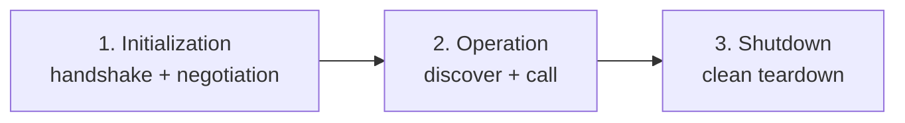
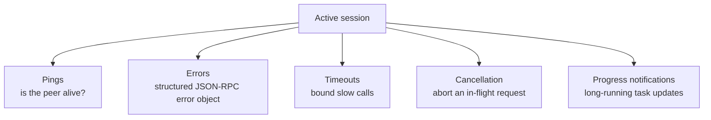

# Lesson 4 — The MCP Lifecycle

> **Source:** CampusX · *The MCP Lifecycle* · 55:05 · [watch](https://www.youtube.com/watch?v=sBHeMcxupmE&list=PLKnIA16_Rmva_oZ9F4ayUu9qcWgF7Fyc0&index=4)
> **One-liner:** How a client↔server **session** actually runs — the three phases (Initialization → Operation → Shutdown), version & capability negotiation, and the plumbing (pings, errors, timeouts, cancellation, progress).

---

## 🎯 TL;DR

Every MCP connection is a **session** with three phases: **Initialization** (handshake — negotiate protocol version and capabilities), **Normal Operation** (discover capabilities, then call tools/read resources), and **Shutdown** (clean teardown, which differs for STDIO vs HTTP). Around these sit the reliability mechanics: **pings, structured errors, timeouts, cancellation, and progress notifications**. This is the runtime foundation for building your own servers/clients later.

---

## 1. The three phases

### Phase 1 — Initialization (the handshake)
1. **Step 1:** client sends `initialize` with its supported protocol version + capabilities.
2. **Step 2:** server responds with its version + capabilities.
3. **Step 3:** client sends an `initialized` notification → session is live.

- **Version negotiation** — both sides agree on a compatible protocol version.
- **Capability negotiation** — each side declares what it supports (tools, resources, prompts, etc.) so neither calls something the other can't do.
- **Important rule:** no normal requests until initialization completes — jumping ahead causes errors.

### Phase 2 — Normal Operation
- **Capability discovery** — client asks what's available (`tools/list`, `resources/list`, `prompts/list`).
- **Tool calling** — client invokes `tools/call`, gets results, feeds them back to the model.

### Phase 3 — Shutdown
- **STDIO:** close stdin/stdout; the host terminates the server subprocess.
- **HTTP:** close the HTTP/SSE connection(s).

---

## 2. Reliability plumbing (the "special cases")

| Mechanism | Purpose |
|-----------|---------|
| **Pings** | Liveness checks — detect a dead/unresponsive peer |
| **Error handling** | Failures return a structured **error object** (`code`, `message`, `data`) |
| **Common error codes** | Standard JSON-RPC codes (e.g., parse/invalid-request/method-not-found/internal) |
| **Timeout** | Don't wait forever on a slow tool/server |
| **Cancellation** | Abort a request that's no longer needed |
| **Progress notifications** | Stream progress for long-running operations |

---

## 3. Practical demo (Claude Desktop + File System server)

The video traces the **actual JSON-RPC messages** exchanged when Claude Desktop connects to a local File System server — you literally see the `initialize` handshake, capability lists, and tool calls flow by. This makes the abstract lifecycle concrete before coding your own.

---

## 4. Key terms

| Term | Meaning |
|------|---------|
| **Session** | One client↔server connection across its full lifecycle. |
| **Initialization / Operation / Shutdown** | The three lifecycle phases. |
| **Version negotiation** | Agreeing on a compatible protocol version at handshake. |
| **Capability negotiation** | Declaring supported features so neither side over-asks. |
| **Ping / timeout / cancellation / progress** | Reliability mechanics during operation. |

---

## ✍️ Notes / follow-ups
- Next — the **How** begins: connect real servers to a client → [Lesson 5 — Connect MCP Servers to Claude Desktop](05-connect-mcp-servers-to-claude-desktop.md).
- Anchor: **Initialize → negotiate → discover → call → shut down, with pings/errors/timeouts around it.**
