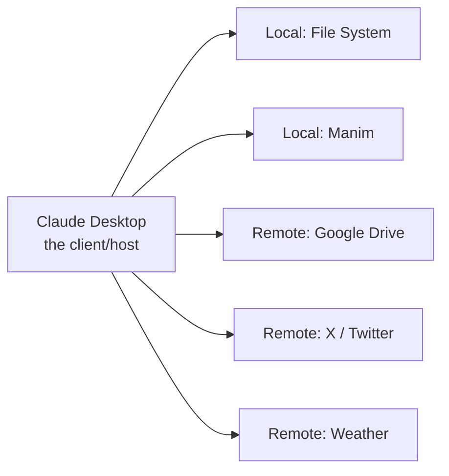

# Lesson 5 — The How: Connect MCP Servers to Claude Desktop

> **Source:** CampusX · *Model Context Protocol | The How | How to connect MCP Servers to Claude Desktop* · 46:17 · [watch](https://www.youtube.com/watch?v=y-uPv3ltOTY&list=PLKnIA16_Rmva_oZ9F4ayUu9qcWgF7Fyc0&index=5)
> **One-liner:** The first hands-on lesson — use **Claude Desktop as the client** and wire it to four ready-made MCP servers (2 local, 2 remote), and understand **connectors vs config files**.

---

## 🎯 TL;DR

Now that you know *why* and *what*, this is the first *how*: install **Claude Desktop** (the host/client) and connect it to existing MCP servers — **local** (File System, Manim) and **remote** (Google Drive, X/Twitter, Weather). Two ways to connect: **connectors** (one-click, safer, consistent) or **config files** (manual JSON, more control). You don't build servers yet — you *use* them to feel MCP working end-to-end.

---

## 1. Plan of action

Use pre-built servers so the focus is **integration**, not coding (that comes in Lessons 6–8).

---

## 2. Two connection types: connectors vs config files

| | **Connectors** | **Config file** |
|---|----------------|-----------------|
| Setup | One-click inside Claude Desktop | Hand-edit JSON (`claude_desktop_config.json`) |
| Ease | Easy, guided | Manual, fiddly |
| Safety/consistency | Safer, standardized | You manage paths, commands, args |
| Control | Less | More — any custom/local server |
| **Why not always connectors?** | Not every server has one yet; local/custom servers still need the config file | — |

**Rule of thumb:** use a **connector** when one exists; fall back to the **config file** for local or custom servers.

---

## 3. Walkthrough beats

| Chapter beat | What happens |
|--------------|--------------|
| **Download Claude Desktop** | Install the client that will host the servers. |
| **Configuration & demo** | Register a **File System** server; grant access to specific directories; watch Claude read/write files via MCP. |
| **Integrate X/Twitter server** | Add a **remote** server through config. |
| **Weather MCP server** | Add another remote server; query live weather. |
| **New MCP servers** | Discover more via the `awesome-mcp-servers` directory. |

> Grant **directory access deliberately** — the File System server can only touch the folders you allow (least privilege).

---

## 4. Key terms

| Term | Meaning |
|------|---------|
| **Claude Desktop** | The host/client used to consume MCP servers. |
| **Connector** | One-click, managed way to add a server. |
| **Config file** | Manual JSON registration of a server (command, args, access). |
| **Local vs remote server** | Runs on your machine (STDIO) vs over the network (HTTP+SSE). |
| **awesome-mcp-servers** | Community directory of ready-made MCP servers. |

---

## ✍️ Notes / follow-ups
- Next: stop using others' servers, build your own → [Lesson 6 — Build Local MCP Servers](06-build-local-mcp-servers.md).
- Anchor: **connector if it exists, config file otherwise; grant access narrowly.**
