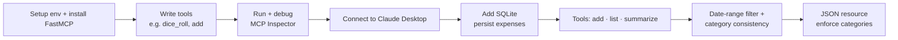

# Lesson 6 — How to Build Local MCP Servers

> **Source:** CampusX · *How to Build Local MCP Servers* · 1:12:11 · [watch](https://www.youtube.com/watch?v=tc2oOznpdE0&list=PLKnIA16_Rmva_oZ9F4ayUu9qcWgF7Fyc0&index=6)
> **One-liner:** Build your own local MCP server from scratch — an **Expense Tracker** using **FastMCP** + **SQLite**, exposing tools, a resource, debugging with **MCP Inspector**, and connecting it to Claude Desktop.
> **Code:** `github.com/campusx-official/expense-tracker-mcp-server`

---

## 🎯 TL;DR

Build a **local Expense Tracker MCP server** in Python with **FastMCP** (a beginner-friendly layer over the official MCP SDK). Expose **tools** (`add`, `list`, `summarize` expenses), back it with **SQLite**, enforce categories via a **JSON resource**, debug with **MCP Inspector**, and connect it to Claude Desktop so you manage expenses in natural language. Bonus: you can even convert a **FastAPI** app into an MCP server.

---

## 1. SDK vs FastMCP

| | **Official MCP SDK** | **FastMCP** |
|---|----------------------|-------------|
| Level | Lower-level, verbose | High-level, decorator-based |
| Boilerplate | More | Minimal |
| Best for | Full control | Getting productive fast (recommended here) |

FastMCP wraps the SDK so you define tools with a decorator and it handles the protocol plumbing.

---

## 2. Build flow

| Step | What you do |
|------|-------------|
| **Environment** | Create the project, install dependencies (FastMCP). |
| **First tools** | Warm up with `dice_roll` / `add numbers` to learn the tool decorator. |
| **MCP Inspector** | Run the server and inspect/test tools before wiring a client. |
| **Connect to Claude Desktop** | Register the server (config file) and drive it in natural language. |
| **SQLite** | Add a database so expenses persist. |
| **Core tools** | `add_expense`, `list_expenses`, `summarize_expenses`. |
| **Refine** | Add **date-range filtering** and **category consistency**. |
| **JSON resource** | Expose allowed categories as a **resource** to keep inputs consistent. |

---

## 3. Tools vs Resources (seen in practice)

| Primitive | In this project |
|-----------|-----------------|
| **Tool** | Actions: add/list/summarize expenses (the model *does* something) |
| **Resource** | The categories JSON the model *reads* to stay consistent |

This makes Lesson 3's primitives concrete: **tools = verbs, resources = read-only context.**

---

## 4. Bonus: FastAPI → MCP

FastMCP is compatible with **FastAPI** — you can convert an existing FastAPI app into an MCP server, so a business already running FastAPI can expose the same logic to AI clients across platforms with little rework.

---

## 5. Key terms

| Term | Meaning |
|------|---------|
| **FastMCP** | High-level Python library over the MCP SDK for building servers fast. |
| **MCP Inspector** | A debugging UI to list/call a server's tools without a full client. |
| **Tool vs Resource** | Executable action vs read-only data exposed by the server. |
| **SQLite** | Local DB used to persist the expense data. |
| **FastAPI → MCP** | Converting an existing web API into an MCP server. |

---

## ✍️ Notes / follow-ups
- Next: take this local server to the cloud → [Lesson 7 — Build & Deploy Remote MCP Servers](07-build-deploy-remote-mcp-servers.md).
- Anchor: **FastMCP + decorators for tools, SQLite for state, MCP Inspector to debug, Claude Desktop to drive it.**
