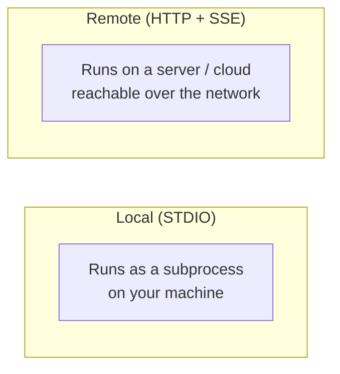
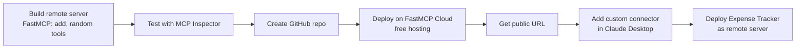

# Lesson 7 — How to Build & Deploy Remote MCP Servers

> **Source:** CampusX · *How to Build & Deploy Remote MCP Servers* · 45:49 · [watch](https://www.youtube.com/watch?v=GF7-ZzUausU&list=PLKnIA16_Rmva_oZ9F4ayUu9qcWgF7Fyc0&index=7)
> **One-liner:** Move from local → remote MCP servers with **FastMCP** — build a remote server, deploy it free on **FastMCP Cloud**, and connect it to Claude Desktop via **custom connectors**.
> **Code:** `github.com/campusx-official/test-remote-mcp-server`

---

## 🎯 TL;DR

**Local** servers run on your machine (STDIO); **remote** servers run over the network (HTTP+SSE) and are what you need for **enterprise / shared / always-on** use. Using FastMCP, build a simple remote server, test it with **MCP Inspector**, deploy it on **FastMCP Cloud** (free), share the URL globally, and connect it to Claude Desktop with a **custom connector**. Then convert the earlier **Expense Tracker** into a deployed remote server.

---

## 1. Local vs remote — when and why

| | **Local server** | **Remote server** |
|---|-------------------|-------------------|
| Transport | STDIO | HTTP + SSE |
| Runs on | Your machine | Cloud / shared host |
| Who can use it | Only you | Anyone with the URL + access |
| Best for | Personal tools, dev | **Enterprise, multi-user, always-on** |
| Trade-off | Simple, private | Needs hosting, auth, network concerns |

---

## 2. Build → test → deploy → connect

| Step | What you do |
|------|-------------|
| **Simple remote server** | Basic tools (`add`, `random number`) to learn the remote flow. |
| **Create repo** | Push the server code to GitHub (FastMCP Cloud deploys from it). |
| **Deploy on FastMCP Cloud** | Free hosting turns your repo into a live remote MCP server with a URL. |
| **Custom connector** | Register the remote URL in Claude Desktop manually. |
| **Expense Tracker remote** | Convert Lesson 6's local server into a deployed remote one — and fix its flaws along the way. |

---

## 3. What changes going remote

- **Transport:** STDIO → **HTTP+SSE** (recall Lesson 3).
- **Hosting:** you now need a place to run it (FastMCP Cloud here).
- **Access & connectors:** clients connect via a **URL + custom connector**, not a local subprocess command.
- **Enterprise fit:** one deployed server serves many users/clients — the reusability payoff from Lesson 2.

---

## 4. Key terms

| Term | Meaning |
|------|---------|
| **Remote MCP server** | A server reachable over the network (HTTP+SSE), not a local subprocess. |
| **FastMCP Cloud** | Free hosting that deploys an MCP server from a GitHub repo. |
| **Custom connector** | Registering a remote server URL in the client (Claude Desktop). |
| **Local → remote** | Swapping STDIO transport for HTTP+SSE + hosting. |

---

## ✍️ Notes / follow-ups
- Next: build the *client* side yourself → [Lesson 8 — Build MCP Clients](08-build-mcp-clients.md).
- Anchor: **remote = HTTP+SSE + hosting + connector; deploy once, use everywhere.**
