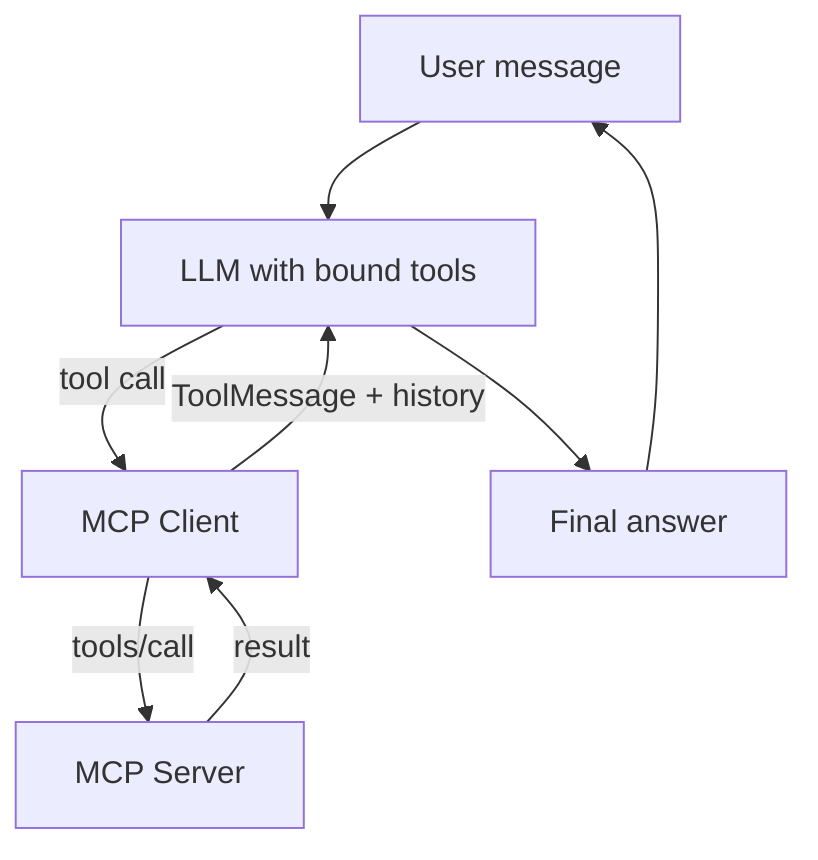

# Lesson 8 — How to Build MCP Clients

> **Source:** CampusX · *How to build MCP Clients* · 40:00 · [watch](https://www.youtube.com/watch?v=o4ajsc-tSBc&list=PLKnIA16_Rmva_oZ9F4ayUu9qcWgF7Fyc0&index=8)
> **One-liner:** Build your **own MCP client** (not just use Claude Desktop) that connects to multiple servers, binds their tools to an LLM, runs the tool-call loop, and wraps it in a **Streamlit** chatbot UI.
> **Code:** `github.com/campusx-official/mcp-client`

---

## 🎯 TL;DR

The final piece: build the **client** yourself. A custom async client connects to multiple MCP servers (local **Math**, remote **Expense Tracker**, external **Manim**), fetches their tools, **binds them to an LLM** (OpenAI), runs the **tool-call loop** (LLM asks → client invokes tool → result returned as a `ToolMessage` → LLM answers), supports **many servers at once**, and gets a **Streamlit** GUI. Now you understand MCP from both ends — server *and* client.

---

## 1. The client's job

The client is the glue: it speaks MCP to servers **and** speaks tool-calling to the LLM.

---

## 2. Build flow

| Step | What you do |
|------|-------------|
| **Servers overview** | Target a local **Math** server + remote **Expense Tracker** (+ Manim later). |
| **Local Math server demo** | Run and test it (uvicorn, MCP Inspector). |
| **Project setup** | `uv init`, install libs (MCP client, LLM SDK, Streamlit). |
| **Client skeleton** | **Async** structure + server config (which servers to connect to). |
| **Tools & LLM binding** | Fetch each server's tools, build a **name→tool** dict, **bind tools to the LLM**. |
| **Tool-call flow** | Parse the LLM's tool calls, **invoke** the tools, collect results. |
| **Return results** | Send results back as a **`ToolMessage`** + conversation history → LLM produces the final answer. |
| **Multi-server** | Loop over multiple servers; add the remote Expense Tracker. |
| **External integration** | Add the **Manim** animation server. |
| **Streamlit GUI** | Turn the console logic into a chatbot UI; live demo. |

---

## 3. Key implementation ideas

- **Async everywhere** — MCP client I/O is async (`async/await`); the client juggles multiple server connections concurrently.
- **Tool binding** — the LLM must be told which tools exist (name, description, schema) so it can decide to call them; the client maps tool names back to the right server.
- **The loop** — this is the same reason-act-observe loop as any agent: LLM proposes a tool call → client executes via MCP → result returns as a `ToolMessage` → LLM continues until it answers.
- **Multi-server routing** — with several servers, the client dispatches each tool call to the server that owns that tool.

---

## 4. Key terms

| Term | Meaning |
|------|---------|
| **MCP client** | The component that connects an LLM app to MCP servers (what Claude Desktop is, built yourself here). |
| **Tool binding** | Registering server tools with the LLM so it can call them. |
| **ToolMessage** | The message type carrying a tool's result back to the LLM. |
| **Multi-server client** | One client managing several MCP server connections at once. |
| **Streamlit** | Python framework used to give the client a chatbot UI. |

---

## ✍️ Notes / follow-ups
- 🎉 **Final lesson of the trilogy.** You now know MCP end-to-end: **Why** (Lessons 1–2) → **What** (3–4) → **How** (5–8: connect, build local, deploy remote, build clients).
- Natural next step (author's suggestion): **LangGraph** for orchestrating these tools into agents.
- Anchor: **a client = fetch tools → bind to LLM → run the tool-call loop across servers.**
