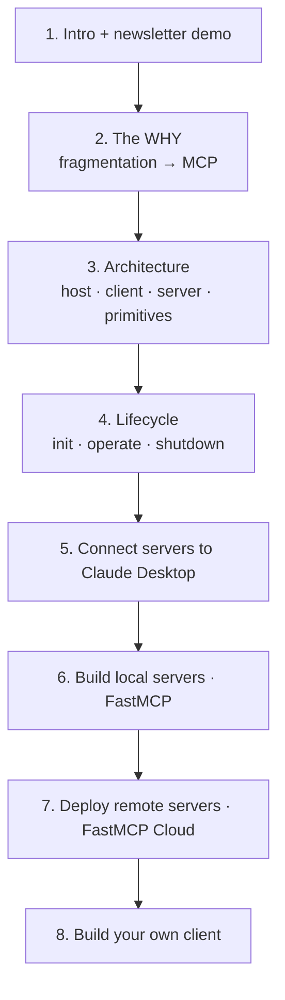

# 🔌 Model Context Protocol (MCP) — Lesson Notes

> One-page study notes distilled from the **CampusX "Model Context Protocol" playlist** ([full playlist](https://www.youtube.com/playlist?list=PLKnIA16_Rmva_oZ9F4ayUu9qcWgF7Fyc0)) — 8 videos, the **MCP Trilogy** (Why → What → How).
> Each lesson = one Markdown page, built from the video's own chapters, description, and key ideas.

---

## Lessons

| # | Lesson | Length | Part | Source | Status |
|---|--------|:------:|:----:|--------|:------:|
| 1 | [MCP Trilogy: Intro & Newsletter Demo](01-mcp-trilogy-intro.md) | 37:07 | Intro | [video](https://www.youtube.com/watch?v=3_TN1i3MTEU&list=PLKnIA16_Rmva_oZ9F4ayUu9qcWgF7Fyc0&index=1) | ✅ |
| 2 | [MCP: The Why](02-mcp-the-why.md) | 52:01 | Why | [video](https://www.youtube.com/watch?v=Zmy439spZB4&list=PLKnIA16_Rmva_oZ9F4ayUu9qcWgF7Fyc0&index=2) | ✅ |
| 3 | [MCP Architecture](03-mcp-architecture.md) | 1:17:09 | What | [video](https://www.youtube.com/watch?v=nQa31xdXbGk&list=PLKnIA16_Rmva_oZ9F4ayUu9qcWgF7Fyc0&index=3) | ✅ |
| 4 | [The MCP Lifecycle](04-mcp-lifecycle.md) | 55:05 | What | [video](https://www.youtube.com/watch?v=sBHeMcxupmE&list=PLKnIA16_Rmva_oZ9F4ayUu9qcWgF7Fyc0&index=4) | ✅ |
| 5 | [Connect MCP Servers to Claude Desktop](05-connect-mcp-servers-to-claude-desktop.md) | 46:17 | How | [video](https://www.youtube.com/watch?v=y-uPv3ltOTY&list=PLKnIA16_Rmva_oZ9F4ayUu9qcWgF7Fyc0&index=5) | ✅ |
| 6 | [Build Local MCP Servers](06-build-local-mcp-servers.md) | 1:12:11 | How | [video](https://www.youtube.com/watch?v=tc2oOznpdE0&list=PLKnIA16_Rmva_oZ9F4ayUu9qcWgF7Fyc0&index=6) | ✅ |
| 7 | [Build & Deploy Remote MCP Servers](07-build-deploy-remote-mcp-servers.md) | 45:49 | How | [video](https://www.youtube.com/watch?v=GF7-ZzUausU&list=PLKnIA16_Rmva_oZ9F4ayUu9qcWgF7Fyc0&index=7) | ✅ |
| 8 | [Build MCP Clients](08-build-mcp-clients.md) | 40:00 | How | [video](https://www.youtube.com/watch?v=o4ajsc-tSBc&list=PLKnIA16_Rmva_oZ9F4ayUu9qcWgF7Fyc0&index=8) | ✅ |

**Playlist complete — all 8 lessons. 🎉**

---

## The trilogy arc (how the lessons connect)

- **Lessons 1–2** = **The Why** (motivation).
- **Lessons 3–4** = **The What** (architecture + lifecycle).
- **Lessons 5–8** = **The How** (connect → build local → deploy remote → build client).

---

## Core MCP cheat-sheet

| Concept | In one line |
|---------|-------------|
| **MCP** | A standard connecting AI apps to external tools/data — "USB-C for AI." |
| **Host / Client / Server** | The AI app / per-server connector / capability provider. |
| **Primitives** | **Tools** (actions), **Resources** (data), **Prompts** (templates). |
| **Data layer** | JSON-RPC 2.0 messages (`tools/call`, `resources/read`, …). |
| **Transport** | **STDIO** (local) or **HTTP+SSE** (remote). |
| **Lifecycle** | Initialization → Operation → Shutdown (+ pings, errors, timeouts). |
| **FastMCP** | High-level Python lib to build servers fast (+ FastMCP Cloud to deploy). |

---

## How each page is structured
- **TL;DR** — the one thing to remember.
- **Core concepts** — distilled, with tables and Mermaid diagrams.
- **Examples / demos** — concrete, from the lesson (with repo links where given).
- **Key terms** — quick glossary.
- **Notes** — space for your own questions + link to the next lesson.

_Notes distilled from each video's chapters + description. Ask for a verbatim transcript of any lesson and I'll capture quoted lines._
