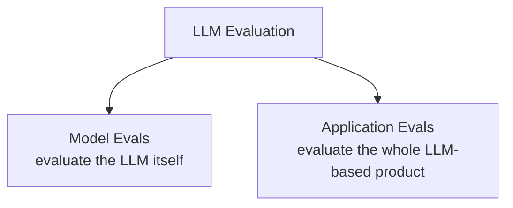

# Lesson 2 — Model Evals vs Application Evals

> **Source:** CampusX · *Introduction to LLM Evaluations – Model Evals vs Application Evals* · 24:32 · [watch](https://www.youtube.com/watch?v=cNF_MO82Qew&list=PLEneLIDJFpcA&index=2)
> **One-liner:** LLM Eval ≠ a metric — it's the entire testing setup (what you test, on what criteria, when, with what tool). That setup splits into two flavors: **Model Evals** (does the frontier lab's LLM have the raw capability?) and **Application Evals** (does everything *you* built around it actually work?) — and this course is about the second one.

---

## 🎯 TL;DR

**LLM Evaluations are systematic, repeatable tests used to judge an LLM or LLM-powered system against a clear criterion** — that's the formal definition given, and every word in it is load-bearing (systematic ≠ vibe testing, repeatable ≠ one-off, clear criterion ≠ "it felt right"). The single biggest misconception the instructor calls out from personal experience: **"Eval" does not mean "metric."** An eval is the entire testing setup — what's being tested, the criteria, the dataset, when it runs, which tool computes it. That setup splits into two categories, and the split matters: **Model Evals** test the LLM's raw capability (reasoning, knowledge, math, coding, etc.) via standardized benchmarks — this is Frontier labs' job, and you mostly need to *read* their results, not run them yourself. **Application Evals** test the entire system you built around the model — and building/running these is the actual job of an AI engineer, and the real focus of this whole playlist.

---

## 1. The formal definition, broken into its three load-bearing words

> "LLM Evaluations are **systematic**, **repeatable** tests used to judge an LLM and LLM-powered system against a **clear criterion**."

| Word | What it rules out | What it requires instead |
|---|---|---|
| **Systematic** | "Vibe testing" — asking 5 questions off the top of your head and deciding it feels fine | A proper dataset that deliberately covers the range of real-world edge cases (e.g. pulling 100 real user chats from a CampusX chatbot's logs to build a representative test set) |
| **Repeatable** | A one-off gut check that can't be redone | The *same* dataset, run against any version of the system (new model, new retriever, new chunking strategy) — so you can objectively say version 2 is better than version 1, because both were scored on identical inputs |
| **Clear criterion** | Testing with no defined notion of "good" | Explicit, stated criteria — for a CampusX chatbot: is the answer correct? is it explained simply? is it grounded in the actual course content? is it free of unsafe/abusive language? |

Without criteria, you're doing vibe testing with extra steps. With criteria, it's a proper evaluation.

---

## 2. The core misconception: "Eval" is not "metric"

The instructor names this directly as a trap he fell into himself, coming from a classical ML background: in ML, "how do you evaluate a model?" usually just meant naming a metric — accuracy, precision, recall. So the instinct is to assume "LLM eval" is the same thing: just a bigger list of metrics.

**That's wrong.** An LLM eval is **the entire testing setup**, which includes:

- **What** is being evaluated (e.g. specifically the retriever component of a RAG chatbot, not the whole system)
- **On what criteria** (e.g. retrieval accuracy)
- **The dataset** built specifically to test that thing
- **When** it runs (offline, before shipping — vs. online, on live production traffic)
- **Which tool** computes it (e.g. Ragas, for a RAG application)

All of these together are what "LLM Eval" refers to — the metric is just one output of that setup, not the setup itself.

**And the goal of an eval was stated explicitly as answering practical questions, not producing a score for its own sake:**
- Can this model be used for this particular application?
- Is this system good enough to ship?
- Did prompt v2 actually improve over prompt v1?
- Is the answer grounded in the retrieved context?
- Is the agent completing its task correctly?
- Is the chatbot safe for real users?
- Is latency under control?

---

## 3. Two types of LLM eval — and an explicit disclaimer about the terms

**Disclaimer stated directly in the lecture:** *"Model Eval"* and *"Application Eval"* are **not official industry terms** — the instructor coined them specifically to make this distinction easy to hold in your head. In the actual industry, both are just called "LLM Evals," and people infer from context which one is meant. This is a teaching device, not vocabulary to quote as if it's standard.

---

## 4. Model Evals — testing the LLM itself

**Definition given:** Model Evals evaluate the model itself — testing and benchmarking a model's raw capabilities so that, when a new LLM is released, its abilities are documented and comparable (this is why you see "Model X topped Benchmark Y" announcements every time a new model launches).

### The 8 capability categories tested, with their named benchmarks

| Capability | What it tests | Named benchmark example |
|---|---|---|
| **Reasoning** | Can the model solve a problem by thinking step by step? | — |
| **Knowledge** | Does the model have general world knowledge up to its training cutoff? | **MMLU** — multi-subject questions across science, history, law, medicine |
| **Basic math** | Can the model solve math problems? | **GSM8K** — grade-school math word problems |
| **Coding** | Can the model write correct code? | **SWE-bench**, **HumanEval** |
| **Instruction following** | If given 10 instructions, does it follow all 10? | **IFEval** |
| **Long-context handling** | Does it stay accurate even with a very large context window? | **Needle in a Haystack** |
| **Multimodal understanding** | Can it understand/produce images, text, sound together? | **MMMU** |
| **Tool use** | Can it correctly invoke and use external tools? | — |

**Who actually needs to run these?** The instructor is direct about this: as an AI engineer, you will most likely **never personally run a model eval** — that's the frontier labs' job when they release a new model. What you *do* need is **literacy**: know these 8 categories exist, know how to read a benchmark result, and use that literacy to make better model-selection decisions when starting a new project (this becomes the deep-dive topic of Lessons 7–9).

---

## 5. Application Evals — testing everything you built around the model

**Why this category exists at all:** the LLM is only *one component* of a real LLM-based application. The instructor lists everything else that goes into a production system besides the model itself:

- User interface
- System prompt
- Tools / API integrations
- Orchestration code (e.g. LangGraph — branching, parallel control flow)
- Guardrails
- Output parsers
- Memory / context management
- Retrieval system, embedding model, vector database (for RAG)
- The full post-deployment monitoring and feedback loop

### The smartphone-chip analogy (the mental model to remember)

Chip manufacturers (Snapdragon, MediaTek) benchmark their processors and publish scores — but a phone with a great chip isn't automatically a great phone. The camera system, OS, sound system, graphics, and battery all need to work *and* be tested individually and together. **Frontier labs evaluate the "chip" (the LLM). Evaluating the rest of the "phone" — the entire application you built — is the AI engineer's job.**

**Definition given:** *"Application Evals assess the behavior and performance of an LLM-powered application, whether at the level of the entire system or a specific component within it."* Critically, application evals happen at **both levels** — the whole RAG chatbot's final response *and* its individual components (is the retriever working? is the embedding model working? is the reranker working?).

**The question application evals answer is different in kind from model evals:** not *"can the model do this?"* (that's model eval) but *"will our product actually work?"* — for a CampusX chatbot specifically: was the student's question answered correctly? was the course material used properly? was the answer faithful? was it easy for a beginner to follow? did the model hallucinate? was the response fast? is the chatbot safe?

---

## 6. Key terms

| Term | Meaning |
|---|---|
| **LLM Evaluation** | The entire testing setup (what's tested, criteria, dataset, timing, tooling) — not just a metric. |
| **Model Eval** (instructor's own term, not industry-standard) | Testing the raw LLM's capabilities via standardized benchmarks. |
| **Application Eval** (instructor's own term, not industry-standard) | Testing the entire LLM-based product, at system level and component level. |
| **Benchmark** | A standardized test (MMLU, GSM8K, SWE-bench, IFEval, Needle in a Haystack, MMMU) used to score and document a model's capability in a specific category. |

---

## ✍️ Notes / follow-ups
- Model Evals get their own dedicated deep-dive later in the playlist (Lessons 7–9); this course's actual focus from here on is Application Evals.
- Next: the complete, repeatable **workflow** for running an application eval end-to-end, using a real email-classification case study → [Lesson 3 — How to Evaluate LLM Applications: The Complete Workflow](03-how-to-evaluate-llm-applications-workflow.md).
- Key habit: whenever you hear "LLM Eval" without further context anywhere in the industry, assume it means *application* eval — the instructor calls this true "99% of the time."
