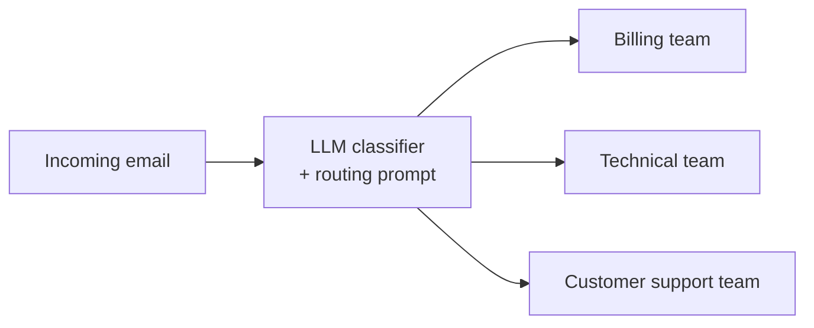
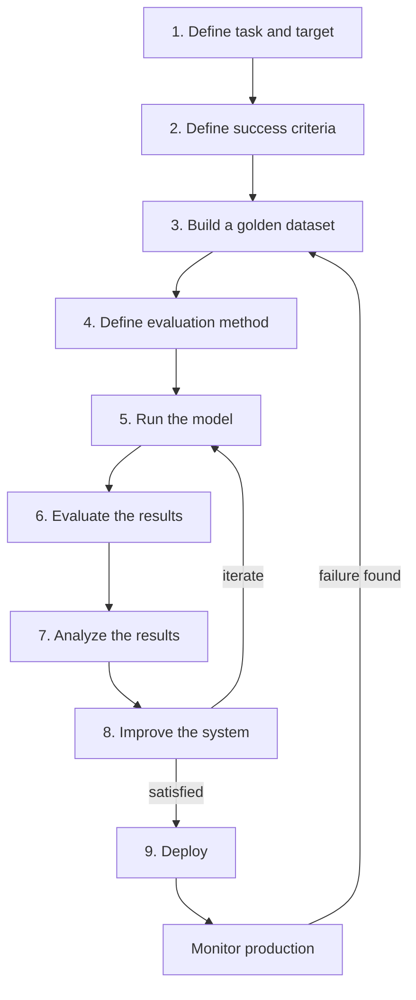

# Lesson 3 — How to Evaluate LLM Applications: The Complete Workflow

> **Source:** CampusX · *How to Evaluate LLM Applications: The Complete Workflow* · 17:00 · [watch](https://www.youtube.com/watch?v=Pv4mkG2K_s8&list=PLEneLIDJFpcA&index=3)
> **One-liner:** A single, repeatable 9-step workflow for evaluating *any* LLM application — demonstrated on the simplest possible case (a Zomato support-email classifier) precisely so the workflow itself, not the app's complexity, is what sticks. The same 9 steps apply unchanged to a RAG chatbot or a complex agent.

---

## 🎯 TL;DR

The whole lecture is one worked example: **Zomato wants to auto-classify incoming support emails** (billing / technical / general) and route them to the right team instead of a human tagging every email by hand. Building the LLM router itself takes "5–10 minutes" — the actual lesson is the discipline of *not deploying it yet*, and instead running it through 9 defined steps: define the task and target → define a success criterion → build a golden dataset → define an evaluation method → run the model → evaluate the results → analyze the results → improve → iterate — then deploy, monitor, and feed production failures back into the golden dataset, forever. This loop is stated explicitly as the same loop you'd use for a RAG pipeline or a complex agent — only the task and metrics change, not the shape of the process.

---

## 1. The case study: Zomato's support-email router

Zomato receives high email volume and wants to stop manually reading and tagging every message. The proposed system: an LLM reads each email's content and classifies it into one of three buckets — **billing**, **technical**, or **general** — so it can be auto-routed to the right team without a human triage step.

This is deliberately the simplest possible LLM application — a single prompt, a single classification call — so that the workflow being taught is visibly separable from the complexity of any one app. The instructor states directly: *"You'll see this exact same flow again and again throughout this course... you'll need to use the same workflow for a very complex agent."*

---

## 2. The 9-step workflow

### Step 1 — Define the task and target
What exactly are you evaluating? Here: this email-routing system, and the specific task is classification — does it correctly bucket each email into billing / technical / general?

### Step 2 — Define a success criterion
For a classification task, the natural metric is **accuracy**: if the system correctly routes 90 of 100 queries, it's 90% accurate. The instructor is explicit that the metric follows from the task shape — a classification task gets accuracy; other task shapes (covered in later lessons) get different metrics.

### Step 3 — Build a golden dataset
A table of (message content, correct label) pairs, hand-labeled — e.g. *"My card was charged twice"* → billing; *"The app crashes on login"* → technical; *"What are your hours?"* → general. Real practice is **50–500 examples**, ideally pulled from your **actual historical data** (real past support chats) rather than invented examples, with labels assigned by a human sitting down and tagging them. This labeled table is what the industry calls a **golden dataset**.

### Step 4 — Define an evaluation method
Decide **who or what actually scores the model's output against the golden label** — there are three options:

| Method | When it fits |
|---|---|
| **Automated (code)** | The output is a short, structured value (like a label) that can be directly string-compared to the golden answer — no ambiguity, no cost, no need for a human or a second LLM |
| **Human** | The output is open-ended text where correctness requires judgment — but costly, since a human has to be paid to review every case |
| **LLM-as-judge** | A middle ground — an LLM reviews open-ended outputs against the golden answer at a fraction of human cost, used when two long text answers can't be compared by exact string match |

For this classifier specifically, the output is a single label (billing/technical/general), so an **automated, code-based comparison** is the obvious and cheapest choice — no need to involve a human or a second LLM. The instructor contrasts this directly with a chatbot scenario, where the expected answer and the generated answer are both long paragraphs — there, code-based exact comparison can't judge semantic correctness, so you'd need a human or an LLM judge instead.

### Step 5 — Run the model
Send every row of the golden dataset through the system and record what it outputs for each one.

### Step 6 — Evaluate the results
Apply the evaluation method from Step 4 (here: a Python script comparing predicted label vs. golden label) to compute the success metric — e.g. accuracy = 80%, meaning 80 of 100 test emails were routed correctly and 20 were not.

### Step 7 — Analyze the results
Don't stop at the number — investigate **where and why** the 20% of mistakes are happening. For this specific system, the instructor names two concrete hypotheses worth checking:
- **The system prompt** may be ambiguously worded, causing the model to confuse billing and technical cases specifically.
- **The model itself** may be too weak (e.g. a low-parameter open-source model) for the task's actual difficulty.

### Step 8 — Improve the system, then iterate
Based on the analysis, make a targeted change — tweak the prompt, or swap the model — then loop back to Step 5 and re-run the *same* golden dataset. This is the concrete meaning of "repeatable" from Lesson 2: the same test, rerun after each change, is what lets you say objectively whether a change helped.

**The worked numbers in the lecture, as a narrative arc:**
1. Baseline run: **80%** accuracy → manager says improve it.
2. Prompt tweak, rerun: **90%** accuracy → manager says improve further.
3. Swap to a heavier/more capable LLM, rerun: **95%** accuracy → manager is satisfied, stop iterating.

### Step 9 — Deploy, then monitor forever
Once satisfied, ship the system — but evaluation doesn't end here. In production:
1. **Monitor** for real-world failures — a golden-dataset accuracy of 95% doesn't guarantee the same performance on genuinely new customer data.
2. **Identify failures** — e.g. an email that should have routed to billing was instead routed to technical, and a real customer had to explicitly complain to the technical team before it got corrected.
3. **Feed the failure back into the golden dataset** — that specific misclassified email becomes a new labeled row.
4. **Restart the loop from Step 5** with the now-richer golden dataset.

> A student question surfaced an important operational detail: *"who decides the output is wrong during monitoring?"* Answer given: in practice this comes from a real feedback signal — e.g. a customer who was misrouted complains to the team that received the email in error, and that team is the one who flags the case as mislabeled, which is what gets it added back into the dataset.

**This creates a permanent loop, not a one-time process**: the golden dataset keeps growing richer from real production failures, and the system keeps getting re-evaluated and improved against that richer dataset for as long as it's deployed.

---

## 3. One important closing point: multiple evals per application

The lecture explicitly flags a subtlety worth remembering: *"One LLM-based application may have — or might have — several LLM evals."* The Zomato example walked through exactly **one** evaluation (classification accuracy), but a real system typically runs **many** evals simultaneously. For a RAG application specifically, the instructor lists concrete examples of the kind of evals that would run in parallel on the *same* app: one eval testing the retriever's performance, a separate eval testing the embedding model, a separate eval testing the whole RAG workflow end-to-end, and yet another eval specifically tracking system latency. **A single LLM application almost always needs multiple, distinct evals running side by side — not one eval that covers everything.**

---

## 4. Key terms

| Term | Meaning |
|---|---|
| **Golden dataset** | A hand-labeled (input, correct-output) table built from real historical data, used as ground truth for every eval run against the system. |
| **Success criterion** | The specific metric that defines "working correctly" for a given task shape (e.g. accuracy for classification). |
| **Evaluation method** | *Who* scores model output against the golden answer — automated code, a human, or an LLM-as-judge — chosen based on how easy the output is to compare programmatically. |
| **Iterate** | Rerunning the *same* golden dataset after each system change, to get an apples-to-apples before/after comparison. |
| **Monitoring (post-deployment)** | Continuously catching real production failures and feeding them back into the golden dataset, so the eval loop never truly stops. |

---

## ✍️ Notes / follow-ups
- This 9-step shape is the backbone the rest of the playlist builds on — it's re-used almost verbatim for the RAG evaluation arc (Lessons 12–14) and will recur for agent evals later.
- Next: why one eval per application usually isn't enough, and how to think about running several eval pipelines together on the same system → [Lesson 4 — Why Your AI Application Needs Multiple Eval Pipelines](04-multiple-eval-pipelines.md).
- Key habit: **pick the evaluation method (automated / human / LLM-judge) based on how comparable the output shape is** — don't reach for an LLM judge when a plain string/label comparison would do, and don't reach for string comparison when the output is open-ended text.
