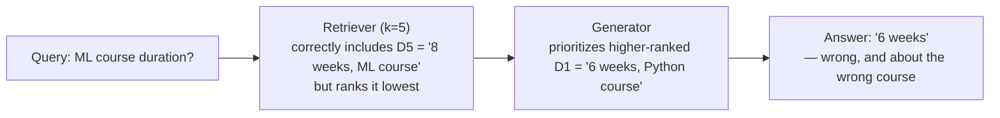

# Lesson 4 — Why Your AI Application Needs Multiple Eval Pipelines

> **Source:** CampusX · *Why Your AI Application Needs Multiple Eval Pipelines?* · 28:06 · [watch](https://www.youtube.com/watch?v=DcZ-XCk-O_M&list=PLEneLIDJFpcA&index=4)
> **One-liner:** A worked RAG failure case — retriever passes its own test, generator passes its own test, and the combined answer is *still* confidently wrong — used to prove that real systems need evals at **three levels** (component, workflow, application) crossed with **three risk categories** (quality, safety, operations), which is why 99.99% of real LLM applications end up with *many* eval pipelines running in parallel, never just one.

---

## 🎯 TL;DR

Picking up directly from the previous lecture's closing line — *"one LLM-based application may have several LLM evals"* — this lecture proves that claim with a single worked RAG scenario: the retriever does its job correctly (it fetches a document containing the right answer, just ranked low), the generator does its job correctly (it faithfully uses the highest-priority document it was given), and yet **the final answer is wrong**, because the *interaction* between two individually-correct components is where the real failure lives. This motivates evaluating at **three levels** — component, workflow (the interaction between components), and application (the whole product) — and, orthogonally, across **three risk categories** — application quality, safety, and operations. The two together are why almost every real LLM application ends up running multiple, separate eval pipelines rather than one.

---

## 1. The worked failure case: two "correct" components, one wrong answer

**Setup:** a RAG chatbot with `k=5` — the retriever fetches the 5 most relevant documents for a query, and the generator is instructed to weigh higher-ranked documents more heavily when composing its answer.

**The scenario, step by step:**
1. A user asks: *"What is the duration of the machine learning course?"*
2. The retriever returns 5 documents. Documents 1–4 are unrelated filler; **document 5** (the lowest-ranked of the five) is the one that actually says *"the duration of the machine learning course is 8 weeks."*
3. **Was the retriever's job done correctly?** Yes — its job was to get the right document into the top-5, and it did. (Reranking is deliberately out of scope for this example — assume none is in place yet.)
4. All 5 documents, plus the question, are passed to the generator — which is instructed (via its system prompt) to give more weight to higher-priority/higher-ranked documents.
5. One of the higher-ranked documents (say, document 1) happens to mention, in an unrelated context, that *"the duration of the Python course is 6 weeks."*
6. The generator, faithfully following its instruction to prioritize higher-ranked context, answers: *"The ML course duration is 6 weeks."* — **wrong**, and mixing up two different courses.

**Why this is a genuinely interesting failure, not just a bug:** the generator didn't hallucinate — it didn't invent a fact from nothing. It pulled a real number from a real document it was given, and followed its own instructions about prioritization faithfully. **Both components, tested in isolation, would pass their own eval.** The retriever got the answer into its top-5 (its whole job). The generator grounded its answer in real provided context and followed its priority instructions (its whole job). **The failure lives entirely in how the two interact** — specifically, that the correct document was ranked last instead of first.

**The fix this diagnosis points to:** a **reranker** — a component that reorders the retrieved documents so the most query-relevant one (D5, in this case) moves to the top before the generator ever sees the list. Once D5 is ranked first, the generator's own "prioritize higher-ranked context" instruction now works *for* the correct answer instead of against it.

---

## 2. Three levels of evaluation

The lecture uses this example to build up three levels, layer by layer:

| Level | What it tests | In this example |
|---|---|---|
| **Component** | Each piece in total isolation | A retriever-only eval (did the right document make the top-K?) and a generator-only eval (given context, is the answer faithful/grounded?) — **both pass** |
| **Workflow** | The *interaction* between chained components | An eval on the retriever→generator combination specifically — this is the one that actually catches the ranking-priority failure, since neither component-level eval is positioned to see it |
| **Application** | The whole product, as the end user experiences it | Even with workflow-level correctness confirmed, is the *whole request* fast enough, cheap enough, safe enough? (e.g. a technically-correct answer that takes 10 seconds is still not production-ready) |

**The explicit progression of the lecture's own reasoning:** first it shows component-level checks passing while the system still breaks (motivating workflow-level eval); then it shows workflow-level correctness confirmed while the system *could still* be unfit to ship — e.g. correct and grounded, but taking 10 seconds to respond, which fails a real user's patience regardless of correctness (motivating application-level eval on top). Each level catches a class of failure invisible to the level below it.

---

## 3. The general list of components that can fail

Beyond retriever/generator, the lecture names the fuller list of things that can independently break inside a real LLM application, each deserving its own component-level eval: the **system prompt**, **reranker**, **query rewriter**, **embedding model**, **vector database**, **output parser** (for structured-output apps), **agent**, **tool** (for tool-using apps), **memory**, and **guardrails**.

---

## 4. Three risk categories — the second, orthogonal axis

Independent of *which level* you're testing, there's a second dimension: *what kind of risk* you're checking for. The lecture organizes all real-world risks into three categories:

| Category | Definition given | Covers |
|---|---|---|
| **Application quality** | "Does the app do its actual job well — giving correct, relevant, complete answers to what the user asked?" | Task-specific correctness — different per application type (see table below) |
| **Safety** | Ensuring the answer isn't harmful | Toxicity, dangerous content, bias, PII/private-data leakage, jailbreak/prompt-injection resistance |
| **Operations** | Can it run fast, cheap, and reliably once deployed? | Latency under load, cost per request, token efficiency, error/failure rate |

### Application-quality risk categories, broken down by app type

The lecture is specific that "application quality" isn't one thing — it names distinct risk categories per application shape:

| Application type | Named risk categories |
|---|---|
| **General LLM app** (e.g. a text summarizer) | Correctness/accuracy, relevance, completeness, instruction-following (did it respect requested format/length?) |
| **RAG application** | **Context relevance** (are retrieved docs actually relevant — closely tied to retriever recall), **groundedness/faithfulness** (is the answer based only on the given context, no extra invented info), **citation accuracy** (can it correctly cite which document a claim came from — as seen in tools like ChatGPT's citations) |
| **Agent** | **Tool selection** (does it pick the right tool for the job?), **parameter correctness** (are the arguments passed to a tool call correct?), **task completion** (how often does it actually finish the task — failure rate), **error recovery** (can it recover gracefully after making a mistake mid-task?) |
| **Multi-turn chatbot** | **Context retention** (how much of the earlier conversation does it actually remember?), **clarification behavior** (does it ask for clarification when the user is ambiguous or uses unclear abbreviations, rather than guessing?) |

### Safety risk categories

Toxicity, harmful content (self-harm, weapons, illegal activity), bias (does it treat different user profiles consistently, or answer differently based on who's asking?), PII/private-data leakage (e.g. leaking another user's credit card info or contact details), and jailbreak/prompt-injection resistance (can a user talk it into doing something it shouldn't via clever phrasing?).

### Operational risk categories

Latency, cost per request, token efficiency, error/failure rate, and latency specifically **under load** (not just latency for a single isolated request).

---

## 5. Why this necessarily produces multiple eval pipelines

**The two reasons stated directly, together:**
1. **Multiple failure points** — component, workflow, and application are three genuinely different places a system can break, each invisible to evals targeting the other two levels.
2. **Multiple risk categories** — at any given level, quality, safety, and operations are three genuinely different *kinds* of failure, each needing its own dataset, metric, and threshold.

**The conclusion drawn explicitly:** the same application ends up with a whole matrix of separate pipelines — one eval for latency, a separate eval for safety, a separate eval for correctness, and so on — because a single blended score would hide exactly which dimension had regressed. This is stated as true **99.99% of the time** for any real LLM-based application, not an edge case.

---

## 6. Key terms

| Term | Meaning |
|---|---|
| **Component-level eval** | Testing one piece (retriever, generator, reranker, etc.) in complete isolation. |
| **Workflow-level eval** | Testing how chained components interact — catches failures invisible to any single component's own eval. |
| **Application-level eval** | Testing the whole product as the end user experiences it, including things like end-to-end latency. |
| **Application quality** | Whether the app does its actual job well — correctness/relevance/completeness, with app-type-specific sub-categories (RAG's groundedness, agent's task completion, etc.). |
| **Safety risk category** | Toxicity, harmful content, bias, PII leakage, jailbreak resistance. |
| **Operational risk category** | Latency (including under load), cost per request, token efficiency, failure rate. |

---

## ✍️ Notes / follow-ups
- Next: *who or what* actually executes each of these pipelines — programmatic, human, or LLM-as-judge → [Lesson 5 — Eval Methods & LLM-as-Judge](05-eval-methods-llm-as-judge.md).
- Key habit: **when a component-level eval passes but the product still fails, look one level up (workflow) before assuming the component eval was wrong.**
