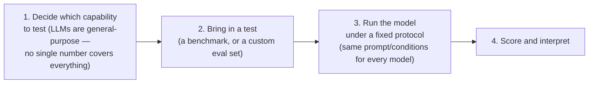

# Lesson 7 — LLM Model Evals & Capabilities

> **Source:** CampusX · *LLM Model Evals & Capabilities* · 37:52 · [watch](https://www.youtube.com/watch?v=FPS0rIAQwzo&list=PLEneLIDJFpcA&index=7)
> **One-liner:** The pivot session from application evals to model evals — four concrete reasons an *AI engineer specifically* (not just a frontier lab) needs model evals, the 4-step anatomy of any model eval, benchmarks vs. custom evals (with a full worked Zomato cost/accuracy table proving benchmarks alone can point you at the *wrong* model for your task), and a detailed tour of the 8 core capabilities every major benchmark targets.

---

## 🎯 TL;DR

Model evals exist generically so anyone can measure an LLM's capabilities — but the lecture asks specifically *why an AI engineer* (not a frontier lab) needs to care, and gives four concrete reasons: comparing candidate models for your application, deciding whether a newly-released model is actually worth upgrading to, assessing safety/hallucination risk before deployment, and choosing between a proprietary API and a self-hosted open-source model. Every model eval, regardless of what it's testing, follows the same **4-step anatomy**: pick a capability → build/select a test → run it under a fixed protocol → score and interpret. Tests come in two flavors — standardized **benchmarks** (same test for every model, enabling direct comparison) and **custom evals** (built from your own data, because a benchmark's generic ranking can be actively misleading for your specific task) — proven with a full worked Zomato email-classification case study where the benchmark-leading model is *not* the one you'd actually deploy. The session closes with a detailed tour of the **8 core capabilities** essentially every benchmark in the industry targets.

---

## 1. Why does an AI engineer, specifically, need model evals?

The instructor is explicit that model evals obviously matter to **frontier labs** — they use them to guide training and prove their new release is better. The more interesting question for this course: *why do you, building applications on top of these models, need to care?* Four reasons are given directly:

1. **Comparing candidate models for your application.** In a real team meeting you cannot say "let's just use whichever, both are fine" — you need concrete pointers: "this application needs capability X, and Model A scores higher than Model B on X" is the kind of justification model evals let you make.
2. **Deciding whether a new model release is actually worth adopting.** If you already have, say, Claude Opus 4.8 deployed and Claude "Fable" is released, your manager asking "should we switch?" can only be answered with real comparative numbers from model evals — not a hunch.
3. **Assessing safety before deployment.** Model evals are how you learn how much a given model hallucinates, how easily it can be jailbroken, and generally how safe it is to put in front of real users.
4. **Choosing proprietary vs. open-source / self-hosted.** Deciding between an API-based proprietary model (e.g. Claude) and a self-hosted open-source model (e.g. DeepSeek) — where the proprietary option may be more powerful but pricier, and the open-source option cheaper but not matching every capability — is exactly the kind of trade-off model evals make legible.

**The line the lecture uses to summarize all four:** *"Without model evals, you are basically blind"* — you have no way to see which model is actually good at what, or to compare two models on anything other than vibes.

---

## 2. The formal definition, and the 4-step anatomy of any model eval

**Definition given:** *"Model evaluation is a systematic process of measuring an underlying model's capabilities, behavior, reliability, and operational characteristics under controlled conditions."*

Every model eval, regardless of which capability it targets, follows the same four steps:

**Why step 1 matters specifically:** unlike a human IQ score that (arguably) summarizes a lot about a person in one number, there is **no single number that summarizes an LLM** — reasoning, coding, math, safety, etc. are genuinely separate capabilities, each requiring its own test. This is why the rest of the lecture organizes around 8 distinct capabilities rather than one aggregate score.

---

## 3. Two kinds of tests: benchmarks vs. custom evals

| Test type | Definition given | When it's the right tool |
|---|---|---|
| **Benchmark** | "A standardized, shared test (like MMLU or SWE-bench) — because everyone runs the same test, it's great for comparing models on common ground." | Comparing general-purpose capability across many models on a level playing field |
| **Custom eval** | "Data you collect from your actual task, which measures what you specifically care about rather than what's generically useful." | Deciding which model is actually best *for your application*, when generic capability rankings may not transfer |

### The worked case study: why benchmark rank alone can point you at the wrong model

**Setup:** back to the Zomato email-classification system from Lesson 3 — routing incoming emails into billing / technical / refund. Two model choices:

| | Model A | Model B |
|---|---|---|
| Benchmark standing | Top of the leaderboard | Mid-table |
| Cost | ~$15 per million tokens | ~$0.50 per million tokens |
| Character | A large frontier model (think Claude Opus-tier) | A smaller, cheaper model (think a Minimax/Qwen-tier model) |

**Naive conclusion from benchmarks alone:** Model A wins every public benchmark — better at math, coding, language generation, everything — so "just use Model A."

**What the custom eval actually showed:** a golden dataset of 200–500 real past emails, hand-labeled, run through both models:

| Metric | Model A | Model B |
|---|:---:|:---:|
| Classification accuracy | 94% | 91% |
| Emergency-urgency accuracy (how urgently a reply is needed) | 88% | 87% |
| Cost per 1,000 emails | ~$6 | a small fraction of a cent |
| Latency per request | ~4.1 seconds | well under 1 second |

**The conclusion drawn directly:** the accuracy gap between the two models on *this specific task* is small — the task simply isn't hard enough to need frontier-model capability — while the cost and latency gap is large. **Model B is the objectively better value proposition for this application**, even though it loses on every public benchmark. The explicit rhetorical question the lecture poses: *"If we had depended only on benchmarks, would we ever have reached this conclusion? No — Model A beats Model B on every benchmark."* Only the custom eval, built from real task data, surfaces the actual right answer for this specific job.

---

## 4. The 8 core capabilities benchmarks target

The instructor frames this as a necessarily "text-heavy" 10-minute section, since these categories are the vocabulary the next several lessons (benchmarking, saturation/contamination, leaderboards) are all built on.

### 1. Knowledge and Reasoning
Combines two things: **factual recall** across subjects (the named example: **MMLU**, which tests across 57 subjects — biology, physics, chemistry, history, etc.) and **multi-step logical reasoning** — connecting multiple facts in the correct sequence to reach a conclusion (the lecture's own example: summarizing the entire arc of human evolution from the Big Bang to now, and explaining why society looks the way it does today — that requires both raw factual knowledge *and* connecting it correctly). **Why frontier labs obsess over this:** it's the most direct signal of how "intelligent" a model is perceived to be. **Real-world relevance:** research assistants, complex customer-query analysis, technical document Q&A, and professional-domain assistants (legal, teaching) all lean heavily on this capability.

### 2. Coding and Software Engineering
Named directly as the most economically significant capability discussed — the instructor cites **Cursor's $60 billion valuation** as a direct consequence of LLMs being able to code well. Tested dimensions: generating functional code from a plain-English spec, generating test cases, improving code based on test failures, fixing bugs in an *existing* codebase, multi-file/long-horizon engineering tasks (refactoring an entire codebase against one guiding principle), running command-line operations (installing packages, configuring servers, setting up environments), and calling APIs/functions correctly. **Real-world relevance:** any AI coding agent (the category the whole Cursor-style product wave is built on) lives or dies on this capability.

### 3. Mathematics
Framed explicitly as a specific *form* of reasoning (step-by-step problem solving toward a solution), but broken out separately because of its distinct real-world footprint. Tested at four escalating tiers: grade-school-level math, competition-level problems (Olympiad-style, requiring creative insight), undergraduate-level problems, and open research-level mathematical reasoning (genuinely unsolved problems). **Real-world relevance:** scientific computing, financial modeling, engineering simulation, data analysis.

### 4. Long Context
Tests whether a model can *actually use* information across a very long input (hundreds of thousands of tokens), not just accept it. Tested dimensions: extracting a small fact buried in a long document, retrieving details about a specific entity from a large document, summarizing long context, and — for coding agents specifically — maintaining full context across a large codebase. **Why this matters even though vendors publish huge context windows:** the lecture notes directly that as a chat grows longer, a model's ability to actually retain and use earlier context tends to degrade in practice, even within the advertised window — so this capability specifically measures whether the *advertised* context length is *usable*, not just accepted.

### 5. Vision and Multimodal
Extending beyond text into understanding images and video. **Real-world relevance, stated directly:** we already live in a multimodal world — pointing a phone camera at a fridge and asking "what can I make with this?", or asking about a specific book in a library — so benchmarks have to cover this alongside text-only capability.

### 6. Agentic and Tool Use
Tests whether a model can effectively browse the web autonomously, correctly call structured tools, interact with APIs, and use a desktop/computer environment. **Why this is a fast-growing focus:** the entire agentic-AI wave depends on models that don't just print text but can reliably *act* — this capability is what a benchmark measures to tell you whether a given model is trustworthy enough to drive an agentic application.

### 7. Safety and Alignment
Tests whether a model can be trusted to behave responsibly: does it generate harmful content, how easily can it be adversarially attacked/jailbroken, is it truthful rather than **sycophantic** (the instructor's own observed comparison: *"In my personal experience, Claude has always been more truthful than ChatGPT — ChatGPT flatters me a lot more; Claude pushes back"*). A newer and growing sub-area named directly: **cybersecurity skill benchmarks** — testing cryptography, reverse engineering, and digital forensics capability, with the specific example that a recent Claude "Fable" model was noted as unusually strong at finding real vulnerabilities in existing software. **Why frontier labs care so much:** direct regulatory/government pressure plus severe reputational risk from any public safety incident.

### 8. Instruction Following
Explicitly called out as **underrated** relative to its real-world importance: does the model do exactly what it was asked, in the way it was asked — respecting formatting requests (bullet lists), length constraints ("under 200 words"), tone requests ("answer in a friendly tone")? Also covers whether the model asks clarifying questions when given an ambiguous instruction, rather than guessing. **Why it matters commercially:** a model that won't reliably follow instructions produces unhappy users who abandon the product — this capability translates almost directly into user retention.

---

## 5. A note on the course's own teaching philosophy

The lecture closes with a direct, self-aware aside: by this point (session 4 of the course, heavy on theory with little hands-on code yet), some learners will feel restless. The instructor's explicit defense, based on prior experience teaching ML/DL courses: covering the theoretical landscape thoroughly *before* the hands-on sessions consistently produces a *better* practical experience later — learners ask sharper questions and explore further — versus teaching practicals from day one. This is stated as a **deliberate pedagogical choice**, not an oversight, and sets expectations for why the model-evals arc (this lesson and the next two) stays conceptual before the custom-model-eval hands-on session (Lesson 11).

---

## 6. Key terms

| Term | Meaning |
|---|---|
| **Model eval** | A systematic process for measuring an LLM's capabilities, behavior, reliability, and operational characteristics under controlled conditions. |
| **Benchmark** | A standardized, shared test (e.g. MMLU) usable to compare any models on common ground. |
| **Custom eval** | A test built from your own task-specific data, used when generic benchmark rank doesn't reflect what actually matters for your application. |
| **Sycophancy** | A model's tendency to flatter/agree with the user rather than push back truthfully — a safety/alignment concern. |
| **8 core capabilities** | Knowledge & Reasoning, Coding & SWE, Mathematics, Long Context, Vision & Multimodal, Agentic & Tool Use, Safety & Alignment, Instruction Following. |

---

## ✍️ Notes / follow-ups
- Next: how the actual scoring/aggregation behind these benchmark numbers works, and why raw leaderboard position can be misleading in its own right (saturation and contamination) → [Lesson 8 — LLM Benchmarking: Saturation vs Contamination](08-benchmarking-saturation-vs-contamination.md).
- Key habit demonstrated in the Zomato case study: **before deploying "the best" model by benchmark rank, run a custom eval against your own task's real data — the benchmark winner is not always the right ship decision.**
