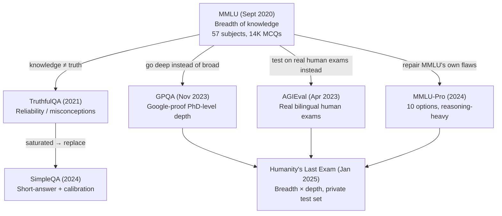

# Lesson 9 — What are LLM Benchmarks: The Evolution of Knowledge Benchmarks

> **Source:** CampusX · *What are LLM Benchmarks | The Evolution of AI Knowledge Benchmarks* · 1:50:47 · [watch](https://www.youtube.com/watch?v=QSOB9lNrNj4&list=PLEneLIDJFpcA&index=9)
> **One-liner:** Rather than a dry list of benchmarks, this lesson tells the **evolutionary story** of the knowledge-capability benchmark family as a branching tree — starting from MMLU, splitting into four separate directions (reliability, human-exam baselines, depth, and "fix MMLU's flaws"), each producing a benchmark that eventually saturated and got replaced — culminating in Humanity's Last Exam, deliberately designed and named as the benchmark meant to end the need for closed-ended knowledge benchmarks altogether.

---

## 🎯 TL;DR

Faced with too many capabilities and too many benchmarks to cover exhaustively, the instructor picked one capability — **knowledge** — and taught its complete evolutionary history instead of a disconnected list, on the theory that understanding *why* each benchmark was invented sticks far better than memorizing names. The story starts with **MMLU** (2020, the "mother of all benchmarks," testing *breadth* of knowledge across 57 subjects) and branches into four directions as it saturated: **TruthfulQA** (is the model's knowledge actually true, or memorized misconception?), **AGIEval** (test LLMs directly on real human exams instead of inventing new ones), **GPQA** (stop testing breadth — test PhD-level *depth* instead), and **MMLU-Pro** (repair MMLU's own specific flaws). TruthfulQA itself later saturated and was replaced by **SimpleQA**. Eventually GPQA, AGIEval, and MMLU-Pro all approached saturation too, and the field converged on **Humanity's Last Exam (HLE)** — deliberately built to combine breadth *and* depth, with a private held-out test set specifically to resist contamination, explicitly intended as the benchmark that, if ever solved, would mean closed-ended knowledge testing has nothing left to measure.

---

## 1. Why this lesson is structured as a story, not a list

The instructor's own account of the planning problem: there are 8 core capabilities, each with multiple famous benchmarks, and each benchmark is technically a full research paper — covering all of them exhaustively would take many sessions and crowd out other material. After going back and forth (10 popular benchmarks overall? two per capability?), the chosen approach: **cover one capability's entire benchmark evolution in depth**, use it to teach 7 real, important benchmarks along the way, and decide the approach for remaining capabilities based on audience feedback afterward. Knowledge was picked as capability #1 because it's arguably the most fundamental — the original expectation behind training LLMs on massive internet-scale data was that they'd absorb world knowledge; other capabilities like reasoning and coding are described as having emerged more as *side effects* of scale, whereas raw knowledge retention was the foundational, directly-intended target from the start.

---

## 2. The evolutionary map

**The single sentence that summarizes the whole arc:** every benchmark eventually saturates (later models cluster near the ceiling, losing discriminating power) or gets contaminated (its public data leaks into future pre-training) — so the field keeps inventing a new one, in whichever direction the previous benchmark's specific weakness pointed.

---

## 3. MMLU (Massive Multitask Language Understanding) — the mother of all knowledge benchmarks

**Launched:** September 2020. **Tests:** breadth of knowledge — how much factual world knowledge a model retained during pre-training, deliberately *not* depth or reasoning.

- **Dataset:** ~14,000 multiple-choice questions across **57 subjects**, grouped into 4 broad categories (Humanities, Social Science, STEM, Other), sourced from real exams (GRE, USMLE, AP) plus textbooks and other credible sources.
- **Scoring:** two valid methods exist and typically diverge by 2–3 percentage points — (1) let the model **generate** an answer letter directly, or (2) compute the **log-probability** the model assigns to each of A/B/C/D and take the highest. Both are legitimate; a claimed score is meaningless without knowing which was used.
- **Run config:** 5-shot prompting, no chain-of-thought, temperature 0, Pass@1, no tools — and MMLU is noted as unusually **prompt-format sensitive**, meaning small wording changes to the system prompt can shift a model's score meaningfully, which several labs have been accused of exploiting.
- **Historical trajectory (real numbers):** GPT-3 scored **43.9%** at launch (1920), against a human-expert baseline of roughly **90%** — a huge gap. Through 2021–22 (the "scaling law era," where labs mostly just scaled parameter count and expected knowledge to follow), models like Gopher, Chinchilla, and PaLM all reported their MMLU scores as it became the default marketing metric for any new release. GPT-4 (2023) scored **86%**, closing in on the human baseline. By 2024, essentially every frontier model (OpenAI, Anthropic, Google) clustered in the **86–92%** range, with none able to exceed roughly 92–93%.
- **Why the ceiling sits at ~92–93%, not 100%:** a follow-up study (the "MMLU-Redux" paper) had experts manually review the dataset and found **roughly 6.5% of questions are simply wrong** — either mislabeled or missing the actually-correct option among the four given — so no model can ever legitimately score 100%, and the practical ceiling is roughly 93–94%.
- **What MMLU explicitly does *not* measure:** reasoning depth, calibration (whether the model knows what it doesn't know), open-ended generation (it's multiple-choice only), or multilingual/non-Western knowledge (it's English-only and skews toward a Western curriculum).
- **Status today:** fully saturated and retired from frontier-lab use as of 2025.

---

## 4. Branch 1 — TruthfulQA: is the knowledge actually *true*?

**The motivating question:** more training data doesn't only teach a model correct facts — the internet also contains widespread misconceptions (the lecture's example: the myth that cracking your knuckles causes arthritis), so a model can become *more knowledgeable-sounding* while actually absorbing more false beliefs.

- **Launched:** September 2021. **Dataset:** 817 adversarially-selected questions across 38 categories, each built around a common human misconception, with a correct answer and multiple incorrect (misconception-driven) answers.
- **The landmark, counterintuitive finding:** **larger models were often *less* truthful** than smaller ones on this benchmark — because bigger models, trained on more internet data, absorbed proportionally more of the internet's misconceptions along with more correct facts. This produced the widely-quoted conclusion that **capability and alignment are not the same thing** — a more capable model is not automatically a more aligned one — which directly motivated a wave of alignment-focused research (RLHF, instruction tuning).
- **Scoring — three distinct methods:** (1) **Generation** — let the model answer freely, then judge it; (2) **MC1** — compute log-probability over each option and check if the single correct answer got the highest probability; (3) **MC2** (the default) — for questions with multiple valid correct answers, sum the probability mass assigned across *all* correct options, then average this across the dataset.
- **Historical trajectory:** GPT-3 scored **58%** against a human baseline of **94%** at launch. Through 2022–23, as RLHF and instruction tuning matured, models became more aligned and the "bigger = less truthful" pattern faded; by 2024 frontier models scored high enough that the benchmark saturated and was largely retired, spawning two 2024–25 successors: **SimpleQA** (covered below) and **MASK** (deferred to a future safety-focused lesson).
- **A distinctive contamination note:** unlike most benchmarks, TruthfulQA's contamination risk is concentrated at the **alignment/fine-tuning stage** rather than pre-training — because misconception-correction content specifically tends to get folded into RLHF/instruction-tuning datasets, not the raw pre-training corpus.
- **A scoring-comparability trap called out directly:** because extracting an answer from free-form generation requires an LLM-as-judge, and judge models themselves keep improving, a score measured today using a 2025-era judge is **not directly comparable** to a score measured two years ago with an older judge — the judge's own extraction accuracy is a hidden variable in the reported number.

---

## 5. Branch 2 — AGIEval: test LLMs directly on real human exams

**The motivating idea:** instead of inventing yet another synthetic benchmark, why not administer real standardized human exams (SAT, LSAT, China's Gaokao, civil service exams, etc.) directly to the model? This gives two benefits at once: no new benchmark construction needed, and a *real, pre-existing human baseline* to compare against.

- **Launched:** April 2023. **Dataset:** repurposed from **20 real exam sections** (SAT, LSAT, LogiQA, AQuA, Gaokao, and others), totaling over 8,000 questions — 18 of 20 sections in MCQ format, 2 in short-answer format. Notably **bilingual** — roughly half English, half Chinese — the first benchmark in this lineage to be non-English.
- **The real human baseline this enabled:** average human test-takers scored **~67%**; top human scorers (toppers) reached **~91%**.
- **Historical trajectory:** at launch, GPT-4 scored **58%**, ChatGPT scored **43%**, and text-davinci-003 scored **37%** — all well below even the average human, let alone the toppers. Through 2023–24 it became a widely-adopted benchmark; by 2024–25, frontier models had climbed to and past the 91% top-human baseline, and the benchmark saturated.
- **The critical, explicitly-flagged caution about headlines like "an LLM beat humans on the JEE exam":** *this does not mean the model has surpassed general human intelligence.* AGIEval measures knowledge recall on a fixed exam paper — it says nothing about long-horizon multi-step task execution, tool use, or the many other things a real human (or agent) does. A high AGIEval score should not be read as "superhuman," even though marketing at the time often implied exactly that.

---

## 6. Branch 3 — GPQA: stop testing breadth, test PhD-level *depth*

**The motivating idea:** MMLU's questions, on inspection, are actually fairly easy — as models get smarter, easy breadth questions become trivial. What if, instead of spreading thin across 57 subjects, a benchmark went *deep* in just a few?

**GPQA = "Google-Proof Question Answering."** The name is literal: every question is validated by two domain experts and specifically designed so that a **non-specialist given 30 minutes and full Google access still couldn't answer it**.

- **Launched:** November 2023. **Dataset:** narrowed to just **3 subjects — Physics, Chemistry, Biology** — with three tiers: **Main** (546 questions), then a filtered-for-errors **Extended**, then the hardest, cleanest **Diamond** subset (198 questions) — the tier virtually always referenced when a lab reports a "GPQA score."
- **Historical trajectory (real numbers on Diamond):** GPT-4 scored **39%** on the Main set at launch (2023). GPT-4o reached **56%** on Diamond (2024). OpenAI's o1 reasoning model reached **78%** — and OpenAI separately hired PhD experts to attempt the same Diamond set, who scored **69.7%**, letting OpenAI market o1 as "beating PhDs" on GPQA (a claim later muddied — see below). By 2025, Grok 4 reached **~87%** on Diamond, pushing the benchmark toward saturation.
- **A concrete marketing-caution example:** OpenAI's own hired-PhD baseline was reported as 69.7% in one context, but 81.3% in a differently-worded paper reference — the lecture uses this directly as a caution that "our model beat PhDs" claims often rest on baselines that aren't even internally consistent between the company's own publications.
- **What GPQA does *not* measure:** general knowledge outside its 3 subjects, open-ended problem-solving (still multiple-choice), or the correctness of a model's internal reasoning trace — a model can arrive at the right answer via lucky elimination or an internally flawed argument, and GPQA has no way to tell the difference, since it only grades the final letter choice.
- **The dataset-size criticism:** Diamond's 198 questions is small compared to MMLU's 14,000 — meaning any single score carries a wider statistical confidence interval than headline reporting usually acknowledges.

---

## 7. Branch 4 — MMLU-Pro: repair MMLU's own specific flaws

**The motivating idea, framed directly:** *"If a product is good, the right move is often to release an improved version of that same product"* — rather than abandoning MMLU's format, fix its specific known problems.

Three concrete fixes:
1. **4 options → 10 options per question.** More options make answer-elimination strategies far less effective, directly raising difficulty.
2. **Removed trivia/noisy questions, added reasoning-heavy questions.** MMLU skewed toward simple factual recall; MMLU-Pro deliberately requires actual multi-step reasoning, not just memorized facts.
3. **57 subjects → 14 broader categories**, each with denser question coverage, so no subject is statistically underrepresented the way some of MMLU's 57 were.

- **Launched:** 2024, alongside a separate paper ("MMLU-Redux") that specifically documented MMLU's ~6.5% label-error problem (the finding referenced in the MMLU section above) — MMLU-Redux itself is *not* a benchmark, just the diagnostic paper that helped motivate MMLU-Pro's existence.
- **A direct proof the reasoning-heavy redesign worked:** models capable of explicit reasoning scored roughly **20 points higher** than otherwise-comparable non-reasoning models on MMLU-Pro — strong evidence the benchmark genuinely requires reasoning, not just recall, unlike its predecessor.
- **What it doesn't measure:** open-ended generation (still multiple-choice), reasoning-trace correctness, or calibration — and it has **no published human baseline** at all, unlike AGIEval or GPQA, so there's no human-comparison anchor for any reported score.
- **A reasoning-model fairness criticism:** because MMLU-Pro's questions were specifically selected to reward step-by-step reasoning, reasoning-capable models get what the lecture calls an "unfair advantage" relative to models that were never designed to reason at length — a design choice, not a flaw exactly, but worth knowing when comparing scores across model types.
- **Status:** approaching saturation as of the lecture's recording (~2026), with frontier models in the 89–90%+ range after only ~2 years — itself evidence of how fast the saturation cycle has been compressing over successive benchmark generations.

---

## 8. SimpleQA — TruthfulQA's replacement, and still active

**Where it fits:** the direct successor to TruthfulQA once *that* saturated — the reliability/truthfulness question was still open, and SimpleQA picked it back up with a harder format.

**The key design change: no multiple-choice options at all.** The model must **generate a short free-form answer**, not select from a list — which the lecture argues (and asks the audience to agree) makes the task inherently harder than any MCQ format, the same way a subjective written exam is harder than an MCQ exam for a human.

- **Launched:** 2024 by OpenAI. **Dataset:** 4,326 short, fact-seeking questions, deliberately constructed from questions **GPT-4 had failed** — guaranteeing genuine difficulty rather than trivial recall.
- **The three-way grading scheme (this is SimpleQA's real innovation):** an LLM judge classifies every answer as **correct**, **incorrect**, or **not attempted** ("I don't know" / declined to answer). Three resulting metrics: **headline "correct"** (fraction right out of all questions), **"correct given attempted"** (accuracy restricted to only the questions the model actually chose to answer), and an **F-score** — a harmonic mean of the two, capturing both factuality *and* calibration (humility) in one number.
- **A striking headline number:** a model scoring **88% on MMLU** scored only **~40% on SimpleQA** — dramatic proof that MCQ-format knowledge and free-generation factual recall are genuinely different skills, not interchangeable proxies for "knowledge."
- **Historical trajectory:** GPT-4o scored 38% at launch (2024); o1-preview reached 42%; by early 2025, GPT-4.5 reached 62.5%. Status as of the lecture: **still active, not yet saturated**, with an estimated 1–2 more years of useful life expected.
- **What it does *not* measure:** long-form factuality (only short, discrete-fact answers are tested), and everyday/common factual recall — since the dataset was deliberately built from *rare*, GPT-4-failing questions, it says nothing about how a model performs on ordinary daily-use questions.
- **Named criticisms:** (1) LLM-judge scores aren't stable over time as judges themselves improve, so year-over-year comparisons are unreliable; (2) **answer-key staleness** — a question like "who is the world's #1 ranked rugby player" has a correct answer that changes over real-world time, so a 2024-built answer key can silently go stale by 2026; (3) **adversarial selection bias against GPT-4 specifically** — since every question was chosen *because* GPT-4 failed it, the dataset isn't a neutral, fair test for every model family equally.

---

## 9. Humanity's Last Exam (HLE) — breadth × depth, built to resist contamination

**The name is described directly as "a thesis, not marketing":** the benchmark's own creators state their premise plainly — if models saturate a benchmark this broad, this deep, and this expert-validated, then closed-ended question-answering has nothing left to measure, and evaluation must move on to open-ended, agentic tasks instead. HLE is explicitly meant to be the *last* benchmark of its kind, by design.

- **Launched:** January 2025. **Scale of effort:** ~1,000 expert question-writers from 500 institutions across 50 countries produced **2,500 questions spanning 100+ subjects** — from classics to rocket engineering — an effort scale the lecture contrasts directly against typical benchmarks built by one research group.
- **Deliberately combines both prior directions at once:** GPQA-style *depth* (expert-level, frontier-model-stumping difficulty) **and** MMLU-style *breadth* (100+ subjects, not just 3) — literally the union both earlier branches had been separately pursuing.
- **Format mix:** ~80% short-answer/generated questions, ~20% multiple-choice; and notably, **~10% of questions are multimodal** (include an image) — the first benchmark in this entire lineage to test anything beyond pure text, which specifically disadvantages any otherwise-strong model lacking vision capability.
- **The anti-contamination design: a private held-out test set.** Beyond the ~2,500 public questions, the creating institution retains a private set never published on the internet, specifically so new models can be tested against genuinely-unseen questions going forward — a direct, structural defense against the contamination problem that has degraded essentially every prior benchmark in this lineage.
- **Calibration is scored alongside accuracy:** the model is asked to report a confidence score with every answer, and scoring includes a term (described as a root-mean-square-type comparison between stated confidence and actual correctness) measuring calibration quality, not just raw accuracy — following SimpleQA's lead but applied at frontier difficulty.
- **Historical trajectory:** at launch (January 2025), frontier models scored in the **single digits**. By later 2025, Grok 4 reached the mid-20s; GPT-5 pushed into the mid-20s to 30s range; by early 2026, Gemini 3 Pro reached **38%** — still far from saturation, and, as of the lecture's recording, **the current top choice** if asked which single benchmark best represents frontier knowledge+reasoning+math capability today.
- **What it does *not* measure:** open-ended agentic task execution (still closed-ended by construction), everyday-usefulness (again, deliberately built from expert-stumping questions, not routine ones), and — since it's English-only — multilingual capability; vision is only lightly touched via that ~10% multimodal slice.
- **Known criticisms:** an initial ~3,000-question pool was trimmed to 2,500 after disputed answers were found and removed (mirroring MMLU's own label-error problem); grading again depends on an LLM-as-judge for the short-answer majority, carrying the same judge-reliability caveat as SimpleQA; and the same "failure-filtered selection bias" as SimpleQA — since questions were chosen specifically because 2024-era frontier models failed them, the set is not neutral with respect to general everyday knowledge.

---

## 10. A resource for going further: "BenchWiki"

The instructor demonstrates a self-built reference site (a "Wikipedia for LLM benchmarks," built with Claude's help) documenting each benchmark's current status (active / near-saturation / saturated / retired), historical score trajectory, task details, sample questions, scoring methodology, what it does and doesn't measure, and history/lineage — covering 23 benchmarks at recording time (the 7 from this lesson plus reasoning- and math-capability benchmarks), with 20–25 more planned within the following weeks, offered as a self-study alternative to watching lecture-length benchmark walkthroughs.

---

## 11. Key terms

| Term | Meaning |
|---|---|
| **Parametric knowledge** | Factual world knowledge absorbed into a model's weights during pre-training — what "knowledge capability" benchmarks actually probe. |
| **MMLU** | The original (2020) breadth-of-knowledge benchmark; 57 subjects, 14K MCQs; now saturated (~93% ceiling due to ~6.5% label errors). |
| **TruthfulQA** | Tests resistance to common misconceptions; revealed that bigger models were often *less* truthful — the "capability ≠ alignment" finding. |
| **AGIEval** | Repurposes real human exams (bilingual English/Chinese) as an LLM benchmark, enabling direct LLM-vs-human score comparison. |
| **GPQA (Diamond)** | "Google-proof," PhD-level depth benchmark across Physics/Chemistry/Biology only; Diamond is its hardest, cleanest 198-question subset. |
| **MMLU-Pro** | MMLU with 10 options (not 4), reasoning-heavy questions, and 14 consolidated categories — explicitly built to fix MMLU's specific flaws. |
| **SimpleQA** | Free-generation (no MCQ) factual-recall benchmark scoring correct/incorrect/not-attempted, explicitly measuring calibration alongside accuracy. |
| **Humanity's Last Exam (HLE)** | Breadth × depth benchmark with a private held-out test set (anti-contamination) and confidence-calibration scoring; explicitly designed to be the last closed-ended knowledge benchmark needed. |
| **Calibration** | Whether a model's stated confidence matches its actual correctness — i.e., does it know what it doesn't know. |
| **Saturation cycle** | The recurring pattern: a benchmark launches hard → models improve release over release → scores cluster near the ceiling → the benchmark loses discriminating power → it's retired and replaced. |

---

## ✍️ Notes / follow-ups
- This closes the deep-dive into the **knowledge** capability specifically; the instructor notes the approach (full evolutionary story per capability) will be adapted for remaining capabilities based on audience feedback, rather than assumed as the fixed format going forward.
- Next in the playlist: pivoting from individual benchmarks to **leaderboards** — how aggregating many benchmarks into one ranking works, and how to read them critically → [Lesson 10 — How to Use LLM Leaderboards](10-how-to-use-llm-leaderboards.md).
- Key habit: **whenever a benchmark score is quoted, ask which generation of the saturation cycle it's in — a "since-saturated" benchmark's score tells you almost nothing about which model is actually better today.**
