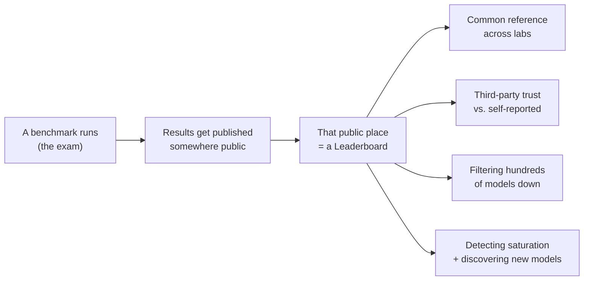
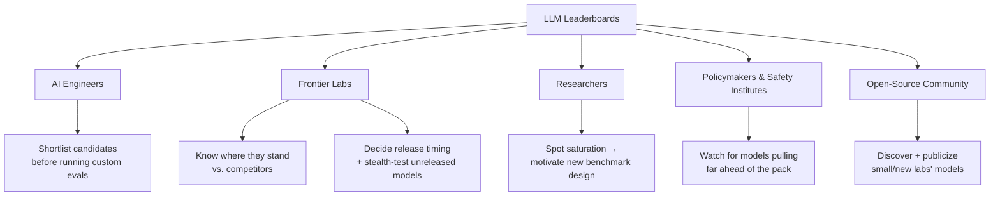
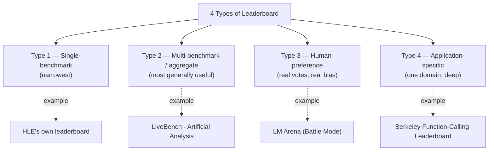
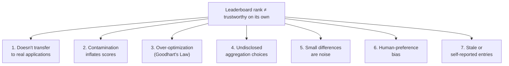
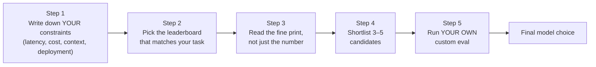

# Lesson 10 — How to Use LLM Leaderboards

> **Source:** CampusX · *How to Use LLM Leaderboards* · 30:07 · [watch](https://www.youtube.com/watch?v=SoZPmKb5uGc&list=PLEneLIDJFpcA&index=10)
> **One-liner:** A leaderboard is just a benchmark's results published somewhere public — this lesson maps the **4 types** of leaderboard that exist (with named real examples: HLE's own leaderboard, LiveBench, Artificial Analysis, LM Arena, the Berkeley function-calling leaderboard), **who actually relies on them and why** (AI engineers, frontier labs, researchers, policymakers, the open-source community), **7 concrete reasons you cannot blindly trust a rank**, and a 5-step guideline for actually using one — landing on the closing line of the whole model-eval arc: *leaderboards are a filtering tool, never a decision tool.*

---

## 🎯 TL;DR

**Definition given directly:** *"An LLM leaderboard is a public ranking and comparison table that shows how different LLMs perform on a common set of evaluations."* The instructor opens the class by asking the audience to name a leaderboard they've seen before answering, then builds the definition from first principles: a benchmark is an exam; someone has to publish the results somewhere; that "somewhere" is a leaderboard — the same way a school posts a rank list after an exam. Leaderboards come in **4 distinct types** — single-benchmark, multi-benchmark/aggregate, human-preference-based, and application-specific — each answering a different question and each with different trustworthiness. **Five groups** genuinely rely on them: AI engineers (shortlisting), frontier labs (release-timing strategy and stealth-testing), researchers (spotting saturation and new directions), policymakers/safety institutes (monitoring for models that need scrutiny), and the open-source community (discovery and publicity). But **7 concrete reasons** mean a rank should never be taken as a final answer: benchmark performance doesn't reliably transfer to messy real applications, contamination inflates scores, models get over-optimized specifically *for* the leaderboard (Goodhart's Law), aggregate scores hide undisclosed weighting choices, small rank differences are statistically meaningless, human-preference boards carry human bias, and entries are frequently stale or self-reported. The lesson's own closing line, delivered as the one sentence to retain from the entire lecture: **"Leaderboards are not a selection tool. Leaderboards are a filtering tool, not a decision tool."**

---

## 1. What a leaderboard is, and the 4 concrete reasons they exist

**The relationship to benchmarks, stated directly:** benchmarks are exams that test a specific LLM capability; a leaderboard is simply the public place where the results of running that exam across many models get published and compared. The instructor's own framing: *"You have leaderboards in your school that show who topped — a leaderboard is that idea applied to LLMs."*

Four distinct reasons leaderboards exist and matter, in the order given:

1. **A common reference for comparing models across labs.** Every model took the same exam under the same conditions, so relative rank is directly meaningful — you instantly know who came first, second, or last, and can decide which one to actually use based on that.
2. **Trust, via third-party distance.** A lab reporting its own model's score has an obvious incentive to look good — *"Open AI or Cloud will tell itself that we scored this much on this benchmark, so you probably won't trust it that much, because obviously Open AI would want its model to be more appreciated."* A genuinely independent third party testing multiple labs' models under the same conditions carries far more credibility, precisely because **their stakes in any one model winning are much lower** than the model's own creator's stakes.
3. **Guiding model selection when you can't run every eval yourself.** With hundreds of models in existence, testing all of them yourself would take "a lot of money... a lot of time and effort." A leaderboard lets someone else absorb that cost — you simply go to the leaderboard, pick the top 10, and choose your own candidates from there, rather than starting a from-scratch search across the entire market.
4. **Detecting saturation, and discovering new/cheaper models.** If the top models on a given leaderboard all cluster within a couple of points of each other, that clustering *is* the saturation signal — you now know the benchmark can no longer meaningfully discriminate between the top tier (tying directly back to Lesson 9's saturation theme). Separately — described as a personal habit the instructor has kept since 2022–23 — the top 3–4 spots on almost any leaderboard tend to stay predictable (Google, OpenAI, Anthropic), **but scrolling down to positions 10, 12, 15, 20 reveals newer models** that aren't the best overall but are "generally cheaper" and can still be a great fit for a specific application.

---

## 2. Who actually uses leaderboards, and why

| Stakeholder | What they use it for |
|---|---|
| **AI engineers** (you) | Shortlisting — narrowing hundreds of models down to a handful of candidates for a specific application domain (e.g. going to a math-specific leaderboard for a math-heavy app), *before* running your own custom evals on that shortlist |
| **Frontier labs** | Two internal uses: (1) knowing where they currently stand relative to competitors, and (2) deciding **release timing/strategy** — the lecture's worked example: *"I am OpenAI, my current model is GPT 5.5, and Opus from Anthropic is 4.8. In a particular benchmark I notice the next model I trained couldn't even beat Opus 4.8 — should I release that model? I won't. People will immediately say Opus 4.8 is better, so my marketing was bad."* Rather than ship an underwhelming iteration, labs hold back and release only once they can convincingly outperform. Also explains **stealth testing**: a new model can appear on a leaderboard under a disguised name to gauge real reception before committing to a public launch — the lecture's named example: **"Nano Banana"**, an image-generation model that appeared anonymously under that name, "broke all the benchmarks," and once its dominance was clear, Google revealed it as their own model and kept the name because it had already become famous through the leaderboard buzz itself |
| **Researchers** | Tracking which benchmarks are saturated vs. still discriminating, which directly shapes what new research directions and new benchmark designs are worth pursuing — this is explicitly the same mechanism that produced the entire Lesson 9 benchmark-evolution story (TruthfulQA, GPQA, MMLU-Pro, HLE all exist because researchers were watching leaderboards saturate) |
| **Policymakers / safety institutes** | Continuously monitor which models are pulling meaningfully ahead of the pack, "has any new model come which is leaving everyone far behind" — so regulatory attention can focus where it's actually needed. The lecture's example: *"as happened with Fable Five, the US government came immediately because they saw that this model is dangerous"* |
| **Open-source community** | Discovery and publicity — *"a new research lab with 101 people released a new, cute little model that scored very well on a single benchmark and made it into the top three or four — that lab got publicity, that model became very famous."* The instructor credits this exact mechanism as part of how several Chinese open-weight labs became widely known: "suddenly a new model came overnight and started competing with the top model in some benchmark — then it got discovered, publicity was done, marketing was done" |

---

## 3. The four types of leaderboard, in depth

### Type 1 — Benchmark-specific leaderboards
Rank models using the result of **exactly one** benchmark. The lecture's own on-screen example: **Humanity's Last Exam's own leaderboard**, showing Gemini 3 Pro at 38.3% alongside a reported calibration-error figure. **Limitation named directly:** this gives a narrow view — *"you just get to know how a model is performing on a particular benchmark; you don't seem to have any idea what the overall model is like."* Most well-known benchmarks (MMLU, GSM8K, GPQA, HLE) maintain one of these, typically run and hosted by the same research team that created the benchmark. **Verdict given directly: "these types of leaderboards are not very useful"** on their own — useful only as one data point among many.

### Type 2 — Multi-benchmark / aggregate leaderboards
Combine results from **many** benchmarks and capability dimensions into a cumulative view, instead of relying on just one test.

- **Named example: LiveBench** — introduced on-screen as *"a challenging, contamination-free LLM benchmark"* spanning **23 objective tasks across 7 categories** (reasoning, coding, agentic coding, and others), reporting both a per-category score and one overall score per model.
- **Named example: Artificial Analysis** — described as a company whose actual *product* is building these leaderboards, maintaining an exhaustive set: a separate leaderboard for "intelligence," a separate one for "speed," a separate one for "tasks per cost," a dedicated re-run of HLE, a dedicated re-run of GPQA-Diamond, plus boards for coding agents, speech, image, audio, and hardware — and then one combined overall view stitching all of it together.
- **Why this is the most valuable type, in the instructor's own words:** *"This is the most useful category which I personally use the most, and people also use it the most."* It answers the practically decisive question directly: *"which model provides the strongest overall combination of capability, cost, and performance?"* — the same three-way tradeoff (capability × cost × latency) that Lesson 7's Zomato case study and Lesson 11's Cricinfo case study both build their entire model-selection process around.

### Type 3 — Human-preference-based leaderboards
Rank models using **real human votes** on live, blind comparisons — not a fixed exam at all.

- **Named example: LM Arena**, in "Battle Mode." The actual live flow demonstrated: a user types a question (the lecture's own example query was literally *"What are LLM leaderboards?"*); two anonymized models answer side-by-side; the user is asked to pick **A is better / B is better / both good / both bad**; only *after* voting are the model identities revealed — in the live demo, the two models turned out to be **Claude Opus 4.8** and **"Fable."** Enough votes, collected from users worldwide across a full day, accumulate into a ranking — split by category (normal chat, code, image, video, each scored separately).
- **The result at time of recording:** the top of the chat leaderboard showed Fable Five and Sonnet/Opus 4.8-thinking-tier models trading places near the top.
- **The named limitation, stated directly:** *"If a user finds an answer better, it is not necessary that the answer is actually better. Many times we get impressed by people who have formatted it very well, or given an answer we personally like."* Humans systematically reward **length, confidence, formatting polish, and tone** somewhat independently of actual correctness — a real, structural bias baked into the ranking mechanism itself.
- **Why it's still trusted despite the bias:** because it operates *at scale*, with people all over the world voting continuously, the aggregate tends to still track real quality reasonably well — *"still you can trust [it], and that is why you can see that the top models are also leading these leaderboards"* elsewhere too.

### Type 4 — Application-specific leaderboards
Built around one particular domain or task rather than general capability — internally they may still combine multiple benchmarks, but all of them scoped to a single use case.

- **Named example: the Berkeley Function-Calling Leaderboard** — ranks models specifically on **tool-calling capability**, i.e. how well a model selects and correctly invokes external tools/APIs.
- **Other examples named in passing:** a dedicated leaderboard for SQL-query generation, and a dedicated leaderboard for medical-domain queries.
- **When to reach for one:** exactly when your application's domain matches the leaderboard's domain — a coding-agent product should look at a coding-specific board, not a general chat-preference board.

### Putting the four types side by side

| Type | What it ranks on | Best real example(s) | Core strength | Core weakness | When to actually use it |
|---|---|---|---|---|---|
| **1. Single-benchmark** | One fixed exam | HLE's own leaderboard | Simple, exact, tied to one well-defined capability | Tells you nothing about the model's overall profile | Only as one data point inside a bigger comparison — never alone |
| **2. Multi-benchmark / aggregate** | Many benchmarks + often cost/latency | LiveBench, Artificial Analysis | Gives capability × cost × speed in one place — the practically decisive view | Aggregation weighting is often undisclosed (see §4.4) | Your **default starting point** for general model selection |
| **3. Human-preference** | Real, blind human votes | LM Arena | Captures real subjective quality at massive scale | Systematically biased toward length/tone/formatting, not correctness | Chat-style or writing-heavy products where "did the user like it" *is* the metric |
| **4. Application-specific** | One domain's combined benchmarks | Berkeley Function-Calling Leaderboard | Directly matches a narrow, real deployment need | Useless outside that one domain | When your product's core task maps exactly onto the board's domain (tool use, SQL, medical Q&A, etc.) |

**The relative-usefulness ranking, stated directly:** single-benchmark boards are the least useful in isolation; multi-benchmark/aggregate boards are the most broadly useful for real decisions; human-preference boards are popular and useful (and great for marketing) but carry real bias; application-specific boards are valuable precisely when — and only when — your use case matches their domain.

---

## 4. Seven reasons not to blindly trust a leaderboard rank

### 1. Benchmark performance doesn't reliably transfer to real applications
The lecture's own analogy, stated directly: *"You can solve problems on Kaggle — it does not mean you will become a good data scientist in real life."* The reason given: Kaggle data is clean, the problem statement is unambiguous, so the work comes easily; the real world is messy in ways a benchmark simply isn't — named examples of that messiness: **abusive requests, missing information, company-specific data, tool failure, unusual edge cases** the model may or may not know how to handle. A high benchmark score says nothing about how a model behaves against any of these.

### 2. Contamination inflates scores
Directly recalling Lesson 8's mechanism: *"Benchmarks are very easily contaminated, and if benchmarks are contaminated, their leaderboard scores will also be contaminated and inflated — it will be more visible."* A leaderboard number alone cannot tell you whether a high score reflects genuine capability or whether *"the model has memorized it, or already knew such questions."*

### 3. Over-optimization for the leaderboard itself — Goodhart's Law
Named explicitly: **"Goodhart's Law — when a measure becomes a target, it becomes less useful as a measure."** The lecture's own worked analogy: imagine a car company learns that Indian buyers care mainly about mileage, so the *entire engineering team* refocuses on mileage alone — "the entire car gets damaged" because driving dynamics, acceleration, and everything else nobody was optimizing for quietly degrades. Applied directly to LLMs: once "who's topping LM Arena" becomes a widely-discussed target in itself, a company can specifically fine-tune a model to produce the *style* of answer humans tend to vote for — softer tone, more flattering, more confidently formatted — **and feed that style into training or fine-tuning specifically to win votes**, rather than to be more genuinely capable. The result: the leaderboard score climbs while real-world capability doesn't move at all.

### 4. Undisclosed aggregation choices (composite/aggregate leaderboards specifically)
Three concrete, unanswered questions the lecture raises about any blended score: **which benchmarks does it include, and which does it exclude? How are scores normalized across benchmarks with different scales? What weighting is given to each capability when combining them into one number?** These choices are very often left opaque. **The rule of thumb given directly: the more transparency a leaderboard shows about its own methodology, the more it deserves your trust** — an untransparent composite score is a black box wearing the authority of a single clean number.

### 5. Small rank/score differences are statistically meaningless
The lecture's own worked numeric example: two models scoring **84.3** and **84.1**, landing at **rank 3** and **rank 5** respectively. The instinctive reaction — "I'll use the rank-3 model, not rank 4 or 5" — is called out directly as a bias: *"the difference was only two [tenths] — there's a good chance these two are very similar, and rank 5 could actually be better for your specific application."* The reinforcing analogy given: *"there will not be much difference between rank 1 and rank 25 in a competitive exam like IIT JEE — anyone can get one or two questions wrong."* This connects directly back to Lesson 9's confidence-interval point about small evaluation datasets (like GPQA-Diamond's 198 questions) — a small score gap on a small or noisy dataset is not a real signal.

### 6. Human-preference leaderboards carry human bias
Already introduced in §3, restated here as its own standalone risk: *"Humans like longer answers, more confident answers, better-formatted answers, more entertaining answers — but it's possible a genuinely better model doesn't do all this, and so it fails in the human-preference ranking"* despite being the more capable model on other, harder-to-fake dimensions.

### 7. Leaderboard entries are often stale or self-reported
Demonstrated live, directly on-screen: the HLE leaderboard shown in class had Gemini 3 Pro at 38.3%, but **did not yet list the most recent frontier models** ("Fable" or "5.6 Sol") purely because the maintaining team hadn't updated the board yet — *"these people did not even update"* — a leaderboard can silently lag real-world releases, and some retain results for discontinued models nobody uses anymore. Separately: *"many times, results in some leaderboards are posted by the companies based on their own models"* — reintroducing the exact self-reporting trust problem from reason #2 and from §1's third-party-trust point, inside what otherwise looks like a neutral third-party board.

### The seven reasons at a glance

| # | Failure mode | What it does to the number |
|---|---|---|
| 1 | Doesn't transfer to real applications | High score ≠ good fit for your messy real task |
| 2 | Contamination | Score reflects memorization, not capability |
| 3 | Goodhart's Law / over-optimization | Score climbs while real capability stays flat |
| 4 | Undisclosed aggregation | One clean number hides arbitrary inclusion/weighting choices |
| 5 | Small differences | Rank order implies a real gap that may not exist |
| 6 | Human-preference bias | Rewards style/tone/length over correctness |
| 7 | Stale / self-reported entries | The number may be outdated or self-interested |

---

## 5. A 5-step guideline for actually using a leaderboard as an AI engineer

**Step 1 — Write down your actual constraints before looking at any leaderboard.** What kind of application is this? What latency is acceptable? What's the cost ceiling? What are the context-length needs? Are there deployment constraints — must it run on-premise, or can it be a public API? Doing this *first* is explicitly meant to short-circuit the natural bias toward "just pick whatever's ranked #1": if on-premise deployment is a hard requirement, proprietary API-only models like Claude/Fable are already off the table regardless of rank, which reframes the whole search toward open-weight models from the very first step, rather than after wasting time falling in love with a #1-ranked model you could never actually deploy.

**Step 2 — Go to the leaderboard that actually matches your task**, not just whichever is most famous or most talked about:

| If you're building… | Go to… | Because… |
|---|---|---|
| An agent | An agent-/tool-use-specific leaderboard | Directly measures the exact capability (e.g. Berkeley Function-Calling) your product depends on |
| A chat product | An LM-Arena-style human-preference board | It directly measures conversational quality as real users perceive it |
| A RAG system | **MTEB** | RAG's retrieval quality is bottlenecked by the embedding model — MTEB ranks *embedding models specifically*, which no general LLM leaderboard does |
| A budget-constrained application | An Artificial-Analysis-style board | It's the type that actually publishes cost and latency alongside capability, not capability alone |

**Step 3 — Actually read the leaderboard's own documentation**, not just the headline number. The concrete checklist given: *What exactly is being scored, and how? Who ran the evaluation? What was the inference budget? Is reasoning/chain-of-thought enabled? How old is the underlying evaluation dataset, and is it still being updated? Is a private test set being maintained (i.e. contamination resistance)? Has the underlying benchmark saturated? If it's a small dataset, is a confidence interval reported* — and if not, the guidance is explicit: **treat two closely-scored models as effectively the same model**, not as meaningfully ranked. *If it's a composite/aggregate leaderboard, what weighting was given to each underlying capability?* The instructor's summary line for this whole step: *"Don't blindly trust a number — you have to read the fine print below it."*

**Step 4 — Shortlist 3–5 candidate models** based on everything gathered in Steps 1–3 — never just one model, and never purely by rank position.

**Step 5 — Run your own custom evaluation on that shortlist**, on your own data, and let *that* — not the leaderboard rank — make the actual final call for your application. This step is the direct, explicit bridge into the very next session in the playlist: running a full custom model eval end-to-end (Lesson 11's entire subject).

### A worked synthesis — applying all 5 steps to one hypothetical

To make the 5 steps concrete, here's how they'd chain together for, say, a customer-support RAG chatbot that must run on a fixed monthly budget:

1. **Constraints:** RAG-based, public API acceptable (no on-premise requirement), moderate latency tolerance (a few seconds), a hard monthly cost ceiling.
2. **Matching leaderboard:** since this is RAG, retrieval quality depends on the embedding model → check **MTEB** for the embedding-model choice; separately, since cost is a hard constraint, check an **Artificial-Analysis-style** aggregate board for the generator LLM, specifically its cost/intelligence tradeoff view rather than its pure-intelligence ranking.
3. **Fine print:** confirm the aggregate board's underlying benchmarks aren't already saturated (Lesson 9), check whether the reported cost figures match the actual expected token ratio for this app (Lesson 11's blended-pricing lesson), and discount any two models whose scores differ by less than a point as effectively tied.
4. **Shortlist:** 3–5 embedding-model + generator-model combinations that clear the cost ceiling and aren't obviously saturated/contaminated picks.
5. **Final decision:** run a custom eval — a golden dataset built from this chatbot's actual domain — across the shortlist, exactly as Lesson 11 demonstrates end-to-end, and let *those* scores make the final call.

**The single sentence meant to be retained from the whole lesson:** *"Leaderboards are not a selection tool. Leaderboards are a filtering tool, not a decision tool."* A leaderboard's job is to narrow the field from hundreds of models to a handful worth actually testing — never to make the final call for you.

---

## 6. Key terms

| Term | Meaning |
|---|---|
| **Leaderboard** | A public ranking/comparison table showing how models perform on a common set of evaluations. |
| **Benchmark-specific leaderboard** | Ranks models on exactly one benchmark — narrow, but common; e.g. HLE's own leaderboard. |
| **Multi-benchmark / aggregate leaderboard** | Combines many benchmarks (and often cost/latency data) into one overall comparison — the type used most in practice (LiveBench, Artificial Analysis). |
| **Human-preference leaderboard** | Ranks models by real user votes on blind, paired answer comparisons (e.g. LM Arena) — powerful at scale, but carries human formatting/tone bias. |
| **Application-specific leaderboard** | Ranks models within one domain/task only (e.g. tool-calling via Berkeley's Function-Calling Leaderboard). |
| **Stealth testing** | A frontier lab testing an unreleased model on a public leaderboard under a disguised name (e.g. "Nano Banana") before confirming its public launch. |
| **Goodhart's Law** | "When a measure becomes a target, it ceases to be a good measure" — the mechanism behind leaderboard over-optimization. |
| **MTEB** | The standard leaderboard for ranking embedding models — the relevant leaderboard type for RAG retrieval-component selection. |
| **Filtering tool vs. decision tool** | The lesson's core distinction — a leaderboard narrows candidates; only your own custom eval should make the final selection. |

---

## ✍️ Notes / follow-ups
- This closes the model-eval arc of the playlist (Lessons 7–10: capabilities → benchmark anatomy → benchmark evolution → leaderboards). Next: putting all of it into practice by actually running a custom model eval end-to-end → [Lesson 11 — Selecting the Right LLM for Your AI App: Running Custom Model Evals](11-selecting-right-llm-for-your-ai-app.md).
- Key habit: **treat any leaderboard as step 2 of a 5-step process (constraints → matching leaderboard → read the fine print → shortlist → your own custom eval) — never as the final answer on its own.**
