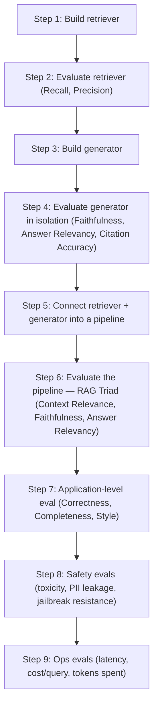

# Lesson 12 — How to Answer "How Do You Evaluate Your RAG App?" in GenAI Interviews

> **Source:** CampusX · *How to Answer "How Do You Evaluate Your RAG App?" in GenAI Interviews* · [watch](https://www.youtube.com/watch?v=4zn-gSckVTQ&list=PLEneLIDJFpcA&index=13)
> **One-liner:** A recap-and-roadmap session — no code yet — that lays out the complete framework for evaluating a RAG app (3 levels of testing + 3 levels of regression testing + online eval) using a real, buildable case study: a chatbot that answers doubts about this very CampusX course from its own lecture transcripts.

---

## 🎯 TL;DR

This is the planning lecture for a 4-session arc. The case study is **"CampusX Doubt Solver"** — a RAG chatbot built from this course's own lecture transcripts. The instructor lays out the entire evaluation strategy before writing any code: evaluate at **three levels** (component → pipeline → application), wrap all of it into an **eval suite** used for **regression testing** (with three levels of sophistication: manual, experiment-tracked, CI-gated), then continue with **online evaluation** after deployment, feeding real failures back into the offline golden datasets. The tooling choice is **DeepEval**, not Ragas — deliberately, for two stated reasons. The explicit goal: after these four sessions, you should be able to give a structured, framework-based answer to the single most common GenAI interview question, instead of just naming 3–4 metrics.

---

## 1. Why RAG and Agents, specifically

The instructor explains the scoping decision directly: LLM application types span simple chatbots, RAG chatbots, agents, multimodal apps, and fixed-schema-output apps (e.g. the earlier Zomato email-classification case study). Teaching eval for every category isn't feasible, so the course commits to two: **RAG** (because most production chatbots have RAG functionality — it's the majority case) and **agents** (covered separately, later). The reasoning given for skipping the rest: if you can evaluate the hard cases well, the easier ones (plain chatbot, fixed-schema output) follow from the same skills.

The interview-relevance angle is stated explicitly: *"How do you evaluate your RAG chatbot?"* is asked in roughly 8 of 10 GenAI interviews, and most candidates — even ones who've studied evals — answer it by naming 3–4 metrics rather than describing a structured process. The goal of the next 4 sessions is to be able to answer with the full framework below.

---

## 2. The case study: CampusX Doubt Solver

Every lecture in this course comes with a recording and a transcript. The chatbot's knowledge base is simply **the transcripts of every lecture so far** — a student asks a doubt about anything taught in the course, and the RAG pipeline (retriever → vector DB → generator) answers it, grounded in what was actually said in class. Deliberately unglamorous as a problem statement — the instructor says outright that the focus is on **evaluating well**, not on building something architecturally fancy.

---

## 3. The 3-level evaluation framework

The core idea: **you don't build the whole chatbot and then evaluate it once at the end.** Exactly like software testing (unit tests at the function level, integration tests at the feature level), you evaluate *as you build*, one layer at a time.



### Level 1 — Component level

Build the **retriever** first (load documents → chunk → embed → vector DB → fetch top-k for a query), then evaluate it **in isolation**, before the generator even exists:

| Metric | Question it answers |
|---|---|
| **Recall** | Of all the documents that are actually correct for this query, how many did the retriever fetch? |
| **Precision** | Of all the documents the retriever fetched, how many were actually useful? |

Then build the **generator** (an LLM that takes a question + relevant context and produces an answer) and evaluate *it* in isolation too — meaning at this point the generator is **not yet wired to the retriever**. Context is provided manually, like a golden dataset, specifically so a generator failure can't be blamed on a bad retrieval:

| Metric | Question it answers |
|---|---|
| **Faithfulness** | Was the answer generated from the given context, or did the model hallucinate/add outside knowledge? |
| **Answer relevance** | Does the generated answer actually address the question asked? |
| **Citation accuracy** | When the bot cites a source (e.g. "Nitish Sir discussed this in session 5"), is that citation correct? |

### Level 2 — Pipeline level: the RAG Triad

Once retriever and generator are each independently solid, **connect them** into a real pipeline (simple glue code) and evaluate the combined system. This introduces the **RAG Triad** — three metrics, one for each pair among {question, retrieved context, generated answer}:

| Metric | Pair it evaluates |
|---|---|
| **Context Relevance** | question ↔ context — is what the retriever fetched actually relevant to this query? |
| **Faithfulness** | context ↔ answer — is the answer grounded in the context, or invented? |
| **Answer Relevance** | question ↔ answer — does the answer address the question? |

### Level 3 — Application level

Now test the whole product experience, beyond just retrieval-and-generation correctness:

| Category | What's tested |
|---|---|
| **Correctness** | Is the final answer factually right? |
| **Completeness** | If the question has multiple parts, does the answer cover all of them? (Answering only half a two-part question, even correctly, fails completeness.) |
| **Style** | Does the answer match CampusX's own teaching/explanation style? |
| **Safety** | Toxicity, PII leakage, jailbreak resistance |
| **Ops** | Latency, cost per query, token spend |

---

## 4. Tooling: why DeepEval, not Ragas

The instructor states the decision and gives two explicit reasons:
1. **Ragas was already covered** in the advanced RAG course — no need to duplicate.
2. **DeepEval has broader scope** — it isn't RAG-only; it also covers agents, multi-turn chatbots, and non-LLM applications, and its adoption trajectory suggests it may become *the* standard library for LLM evals (the way MLflow became standard for classical ML), unlike Ragas which is more narrowly RAG-focused.

A practical detail called out as a comfort factor: **DeepEval's syntax is built on PyTest**, Python's standard software-testing library — so anyone with prior PyTest experience will find it immediately familiar.

---

## 5. Regression testing: three levels of sophistication

Once the eval suite exists, running it against a new version of the software to check "did this change make things better or worse?" is called **regression testing**. The instructor gives it three levels:

### Level 1 — Basic
Run the whole eval suite (via a single orchestrating script, e.g. `run_evals.py`) once to get a **baseline** set of numbers. Every time you change something (chunk size, overlap, prompt, model), rerun it and manually compare the new numbers to the baseline.

### Level 2 — Experiment tracking
Log every run's **configuration** (chunk size, overlap, temperature, embedding model, etc.) alongside its **metric scores** into a tool like **MLflow** (or DeepEval's own **Confident AI**, or Weights & Biases). This gets you a dashboard where you can visually compare how every metric moved across your last N runs, instead of eyeballing numbers in a terminal.

### Level 3 — CI/CD gating
Wire the eval suite into a CI tool (e.g. GitHub Actions): any code push triggers a full eval run automatically, the new metrics are compared against the current baseline with a defined threshold (e.g. "must not regress by more than 3%"), and the deployment is **paused/blocked** if the new version is worse. If it's better, the baseline updates and the deploy proceeds. This turns the eval suite into an automated gating mechanism — you can keep shipping changes with confidence, because a regression blocks itself.

> **Suggested project layout**, stated directly in the lecture:
> ```text
> project/
> ├── src/            # retriever.py, generator.py, rag_pipeline.py, API/UI code
> ├── evals/          # eval_retriever.py, eval_generator.py, eval_rag_pipeline.py, eval_application.py, eval_safety.py, eval_ops.py
> └── run_evals.py    # orchestrates every eval file, produces one combined report
> ```

---

## 6. After deployment: online evaluation

Evaluation doesn't stop at deployment. Once live, you run **online evaluation**, which the instructor breaks into three activities:

1. **Capture** — latency, cost, tokens, thumbs-up/thumbs-down signals from real user interactions, via an observability tool (Langfuse, Confident AI, or similar — referred to in this space as **LLM Ops / observability**).
2. **Compute** — some of the same offline metrics (faithfulness, answer relevance, correctness) recomputed on live traffic, not just captured passively.
3. **Detect drift** — is a tracked metric (e.g. faithfulness) trending downward over recent hours/days? If so, alert and investigate — this is **drift detection**.

**Self-improving loop:** whenever the live app misbehaves in a real conversation, that failing instance gets pulled into the **offline golden dataset**, enriching it so the *next* offline eval run (during the next regression test) can catch that failure mode before it ships again.

---

## 7. How to structure the interview answer

The instructor's own template for actually answering "how do you evaluate your RAG app?" in an interview:

```text
1. "I build an evaluation suite that tests at three levels: component, pipeline, application."
2. Name the component-level metrics: Recall & Precision (retriever), Faithfulness & Answer
   Relevancy & Citation Accuracy (generator, evaluated in isolation).
3. Name the pipeline-level metric: the RAG Triad (Context Relevance, Faithfulness, Answer
   Relevancy) — now evaluated on the connected system.
4. Name the application-level checks: Correctness, Completeness, Style, plus Safety and Ops evals.
5. "Once the suite exists, I use it for regression testing" — describe the three levels
   (manual baseline comparison → experiment tracking → CI/CD gating).
6. "After deployment, evaluation continues online" — capture signals, recompute key metrics
   live, detect drift, and feed real failures back into the offline golden dataset."
```

The instructor's explicit claim: most candidates who've read about evals still only name "recall, precision, answer relevance" as their whole answer — describing the full framework, in this structured order, is what actually signals depth to an interviewer.

---

## 8. Key terms

| Term | Meaning |
|---|---|
| **Component-level eval** | Testing the retriever or the generator in isolation, before they're wired together. |
| **RAG Triad** | Context Relevance + Faithfulness + Answer Relevance, evaluated on the connected retriever→generator pipeline. |
| **Regression testing (for LLM apps)** | Re-running the full eval suite on a new version to confirm it isn't objectively worse than the previous baseline, before deploying. |
| **Experiment tracking** | Logging each eval run's configuration alongside its metric results (e.g. via MLflow or Confident AI) for visual, historical comparison. |
| **CI/CD gating** | Automating regression testing so a code push that regresses key metrics beyond a threshold blocks deployment automatically. |
| **Online evaluation** | Post-deployment measurement — capturing live signals, recomputing key offline metrics on production traffic, and detecting drift. |
| **Self-improving loop** | Feeding real production failures back into the offline golden dataset so future regression tests catch them. |

---

## ✍️ Notes / follow-ups
- This lecture is pure planning — no code was written. Next: build and evaluate the retriever and generator components in isolation → [Lesson 13 — How to Test RAG Retrievers (Hands-On)](13-how-to-test-rag-retrievers-hands-on.md).
- Key habit: **answer the interview question as a framework (levels → metrics → regression → online eval), not as a list of 3–4 metric names.**
