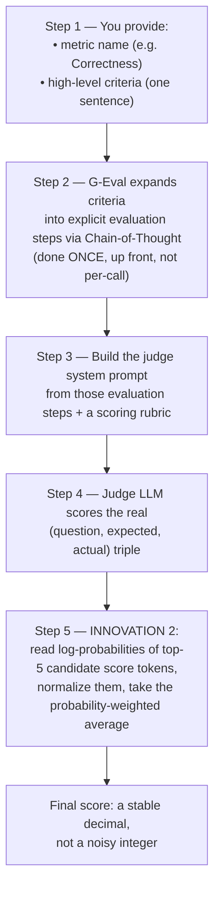

# Lesson 15 — Mastering G-Eval: The Deterministic LLM-as-a-Judge Framework

> **Source:** CampusX · *Mastering G-Eval: The Deterministic LLM-as-a-Judge Framework Explained* · 1:26:52 · [watch](https://www.youtube.com/watch?v=nlyxlKD5cvU&list=PLEneLIDJFpcA&index=16)
> **One-liner:** Continuing straight from Lesson 14's application-level roadmap — builds Correctness, Completeness, and Style metrics for the CampusX Doubt Solver, and along the way introduces **G-Eval**, the technique that fixes plain "LLM-as-a-judge"'s biggest practical flaw: wildly inconsistent scores across identical re-runs.

---

## 🎯 TL;DR

Five metrics so far (Recall, Precision, Faithfulness, Answer Relevancy, Contextual Relevancy) all share a hidden pattern: they're **count-based** — break an answer into claims, count how many pass a check, divide. But some qualities — **Correctness** (is the answer factually right?), **Completeness** (does it cover every part of the question?), and **Style** (does it sound like CampusX?) — can't be counted claim-by-claim; they require **holistic judgment** over the whole answer. The naive fix — "ask an LLM to output a score from 0–10" — technically works but is **unreliable**: the same input can score 6 one run and 8 the next, for two structural reasons. **G-Eval** (a 2023 research paper) fixes both: (1) it expands a short criteria sentence into an explicit **chain-of-thought rule book** of evaluation steps *once*, up front, so every subsequent judge call follows the same reasoning instead of re-deriving it; and (2) instead of taking the single printed score token, it reads the **log-probabilities of the top candidate score tokens** and computes a **probability-weighted average** — turning a noisy integer pick into a smooth, stable decimal. Live results on the real CampusX Doubt Solver: Correctness went from a 66% baseline to **83–84%** after two rounds of rubric refinement; Completeness went from **68% → 75%** after a one-line generator prompt fix; Style went from **54% → 74%** after fixing the generator prompt and correcting an over-strict rubric.

---

## 1. Where this picks up, and the pattern behind the first 5 metrics

This is a direct continuation of the roadmap from [Lesson 14](14-evaluating-rag-generator-pipeline-rag-triad.md): component-level and pipeline-level evals are done; today starts **application-level quality** (the first of its three sub-parts — quality, safety, ops — with safety/ops and regression testing promised for the next session).

**The pattern named explicitly across all 5 prior metrics** (Recall, Precision, Faithfulness, Answer Relevancy, Contextual Relevancy): every one of them is **count-based**. The mechanism is always: break something (an answer, a chunk) into discrete claims via an LLM, check each claim against a yes/no condition, then compute a ratio — *3 of 4 claims supported → 0.75*. This works because the presence/absence of each individual claim is what determines the score.

**Why that mechanism breaks for some new metrics.** Take **Style**: does the generated answer follow CampusX's teaching style? You can't sensibly ask "is this individual sentence in the CampusX style?" — the teaching *voice* is a property of the whole answer's flow, not of any one claim in isolation. **Correctness** has the same problem in a subtler way, illustrated with a concrete failure case: suppose an answer legitimately uses an **analogy** to explain a concept. Pull that analogy out and check it in isolation against a golden answer, and an LLM judge will flag it as an unrelated, unsupported claim — "this statement is not related to the golden answer" — and penalize it, even though the analogy was doing real explanatory work *inside* the answer as a whole. **The lesson's own framing: some metrics need judgment, not counting** — a whole-answer read that produces a single holistic score, done by either a human or an LLM.

---

## 2. The naive fix: direct LLM-as-a-judge scoring, and why it's unreliable

**The setup, worked through for Correctness specifically:**
1. Build a golden dataset: (question, universally-correct expected answer) pairs — 15 questions used live, and *"correct" here explicitly does not mean "what I taught in this course," it means what's actually right in the world* (a distinction the instructor draws directly against Faithfulness, covered below).
2. Run each question through the RAG pipeline to get a real generated answer.
3. Send an LLM judge a prompt containing all three: the question, the expected answer, and the generated answer, with an instruction like: *"Compare the actual answer against the expected answer and decide how factually correct it is. Give a score from 0 to 10, where 10 = fully correct, 0 = completely wrong."*
4. Average the 15 resulting scores.

**This is philosophically simple, and the instructor is direct that it's actually *easier* than the count-based metrics** — no claim-breakdown machinery needed, just one number per question. But it's explicitly called out as **not a reliable evaluation method in practice**, and the lecture works through *why*, rejecting the easy guesses first (the judge model itself being wrong; latency/cost) in favor of the real mechanism: **high run-to-run variance on the exact same input.**

### Reason 1 — The criteria is a loose sentence, not a rule book

The prompt gives the judge a single line of guidance ("decide how factually correct it is") with no precise definition of what "correctness" actually means step by step. Because the instruction is this loose, **the judge is free to reinterpret what to check on every fresh call** — one run might weigh completeness of coverage, the next might weigh precision of wording, with nothing forcing consistency between calls. Nothing in the prompt fixes *how* correctness gets assessed, so it drifts.

### Reason 2 — Naive integer output collapses a probability distribution into one lucky/unlucky pick

**Explained from first principles (the lecture's own explanation, expanded here):** an LLM generates each output token by producing a probability over its *entire* vocabulary (tens of thousands of tokens) and then greedily (or near-greedily) picking the single highest-probability one — this is what "autoregressive generation" means: each token is chosen conditioned on everything generated so far, then fed back in to generate the next. When you ask for "a score between 0 and 10," the model isn't outputting a clean, calibrated number — it's sampling from a distribution that might look like: `8 → 40%, 7 → 51%, 6 → 9%`. If 7 has the marginal edge this run, it prints 7; a slightly different internal computation next time — perhaps 8 nudges ahead at 51% — and it prints 8. **Nothing about the question or the answer changed between calls — only which token happened to win the argmax that time.** Multiply this instability across 15 questions and average them, and the aggregate score can swing by 10+ points between otherwise-identical evaluation runs — exactly the unreliability the instructor demonstrates is unacceptable for a metric you're going to use to gate deployments.

> **My own added framing, since this point is easy to gloss over:** this is the same failure mode as flipping a coin that's secretly weighted 51/49 — most of the time it lands on the "right" side, but a meaningful fraction of the time it doesn't, and you have no way to tell a genuine 51-49 call apart from a landslide 99-1 call just by looking at which face came up. **G-Eval's fix, below, is precisely to stop looking at which face came up and instead directly use the 51/49.**

---

## 3. G-Eval: the two-part fix

**Source, named directly:** a 2023 research paper (the instructor recommends reading it directly, expecting the class to understand it much better having watched this walkthrough first). G-Eval's contribution is **exactly two innovations** layered on top of plain LLM-as-a-judge — nothing more:



### Innovation 1 — Chain-of-thought expansion of criteria into a fixed rule book

Instead of handing the judge a loose one-liner every single call, G-Eval uses an LLM (the paper recommends GPT-4-class models for best results) to **expand your high-level criteria into 4–5 concrete evaluation steps, once** — turning *"decide how factually correct it is"* into an explicit checklist such as:

1. Compare only the factual claims in the actual output against the expected output.
2. A claim is wrong only if it contradicts the expected output or is actually false.
3. A factually accurate answer scores high even if shorter and covering fewer points — do not deduct for brevity or omitted points; only wrong statements count.
4. Additional correct information must never lower the score.

**Why this directly attacks Reason 1 above:** every subsequent judge call now reasons from the *same* fixed checklist instead of re-deriving what "correctness" means from a vague sentence — **"we're building a constitution, a rule book," in the instructor's own words** — which sharply narrows how much the judge's interpretation can drift between calls. A scoring rubric (e.g. "9–10 if every claim is factually accurate; 5–8 if mostly correct with one or two minor issues; 0–4 if there are clear factual errors") is layered on top, explicitly telling the judge not just *what* to check but *how to convert findings into a number* — taking that decision away from the judge's own improvisation too.

> **My own added explanation of "Chain-of-Thought" here, since the lecture assumes familiarity:** Chain-of-Thought (CoT) prompting is simply asking a model to reason in explicit intermediate steps before producing a final answer, rather than jumping straight to the answer — the same "let's think step by step" pattern from general LLM prompting. G-Eval's specific use of it is narrow but clever: CoT isn't used to answer the *evaluation question* itself — it's used **once, offline, to design the evaluation procedure** (the checklist), which then gets reused verbatim for every real evaluation call. This is why it reduces variance: the expensive, failure-prone "figure out how to think about this" step happens one time, not once per question.

### Innovation 2 — Probability-weighted scoring instead of the printed token

Rather than asking the model to print a single number and using that digit directly, G-Eval:
1. Constrains attention to the small set of tokens that could plausibly represent a valid score (e.g. the digits/numbers `6, 7, 8, 9, 10` for a 0–10 scale) and pulls the **top-5 candidate tokens with their log-probabilities** from the model's output distribution (this requires access to log-probabilities from the LLM API — a real, practical prerequisite).
2. **Discards non-numeric tokens** from that top-5 (colons, stray words) since they're not valid scores.
3. **Renormalizes** the remaining numeric tokens' probabilities so they sum to 1 (since dropping tokens means the remainder no longer sums to 1) — e.g. raw probabilities `8→0.70, 7→0.20, 9→0.05` sum to 0.95, so dividing each by 0.95 gives `8→0.737, 7→0.211, 9→0.0526`.
4. Computes the **weighted average**: `(8 × 0.737) + (7 × 0.211) + (9 × 0.0526) ≈ 7.84`.
5. Divides by 10 to normalize the final score into `[0, 1]`, then compares against a threshold (e.g. 0.7) to decide pass/fail.

**The concrete before/after, worked in the lecture:** naive argmax scoring would have simply printed **8** (the single highest-probability token) — full stop, no visibility into how close the runner-up was. G-Eval's weighted score of **7.84** captures the fact that the model was genuinely torn between 7 and 8, rather than pretending it was fully confident in 8. On a *second* run where internal noise shifts the numbers slightly (say 8 now edges out at 51% instead of 40%), the naive method would still print 8 either way *or* could have jumped from 8 straight to 6 if 6 had won a different run — but the weighted average barely moves, something like 7.84 → 7.4 or 7.9, never a 6-to-8 jump. **This is the whole mechanism behind G-Eval's stability**: it stops discarding the information in *how confident* the model was, and that confidence signal is what smooths out run-to-run noise.

> **My own added explanation of why this generalizes:** this is really just **using the full distribution instead of the mode**. In any measurement with inherent uncertainty, reporting "the most likely single value" throws away exactly the information that tells you how uncertain that value was. Reporting an expectation (probability-weighted mean) over the plausible values is strictly more informative and, as a mathematical consequence, has lower run-to-run variance than repeatedly sampling and reporting the mode — which is precisely why G-Eval's scores are so much more reproducible.

### The single-sentence summary G-Eval reduces to
*"G-Eval is not a new kind of LLM-as-a-judge — it's the same LLM-as-a-judge, with exactly two fixes: turn the loose criteria into a fixed chain-of-thought checklist once, and read log-probabilities instead of the printed token."* Nothing else is different.

---

## 4. Metric 1 — Correctness, built and iteratively refined live

**Distinguishing Correctness from Faithfulness explicitly** (a distinction the instructor is careful to draw, since both concern "is the answer right"):

| | What it checks | Can be right while the other is wrong? |
|---|---|---|
| **Faithfulness** | Is the answer grounded in the *retrieved context* — did the generator stick to what it was given, whether or not that source material was itself correct? | Yes — an answer can be faithful to a wrong context and still be unfaithful-but-correct if the generator ignored bad context and got lucky from its own training knowledge |
| **Correctness** | Is the answer actually right *in the world* — factually accurate by universal/expert standards, independent of what any particular context said | Yes — four real combinations exist: (correct + faithful) = ideal; (correct + unfaithful) = generator ignored context but got it right anyway; (incorrect + faithful) = context itself was wrong and the generator faithfully repeated the error; (incorrect + unfaithful) = generator hallucinated *and* got it wrong |

### Implementation: `evals/eval_application.py` + `goldens/correctness_golds.json`

The golden dataset (`correctness_golds.json`, 15 questions) pairs each question with a **universally correct answer** — explicitly *not* "whatever was taught in this specific course," but the expert/world-accurate answer, since Correctness is being measured against reality, not against the course transcript (that's Faithfulness's job). Structurally, the eval file follows the same shape established in Lessons 13–14, with one new piece: DeepEval's `GEval` metric class, configured with:

```python
GEval(
    name="Correctness",
    evaluation_steps=[
        "Compare the actual output against the key facts in the expected output.",
        "Heavily penalize statements in the actual output that contradict the "
        "expected output and are actually wrong.",
        "Reward statements that match the expected output in meaning, regardless "
        "of wording.",
        "Do not penalize the actual output for omitting information — only wrong "
        "statements count.",
    ],
    evaluation_params=[LLMTestCaseParams.INPUT, LLMTestCaseParams.ACTUAL_OUTPUT,
                        LLMTestCaseParams.EXPECTED_OUTPUT],
    model="gpt-4o-mini",
    threshold=0.7,
    strict_mode=False,   # False = full weighted-probability scoring; True = raw printed token
)
```

**A deliberate design choice worth calling out: `evaluation_steps` was supplied directly, bypassing G-Eval's own chain-of-thought auto-generation.** The instructor poses this as a direct question to the class — is it better to give a high-level `criteria` string and let G-Eval auto-generate its own evaluation steps each time, or to author the evaluation steps yourself and skip that generation step entirely? **The answer given: authoring them yourself is strictly more deterministic**, because letting the LLM regenerate its own steps from a criteria string on every fresh pipeline build reintroduces exactly the kind of call-to-call drift G-Eval's first innovation exists to eliminate. **The practical guidance layered on top:** early in building an eval pipeline, when you don't yet know your system's real failure patterns, start with `criteria` and let G-Eval draft the steps for you, to explore quickly. Once you've run it a few times and understand *which* questions fail and *why*, switch to authoring `evaluation_steps` yourself — locking in exactly what you've learned matters, which is the more mature, stable end state.

### The live iteration — three rounds, with real numbers

| Round | What changed | Correctness score | Pass/fail (of 15) |
|---|---|:---:|---|
| **Baseline** | Initial evaluation_steps, no scoring rubric | **66%** | 8 passed / 7 failed |
| **Round 2** | Added a `rubric` (explicit score-band definitions) + loosened evaluation steps to explicitly reward brevity/partial coverage and stop penalizing omissions | **84%** | 14 passed / 1 failed |
| **Round 3 (re-run, same config)** | No change — just re-running to test stability | **83%** | 14 passed / 1 failed (same test case failing both times) |

**Root-cause analysis behind the Round 2 fix, done the same way every prior lesson analyzed failures:** the instructor read all 7 failing reasons from Round 1 and found one common pattern — the golden answers were written by a human expert covering *every* angle of the question thoroughly, while the RAG pipeline's real generated answers, though individually correct, were shorter and covered fewer points. The judge was penalizing **incompleteness as if it were incorrectness** — conflating two different failure modes (this is exactly why Completeness, below, needs to be its own separate metric). The fix: explicitly instruct the judge, via both the evaluation steps and the rubric, to reward accuracy regardless of brevity and never penalize a correct-but-partial answer.

**The stability payoff, demonstrated directly:** re-running the *exact same* Round-2 configuration produced 84% then 83% — a swing of one point, with the *same single test case* failing both times. This is presented as the direct, visible contrast against the naive method's 60→95-point swings from §2 — concrete proof that G-Eval's two innovations deliver on their promise.

---

## 5. Metric 2 — Completeness

**The concept, explained simply:** if a golden answer genuinely contains three distinct points (A, B, C) and the generated answer only covers two of them (A, B), the answer isn't *wrong* — every claim it makes might be fully accurate — but it's **incomplete**. This is exactly the gap Correctness's Round-2 fix deliberately stopped penalizing (on purpose, since that's not what Correctness is *for*) — Completeness exists precisely to measure that gap on its own, as a separate concern.

**Implementation:** adding Completeness required **no new machinery** — just a second `GEval` metric object (same golden dataset, same test-case structure) with its own evaluation steps and rubric, passed alongside Correctness into the same `evaluate()` call. This modularity — bolt on another `GEval` instance to add another dimension of judgment — is presented as the payoff of the whole approach.

**Baseline result: 68%, with 10 of 15 test cases failing** — flagged directly as a concerning result. Root-cause analysis: the RAG pipeline's **generator prompt** was too conservative — instructed to stick tightly and narrowly to context without being told to address every distinct part of a multi-part question. The fix — a **generator prompt change**, not an eval-code change:

> *"Carefully identify every distinct part of the question and cover each one... Include all the relevant points the context provides for answering it. If the question has multiple parts, and the context has multiple components, address all of them rather than stopping at the first."*

**Result after this one prompt fix: 75%, with only 1 of 15 failing** (down from 10). This is the lesson's clearest demonstration that **fixing an eval score is often a generator/application fix, not an eval-methodology fix** — the measurement was accurate; the system genuinely needed to improve.

---

## 6. Metric 3 — Style

**The concept:** does the generated answer sound like it was written in **CampusX's own teaching voice** — as opposed to being merely correct and complete? Explicitly, **this metric needs no golden answer at all** — it's judged purely against a well-written rubric describing the target style, making it reference-free in the same sense Answer Relevancy and Contextual Relevancy were in Lesson 14.

**The rubric, given directly:**
> *"Reward an intuitive, explanatory tone in plain language — the idea explained before any formula, jargon, or technical terms (briefly defined when used). Reward a direct, conversational register that addresses the student like a CampusX lecture would, rather than a dry, formal, textbook tone. Reward the use of a concrete example, analogy, and 'why it matters' framing where relevant."*

Scoring bands layered on top: 9–10 for a clearly intuitive, conversational, CampusX-voiced answer; 5–8 for reasonably clear but flat/formal/textbook-sounding; 0–4 for dry, jargon-heavy, or robotic answers that don't read like a teaching explanation at all.

**Baseline result: 54%** — expected and unsurprising, since the generator's own prompt had never been told anything about matching a particular teaching voice; it was purely optimizing for grounded, in-context answers with no stylistic guidance at all.

**The fix, in two parts:**
1. **Generator prompt change**, instructing it to write in *"flowing conversational prose the way a teacher would explain something out loud, not as a bulleted/numbered list"* (reserving lists only for questions that genuinely call for enumeration), and to *"explain the intuition first in plain language, then briefly unpack any technical terms."*
2. **A rubric overcorrection, caught and fixed.** The instructor noticed something subtle while reading failure reasons: several low scores were being driven by the judge reading *"reward the use of analogy/examples"* too literally — effectively treating "no analogy present" as an automatic penalty, which isn't what was intended (not every correct explanation needs an analogy). The fix was a rubric addition: *"An analogy or concrete example is a bonus when the concept is abstract, but a clear, direct, well-explained answer is fully acceptable [without one]."*

**Result after both fixes: 74%**, with 9 of 15 passing (only 6 failing) — a marked improvement highlighted as coming from *just two changes*.

**A closing point on prompt engineering, stated directly as a broader lesson:** *"Prompt engineering by itself doesn't matter that much — what actually matters is tweaking prompts with the right evals in the loop, so you can actually see and measure the improvement."* Prompt engineering is a skill worth having (whether you do it yourself or delegate it to an LLM), but it's the eval score — not intuition about what "sounds better" — that tells you whether a prompt change genuinely helped.

**An explicit ceiling acknowledged:** pushing Style much higher than 74% risks trading off against other metrics — an overly stylized, analogy-heavy, conversational answer can start sacrificing Faithfulness or Correctness. 74% is presented as a reasonable stopping point for this session, not a final target.

---

## 7. Key terms

| Term | Meaning |
|---|---|
| **Count-based metric** | A metric computed by breaking an output into discrete claims/chunks and calculating a ratio of how many pass a check (Recall, Precision, Faithfulness, Answer Relevancy, Contextual Relevancy all work this way). |
| **Judgment-based metric** | A metric that requires a holistic read of the whole output rather than counting individual pieces (Correctness, Completeness, Style, Helpfulness, most safety metrics). |
| **G-Eval** | A 2023 technique for making LLM-as-a-judge scoring deterministic: (1) expand loose criteria into a fixed chain-of-thought checklist once, and (2) score via a probability-weighted average over the top candidate score tokens instead of the single printed token. |
| **Chain-of-Thought (CoT), as used here** *(added explanation)* | Prompting a model to reason in explicit intermediate steps rather than jump straight to an answer; G-Eval uses it once, offline, to design a reusable evaluation checklist — not per-question. |
| **Autoregressive generation** *(added explanation)* | The mechanism by which an LLM produces one token at a time, each conditioned on everything generated so far, by (near-)greedily picking the highest-probability token from its full vocabulary distribution at each step. |
| **Log-probability / token probability** | The probability an LLM's final layer assigns to each possible next token; G-Eval reads these for the top candidate score tokens instead of only seeing which one "won." |
| **Probability-weighted score** | Computed by normalizing the top-K candidate score tokens' probabilities to sum to 1, then taking their probability-weighted average — smooths out the instability of picking a single winning token. |
| **`strict_mode`** (DeepEval `GEval` parameter) | `False` = use the full probability-weighted scoring (G-Eval's actual innovation); `True` = just take the raw printed/argmax token, discarding the stability benefit. |
| **Evaluation steps vs. criteria** (DeepEval `GEval` parameters) | `criteria` = a high-level sentence, auto-expanded into steps fresh on each pipeline build (faster to set up, less deterministic); `evaluation_steps` = steps you author yourself once and reuse verbatim (more deterministic, the recommended end state once you understand your system's failure patterns). |
| **Rubric** | Explicit score-band definitions (e.g. "9–10 if X, 5–8 if Y, 0–4 if Z") layered on top of evaluation steps, removing the judge's remaining discretion over how findings convert into a number. |
| **Correctness vs. Faithfulness** | Correctness asks "is this right in the world?" (needs a universally-correct golden answer); Faithfulness asks "is this grounded in the given context?" (needs no world-truth check at all) — a model can be either without the other. |
| **Completeness** | Whether a generated answer covers every distinct part of a multi-part question/ideal-answer, independent of whether the parts it does cover are correct. |
| **Style** | Whether an answer matches a defined voice/tone (here, CampusX's teaching style) — reference-free, judged purely against a rubric, no golden answer needed. |

---

## ✍️ Notes / follow-ups
- Application-level **quality** metrics (Correctness, Completeness, Style) are now done. Next in the roadmap, per the instructor: **Safety** evals (also G-Eval-based) and **Ops** evals, followed by regression testing. Operational evals are covered in [Lesson 16 — RAG Operational Evals: Latency, Cost & Reliability](16-rag-operational-evals-latency-cost-reliability.md).
- Key habit demonstrated repeatedly this lesson: **when a metric scores low, read the actual failure reasons before touching anything** — every fix in this lesson (Correctness's rubric, Completeness's generator prompt, Style's generator prompt + rubric overcorrection) came directly from reading *why* specific test cases failed, not from guessing.
- Second key habit: **start with `criteria` while you're still learning your system's failure modes; graduate to self-authored `evaluation_steps` once you know what actually needs checking** — this is the same "loose-first, tight-later" arc as the Correctness metric's own two rounds.
