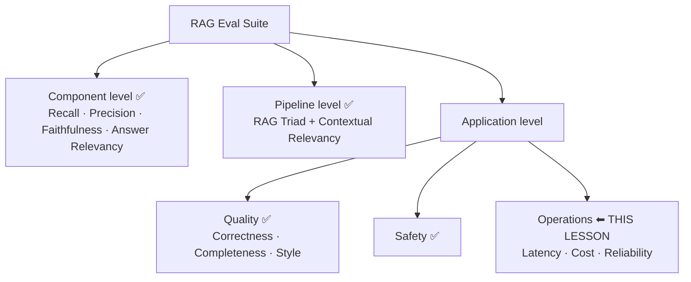
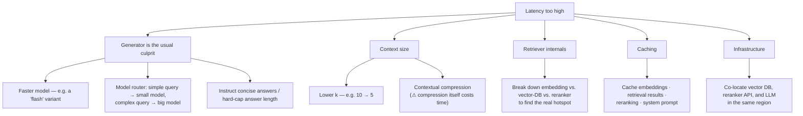

# Lesson 16 — RAG Operational Evals: Building Faster & Cheaper RAG Systems

> **Source:** CampusX · *RAG Operational Evals: Building Faster & Cheaper RAG Systems* · 1:19:31 · [watch](https://www.youtube.com/watch?v=kuTgQM9zhq0&list=PLEneLIDJFpcA&index=17)
> **One-liner:** The last missing piece of the RAG eval suite — three evals (**latency**, **cost**, **reliability**) that ask a completely different question from every metric so far: not *"is the answer good?"* but *"can this thing actually run fast, cheap, and reliably in production?"*

---

## 🎯 TL;DR

Every metric in Lessons 13–15 measured **quality** — Faithfulness, Correctness, Answer Relevancy, and so on. Operational evals measure something orthogonal: **latency** (how long users wait), **cost** (money burned per query), and **reliability** (how often the pipeline actually completes without erroring out). Two things make them feel different from everything before: they need **no golden dataset and no LLM-as-judge** — they're pure software and telemetry measurement, which also means the scripts are **free to run**. And crucially, they belong in your **offline** suite too, not just post-deployment: the absolute numbers from your laptop aren't trustworthy, but the *direction of change* between two runs absolutely is — which is exactly what catches a "quality improvement" that quietly doubled your latency and cost.

---

## 1. Where this fits — the suite is nearly done

Five sessions in, the RAG eval suite for the CampusX Doubt Solver looks like this:



Everything except **Operations** was already built. This lesson closes it out. (Regression testing was originally planned for this session too, but got pushed to the next one.)

---

## 2. What operational evals actually are

**The definition given:**
> *"Operational evals for a RAG application answer a different question from quality evals such as correctness, faithfulness, relevance. Even if the RAG system gives good answers — can it run reliably, quickly, and economically in production?"*

Everything so far judged **output quality**. Operational evals judge **the system as software**. And they differ in a second, very practical way:

> *"Operational evals are primarily software- and telemetry-driven. Unlike quality evals, they usually do not require golden datasets and LLM judgements."*

This has a nice side effect flagged directly in the session: **these scripts cost nothing extra to run.** There's no judge model being invoked, so aside from the actual RAG calls being measured, there's no evaluation overhead at all.

### The four operational metrics (three covered here)

| Metric | Question it answers | Covered? |
|---|---|:---:|
| **Latency** | How long do users wait for an answer? | ✅ |
| **Cost** | How much money per query? | ✅ |
| **Reliability** | How often does the pipeline complete without failing? | ✅ |
| **Throughput** | How many concurrent requests can we serve in a given time window? | ❌ — needs load/stress testing with dedicated tooling, out of scope |

---

## 3. The key argument: why these belong in your *offline* suite

Read the definition again and there's an obvious objection: operational evals describe *production* behavior. So shouldn't they only run *after* deployment? Why waste time putting them in the offline suite?

**The answer is an emphatic yes, they belong offline** — and the session makes the case with a fully worked scenario worth walking through slowly.

### The scenario

You've built a RAG app: top-5 chunks from the retriever, fed to an LLM. You measure everything:

| | **Before changes** |
|---|---|
| Correctness | 91% |
| Faithfulness | 94% |
| Answer Relevancy | 93% |
| Avg latency | 2.3s |
| P95 latency | 4.8s |
| Avg cost/query | ₹0.72 |
| Timeout rate | 2% |
| Success rate | 99.8% |

Now you make **three improvements**: add a reranker, bump top-5 → top-10 chunks, and swap in a bigger LLM. You re-measure:

| | **Before** | **After** | |
|---|---|---|---|
| Correctness | 91% | **95%** | ⬆ better |
| Faithfulness | 94% | **96%** | ⬆ better |
| Answer Relevancy | 93% | **95%** | ⬆ better |
| Avg latency | 2.3s | **4.1s** | ⬇ **~1.8× worse** |
| P95 latency | 4.8s | **6.2s** | ⬇ worse |
| Avg cost/query | ₹0.72 | **₹1.08** | ⬇ **50% more expensive** |
| Timeout rate | 2% | 1% | ⬆ better |
| Success rate | 99.8% | 99.9% | ⬆ better |

**Every quality metric improved.** If quality evals were all you had, you'd ship this without hesitation — and only discover in production that users are complaining the app got sluggish, while your bill went up 50%.

> *"Do not wait until production to discover that your RAG pipeline is too slow and too expensive."*

### The important caveat about absolute vs. relative numbers

The session is careful here, because there's a real objection: 2.3 seconds on your laptop won't be 2.3 seconds in production, so what's the point of measuring it offline?

**The answer: the absolute value isn't dependable, but the *differential* is.** The fact that latency went from 2.3s → 4.1s *because you changed the model and doubled the chunk count* is a real, transferable fact about your system. Direction and magnitude of change survive the move to production even though the raw numbers don't.

The one assumption this rests on, raised by a student and answered directly: **you must keep the setup identical between the two runs.** Change the setup *and* the pipeline at the same time and the comparison means nothing — the usual experimental-control discipline.

**So the honest summary:** operational evals offline are for **regression detection**, not for predicting production numbers. Post-deployment (online evals, next lessons) is where the absolute values become meaningful — and where observability tools like Langfuse or Confident AI log most of these automatically by default.

---

## 4. Latency

**Definition:** *the amount of time a system takes to respond to a request* — user hits enter, and the clock runs until the full reply is on their screen.

The naive implementation is trivially simple:

```python
start = time()
answer = rag_pipeline(question)   # retriever → context → generator → LLM
end   = time()
latency = end - start
```

...and this simple version is **wrong in about nine different ways.** The bulk of the latency discussion is the considerations that turn that three-liner into a real eval. This is flagged as the most interview-relevant stretch of the session.

### 4.1 Prefer distributions over averages — P50, P95, P99

Latency is always reported over a **time window** (last hour, last 24h, last week). Say 2,000 students asked questions in the last hour — you now have 2,000 latency values. The instinct is to report their mean. Don't stop there:

| Percentile | Meaning |
|---|---|
| **P50** (median) | 50% of requests completed within this time |
| **P95** | 95% of requests completed within this time |
| **P99** | 99% of requests completed within this time |

**Why the tail matters:** the mean might be a perfectly fine 2 seconds — but there's a slice of users for whom the answer took far longer, and *their* experience is terrible. P95/P99 are what surface those **tail latencies**. Averages hide exactly the users you most need to know about.

### 4.2 Break end-to-end latency down by component

An end-to-end number tells you *that* you're slow, not *where*. Always decompose:

> Total 4.5s = retrieval 1.5s + generation 3.0s

...and ideally further still: embedding time, vector-DB retrieval time, reranking time, generation time. Without the breakdown you have no idea which stage to attack.

### 4.3 Measure TTFT (Time To First Token) separately

Most LLM apps **stream** — the first token appears on screen the moment it arrives, rather than waiting for the whole answer. **TTFT** is how long until that first token shows up, and it's a genuinely separate metric from end-to-end latency.

Two reasons streaming is worth having (and therefore worth measuring):
1. **Readability** — a wall of text appearing all at once is harder to start reading than text that arrives at reading pace.
2. **Perceived responsiveness** — a blank screen for several seconds makes users think something broke. Visible movement keeps them calmly waiting.

> ⚙️ **Implementation note from the session:** measuring TTFT required *adding a streaming function to `src/generator.py`*, which the pipeline didn't have before. You can't measure TTFT on a non-streaming generator.

### 4.4 Watch for cold starts

First-request latency is often wildly unrepresentative. Cold starts come from:
- Model loading (e.g. downloading a reranker from Hugging Face on first use)
- Vector-DB connection setup
- Network handshakes
- Cache initialization
- Container / serverless cold boot

**The fix: discard warm-up runs.** Skip the first one or two queries and start measuring from the third — otherwise one-time setup cost pollutes your numbers.

### 4.5 Never report latency without token count and context size

**Latency scales with output length.** A long answer takes longer to generate than a short one; a large context takes longer to process than a small one. A latency number without the accompanying token counts is uninterpretable — you can't tell whether a change made the system faster or just made the answers shorter.

### 4.6 Distinguish latency from throughput

| | Definition | Restaurant analogy |
|---|---|---|
| **Latency** | Time to process a *single* request | How long one customer waits for their food to arrive |
| **Throughput** | How many concurrent requests you can handle in a given time | How many customers the kitchen can serve in an hour |

**Why they interact:** there's a throughput threshold. Below it, latency behaves normally. Cross it and requests **queue** — and queued requests have terrible latency. If a server handles 10,000 concurrent users and 20,000 show up, the first 10,000 are served normally while the second 10,000 wait, and their latency spikes.

So always state the concurrency conditions your latency number was measured under. On a laptop with one user, throughput isn't a factor at all — say so explicitly.

### 4.7 Repeat runs, because external APIs are noisy

You don't control the LLM provider's server. One slow call could be their problem, not yours. **Send each question multiple times** (5× in the session's script) and average, specifically to average out that external noise.

### 4.8 Track failures separately from latency

This one is subtle and important. Suppose you run 50 requests:

- **Experiment 1:** P95 latency = 3s, timeout rate = 2% (1 request failed)
- **Experiment 2:** P95 latency = 2s, timeout rate = 8% (4 requests failed)

Experiment 2 *looks* faster. But it isn't — **the slowest requests timed out and therefore weren't counted in the latency stats at all.** You get a false sense of improvement because the hard cases silently dropped out of the sample.

**Always report timeout/failure rate alongside latency.** Latency measured in isolation is misleading.

### 4.9 Define latency budgets (SLOs) — at system *and* component level

Write explicit thresholds into your eval script:

- **System level:** "P95 end-to-end latency must not exceed 3 seconds."
- **Component level:** "The retriever must not take more than 1 second to fetch documents."

Where do the numbers come from? A mix of your application's nature, your users' expectations, and industry norms — but you need *a* number, committed to code, so the eval can pass or fail against it.

### 4.10 Use representative, segmented workloads

If your 10 test questions are all easy, your latency looks great — right up until real users ask hard ones. Deliberately mix difficulty: e.g. 3 simple, 4 medium, 3 complex. Every question type a real user might ask should be represented.

### The script: `evals/eval_latency.py`

Configuration used live:
- **5 questions × 5 repeats = 25 total pipeline runs**
- **2 warm-up runs discarded** (cold-start protection)
- **Budgets:** P95 end-to-end ≤ 3000ms; P95 TTFT ≤ 1200ms

> The session is candid that 25 runs is far too few for trustworthy numbers — *"you'd probably do this 500 or 1000 times to get a good reliable number"* — but 25 keeps a live demo tolerable.

### The real output

**End-to-end latency:**

| | Value |
|---|---|
| Mean | 3.6s |
| P50 (median) | 3.8s |
| P95 | 5.3s |
| P99 | 5.3s |
| Min | 1.3s |
| Max | 5.3s |

**Component breakdown:**

| Stage | Mean | Notes |
|---|---|---|
| **Retrieval** | ~756ms | P95 983ms, P99 just over 1s — very tight spread |
| **Generation** | ~2.9s | **~4× the retriever** — and the two roughly sum to the 3.6s total |

The generator dominating is expected — it's the stage making a network call to an LLM, while retrieval runs locally.

**TTFT:** mean 1.6s · P95 2.0s · P99 2.1s · min 1.3s
**Average answer length:** ~1,158 characters

**SLO verdict: ❌ both budgets FAILED**

| Objective | Target | Actual | |
|---|---|---|---|
| P95 end-to-end | ≤ 3000ms | 5300ms | ❌ |
| P95 TTFT | ≤ 1200ms | 2081ms | ❌ |

Which is exactly the point of having budgets — the eval tells you unambiguously to go back and optimize, rather than leaving it to a judgement call.

### How to actually reduce latency



Two of these deserve a note:

**Model routing** is a genuinely interesting lever: inspect the incoming question, decide whether it's simple or complex, and route simple ones to a small fast model. Since simple questions are usually the majority, this pulls the *average* and P95 down meaningfully without sacrificing quality on the hard questions.

**Infrastructure distance** is easy to overlook. If your vector DB is hosted in Mumbai, your reranker API (e.g. Cohere) is in the US, and your LLM API is in Europe, every hop between them adds a fraction of a second — and those fractions accumulate on every single query. Serving India from India-region infrastructure (and US from US-region) reclaims that for free.

---

## 5. Cost

### Where the money actually goes

| Cost source | Notes |
|---|---|
| **LLM API tokens** | **Dominant cost in nearly every LLM app.** Ask any application developer where the money goes and the answer is token burn. |
| Commercial vector database | E.g. Pinecone, if you're paying for better service/performance |
| Paid reranker API | E.g. Cohere's rerank endpoint |
| Embedding model | Real, but usually small |
| Infrastructure / hosting | Wherever the app itself runs |

**The session's simplifying assumption:** vector DB free, reranker free, embedding model small/local, nothing deployed yet — so the entire cost discussion focuses on **LLM tokens**, which is where the leverage is anyway.

**Definition:**
> *"Cost is the monetary expense incurred to process a user query, driven primarily by the LLM tokens consumed during generation."*

**The mechanism** is straightforward: count input tokens, count output tokens, multiply each by its per-token rate, add them. Rates are published per **1 million tokens**, separately for input and output, and **output is typically ~4× more expensive than input**.

### Considerations

1. **The headline number is cost *per query*** — not last-hour/day/month totals. (Those matter too, but per-query is what you optimize against.)
2. **Break down input vs. output cost separately** — you can't tell which side to attack from a combined number.
3. **Measure cost as a distribution, not just a mean.** Typical query might cost ₹0.02, but tail queries might cost ₹1.50 or ₹3.00 — and those outliers deserve investigation. *(Noted as not yet implemented in the demo script — a good exercise.)*
4. **Segment cost by query type** — simple vs. medium vs. complex.
5. **Set a cost budget** — e.g. "no more than ₹0.50 per query," handed down by the business team.

### The script: `evals/eval_cost.py`

- **4 questions × 3 repeats = 12 samples**
- Model pricing hardcoded (so the script must know which model you're on)
- Budgets defined
- ⚠️ **A live bug caught on screen:** the USD→INR conversion factor was set to `88`, which was stale — should be ~95–96.

### The real output (GPT-4o-mini)

| | Value |
|---|---|
| Input rate | $0.15 / 1M tokens |
| Output rate | $0.60 / 1M tokens (4×) |
| Samples | 12 |
| Avg input tokens | ~1,700 — **of which ~1,109 were auto-cached** |
| Avg output tokens | 209 |
| **Avg cost per query** | **≈ ₹0.02 (2 paise)** |

**Two observations worth pulling out:**

**1. Cost is far more stable than latency.** The min–max range was very tight. Rates are fixed, token counts don't vary wildly — so unlike latency, **cost measured offline is genuinely reliable.** This is why the session notes cost works well as an offline metric with little caveat.

**2. This app spends more on input than output — which is backwards from the norm.** Because a RAG app stuffs a big system prompt plus retrieved context into every call, input dominates. Contrast a coding agent: a tiny instruction in ("generate this file"), an enormous output out. Know which shape your app is, because it determines which side is worth optimizing.

**Projections at 2,000 queries/day:** ₹57/day → **₹1,700/month** — comfortably within budget, so the cost SLO **passed** ✅.

### ⚠️ A caching caveat about this specific measurement

1,109 of ~1,753 input tokens came back cached — suspiciously high. **The reason: the eval sends the same question 3–4 times in a row**, so the provider aggressively caches it. Real production traffic has varied questions, so **expect the cache-hit rate (and therefore the savings) to be meaningfully lower in production.**

Also worth being clear about: **no caching code was written.** OpenAI does this automatically on their end when it detects a repeated prompt prefix.

### How to actually reduce cost

| Lever | Effect |
|---|---|
| **Reduce context size** (smaller chunks, contextual compression) | Fewer input tokens — and often fewer output tokens too, since less material to discuss |
| **Trim the system prompt** | A 1,000-token prompt squeezed to 800 without losing meaning is a permanent 20% saving on every call |
| **Instruct shorter answers / cap word count** | Directly cuts the expensive output side |
| **Use a cheaper model** | The blunt instrument |
| **Caching** | Wherever you can get it |
| 🎯 **Which model you choose** | **By far the biggest lever.** Everything else is a ±5% optimization. At real scale, switching to open-source models on your own infrastructure is the escape hatch. |

The framing is worth internalizing: unlike latency — which you can attack from many angles across the whole system — **cost is overwhelmingly a model-selection decision**, with minor optimizations around the edges.

---

## 6. Reliability

**Definition:**
> *"Reliability is the ability of a RAG system to successfully serve requests without errors, timeouts, crashes, and broken pipeline stages."*

**Concretely:** 10 users ask questions, 8 get answers, 2 see "try again later" → your system is **80% reliable**. The cause could be an LLM API failure, a reranker API failure, the vector DB failing to return context, or the server being down — the metric doesn't care which, it just counts outcomes.

### Metrics

| Metric | Meaning |
|---|---|
| **Success rate** | % of requests served successfully |
| **Error rate** | % that failed — complementary: `error = 1 − success` |
| **Timeout rate** | % that exceeded the allowed time window (distinct from a hard error) |
| **Retry rate** | % that needed at least one retry to succeed |

### Considerations

1. **Measure overall success/failure rates** — the baseline.
2. **Categorize failures instead of reporting one generic error rate.** A 20% failure rate is nearly useless as a number; break it into: LLM API failure, retriever failure, reranker failure, timeout, rate-limit error, parser/formatting error, internal exceptions. **Implementation is unglamorous but simple: wrap each pipeline stage in its own `try/except`** so you know which stage blew up.
3. **Measure reliability under load separately.** A pipeline can be 100% reliable in a single-user offline test and start failing as concurrency rises. Failure rate goes up with concurrent users, essentially always.
4. **Use enough samples.** 25 or 50 requests will just return 100% and teach you nothing. You need 1,000+ before a single failure shows up and the number starts meaning something.
5. **Use representative requests** — simple, long-context, complex, long-answer-producing, plus deliberate edge cases. Error rates often differ sharply by query type, and you want that segmentation.

### The script: `evals/eval_reliability.py`

- **4 questions × 5 repeats = 20 API hits**
- `max_retries = 2`
- Measures error rate, success rate, retry rate

**The real output: 100% success, 0% errors, 0% retries.**

And the session is refreshingly honest about this being an uninformative result:

> *"Our current setup is too ideal to give us any bad numbers."*

20 requests, from one laptop, against a very reliable API — of course nothing failed. **Reliability is a metric that only becomes meaningful post-deployment**, where thousands of users hit the system concurrently and the error/timeout/retry numbers actually move. It's included in the offline suite for completeness, not because the laptop number is useful.

**Ways to see real numbers if you want to exercise the script:** point it at a less reliable API (Ollama cloud models are suggested), or a pricier model with tighter rate limits, where rate-limit errors start appearing naturally.

---

## 7. Throughput — the fourth metric, deliberately skipped

**Throughput** = how many requests you can serve in a given time period. It's a genuinely important operational aspect, but measuring it requires **load testing / stress testing** — dedicated tooling that emulates large volumes of concurrent requests against your application. That's outside the scope of a laptop-based session, but flagged as something you *should* do in a real production setup.

---

## 8. One Q&A worth keeping

**Q (Tushar): Do we set budgets separately for dev mode vs. production mode? If we pass 1,000 questions in dev, that costs money.**

**A:** Generally no — at least not for **cost** budgeting, because token rates are identical regardless of where you run. **Latency** budgets you might reasonably set separately, since laptop latency and production latency genuinely differ (production adds server-to-server network hops your laptop test doesn't have). But cost stays the same either way.

---

## 9. Key terms

| Term | Meaning |
|---|---|
| **Operational eval** | An eval measuring whether the system runs reliably/quickly/economically, rather than whether its output is good. Software- and telemetry-driven; needs no golden dataset and no LLM judge. |
| **Latency** | Time from request to full response. |
| **P50 / P95 / P99** | Percentile latencies — the time within which 50% / 95% / 99% of requests completed. P95 and P99 expose *tail latency*, which averages hide. |
| **Tail latency** | The slowest slice of requests — the users having the worst experience, invisible in a mean. |
| **TTFT (Time To First Token)** | How long until the first streamed token appears on screen — a separate metric from end-to-end latency, and only measurable if the generator streams. |
| **Cold start** | One-time setup cost on the first request (model loading, DB connection, network handshake, cache init, container boot). Mitigated by discarding warm-up runs. |
| **Warm-up run** | An initial eval run whose result is deliberately thrown away so cold-start cost doesn't pollute measurements. |
| **Throughput** | How many concurrent requests can be served in a given time window — distinct from latency, and requiring load testing to measure. |
| **SLO (Service Level Objective)** | A committed threshold your system must meet (e.g. "P95 latency ≤ 3s"), written into the eval so it produces a hard pass/fail. |
| **Latency budget** | An SLO for latency, defined at both system level and per-component level. |
| **Contextual compression** | Compressing retrieved context before sending it to the generator — cuts tokens (cost) and generation time, but the compression step itself costs time. |
| **Model router** | Inspecting a query's difficulty and routing simple queries to a small/fast model and complex ones to a large model — reduces average latency and cost. |
| **Prompt caching** | The provider automatically caching a repeated prompt prefix so subsequent calls pay a reduced input rate. Handled by the provider, not your code. |
| **Error rate / success rate** | Complementary measures of how many requests completed successfully (`error = 1 − success`). |
| **Timeout rate** | % of requests that exceeded the allowed time window — distinct from a hard error, and essential to report alongside latency. |
| **Retry rate** | % of requests that needed at least one retry to succeed. |

---

## ✍️ Notes / follow-ups

- **The RAG eval suite is now complete** across all five sessions: component → pipeline → application (quality, safety, operations). Next up: **regression testing** — wiring the whole suite into a single flow that tells you whether a given change improved, held, or regressed the system, and therefore whether to ship it. After that, **online evals**. Then the course moves on to **agent evals**, which should go faster now that the fundamentals are in place.
- **The single most transferable habit from this lesson:** never evaluate quality in isolation. A change that improves Correctness by 4 points while doubling latency and adding 50% to cost is not obviously a good change — and you can only see that trade-off if operational evals run in the same suite.
- **Two measurement traps to remember:** (1) latency without timeout rate lies to you, because timed-out slow requests silently leave the sample; (2) cost measured by repeating the same question overstates cache savings, because production traffic is varied.
