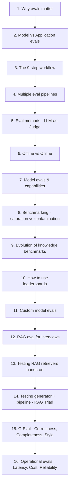

# 📊 LLM Evaluations — Lesson Notes

> One-page study notes distilled from the **CampusX "LLM Evaluations" playlist** ([full playlist](https://www.youtube.com/playlist?list=PLEneLIDJFpcA)) — 16 videos.
> Each lesson = one Markdown page, built from the video's own chapters, description, and key ideas.
> 
> 🔗 **Platform companion:** [`AI/30_langsmith/`](../30_langsmith/) — the *tooling* side of evaluation (datasets, `evaluate()`, CI gates, online evaluators, tracing). This folder is the theory and the metrics; that one is how you run them.
> Same ground on the open-source side: [`AI/32_langfuse/`](../32_langfuse/) (`run_experiment`, score types, annotation queues).

---

## Lessons

| # | Lesson | Length | Source | Status |
|---|--------|:------:|--------|:------:|
| 1 | [Master LLM Evaluations (Playlist Intro)](01-intro-master-llm-evaluations.md) | 23:24 | [video](https://www.youtube.com/watch?v=6W92_t9FveA&list=PLEneLIDJFpcA&index=1) | ✅ |
| 2 | [Model Evals vs Application Evals](02-model-evals-vs-application-evals.md) | 24:32 | [video](https://www.youtube.com/watch?v=cNF_MO82Qew&list=PLEneLIDJFpcA&index=2) | ✅ |
| 3 | [How to Evaluate LLM Applications: The Complete Workflow](03-how-to-evaluate-llm-applications-workflow.md) | 17:00 | [video](https://www.youtube.com/watch?v=Pv4mkG2K_s8&list=PLEneLIDJFpcA&index=3) | ✅ |
| 4 | [Why Your AI Application Needs Multiple Eval Pipelines](04-multiple-eval-pipelines.md) | 28:06 | [video](https://www.youtube.com/watch?v=DcZ-XCk-O_M&list=PLEneLIDJFpcA&index=4) | ✅ |
| 5 | [Eval Methods: LLM-as-a-Judge, Reference-Based vs Free](05-eval-methods-llm-as-judge.md) | 53:10 | [video](https://www.youtube.com/watch?v=uQFLY8rQVYA&list=PLEneLIDJFpcA&index=5) | ✅ |
| 6 | [Offline Evals vs Online Evals](06-offline-vs-online-evals.md) | 1:21:09 | [video](https://www.youtube.com/watch?v=SahaDGzN-Bk&list=PLEneLIDJFpcA&index=6) | ✅ |
| 7 | [LLM Model Evals & Capabilities](07-model-evals-and-capabilities.md) | 37:52 | [video](https://www.youtube.com/watch?v=FPS0rIAQwzo&list=PLEneLIDJFpcA&index=7) | ✅ |
| 8 | [LLM Benchmarking: Saturation vs Contamination](08-benchmarking-saturation-vs-contamination.md) | 51:20 | [video](https://www.youtube.com/watch?v=qIiU3lyjrhM&list=PLEneLIDJFpcA&index=8) | ✅ |
| 9 | [The Evolution of Knowledge Benchmarks](09-evolution-of-knowledge-benchmarks.md) | 1:50:47 | [video](https://www.youtube.com/watch?v=QSOB9lNrNj4&list=PLEneLIDJFpcA&index=9) | ✅ |
| 10 | [How to Use LLM Leaderboards](10-how-to-use-llm-leaderboards.md) | 30:07 | [video](https://www.youtube.com/watch?v=SoZPmKb5uGc&list=PLEneLIDJFpcA&index=10) | ✅ |
| 11 | [Selecting the Right LLM for Your AI App: Running Custom Model Evals](11-selecting-right-llm-for-your-ai-app.md) | 1:56:53 | [video](https://www.youtube.com/watch?v=RG5A-W3eMHI&list=PLEneLIDJFpcA&index=12) | ✅ |
| 12 | [How to Answer "How Do You Evaluate Your RAG App?" in GenAI Interviews](12-how-to-answer-evaluate-rag-app-interview.md) | 46:20 | [video](https://www.youtube.com/watch?v=4zn-gSckVTQ&list=PLEneLIDJFpcA&index=13) | ✅ |
| 13 | [How to Test RAG Retrievers (Hands-On)](13-how-to-test-rag-retrievers-hands-on.md) | 1:47:03 | [video](https://www.youtube.com/watch?v=9Dkz3ckRj8c&list=PLEneLIDJFpcA&index=14) | ✅ |
| 14 | [Evaluating RAG: Testing the Generator & Full Pipeline with the RAG Triad](14-evaluating-rag-generator-pipeline-rag-triad.md) | 1:21:27 | [video](https://www.youtube.com/watch?v=PATGn2XhmCY&list=PLEneLIDJFpcA&index=15) | ✅ |
| 15 | [Mastering G-Eval: The Deterministic LLM-as-a-Judge Framework](15-mastering-g-eval-deterministic-judge.md) | 1:26:52 | [video](https://www.youtube.com/watch?v=nlyxlKD5cvU&list=PLEneLIDJFpcA&index=16) | ✅ |
| 16 | [RAG Operational Evals: Latency, Cost & Reliability](16-rag-operational-evals-latency-cost-reliability.md) | 1:19:31 | [video](https://www.youtube.com/watch?v=kuTgQM9zhq0&list=PLEneLIDJFpcA&index=17) | ✅ |

**Playlist complete — all 16 lessons. 🎉**

---

## The series arc (how the lessons connect)

- **Lessons 1–6** = **Application evals** (evaluating the product you build).
- **Lessons 7–10** = **Model evals** (evaluating the raw model / benchmarks / leaderboards).
- **Lesson 11** = **Custom model selection** (running your own evals to pick the right backend model).
- **Lesson 12** = **RAG eval for interviews** (the 3-tier framework + how to tell the story).
- **Lessons 13–14** = **RAG eval hands-on** (Lesson 12's framework put into practice: retriever, then generator + pipeline via the RAG Triad).
- **Lesson 15** = **Application-level quality evals via G-Eval** (Correctness, Completeness, Style — the judgment-based metrics count-based methods can't handle).
- **Lesson 16** = **Operational evals** (latency, cost, reliability — no golden dataset, no LLM judge; catches the "quality improved but it's now 2× slower and 50% pricier" regression).

---

## How each page is structured
- **TL;DR** — the one thing to remember.
- **Core concepts** — distilled, with tables and Mermaid diagrams.
- **Examples / case studies** — concrete, from the lesson.
- **Key terms** — quick glossary.
- **Notes** — space for your own questions + link to the next lesson.

_Notes for all 16 lessons are distilled directly from each video's full transcript (auto-captions), not just chapters/description — including real worked numbers, code/file names, and verbatim examples from each session._
