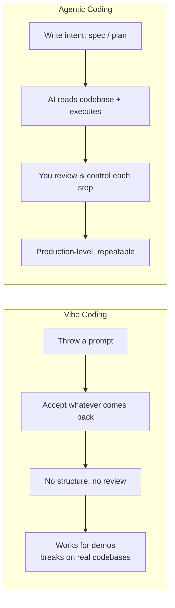

# Lesson 1 — Learn AI Coding the Right Way (No Vibe Coding)

> **Source:** CampusX · *Learn AI Coding the Right Way (No Vibe Coding) | New Playlist* · 16:54 · [watch](https://www.youtube.com/watch?v=K_KIQA849cs&list=PLKnIA16_RmvaYH3poI0oJvbDF4zEvpq8W&index=1)
> **One-liner:** The playlist trailer — why "vibe coding" (prompt-and-pray) breaks down on real projects, and why **Agentic Coding with Claude Code** is the disciplined alternative this series teaches.

---

## 🎯 TL;DR

**Vibe coding** — throwing prompts at an AI and accepting whatever comes back — feels fast but collapses once a codebase grows: no shared mental model, no review discipline, no way to trust the output. **Agentic coding** is the fix: you stay the system-level thinker (spec, review, control) while **Claude Code** — Anthropic's terminal-native coding agent — reads the codebase, plans, writes, and executes with your guardrails. This playlist is a structured 15-lesson path from setup to production-grade agentic workflows (CLAUDE.md, spec-driven dev, subagents, hooks, plugins).

---

## 1. Vibe coding vs. Agentic coding

| Dimension | Vibe coding | Agentic coding |
|---|---|---|
| **Mental model** | None — you hope the AI "gets it" | You define structure (spec, CLAUDE.md, plan) |
| **Control** | Low — accept-or-reject the whole blob | High — review at each step |
| **Scaling with codebase size** | Breaks down fast | Holds up — AI reads/plans against real context |
| **Your role** | Prompt-writer | System-level thinker / reviewer |

---

## 2. Why Claude Code specifically

| Property | What it means |
|---|---|
| **Terminal-native** | Lives in your dev workflow, not a separate chat window |
| **Reads your codebase** | Understands existing files/structure before acting |
| **Plans tasks** | Produces a plan you can inspect before execution |
| **Writes + executes** | Edits files, runs commands, iterates |
| **Autonomous but steerable** | Runs workflows end-to-end, but under your structure (specs, CLAUDE.md, hooks — covered later in the series) |

---

## 3. What the playlist covers (roadmap)

| # | Topic | Theme |
|---|---|---|
| 2 | Setup | Getting Claude Code running |
| 3 | Slash commands | Built-in workflow shortcuts |
| 4 | Code changes + image context | Everyday editing loop |
| 5 | Context window management | Token/cost discipline |
| 6 | CLAUDE.md | Persistent project memory |
| 7–9 | Spec-driven development + plan mode + custom commands | Structure before execution |
| 10 | Skills | Turning Claude into a task-specific expert |
| 11–12 | Subagents (built-in + custom) | Delegation, context isolation |
| 13 | MCP | Connecting external tools |
| 14 | Hooks | Deterministic guardrails on a probabilistic system |
| 15 | Plugins | Packaging it all into shareable workflows |

---

## 4. Key terms

| Term | Meaning |
|------|---------|
| **Vibe coding** | Unstructured prompt-and-accept coding with no review discipline |
| **Agentic coding** | Structured AI-assisted development: spec → plan → execute → review |
| **Claude Code** | Anthropic's terminal-based agentic coding tool |
| **System-level thinker** | The role you keep — defining structure/intent instead of writing every line |

---

## ✍️ Notes / follow-ups
- Next: hands-on setup → [Lesson 2 — Setup Claude Code](02-setup-claude-code.md).
- Anchor: **the goal of this whole playlist is to replace "hope it works" with "know it works."**
