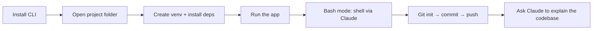

# Lesson 2 — How to Setup Claude Code on your System

> **Source:** CampusX · *How to Setup Claude Code on your System | Run Claude for Free* · 26:36 · [watch](https://www.youtube.com/watch?v=YjLF6jTyAVk&list=PLKnIA16_RmvaYH3poI0oJvbDF4zEvpq8W&index=2)
> **One-liner:** End-to-end setup of Claude Code — install, open a real project, run it in a virtual environment, use bash mode, wire up Git, and (at the time of recording) a free local alternative via Ollama.

---

## 🎯 TL;DR

Claude Code installs as a CLI and runs **inside your project directory**, where it can see and edit real files. This lesson walks the full first-project loop: install → open the project in the editor → set up a Python virtual environment → run the app → use **bash mode** to run shell commands through Claude → initialize Git and push to GitHub → ask Claude to explain the project's structure and tech stack.

---

## 1. Setup walkthrough (chapter timestamps)

| Time | Step | What happens |
|---|---|---|
| 0:46 | **Install Claude Code** | Run the install command for the CLI |
| 3:52 | **Set up the project** | Download/open the project folder in the editor (VS Code) |
| 6:39 | **Run the project** | Create a virtual environment, install dependencies, run the app (Flask example) |
| 10:02 | **Bash mode** | Run shell commands directly through Claude Code |
| 12:05 | **Git setup** | Initialize a repo, commit, push to GitHub |
| 14:18 | **Claude Code examples** | Ask Claude to explain project structure & tech stack |
| 17:16 | **Free alternative (Ollama)** | Point Claude Code at a local model via Ollama instead of the Anthropic API |

---

## 2. Why "run it inside the project" matters

Claude Code's core value is **reading real project context** — file tree, dependencies, existing code style — before writing anything. That's why setup isn't just "install a CLI"; it's install → point it at a live project → let it read and act on that project's actual state (venv, running app, git history).

---

## 3. Bash mode

A mode where you can issue shell commands directly through the Claude Code session instead of context-switching to a separate terminal — keeping the whole loop (edit → run → verify) inside one conversation.

---

## 4. Key terms

| Term | Meaning |
|------|---------|
| **Bash mode** | Run raw shell commands through Claude Code's interface |
| **Ollama alternative** | Running Claude Code against a local model instead of Anthropic's hosted API (a free workaround some users tried; later largely closed off as Claude Code became tied to the Anthropic API) |
| **Project context** | The file tree, dependencies, and structure Claude Code reads before acting |

---

## ✍️ Notes / follow-ups
- ⚠️ Several viewers noted the Ollama free-tier trick stopped working once Claude Code required the paid Anthropic API — treat it as historical context, not a current free path.
- Next: the everyday command layer → [Lesson 3 — Slash Commands](03-slash-commands.md).
