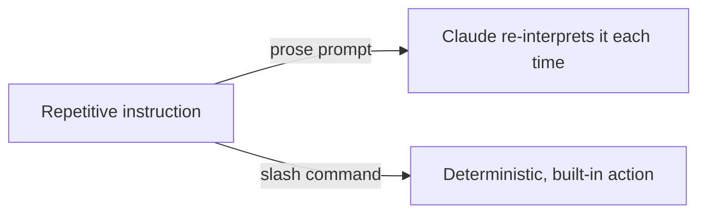

# Lesson 3 — Slash Commands in Claude Code

> **Source:** CampusX · *Slash Commands in Claude Code* · 31:28 · [watch](https://www.youtube.com/watch?v=eW9FADWxS1k&list=PLKnIA16_RmvaYH3poI0oJvbDF4zEvpq8W&index=3)
> **One-liner:** The built-in `/`-prefixed commands that control the Claude Code session itself — the fastest way to stop re-typing the same instructions every session.

---

## 🎯 TL;DR

Slash commands are **session-control shortcuts**, distinct from natural-language prompts: instead of asking Claude in prose to "clear this conversation" or "show me what tools you have," you invoke a purpose-built command. Learning the built-in set removes friction from the everyday loop and sets up the idea (formalized later in Lesson 9) that you can define your **own** slash commands too.

---

## 1. Why slash commands exist

| Problem without them | Fix with slash commands |
|---|---|
| Repeating the same setup prompt every session | One `/command` invocation |
| No clean way to reset context | `/clear`-style commands |
| Unclear what tools/config are active | Inspection commands surface this directly |

---

## 2. Command categories covered

| Category | Purpose |
|---|---|
| **Session management** | Reset/compact the conversation, start fresh without losing project setup |
| **Inspection** | See current config, model, permissions, active context |
| **Workflow shortcuts** | Trigger common built-in behaviors without a full natural-language prompt |

---

## 3. Slash commands vs. prompting

| | Natural-language prompt | Slash command |
|---|---|---|
| **Determinism** | Varies with phrasing | Fixed, predictable behavior |
| **Speed** | Slower — Claude interprets intent | Instant — direct invocation |
| **Best for** | Novel/one-off requests | Repeated, structural actions |

---

## 4. Key terms

| Term | Meaning |
|------|---------|
| **Slash command** | A `/`-prefixed built-in instruction that triggers a specific Claude Code behavior directly, bypassing free-form interpretation |
| **Session** | One continuous Claude Code conversation/context against a project |

---

## ✍️ Notes / follow-ups
- This lesson covers the **built-in** commands; Lesson 9 extends the idea to **custom** slash commands you author yourself.
- Next: the everyday edit loop → [Lesson 4 — Making Code Changes](04-making-code-changes-and-image-context.md).
