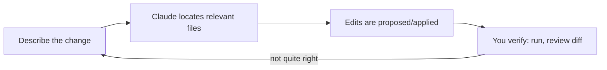

# Lesson 4 — Making Code Changes using Claude Code | How to Add Image as Context

> **Source:** CampusX · *Making Code Changes using Claude Code | How to Add Image as Context* · 22:02 · [watch](https://www.youtube.com/watch?v=-Lt-ntUDj-g&list=PLKnIA16_RmvaYH3poI0oJvbDF4zEvpq8W&index=4)
> **One-liner:** The everyday edit loop — asking Claude Code to make real code changes — plus a multimodal trick: feeding it an **image** (e.g. a hero/UI mockup) as extra context.

---

## 🎯 TL;DR

Beyond setup and commands, the daily work of agentic coding is: describe a change → Claude Code locates the relevant files → edits → you verify. This lesson also shows that Claude Code's context isn't limited to text: you can drop in an **image** (a design mockup, a screenshot, a "hero image") and have Claude use it as a visual spec when generating or modifying UI code.

---

## 1. The code-change loop

| Step | What to watch for |
|---|---|
| **Describe** | Be specific about the *what*, let Claude figure out the *where* |
| **Locate** | Claude reads the codebase to find the right files — verify it picked the right ones |
| **Edit** | Review the diff before trusting it, especially on shared/critical files |
| **Verify** | Run the app / tests — don't just read the diff and assume |

---

## 2. Images as context

| Use case | Why it helps |
|---|---|
| **UI mockup → code** | Claude can reference visual layout, colors, copy directly from the image |
| **Hero image for a landing page** | Feed the actual asset so generated markup/CSS matches it |
| **Bug screenshot** | Show the broken UI state instead of describing it in words |

**Takeaway:** Claude Code's context window accepts images alongside text — treat a picture as a first-class spec input, not just a text description of one.

---

## 3. Key terms

| Term | Meaning |
|------|---------|
| **Hero image** | The large banner/feature image at the top of a page — used here as a worked example of image-as-context |
| **Multimodal context** | Supplying both text and image input in the same Claude Code request |

---

## ✍️ Notes / follow-ups
- Practical tip: the more visually specific the target (exact layout, spacing, colors), the more an image beats a text description.
- Next: as edits accumulate, context fills up — [Lesson 5 — Context Window Management](05-context-window-management.md).
