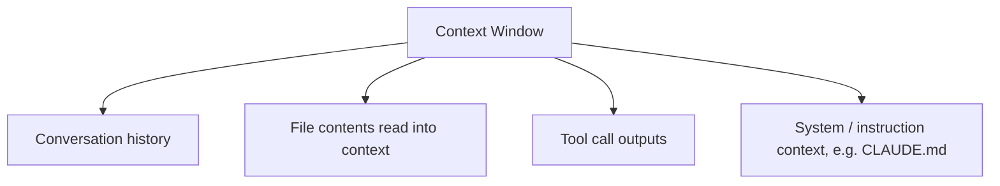
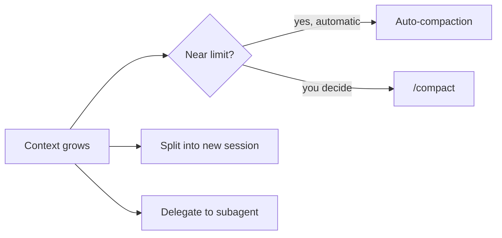

# Lesson 5 — Context Window Management in Claude Code

> **Source:** CampusX · *Context Window Management in Claude Code* · 35:07 · [watch](https://www.youtube.com/watch?v=lN5tLx2_7HQ&list=PLKnIA16_RmvaYH3poI0oJvbDF4zEvpq8W&index=5)
> **One-liner:** How Claude Code's context window actually fills up (token limits, conversation history, tool output) and the levers — auto-compaction, `/compact`, session splitting, subagents — for keeping cost and response quality under control.

---

## 🎯 TL;DR

Every message, file read, and tool result consumes tokens from a **finite context window**. Left unmanaged, long sessions degrade: responses get slower, less accurate, and more expensive. Claude Code has both **automatic** (auto-compaction) and **manual** (`/compact`, new sessions, subagents) tools to keep the working context lean without losing what matters.

---

## 1. What fills the context window

| Source | Notes |
|---|---|
| **Conversation history** | Every prior turn stays in context until compacted/cleared |
| **File reads** | Reading a large file consumes real token budget |
| **Tool outputs** | Command output, search results, etc. all count |
| **Instruction context** | CLAUDE.md and system prompts occupy a baseline slice |

---

## 2. Managing it: the lever table

| Lever | Type | What it does |
|---|---|---|
| **Auto-compaction** | Automatic | Claude Code summarizes/trims older context when nearing the limit |
| **`/compact`** | Manual | You trigger compaction on demand, at a point *you* choose |
| **New session / split work** | Manual | Start fresh for an unrelated task instead of dragging old context along |
| **Subagents** | Structural | Delegate a subtask to an isolated context, so its exploration/output doesn't bloat the main session |

---

## 3. Best practices

| Practice | Why |
|---|---|
| **Split unrelated work into new sessions** | Avoids unrelated history diluting the current task's context |
| **Use `/compact` proactively**, not just when forced | You control *what* gets summarized away vs. auto-compaction picking for you |
| **Push exploratory/heavy reads into subagents** | Keeps the main session's context focused on decisions, not raw exploration |
| **Watch cost, not just correctness** | A bloated context window costs more per turn even when answers are still fine |

---

## 4. Key terms

| Term | Meaning |
|------|---------|
| **Context window** | The finite token budget available to a single Claude Code session |
| **Auto-compaction** | Claude Code's automatic summarization of older context to free up space |
| **`/compact`** | Manual command to trigger compaction on demand |
| **Subagent** | A separate Claude instance with its own context, used to isolate heavy work from the main session (deep dive in Lessons 11–12) |

---

## ✍️ Notes / follow-ups
- This lesson is the "why it matters" for subagents — the full how-to comes in [Lesson 11](11-subagents-context-and-token-cost.md).
- Next: give Claude persistent memory across sessions → [Lesson 6 — CLAUDE.md](06-claude-md-the-most-important-file.md).
