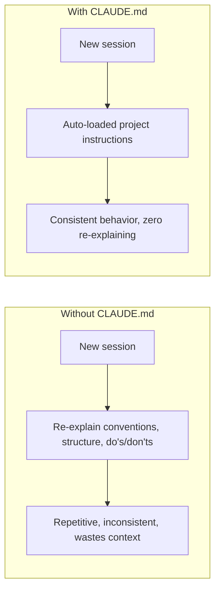

# Lesson 6 — Claude.md | Claude Code — The Most Important File

> **Source:** CampusX · *Claude.md | Claude Code — The Most Important File* · 46:28 · [watch](https://www.youtube.com/watch?v=QzA12C5NsjU&list=PLKnIA16_RmvaYH3poI0oJvbDF4zEvpq8W&index=6)
> **One-liner:** `CLAUDE.md` is the file Claude Code automatically loads at the start of every session — the mechanism for making project conventions, architecture, and instructions persistent instead of re-explained every time.

---

## 🎯 TL;DR

Without a `CLAUDE.md`, every new session starts from zero context about *how you want things done*. `CLAUDE.md` (plus the broader `.claude/` folder and auto-memory behavior) lets you write project instructions, coding conventions, and architecture notes **once** and have Claude Code reuse them automatically across every future session — turning "explain the codebase again" into "it already knows."

---

## 1. Why this file is "the most important"

| Without `CLAUDE.md` | With `CLAUDE.md` |
|---|---|
| Repeat conventions every session | Loaded automatically, every time |
| Inconsistent AI behavior across sessions | Consistent, because instructions don't drift |
| Context wasted re-establishing basics | Context spent on the actual task |

---

## 2. What goes in it

| Content type | Example |
|---|---|
| **Project instructions** | "Always run tests before committing" |
| **Coding conventions** | Naming style, preferred libraries, formatting rules |
| **Architecture details** | How modules relate, where key logic lives |
| **Do's / don'ts** | Things Claude should never touch or always ask about first |

---

## 3. The `.claude/` folder & auto-memory

| Piece | Role |
|---|---|
| **`CLAUDE.md`** | The main persistent-instructions file, auto-loaded every session |
| **`.claude/` folder** | Holds project-level Claude Code configuration beyond just the one file |
| **Auto-memory** | Claude Code's behavior of retaining/reusing this project context automatically, without you re-attaching it each time |

---

## 4. Best practices

- Keep it **specific and current** — stale instructions actively mislead future sessions.
- Put architecture/convention facts here, not one-off task instructions (those belong in the conversation or a spec, see Lesson 7).
- Treat it as living documentation the AI actually reads — update it when conventions change.

---

## 5. Key terms

| Term | Meaning |
|------|---------|
| **`CLAUDE.md`** | The auto-loaded, persistent project-instructions file for Claude Code |
| **`.claude/` folder** | Project-level configuration directory for Claude Code |
| **Auto-memory** | Automatic reuse of project context/instructions across sessions without manual re-attachment |

---

## ✍️ Notes / follow-ups
- This is the persistent-memory layer; the next three lessons build the **process** layer on top of it (spec-driven development, plan mode, custom commands).
- Next: [Lesson 7 — Spec-Driven Development](07-spec-driven-development.md).
