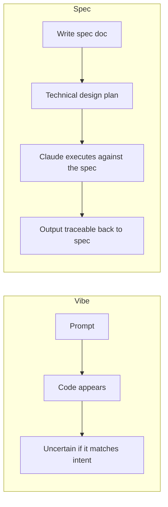
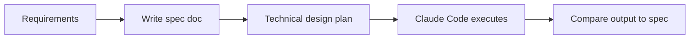

# Lesson 7 — Spec-Driven Development in Claude Code

> **Source:** CampusX · *Spec-Driven Development in Claude Code* · 28:07 · [watch](https://www.youtube.com/watch?v=AjKFApDdffA&list=PLKnIA16_RmvaYH3poI0oJvbDF4zEvpq8W&index=7)
> **One-liner:** Why writing a detailed **spec document** before letting Claude Code touch anything produces more reliable results than "vibe coding" straight into a prompt.

---

## 🎯 TL;DR

Vibe coding loses control precisely because there's no shared, written artifact describing *what* should be built before the AI starts building it. **Spec-driven development** inserts that artifact: a spec document that captures requirements, structure, and technical design — which Claude Code then executes against, instead of guessing intent turn by turn.

---

## 1. Vibe coding vs. spec-driven development

| | Vibe coding | Spec-driven development |
|---|---|---|
| **Shared artifact** | None | The spec document |
| **Traceability** | Low — hard to say *why* code looks a certain way | High — every decision traces to a spec section |
| **Consistency across sessions** | Drifts | Anchored by the same written spec |

---

## 2. Structure of a spec document

| Section | Purpose |
|---|---|
| **Requirements** | What the feature must do, functionally |
| **Technical design** | How it will be built — data model, key components, flow |
| **Acceptance criteria** | How you'll know it's done correctly (formalized further in Lesson 8) |

---

## 3. The full workflow

---

## 4. Key terms

| Term | Meaning |
|------|---------|
| **Spec-driven development** | Writing a requirements/design document first, then having the AI execute against it |
| **Technical design plan** | The "how" section of a spec — architecture and implementation approach |
| **Vibe coding** | The unstructured alternative this lesson argues against (see [Lesson 1](01-learn-ai-coding-the-right-way.md)) |

---

## ✍️ Notes / follow-ups
- This is the conceptual half; Lesson 8 puts it into practice on a real project (an expense tracker) using **plan mode**.
- Next: [Lesson 8 — Plan Mode / Ultraplan Mode](08-plan-mode-and-ultraplan-mode.md).
