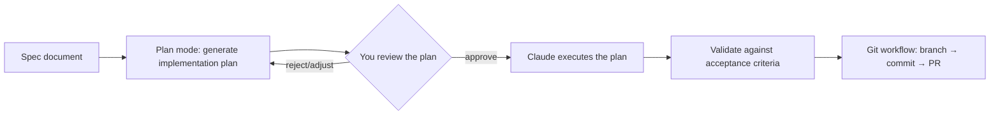

# Lesson 8 — Plan Mode in Claude Code | Ultraplan Mode

> **Source:** CampusX · *Plan Mode in Claude Code | Ultraplan Mode in Claude Code* · 37:36 · [watch](https://www.youtube.com/watch?v=yz-7Oczvg34&list=PLKnIA16_RmvaYH3poI0oJvbDF4zEvpq8W&index=8)
> **One-liner:** Spec-driven development in practice — starting a real "Spendly" expense-tracker project's database layer using a spec doc, **plan mode** to generate an inspectable implementation plan, and a full Git workflow (branch → commit → PR).

---

## 🎯 TL;DR

**Plan mode** makes Claude Code produce and show its **implementation plan before writing code** — you review and approve the plan itself, not just the resulting diff. This lesson applies that to a real feature (the expense tracker's database setup): spec → plan → execute → validate against acceptance criteria → commit through a proper Git workflow. **Ultraplan mode** is the escalated version for higher-stakes/more complex changes.

---

## 1. The plan-mode workflow

| Stage | What happens |
|---|---|
| **Spec** | Requirements + technical design (from Lesson 7) |
| **Plan mode** | Claude generates a step-by-step plan *without executing yet* |
| **Review** | You inspect and approve/adjust the plan before any code is touched |
| **Execute** | Claude carries out the approved plan |
| **Acceptance criteria check** | Verify the result actually satisfies the spec's definition of done |
| **Git workflow** | Branch, commit, open a pull request — normal team process, not bypassed |

---

## 2. Why review the *plan*, not just the diff

| Reviewing only the diff | Reviewing the plan first |
|---|---|
| You catch mistakes after work is already done | You catch wrong approaches before any code is written |
| Rework means redoing the execution | Rework means just adjusting the plan |
| Harder to reason about "is this the right approach" from a diff | The plan states the approach explicitly, in plain steps |

---

## 3. Plan mode vs. Ultraplan mode

| | Plan mode | Ultraplan mode |
|---|---|---|
| **Use case** | Standard feature work | Higher complexity / higher-stakes changes |
| **Depth** | Step-by-step plan | More exhaustive planning pass before execution |

---

## 4. Worked example: Spendly expense tracker

The lesson builds the **database setup** of a real project ("Spendly") end-to-end using this workflow — spec → plan mode → execute → acceptance criteria → Git — establishing the project that recurs through the rest of the playlist (custom commands in Lesson 9, and the final feature completion in Lesson 15).

---

## 5. Key terms

| Term | Meaning |
|------|---------|
| **Plan mode** | Claude Code mode that produces an inspectable plan before executing |
| **Ultraplan mode** | A more thorough planning mode for complex/high-stakes work |
| **Acceptance criteria** | The explicit conditions that define a feature as correctly done |

---

## ✍️ Notes / follow-ups
- Project continuity: **Spendly** (expense tracker) is the running example — watch for it again in Lessons 9 and 15.
- Next: automate this workflow itself → [Lesson 9 — Custom Slash Commands](09-custom-slash-commands.md).
