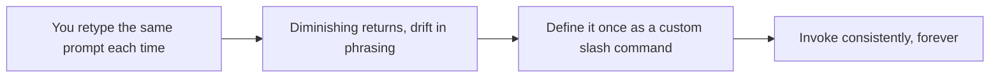
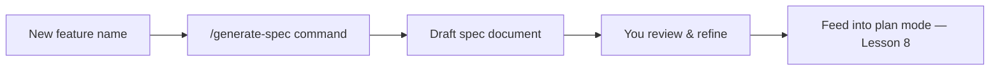

# Lesson 9 — Claude Code Custom Slash Commands | Stop Repeating Prompts

> **Source:** CampusX · *Claude Code Custom Slash Commands | Stop Repeating Prompts* · 46:27 · [watch](https://www.youtube.com/watch?v=ep2P9hvmvzY&list=PLKnIA16_RmvaYH3poI0oJvbDF4zEvpq8W&index=9)
> **One-liner:** Beyond the built-ins from Lesson 3 — authoring your **own** slash commands to automate repeatable workflows, including a command that auto-generates spec documents for new features.

---

## 🎯 TL;DR

If you find yourself typing the same multi-paragraph prompt every time you start a certain kind of task, that's a signal to turn it into a **custom slash command**. This lesson builds several on the Spendly project: seeding database users/expenses, and — the more powerful example — a command that automatically **generates a spec document** for a new feature, demonstrated by generating the spec for a registration feature.

---

## 1. From repeated prompts to custom commands

| Signal you need a custom command | Example |
|---|---|
| Same multi-step instruction, repeated | "Seed the database with test users" |
| A workflow with a fixed shape but variable input | "Generate a spec doc for feature X" |
| Team members should trigger it the same way | Shared commands = shared process |

---

## 2. Worked examples (on the Spendly project)

| Custom command | What it automates |
|---|---|
| **Seed users** | Populate the database with test user records |
| **Seed expenses** | Populate test expense records |
| **Generate spec** | Given a feature name, produce a full spec document automatically (used here for the *registration* feature) |

---

## 3. Why the "generate spec" command matters

It closes the loop with Lessons 7–8: instead of hand-writing every spec from scratch, you get a **first-draft spec automatically**, then review/refine it before handing it to plan mode. This is process automation applied to the process itself.

---

## 4. Key terms

| Term | Meaning |
|------|---------|
| **Custom slash command** | A user-defined `/`-command that encodes a repeatable workflow, as opposed to the built-ins in [Lesson 3](03-slash-commands.md) |
| **Spec generation command** | A custom command whose job is to draft a spec document for a named feature |

---

## ✍️ Notes / follow-ups
- Pattern to reuse: whenever a prompt starts feeling copy-pasted, that's the cue to promote it into a custom command.
- Next: turn Claude into a domain-specific expert → [Lesson 10 — Skills](10-skills-full-guide.md).
