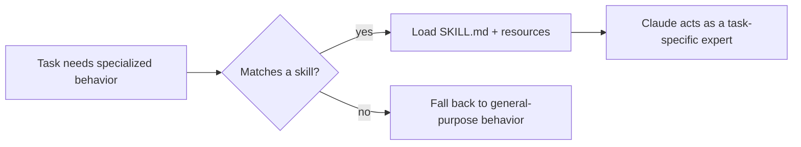

# Lesson 10 — Claude Code Skills: Full Guide

> **Source:** CampusX · *Claude Code Skills: Full Guide* · 49:46 · [watch](https://www.youtube.com/watch?v=JN7QCdvJwwM&list=PLKnIA16_RmvaYH3poI0oJvbDF4zEvpq8W&index=10)
> **One-liner:** **Skills** turn Claude from a general-purpose assistant into a **task-specific expert** — packaged as a `SKILL.md` + YAML metadata + resource files, loaded via progressive disclosure.

---

## 🎯 TL;DR

Prompts fail for repeated, complex workflows because you're re-explaining domain expertise every time. A **Skill** packages that expertise once — instructions, metadata, and supporting resource files — so Claude can load exactly the right specialized behavior on demand, without bloating context for tasks that don't need it. Skills can be personal (yours across projects) or project-scoped, and there are multiple ways to create one.

---

## 1. Why prompts fail, why skills fix it

| Prompt-only approach | Skill-based approach |
|---|---|
| Re-explain domain rules every time | Written once, loaded when relevant |
| All instructions sit in context whether needed or not | **Progressive disclosure** — loaded only when the skill is invoked |
| Hard to share with a team consistently | A skill file is a shareable, versionable artifact |

---

## 2. Anatomy of a Skill

| Component | Role |
|---|---|
| **`SKILL.md`** | The core instructions defining the skill's behavior |
| **YAML metadata** | Structured frontmatter — name, description, trigger conditions |
| **Resource files** | Supporting material the skill can reference (templates, reference docs, scripts) |

---

## 3. Progressive disclosure

Rather than loading every skill's full content into context all the time, Claude Code loads skills **progressively**: metadata is cheap and always scannable; the full `SKILL.md` and resources only load once a skill is actually matched and invoked. This keeps the context window (Lesson 5) from being clogged by unused skill definitions.

---

## 4. Personal vs. project skills

| Type | Scope | Use case |
|---|---|---|
| **Personal skills** | Follow you across all projects | General workflows you always want (e.g., your commit-message style) |
| **Project skills** | Scoped to one repo | Domain-specific expertise relevant only to that codebase |

---

## 5. Key terms

| Term | Meaning |
|------|---------|
| **Skill** | A packaged, reusable unit of task-specific expertise for Claude Code |
| **`SKILL.md`** | The main file defining a skill's instructions |
| **Progressive disclosure** | Loading skill content only when the skill is actually triggered, not upfront |
| **Personal / Project skill** | Scope classification — cross-project vs. repo-specific |

---

## ✍️ Notes / follow-ups
- Skills vs. subagents (next two lessons): a skill changes *how* the main agent behaves for a task; a subagent runs the task in a **separate context** entirely.
- Next: [Lesson 11 — Subagents](11-subagents-context-and-token-cost.md).
