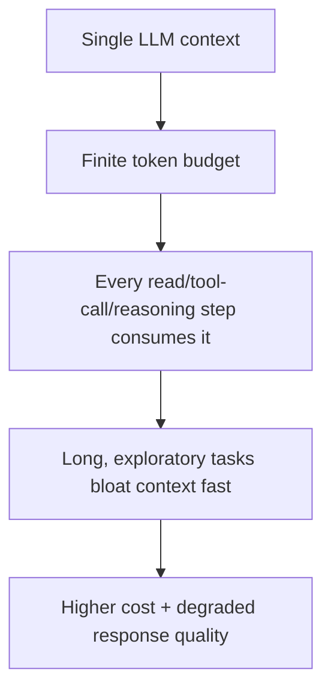
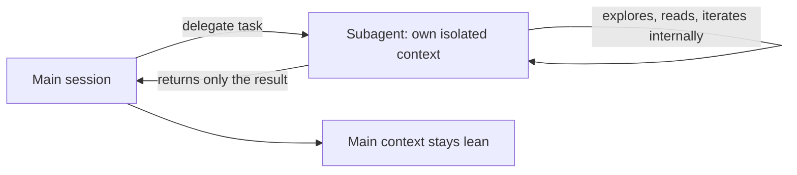

# Lesson 11 — Claude SubAgents: Solve Context & Token Cost Problems

> **Source:** CampusX · *Claude SubAgents: Solve Context & Token Cost Problems* · 48:24 · [watch](https://www.youtube.com/watch?v=aZCU_wTXwfo&list=PLKnIA16_RmvaYH3poI0oJvbDF4zEvpq8W&index=11)
> **One-liner:** Subagents explained from first principles — starting from a fundamental LLM limitation (finite context) and building up to why delegating work to isolated subagents is the structural fix.

---

## 🎯 TL;DR

Every LLM call shares **one** context window, so every exploration step, every file read, every intermediate reasoning trace competes for the same limited space and cost budget. A **subagent** is a separate Claude instance with its **own** context — you hand it a task, it does the exploration/work in isolation, and returns only the **result** to the main session, keeping the main context lean and the cost lower.

---

## 1. The fundamental limitation

This is the same problem introduced in [Lesson 5](05-context-window-management.md) — here it's traced back to its root cause: an LLM only ever reasons within **one shared context**, so there's no way to "explore a lot" without that exploration itself costing context.

---

## 2. Subagents as the structural fix

| Without subagents | With subagents |
|---|---|
| Exploration/search steps live in the main context | Exploration happens in the subagent's own context |
| Main context grows with every intermediate step | Main context grows only by the subagent's **final answer** |
| Token cost scales with total work done | Token cost isolated — main session pays only for the summary |

---

## 3. When to delegate to a subagent

| Good fit | Why |
|---|---|
| Heavy codebase search/exploration | Keeps raw search noise out of the main session |
| A subtask with a clear, boundable goal | Cleanly returns a single useful result |
| Work you don't need to review step-by-step | You only need the outcome, not the process |

| Poor fit | Why |
|---|---|
| Highly interactive, iterative work | Losing visibility into intermediate steps hurts more than it helps |
| Tasks needing your judgment mid-way | Subagents run to completion before reporting back |

---

## 4. Key terms

| Term | Meaning |
|------|---------|
| **Subagent** | A separate Claude Code agent instance with an isolated context, invoked to perform a bounded task and return a result |
| **Context isolation** | The core benefit — a subagent's internal work doesn't consume the calling session's context |

---

## ✍️ Notes / follow-ups
- This lesson covers Claude Code's **built-in** subagent types; Lesson 12 shows how to define **custom** ones for specialized workflows.
- Next: [Lesson 12 — Custom Subagents](12-custom-subagents.md).
