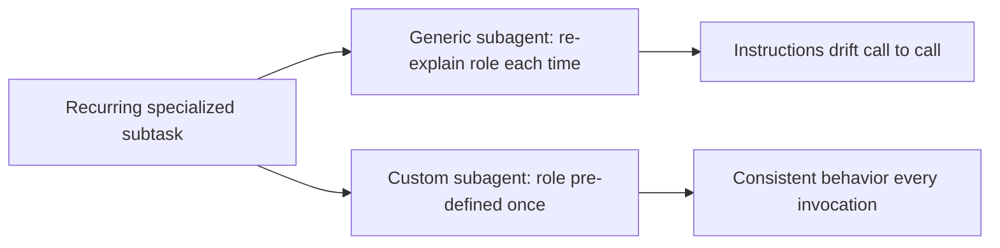

# Lesson 12 — Claude Custom Subagents (Build Your Own AI Workers)

> **Source:** CampusX · *Claude Custom Subagents (Build Your Own AI Workers)* · 47:23 · [watch](https://www.youtube.com/watch?v=CBdixlYmtaw&list=PLKnIA16_RmvaYH3poI0oJvbDF4zEvpq8W&index=12)
> **One-liner:** Going beyond Claude Code's built-in subagents by defining your **own** — specialized, task-specific "AI workers" tailored to a project's recurring subtasks.

---

## 🎯 TL;DR

Built-in subagents (Lesson 11) cover general delegation patterns, but real projects have **recurring, specific** subtasks — a dedicated reviewer, a test-writer, a migration-checker. Custom subagents let you define a named, purpose-built worker: its own instructions, its own scope, invoked whenever that specific kind of work comes up, instead of re-explaining the role to a generic subagent each time.

---

## 1. Built-in vs. custom subagents

| | Built-in subagent | Custom subagent |
|---|---|---|
| **Role definition** | Generic, described per-call | Pre-defined, named, reusable |
| **Consistency** | Depends on how you phrase the delegation each time | Fixed by its own definition |
| **Best for** | One-off delegation | Recurring, well-understood subtasks |

---

## 2. Anatomy of a custom subagent

| Component | Role |
|---|---|
| **Name/identity** | What you invoke it as |
| **Scoped instructions** | What this worker is responsible for, and nothing more |
| **Isolated context** | Same context-isolation benefit as built-in subagents ([Lesson 11](11-subagents-context-and-token-cost.md)) |

---

## 3. Designing good custom subagents

| Principle | Why |
|---|---|
| **Narrow, well-defined scope** | A subagent that does one thing well is easier to trust and reuse |
| **Return a clean, structured result** | The main session should get a usable answer, not raw exploration dumped back |
| **Name it for its role, not its implementation** | "code-reviewer," not "agent-3" — makes intent obvious when delegating |

---

## 4. Key terms

| Term | Meaning |
|------|---------|
| **Custom subagent** | A user-defined, named subagent with fixed scope/instructions, built on the isolation model from Lesson 11 |
| **AI worker** | The lesson's framing for a custom subagent — a specialized, callable unit of work |

---

## ✍️ Notes / follow-ups
- Custom subagents + custom slash commands ([Lesson 9](09-custom-slash-commands.md)) compose well: a command can be the trigger, a subagent the executor.
- Next: connecting Claude Code to external tools → [Lesson 13 — Claude + MCP](13-claude-and-mcp-explained.md).
