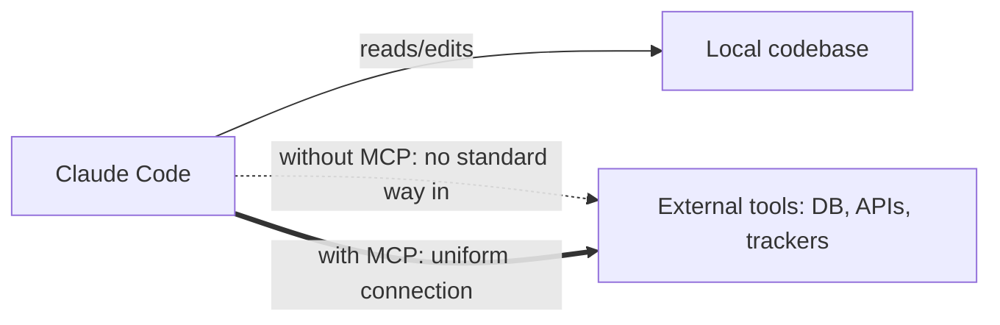

# Lesson 13 — Claude + MCP Explained

> **Source:** CampusX · *Claude + MCP Explained* · 54:33 · [watch](https://www.youtube.com/watch?v=Q38npqiDxMI&list=PLKnIA16_RmvaYH3poI0oJvbDF4zEvpq8W&index=13)
> **One-liner:** How the **Model Context Protocol** turns Claude Code from a codebase-aware editor into a tool-connected development environment that can reach external systems — databases, APIs, project trackers — through a standard interface.

---

## 🎯 TL;DR

Claude Code is powerful reading and editing local files, but real dev work touches things outside the repo: a database, a ticket tracker, a deploy API. **MCP** is the standard that connects Claude Code to those external tools/data sources uniformly, instead of every integration being a one-off. Once connected, Claude Code can call MCP-exposed tools directly as part of its normal agentic loop.

> For the full theory (host/client/server architecture, primitives, lifecycle), see the dedicated [`mcp/` playlist notes](../15_mcp/README.md) — this lesson applies that model specifically inside Claude Code.

---

## 1. Why Claude Code needs MCP

| Without MCP | With MCP |
|---|---|
| Every external integration is custom/ad hoc | One standard protocol for all of them |
| Claude Code limited to local file context | Claude Code can call real tools/data during its loop |
| Hard to add a new external capability | Add an MCP server, Claude Code gains the capability |

---

## 2. How it fits Claude Code's agent loop

| Step | Role of MCP |
|---|---|
| **Plan** | Claude may plan a step that requires an external action (e.g., "query the DB for current schema") |
| **Execute** | That step is carried out via an MCP tool call, not a guess |
| **Result** | The tool's real output feeds back into the session, grounding the next step in actual data |

---

## 3. Practical payoff

Connecting an MCP server (e.g., for a database, or project management tool) means Claude Code isn't just editing files based on assumptions — it can **verify against the real external system** as part of the same workflow, closing the loop between "what the code says" and "what's actually true."

---

## 4. Key terms

| Term | Meaning |
|------|---------|
| **MCP (Model Context Protocol)** | Standard connecting AI models/tools to external data and capabilities |
| **MCP server** | A program exposing tools/data to Claude Code in the MCP standard |
| **Tool call** | Claude Code invoking an MCP-exposed capability mid-workflow |

---

## ✍️ Notes / follow-ups
- This is the "MCP inside Claude Code" angle; the standalone [`mcp/`](../15_mcp/README.md) notes cover building your own MCP servers/clients from scratch.
- Next: the safety layer on top of all this automation → [Lesson 14 — Hooks](14-hooks-full-theory-and-practical-use.md).
