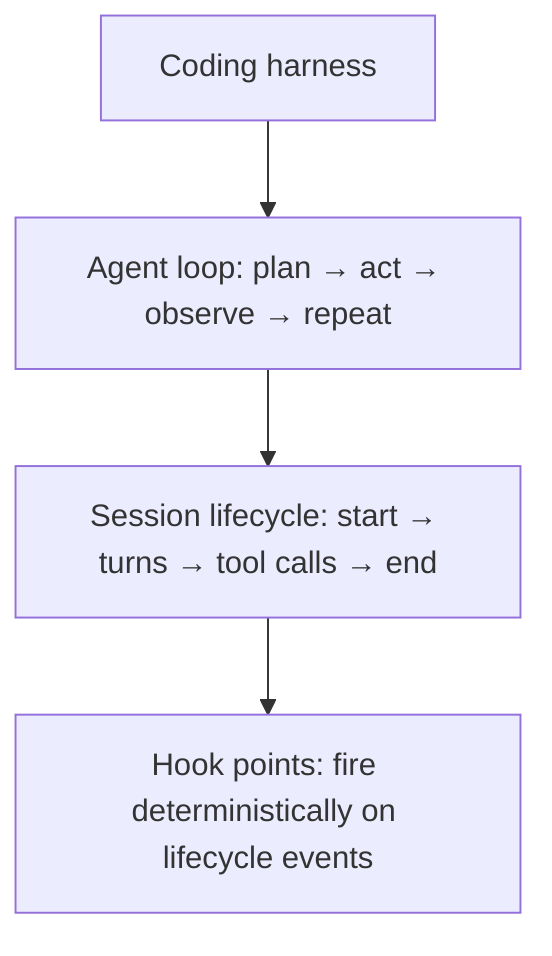
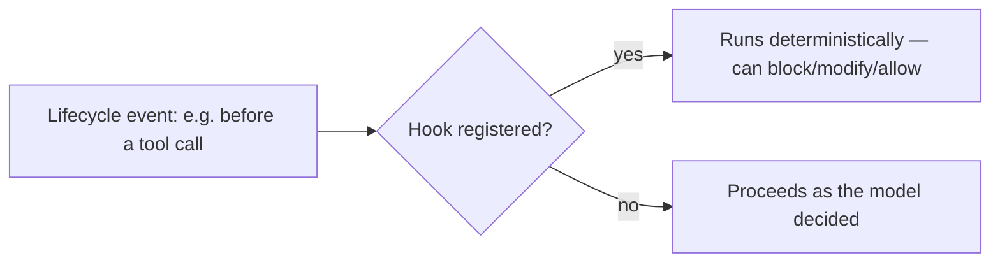

# Lesson 14 — Hooks in Claude Code — Full Theory + Practical Use

> **Source:** CampusX · *Hooks in Claude Code — Full Theory + Practical Use* · 1:04:58 · [watch](https://www.youtube.com/watch?v=oo1oADOiVmM&list=PLKnIA16_RmvaYH3poI0oJvbDF4zEvpq8W&index=14)
> **One-liner:** Claude Code's internal architecture (coding harness, agent loop, session lifecycle) and how **hooks** let you enforce deterministic, non-negotiable rules on top of an otherwise probabilistic AI system.

---

## 🎯 TL;DR

An LLM is inherently probabilistic — it might *usually* follow an instruction in `CLAUDE.md`, but "usually" isn't good enough for things like "never touch the `main` branch" or "always run tests before commit." **Hooks** are deterministic interception points wired into Claude Code's **agent loop** and **session lifecycle** — they run guaranteed, every time a matching event happens, regardless of what the model decides to do.

---

## 1. Claude Code's internal architecture

| Concept | Meaning |
|---|---|
| **Coding harness** | The overall system wrapping the model — tools, permissions, session state |
| **Agent loop** | The repeated plan → act → observe cycle Claude Code runs each turn |
| **Session lifecycle** | The sequence of events from session start to end (including every tool call) |

---

## 2. Why hooks, given `CLAUDE.md` already exists

| `CLAUDE.md` instructions | Hooks |
|---|---|
| The model *reads and tries to follow* them | The harness *enforces* them outside the model's discretion |
| Probabilistic — can be missed or reinterpreted | Deterministic — fires on the event, every time |
| Good for conventions, style, context | Good for hard constraints, safety, side-effect control |

---

## 3. Practical use cases

| Use case | What the hook does |
|---|---|
| **Preventing destructive actions** | Block a tool call before it executes if it matches a forbidden pattern (e.g., `rm -rf`, pushing to `main`) |
| **Enforcing process** | Require a test run before allowing a commit |
| **Logging/auditing** | Record every tool call for later review, independent of what the model reports |
| **Injecting checks** | Run a linter/validator automatically at a defined lifecycle point |

---

## 4. Key terms

| Term | Meaning |
|------|---------|
| **Hook** | A deterministic interception point tied to a Claude Code lifecycle/agent-loop event |
| **Coding harness** | The infrastructure around the model — tools, permissions, orchestration |
| **Agent loop** | The plan → act → observe cycle Claude Code executes per turn |
| **Deterministic vs. probabilistic** | Hooks always fire on their trigger; model behavior only *usually* follows instructions |

---

## ✍️ Notes / follow-ups
- Mental model: `CLAUDE.md` = guidance the model reads; **hooks** = rules the system enforces, regardless of what the model reads.
- Next: packaging skills + hooks + commands + MCP + subagents together → [Lesson 15 — Plugins](15-plugins-and-claude-code-notes.md).
