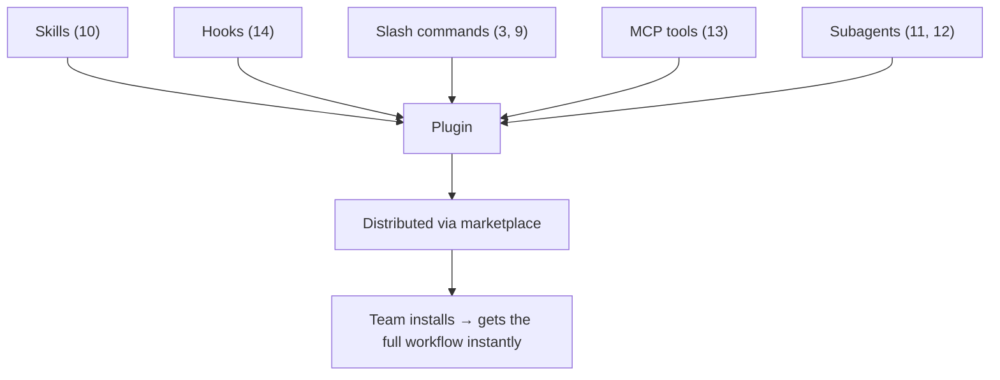

# Lesson 15 — Plugins in Claude Code + Claude Code Notes (Final Video)

> **Source:** CampusX · *Plugins in Claude Code + Claude Code Notes | Final Video* · 35:08 · [watch](https://www.youtube.com/watch?v=4lfcbeihdJk&list=PLKnIA16_RmvaYH3poI0oJvbDF4zEvpq8W&index=15)
> **One-liner:** The playlist finale — **plugins** package skills, hooks, slash commands, MCP tools, and subagents into one reusable, shareable unit, installable via marketplaces; the Spendly expense-tracker project is completed as a capstone.

---

## 🎯 TL;DR

Every capability built across this playlist — skills (10), hooks (14), slash commands (3, 9), MCP tool connections (13), subagents (11–12) — can be bundled into a single **plugin**: one artifact a team installs to get an entire configured workflow at once, distributed through **marketplaces** rather than copy-pasted file by file. The lesson closes by finishing the Spendly project using everything the series taught.

---

## 1. Plugins as the packaging layer

| Building block | Where it was covered |
|---|---|
| Skills | [Lesson 10](10-skills-full-guide.md) |
| Hooks | [Lesson 14](14-hooks-full-theory-and-practical-use.md) |
| Slash commands (built-in + custom) | [Lesson 3](03-slash-commands.md) / [Lesson 9](09-custom-slash-commands.md) |
| MCP tools | [Lesson 13](13-claude-and-mcp-explained.md) |
| Subagents (built-in + custom) | [Lesson 11](11-subagents-context-and-token-cost.md) / [Lesson 12](12-custom-subagents.md) |

---

## 2. Why package as a plugin instead of sharing files

| Sharing individual files | Sharing a plugin |
|---|---|
| Teammates manually copy skills/hooks/commands into place | One install brings the whole configured workflow |
| Easy to drift — people end up on slightly different setups | Versioned, consistent across the team |
| No discovery mechanism | Marketplaces make plugins discoverable/installable |

---

## 3. Capstone: finishing Spendly

The project introduced in [Lesson 8](08-plan-mode-and-ultraplan-mode.md) and extended in [Lesson 9](09-custom-slash-commands.md) gets completed here — a full pass using spec-driven development, plan mode, custom commands, and (implicitly) the safety/extension layers from Lessons 10–14, demonstrating the whole playlist's toolkit working together on one real feature set.

---

## 4. Key terms

| Term | Meaning |
|------|---------|
| **Plugin** | A packaged bundle of skills, hooks, commands, MCP tools, and subagents, installable as one unit |
| **Marketplace** | A distribution mechanism for discovering and installing Claude Code plugins |

---

## ✍️ Notes / follow-ups
- 🎉 **Final lesson of the playlist.** Arc recap: setup → daily workflow (commands, edits, context) → persistent memory (CLAUDE.md) → structured process (specs, plan mode, custom commands) → specialization & delegation (skills, subagents) → external connectivity (MCP) → safety (hooks) → packaging (plugins).
- Big picture: **agentic coding is a stack, not a single trick** — each lesson adds one layer, and Lesson 15's plugins are how you ship that whole stack to a team in one piece.
