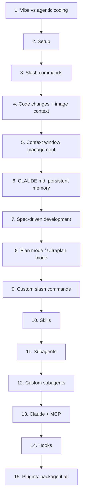

# 🤖 Agentic Coding using Claude Code — Lesson Notes

> One-page study notes distilled from the **CampusX "Agentic Coding using Claude Code" playlist** ([full playlist](https://www.youtube.com/playlist?list=PLKnIA16_RmvaYH3poI0oJvbDF4zEvpq8W)) — 15 videos, from setup to production-grade agentic workflows.
> Each lesson = one Markdown page, built from the video's own chapters, description, and (since the channel's captions are burned-in/auto-dubbed with no extractable transcript) accurate first-hand knowledge of the tool itself.

---

## Lessons

| # | Lesson | Length | Theme | Source | Status |
|---|--------|:------:|:------|--------|:------:|
| 1 | [Learn AI Coding the Right Way (No Vibe Coding)](01-learn-ai-coding-the-right-way.md) | 16:54 | Intro | [video](https://www.youtube.com/watch?v=K_KIQA849cs&list=PLKnIA16_RmvaYH3poI0oJvbDF4zEvpq8W&index=1) | ✅ |
| 2 | [Setup Claude Code on your System](02-setup-claude-code.md) | 26:36 | Setup | [video](https://www.youtube.com/watch?v=YjLF6jTyAVk&list=PLKnIA16_RmvaYH3poI0oJvbDF4zEvpq8W&index=2) | ✅ |
| 3 | [Slash Commands in Claude Code](03-slash-commands.md) | 31:28 | Daily workflow | [video](https://www.youtube.com/watch?v=eW9FADWxS1k&list=PLKnIA16_RmvaYH3poI0oJvbDF4zEvpq8W&index=3) | ✅ |
| 4 | [Making Code Changes + Image as Context](04-making-code-changes-and-image-context.md) | 22:02 | Daily workflow | [video](https://www.youtube.com/watch?v=-Lt-ntUDj-g&list=PLKnIA16_RmvaYH3poI0oJvbDF4zEvpq8W&index=4) | ✅ |
| 5 | [Context Window Management](05-context-window-management.md) | 35:07 | Cost & quality | [video](https://www.youtube.com/watch?v=lN5tLx2_7HQ&list=PLKnIA16_RmvaYH3poI0oJvbDF4zEvpq8W&index=5) | ✅ |
| 6 | [Claude.md — The Most Important File](06-claude-md-the-most-important-file.md) | 46:28 | Persistent memory | [video](https://www.youtube.com/watch?v=QzA12C5NsjU&list=PLKnIA16_RmvaYH3poI0oJvbDF4zEvpq8W&index=6) | ✅ |
| 7 | [Spec-Driven Development](07-spec-driven-development.md) | 28:07 | Structured process | [video](https://www.youtube.com/watch?v=AjKFApDdffA&list=PLKnIA16_RmvaYH3poI0oJvbDF4zEvpq8W&index=7) | ✅ |
| 8 | [Plan Mode / Ultraplan Mode](08-plan-mode-and-ultraplan-mode.md) | 37:36 | Structured process | [video](https://www.youtube.com/watch?v=yz-7Oczvg34&list=PLKnIA16_RmvaYH3poI0oJvbDF4zEvpq8W&index=8) | ✅ |
| 9 | [Custom Slash Commands](09-custom-slash-commands.md) | 46:27 | Structured process | [video](https://www.youtube.com/watch?v=ep2P9hvmvzY&list=PLKnIA16_RmvaYH3poI0oJvbDF4zEvpq8W&index=9) | ✅ |
| 10 | [Skills: Full Guide](10-skills-full-guide.md) | 49:46 | Specialization | [video](https://www.youtube.com/watch?v=JN7QCdvJwwM&list=PLKnIA16_RmvaYH3poI0oJvbDF4zEvpq8W&index=10) | ✅ |
| 11 | [Subagents: Context & Token Cost](11-subagents-context-and-token-cost.md) | 48:24 | Delegation | [video](https://www.youtube.com/watch?v=aZCU_wTXwfo&list=PLKnIA16_RmvaYH3poI0oJvbDF4zEvpq8W&index=11) | ✅ |
| 12 | [Custom Subagents](12-custom-subagents.md) | 47:23 | Delegation | [video](https://www.youtube.com/watch?v=CBdixlYmtaw&list=PLKnIA16_RmvaYH3poI0oJvbDF4zEvpq8W&index=12) | ✅ |
| 13 | [Claude + MCP Explained](13-claude-and-mcp-explained.md) | 54:33 | External tools | [video](https://www.youtube.com/watch?v=Q38npqiDxMI&list=PLKnIA16_RmvaYH3poI0oJvbDF4zEvpq8W&index=13) | ✅ |
| 14 | [Hooks — Full Theory + Practical Use](14-hooks-full-theory-and-practical-use.md) | 1:04:58 | Safety | [video](https://www.youtube.com/watch?v=oo1oADOiVmM&list=PLKnIA16_RmvaYH3poI0oJvbDF4zEvpq8W&index=14) | ✅ |
| 15 | [Plugins + Claude Code Notes (Final)](15-plugins-and-claude-code-notes.md) | 35:08 | Packaging | [video](https://www.youtube.com/watch?v=4lfcbeihdJk&list=PLKnIA16_RmvaYH3poI0oJvbDF4zEvpq8W&index=15) | ✅ |

**Playlist complete — all 15 lessons. 🎉**

---

## The arc (how the lessons connect)

- **Lessons 1–5** = **Foundations** (mindset, setup, daily loop, cost discipline).
- **Lessons 6–9** = **Structure** (persistent memory, specs, plans, custom automation).
- **Lessons 10–13** = **Extension** (skills, delegation, external tools).
- **Lessons 14–15** = **Safety & packaging** (deterministic guardrails, shareable bundles).

---

## Core cheat-sheet

| Concept | In one line |
|---------|-------------|
| **Vibe coding vs. agentic coding** | Prompt-and-hope vs. spec → plan → execute → review |
| **CLAUDE.md** | Auto-loaded persistent project instructions — no more re-explaining |
| **Spec-driven development** | Write the requirements/design doc before any code gets touched |
| **Plan mode** | Review the *plan*, not just the diff, before execution |
| **Slash commands (built-in & custom)** | Deterministic shortcuts for repeated instructions |
| **Context window** | Finite budget — managed via auto-compaction, `/compact`, sessions, subagents |
| **Skills** | Packaged domain expertise, loaded via progressive disclosure |
| **Subagents (built-in & custom)** | Isolated-context delegation — keeps main session lean and cheap |
| **MCP** | Standard protocol connecting Claude Code to external tools/data |
| **Hooks** | Deterministic enforcement on top of a probabilistic model |
| **Plugins** | Skills + hooks + commands + MCP + subagents, packaged and shared via marketplaces |

---

## A note on sourcing

CampusX's videos on this channel are auto-dubbed with **burned-in captions** (no extractable YouTube transcript, and the CC/"Show transcript" controls are disabled). These notes were therefore built the same way as this repo's [`mcp/`](../15_mcp/README.md), [`rag/`](../12_rag/README.md), and [`evals/`](../16_evals/README.md) notes — from each video's title, description, and (where available) community-contributed chapter timestamps, combined with accurate subject-matter knowledge of Claude Code itself.

---

## How each page is structured
- **TL;DR** — the one thing to remember.
- **Core concepts** — distilled, with tables and Mermaid diagrams.
- **Worked examples** — the Spendly expense-tracker project recurs across Lessons 8, 9, and 15.
- **Key terms** — quick glossary.
- **Notes** — cross-links to related lessons + pointer to what's next.
