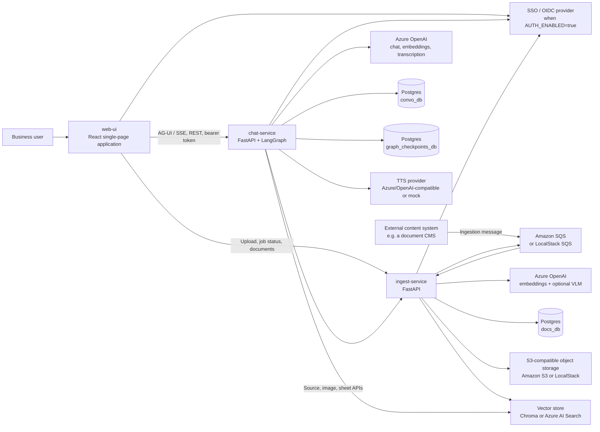
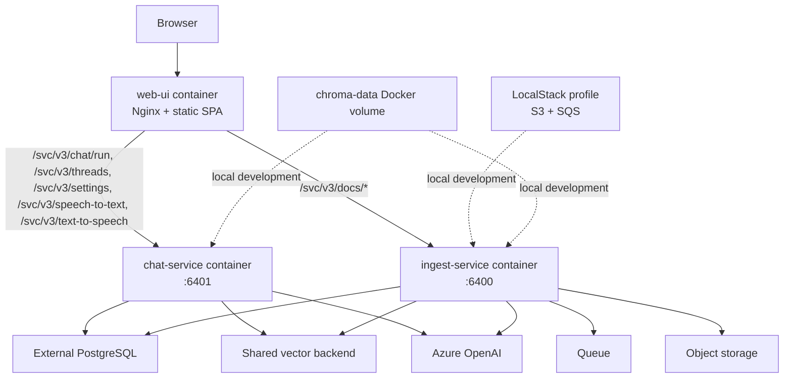

# High-Level Design

> **Modular Knowledge Assistant** · design set → [README](README.md) · **you are here: HLD**

## 1. Purpose

Modular Knowledge Assistant is an enterprise-oriented, agentic RAG platform. It ingests business documents, extracts both textual and visual knowledge, indexes that knowledge, and offers a browser-based assistant that answers with grounded citations. It supports local development with LocalStack and Chroma, while retaining production-oriented options for Amazon S3/SQS, Azure OpenAI, Azure AI Search, PostgreSQL, and an SSO (OIDC) identity provider.

## 2. System context

## 3. Component model

| Component | Responsibility | Owned state | Primary interfaces |
| --- | --- | --- | --- |
| `web-ui` | Browser interaction: chat, sources, document upload/status, prompt configuration, feedback, voice capture/playback | Client-side view state | REST, AG-UI SSE, SSO browser auth |
| `chat-service` | Conversational orchestration and read-side RAG | Conversations, turn state, configuration versions, LangGraph checkpoints | `/svc/v3/chat/run`, conversation/configuration APIs, vector read APIs, ingestion document APIs |
| `ingest-service` | Asynchronous document lifecycle and vector write-side pipeline | Ingestion jobs and results | Upload/job/document APIs, SQS producer/consumer, storage/vector provider adapters |
| Vector store | Semantic retrieval over chunks and metadata filters | Embedded text/image-vector records | Chroma or Azure AI Search |
| Object storage | Original uploaded files and page/slide image assets | S3 keys and object metadata | Amazon S3 or LocalStack S3 API |
| PostgreSQL | Durable service data and graph checkpoint state | Three logical databases | Async SQLAlchemy/psycopg and LangGraph PostgreSQL saver |
| Azure OpenAI | Embeddings, agent chat synthesis, query expansion, optional vision extraction, transcription | Model deployments | Azure OpenAI REST through LangChain/OpenAI clients |
| SQS | Decouples document submission from processing and supports retry/DLQ behavior | In-flight messages | Amazon SQS or LocalStack SQS |

## 4. Logical architecture

### 4.1 Write path — document ingestion

1. The UI uploads a file to `ingest-service`, or an external producer sends an `IngestionMessage` to SQS.
2. The API persists the source object and creates an ingestion job. It publishes the job handle to SQS.
3. A background SQS consumer validates the message and performs `new`, `update`, or `delete` routing.
4. The ingestion worker downloads the object to a temporary location, extracts documents by file type, saves generated page/slide images, chunks content, standardizes metadata, optionally summarizes the document, and upserts vectors.
5. The job record becomes `COMPLETED`, `FAILED`, or a delete-related state. Transient errors are re-raised so SQS can redeliver; terminal errors become a durable job failure.

### 4.2 Read path — grounded chat

1. The UI submits a user turn to the agent's `/svc/v3/chat/run` endpoint using AG-UI and accepts an SSE event stream.
2. The agent obtains the conversation's pinned prompt configuration, forces a `search_knowledge_base` tool call for each new user turn, and expands the query into up to four searches.
3. The vector adapter searches the configured vector store and deduplicates chunks.
4. Context assembly attaches text, Excel sheet rows, and image content according to chunk metadata. It also creates a citation whitelist.
5. The chat model synthesizes an answer using the retrieved multimodal context. Tokens, thinking updates, citations, and state events stream to the UI.
6. The LangGraph checkpoint and companion conversation records let the UI rehydrate messages and sources after a refresh.

## 5. Deployment topology

Docker Compose separates services into two profiles:

- `app`: `ingest-service`, `chat-service`, and `web-ui`.
- `localstack`: LocalStack plus an initializer that creates the local bucket, queue, and dead-letter queue.

Example Compose host mappings are UI `6280 -> 8888`, agent `6501 -> 6401`, ingestion `6511 -> 6400`, and LocalStack `4576 -> 4566`. Treat `docker-compose.yml` as the source of truth for host ports; they are environment-configurable and may differ per deployment.

## 6. Service boundaries

The project deliberately maintains independent service surfaces:

| Boundary | Allowed interaction | Why it matters |
| --- | --- | --- |
| UI → agent | HTTP REST and AG-UI SSE | Keeps browser protocol and agent orchestration replaceable. |
| UI → ingestion | HTTP upload/job/document APIs | UI never handles S3 credentials or vector access. |
| Agent → ingestion | HTTP source/image/sheet APIs | Agent can enrich context without direct storage access. |
| Ingestion → vector store | Write/upsert/delete adapter | Prevents agent service from accidentally mutating the index. |
| Agent → vector store | Read/search adapter | Keeps query logic independent of provider implementation. |
| Ingestion ↔ external systems | SQS message contract | Enables non-UI sources and retry/DLQ processing. |

There are no direct imports between `ingest-service`, `chat-service`, and `web-ui`.

## 7. Security design

| Control | Current design |
| --- | --- |
| User authentication | Optional SSO (OIDC) bearer-token validation through `common.auth`; controlled by `AUTH_ENABLED`. Local templates default it to `false`. |
| Browser authentication | UI uses an OIDC-compliant browser SSO library for token acquisition and redirect handling when auth is enabled. |
| Service authorization | Agent `/svc/v3/chat/run`, conversation, and transcription routes explicitly require an authenticated user. Ingestion applies auth middleware to ingestion API routes. Configuration endpoints should be reviewed before production because they currently do not declare the route-level auth dependency used by conversation endpoints. |
| Data access | Agent fetches assets through ingestion HTTP APIs instead of directly using S3 credentials. |
| Secrets | Service-specific `.env.local` files are gitignored. Secrets resolve from process environment before local harness configuration. |
| Storage | S3 server-side encryption can be configured; real AWS uses the default credential chain rather than baked keys. |
| Network | Compose places services on an internal network; Nginx proxies browser routes to backend services. Production deployment should enforce TLS, restrictive CORS, and private data-plane access. |

## 8. Non-functional design

| Concern | Design response | Operational implication |
| --- | --- | --- |
| Responsiveness | Chat streams AG-UI/SSE tokens and thinking updates. | Reverse proxies must disable response buffering for the stream. |
| Ingestion resilience | SQS long polling, visibility timeout, retry/redelivery, and DLQ after configured receive attempts. | Visibility timeout must exceed worst-case document processing time. |
| Idempotency | External `file_id` drives deduplication and update/delete behavior. | Producers should supply a stable, source-system identity. |
| Consistency | Shared vector configuration is validated at request time before ingestion/search. | Provider/index/deployment mismatch is rejected rather than silently producing incompatible vectors. |
| Durability | Job records and checkpoints live in Postgres; source files and rendered assets live in object storage. | Backups must cover all three stores, not only the database. |
| Scale | UI and agent are stateless except for external state; ingestion can be separated into API and worker deployments around SQS. | The current background consumer is in the ingestion API process, so horizontal scale requires queue-consumer coordination planning. |
| Cost/latency | VLM, multi-query expansion, and image fetches are optional/conditional. | Tune top-K, chunking, summary/VLM flags, timeouts, and model deployment tiers. |

## 9. Key risks and guardrails

1. Vector schema drift is the principal data-contract risk. Both services must use the same provider, collection/index, embedding deployment, dimensions, and metadata schema.
2. `file_id` is critical for update/delete correctness. A producer that changes it per version creates duplicate documents rather than an update.
3. Retrieval can be more expensive than a basic RAG call because the agent runs multi-query expansion and may load Excel rows or images. Keep result limits and timeout values explicit.
4. The current ingestion consumer runs inside the FastAPI service lifecycle. For high volume, split worker scaling and document concurrency from API scaling.
5. Production should review authorization coverage, internal service-to-service authentication, CORS policy, audit logging, retention, and tenant/data-isolation filters before enabling sensitive workloads.
