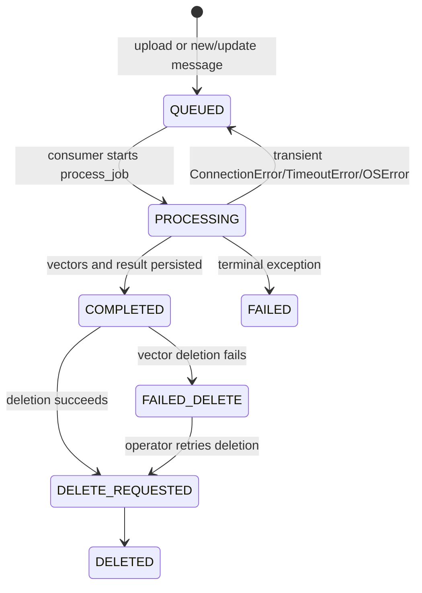
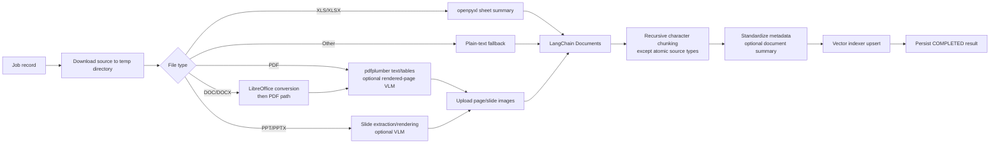

# Low-Level Design — Ingestion Service

> **Modular Knowledge Assistant** · design set → [README](README.md) · **you are here: LLD — Ingestion**

## 1. Responsibilities and module map

`ingest-service` is the write-side owner of document lifecycle, source artifacts, and vector indexing.

| Module/area | Responsibility |
| --- | --- |
| `api.py` | FastAPI lifespan, auth middleware, upload/job/document/content endpoints, SQS publication, and source/image/sheet access APIs. |
| `consumer.py` | Long-poll SQS message consumption; message validation; `new`/`update`/`delete` routing. |
| `messages.py` | Pydantic queue models: operation, source, file handle, document metadata, source-system metadata. |
| `ingestion.py` | Upload submission, background processing, chunking, metadata normalization, index writes, cleanup, and bulk storage ingestion. |
| `repository.py` | Async SQLAlchemy persistence for `IngestionJob` records. |
| `connectors/` | Storage connector registry and S3 implementation. |
| `processors/` | Type-specific extraction for PDF, PowerPoint, Excel, Word, text, and optional VLM enrichment. |
| `vector_indexers/` | Provider-neutral write-side interface plus Chroma and Azure AI Search adapters. |
| `embedding.py` | Azure OpenAI embedding client factory used by vector indexers. |

## 2. Lifecycle and concurrency

The FastAPI lifespan initializes the repository, storage connector, vector indexer, chat model, SQS publisher, and a background queue-consumer task. API requests and queue messages converge on the same `process_job` implementation.



`FAILED_DELETE` deliberately retains the job and source object when vector deletion fails. This preserves the ability to retry instead of reporting an incorrect successful delete.

## 3. Ingestion entry points

| Entry point | Route/message | Behavior |
| --- | --- | --- |
| UI upload | `POST /svc/v3/docs/uploads` | Stores the file, creates a job, publishes an SQS `new` message, returns `202` plus job status. |
| External create | SQS `operation_type: new` | Creates a job from an external S3 handle, deduplicated by `file_id`. |
| External update | SQS `operation_type: update` | Cleans the old matching `file_id`, then ingests the new object. |
| External delete | SQS `operation_type: delete` | Cleans vectors and storage for the matching `file_id`. |
| Bulk re-index | `POST /svc/v3/docs/ingest-from-storage` | Enumerates configured storage; requires an explicit `clean_index` parameter to clear the index. |

## 4. Queue contract

```json
{
  "operation_type": "new",
  "document_source": "external_cms",
  "file_handle": {
    "bucket": "upstream-document-bucket",
    "key": "policies/reports/report.pdf",
    "filename": "report.pdf",
    "content_type": "application/pdf"
  },
  "document_metadata": {
    "file_id": "external-asset-12345",
    "namespace": "policies"
  },
  "source_system_metadata": {
    "source_system": "external_cms",
    "year": "2026",
    "folder": "/Policies/Reports",
    "revision": "3"
  }
}
```

The important producer rule is that `file_id` must remain stable for the logical document. It lets the consumer deduplicate `new`, replace on `update`, and locate the record on `delete`.

## 5. Processing pipeline



### File-type behavior

| Type | Extracted content | Optional enrichment | Stored artifacts |
| --- | --- | --- | --- |
| PDF | Per-page text and tables via `pdfplumber` | Visual detection, rendered page, VLM description | Source PDF; page PNG where enabled/needed |
| PPT/PPTX | Slide content/rendered slides | VLM slide description | Source presentation; slide PNGs |
| XLS/XLSX | Sheet-level structured content via `openpyxl` | Chat-model sheet/document summary | Source spreadsheet; rows served by API on retrieval |
| DOC/DOCX | Converted to PDF by LibreOffice, then PDF extraction | Same as PDF | Source Word document and derived assets |
| Other | UTF-8/plain-text fallback | None | Source object where uploaded |

The controls `INGESTION_ENABLE_PDF`, `INGESTION_ENABLE_PPTX`, `INGESTION_ENABLE_XLSX`, `INGESTION_ENABLE_DOCX`, and `INGESTION_ENABLE_TEXT` gate accepted formats. VLM needs `INGESTION_ENABLE_VLM=true` and a configured chat deployment.

> **DOCX note:** DOC/DOCX is converted to PDF by LibreOffice and then **re-enters the PDF branch** — so it gets the same per-page text, table, and visual/VLM treatment (and page-image artifacts) as a native PDF. The flowchart edge `DOC/DOCX → PDF` reflects this.
>
> **Visual/image handling is non-trivial** for image-dense and scanned PDFs. The full logic — how a page is detected as image-dense, rendered, described by the VLM, and split into `visual_insight` + `page_image` chunks — is documented separately in [06 — Visual Extraction & VLM](06-visual-extraction-and-vlm.md), with worked examples.

## 6. Core implementation pattern

The following excerpt captures the service's processing transaction boundary. Blocking provider work runs in a thread; transient failures return the job to `QUEUED` and are intentionally re-raised for SQS redelivery.

```python
async def process_job(config, repository, vector_indexer, storage, job_id, chat_model):
    record = await repository.mark_processing(job_id)
    if record is None:
        return

    try:
        result, summary = await asyncio.to_thread(
            _process_job_payload,
            config, vector_indexer, storage, record, job_id, chat_model,
        )
        completed = await _finalize_job(repository, storage, job_id, result, summary)
        if not completed:
            await asyncio.to_thread(vector_indexer.delete_job, job_id=job_id)
            await asyncio.to_thread(storage.delete_objects, [record.stored_file_path])
            await repository.mark_deleted(job_id)
    except (ConnectionError, TimeoutError, OSError):
        await repository.mark_queued(job_id)
        raise                         # permits SQS retry
    except Exception as exc:
        await repository.mark_failed(job_id, str(exc))
```

At the center of `_process_job_payload`, the service normalizes every extracted item to the same vector contract:

```python
ctx, documents = _extract_documents(config, job_id, local_file, chat_model)
_upload_page_images(storage, job_id, documents)
chunks = _chunk_documents(config, documents)

for chunk in chunks:
    chunk.metadata = _standardize_metadata(record, chunk)

if chat_model is not None:
    summary = _generate_doc_summary(chat_model, record.original_file_name, documents)
    for chunk in chunks:
        chunk.metadata["doc_summary"] = summary

indexed = vector_indexer.upsert_documents(
    job_id=job_id, namespace=record.namespace, documents=chunks
)
```

## 7. Data model

### 7.1 Ingestion job

`IngestionJob` is the durable operational record. Important fields include:

| Field | Purpose |
| --- | --- |
| `job_id` | Unique identifier for this ingestion version; links job, vectors, images, and retrieval. |
| `file_id` | Stable logical identity for dedup/update/delete. |
| `document_source` | `ui_screen`, `external_cms`, or another origin. Determines storage-read behavior. |
| `source_bucket` / `stored_file_path` | Location of original object. |
| `namespace` | Optional grouping/filtering value passed to the indexer. |
| `status`, `delete_requested`, `error_message` | Lifecycle and remediation visibility. |
| `result` | Counts, processing time, breakdown, and extraction issues for UI/status reporting. |
| `artifact_path` | Generated asset linkage where present. |

### 7.2 Canonical vector metadata

All chunks are normalized before upsert. Core fields are `job_id`, `file_id`, `title`, `source_uri`, `source_type`, `namespace`, `page`, `chunk_index`, `created_at`, and source-system metadata. Conditional fields include `image_uri`, `sheet_name`, table metadata, and `doc_summary`.

```json
{
  "job_id": "a1b2c3",
  "file_id": "external-asset-12345",
  "title": "report",
  "source_uri": "uploads/a1b2c3_report.pdf",
  "source_type": "visual_insight",
  "namespace": "policies",
  "page": 8,
  "chunk_index": 17,
  "image_uri": "page_images/a1b2c3/8.png",
  "doc_summary": "Short document-level orientation text"
}
```

## 8. Provider abstractions

| Concern | Contract | Implementations |
| --- | --- | --- |
| Storage | `StorageConnector` | S3-compatible connector; local configuration exists for development/reference use. |
| Index writes | Vector indexer interface: `upsert_documents`, `delete_job`, `delete_all` | Chroma and Azure AI Search. |
| Embeddings | Azure OpenAI embedding factory | `text-embedding-3-small` is the template default at 1536 dimensions. |
| Extraction | Processor dispatch based on extension | PDF, slides, Excel, Word, text. |

Any new vector provider must implement the write interface and match the chat-service read interface, including metadata filtering and the exact embedding/vector dimensions.

## 9. Failure handling and cleanup order

The cleanup order is intentionally vectors first, then objects, then job-state mutation. If vector deletion fails, the service records `FAILED_DELETE` without removing source data or hiding the job. This prevents orphaned searchable vectors from being mistaken for a completed deletion.

For queue errors, the consumer deletes messages only after successful handling or a classified terminal error. Connection, timeout, and operating-system errors remain available for redelivery. LocalStack initialization configures a main queue with a 3600-second visibility timeout and a dead-letter policy after three receives; production must set equivalent queue policy deliberately.

## 10. Extension points

| Change | Primary files | Compatibility checks |
| --- | --- | --- |
| New file processor | `processors/`, dispatch in `processors/__init__.py` | Preserve canonical metadata and report `ProcessingContext` issues. |
| New storage backend | `connectors/base.py`, registry, new adapter | Support upload, download, bytes access, and deletion semantics. |
| New vector backend | `vector_indexers/base.py`, registry, adapter | Add matching agent read adapter, schema validation, delete semantics, and integration tests. |
| New source system | `messages.py`, `consumer.py` | Define stable `file_id`, source-bucket permissions, and replay behavior. |
