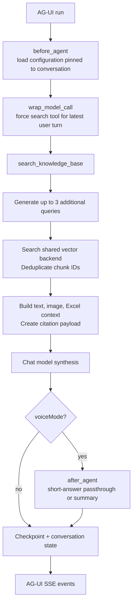
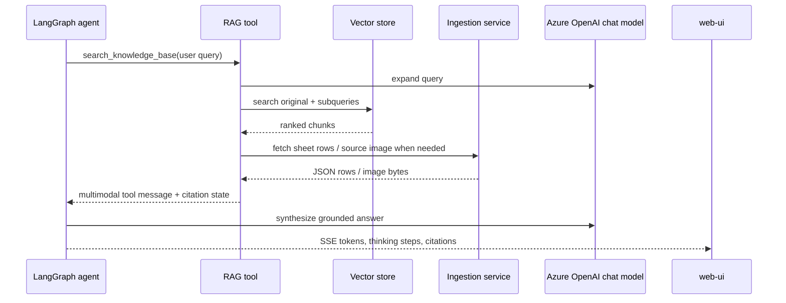
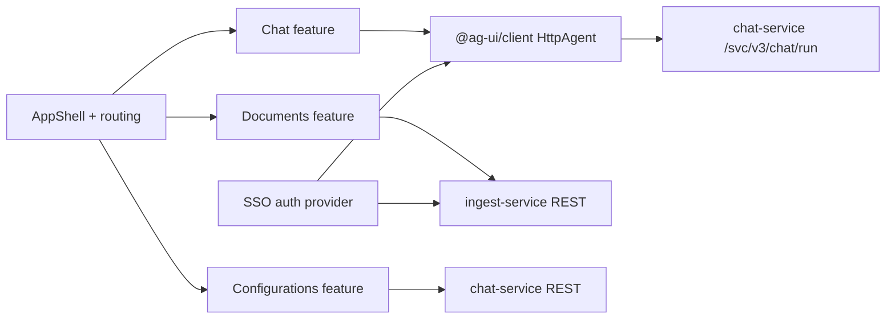

# Low-Level Design — Agent Service and UI

> **Modular Knowledge Assistant** · design set → [README](README.md) · **you are here: LLD — Agent & UI**

## 1. Agent service module map

| Module/area | Responsibility |
| --- | --- |
| `api.py` | FastAPI lifespan, AG-UI streaming endpoint, conversation/configuration APIs, transcription, TTS, health, and checkpoint cleanup. |
| `agent_builder.py` | LangGraph agent assembly, graph state, middleware, forced retrieval, prompt resolution, and voice summary. |
| `retrieval_tools.py` | `search_knowledge_base`, query expansion, vector retrieval, source/image/Excel context assembly, citations, and thinking events. |
| `vector_stores/` | Read-only vector abstraction and Chroma/Azure AI Search adapters. |
| `repositories/`, `services/`, `schemas/`, `domain/` | Conversation and configuration persistence, DTOs, service-level business logic. |
| `auth.py` | Compatibility export for the shared SSO authentication implementation. |
| `transcription.py`, `services/tts/` | Voice input and streamed text-to-speech output. |
| `bootstrap.py` | Resource initialization/shutdown, including optional observability integration. |

## 2. Agent graph design

The agent is built with `langchain.agents.create_agent`, a PostgreSQL-backed LangGraph checkpointer, one knowledge-base tool, and middleware. `KnowledgeAgentState` extends the framework state with persistent citations, a per-turn resolved prompt, voice-mode input, and generated voice summaries.



The forced-retrieval middleware avoids a common stateful-agent error: a previous tool message in a persisted checkpoint must not let a later user question skip retrieval. It inspects messages after the latest user turn and sets `tool_choice="any"` until a new tool message exists.

```python
@wrap_model_call
async def force_retrieval_until_tool_message(request, handler):
    messages = request.state.get("messages", [])
    last_user_idx = max(
        (i for i, m in enumerate(messages) if _kind(m) in {"human", "user"}),
        default=-1,
    )
    has_tool_after_latest_user = any(
        _kind(message) == "tool" for message in messages[last_user_idx + 1:]
    )
    if has_tool_after_latest_user:
        return await handler(request)                  # synthesize answer
    return await handler(request.override(tool_choice="any"))
```

## 3. Retrieval and grounding design

`search_knowledge_base` is the only registered agent tool. It performs multi-query retrieval to improve recall and turns retrieved metadata into the final multimodal model context.



### Context by chunk type

| Source type | Context supplied to model | Citation/source behavior |
| --- | --- | --- |
| `text`, `table` | Chunk text labeled by document/page | Page-aware citation token. |
| `excel_summary` | Retrieved summary plus sheet JSON fetched from ingestion API; row cap controlled by `AGENT_EXCEL_SHEET_CONTEXT_MAX_ROWS` | File-and-sheet citation token. |
| `visual_insight`, `page_image` | VLM text plus an image content block loaded through ingestion | Page-and-image citation token; UI exposes image/source view. |

The tool emits a custom `citations` event for immediate rendering and persists the unfiltered citation map in graph state keyed by tool call ID. During conversation hydration, the UI associates that map with the subsequent final assistant message.

```python
@tool
def search_knowledge_base(query: str, tool_call_id: str | None = None):
    queries = _multi_query_expand(query)       # original + up to 3 variants
    chunks = _retrieve_chunks(queries, top_k=_get_config().vector_top_k)
    content_blocks = _assemble_context(chunks) # text, image, Excel data
    citations = _build_citations_payload(chunks)

    dispatch_custom_event("citations", {"citations": citations})
    return Command(
        update={"citations_by_run": {tool_call_id: citations}},
        messages=[ToolMessage(content=content_blocks, tool_call_id=tool_call_id)],
    )
```

The snippet is a condensed representation of the current tool implementation; the implementation also guards expansion, search, and citation availability checks with configured timeouts and emits detailed thinking-step state.

## 4. Conversation and configuration persistence

Three durable concerns are separated:

| Store | Contents | Reason for separation |
| --- | --- | --- |
| `convo_db` | Conversation records, turns, source-panel data, feedback and configuration versions | Product-facing metadata/query model. |
| `graph_checkpoints_db` | LangGraph checkpoints | Framework-managed graph state, messages, citations, and resume/hydration data. |
| In-memory process state | Active graph wrapper, TTS provider, checkpoint pool | Recreated during app lifespan; never authoritative. |

A conversation can pin a configuration version. At the start of each turn, `before_agent` resolves that version once and caches the system and voice-summary prompts in graph state. This makes prior conversations reproducible even when a newer configuration becomes active.

`api.py` also runs a tombstone sweeper: it periodically removes checkpoint threads for conversations that have been tombstoned, then hard-deletes their companion application records.

## 5. Agent API design

| Endpoint | Purpose | Authentication |
| --- | --- | --- |
| `GET /health` | Liveness check | No explicit dependency. |
| `POST /svc/v3/chat/run` | Start/continue an agent run; SSE response (AG-UI protocol) | `require_auth`. |
| `POST/GET /svc/v3/threads` | Create/list conversations | `require_auth`. |
| `GET/DELETE /svc/v3/threads/{thread_id}` | Read or tombstone a conversation | `require_auth`. |
| `POST /svc/v3/speech-to-text` | Convert uploaded audio to text | `require_auth`; 25 MiB request cap. |
| `POST /svc/v3/text-to-speech` | Return streamed MPEG audio | Provider availability and text limits enforced. |
| `/svc/v3/settings` routes | Create, list, select, activate prompt configuration versions | Current source exposes these routes without the route-level `require_auth` dependency; secure this before production exposure. |
| `GET /svc/v3/auth/setup`, `GET /svc/v3/auth/status` | Browser auth bootstrap/status | Status requires authentication. |

The `/svc/v3/chat/run` route creates a turn record, claims a per-conversation run lock to reject concurrent runs with `409`, streams encoded events, and marks/clears the turn outcome at completion/failure.

## 6. UI architecture



The app uses React Router routes for `/chat`, `/chat/new`, `/chat/:chatId`, `/documents`, and `/configurations`. The Nginx container serves the SPA and proxies browser API calls to the two backend services, avoiding browser access to container-internal hostnames.

### UI feature responsibilities

| Feature | Key behavior |
| --- | --- |
| Chat | Creates an `HttpAgent`, attaches auth headers, receives AG-UI stream state, renders Markdown, thinking steps, citations, source panel, feedback, and optional voice flow. |
| Documents | Uploads multipart files, polls job state every 3 seconds until terminal, lists active jobs, and requests asynchronous delete. |
| Configurations | Reads versioned prompts, creates an immutable new version from edits, and activates a selected version. |
| Shared auth/connectivity | SSO token acquisition, auth redirects, authorized request headers, API base URLs, and connection status. |

Representative client construction:

```typescript
export function createChatAgent(threadId: string): HttpAgent {
  return new HttpAgent({
    url: `${AGENT_API_BASE_URL}/svc/v3/chat/run`,
    headers: getCachedAuthorizationHeaders(),
    threadId,
    debug: import.meta.env.DEV,
  })
}
```

## 7. Voice interaction

1. The UI captures a recording and sends it to `/svc/v3/speech-to-text` with bearer authorization.
2. Agent service sends audio to the configured Azure transcription deployment and returns text.
3. The UI sets AG-UI `voiceMode` for the next turn.
4. After answer generation, agent middleware uses cleaned, citation-free text directly for short responses or generates a speech-oriented summary for longer ones.
5. The UI requests `/svc/v3/text-to-speech` and plays streamed MPEG audio. A mock provider is used when no real TTS API key is configured.

## 8. Extension points

| Change | Implementation seam | Verify |
| --- | --- | --- |
| New retrieval strategy | `retrieval_tools.py` query expansion/retrieval functions | Citation mapping, timeouts, duplicate suppression, and retrieval quality. |
| New vector provider | `vector_stores/` base/registry/adapter | Matching ingestion adapter and shared schema configuration. |
| New custom AG-UI event | Agent dispatch plus UI stream handler/types | Browser backward compatibility and hydration behavior. |
| New configuration field | Schema, repository, service, graph state, configuration UI | Version pinning and migration/default behavior. |
| New TTS provider | `services/tts/base.py`, registry, provider implementation | First-chunk error handling, input sanitization, timeout, and MIME type. |
