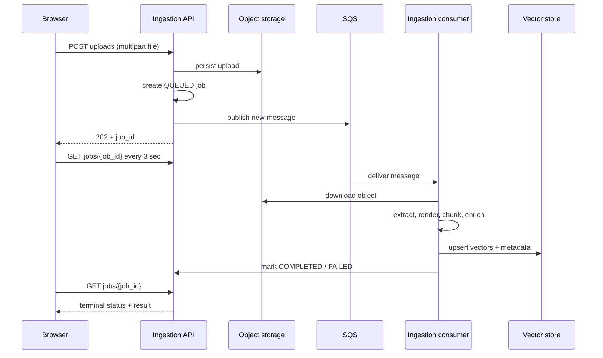
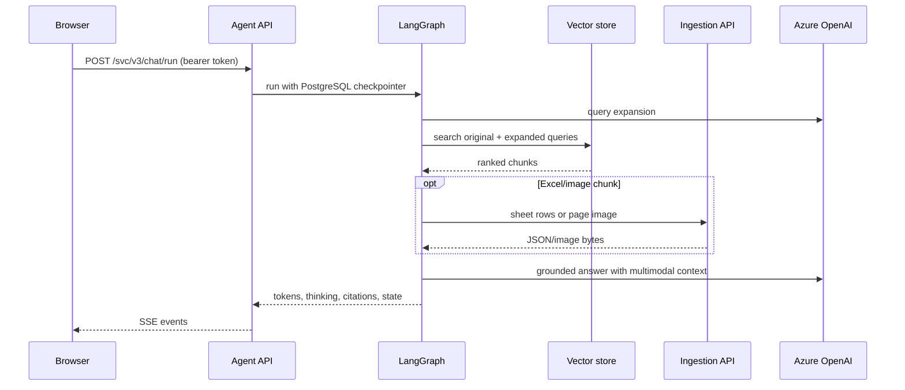

# API Contracts and Data Flows

> **Modular Knowledge Assistant** · design set → [README](README.md) · **you are here: API Contracts & Data Flows**

## 1. Contract principles

- Browser APIs are JSON or multipart HTTP, except `/svc/v3/chat/run`, which is an AG-UI event stream over SSE.
- The UI does not access object storage or vector databases directly.
- Internal read-side access to document source, images, and Excel rows goes through ingest-service APIs.
- Authentication is a bearer token when `AUTH_ENABLED=true`; local environment templates default to unauthenticated development mode.
- Vector metadata is a cross-service contract. Changes must be implemented together in ingestion indexers and agent readers.

## 2. Ingestion REST API

| Method | Path | Request | Response / behavior |
| --- | --- | --- | --- |
| `GET` | `/health` | — | `{ "ok": true }` |
| `POST` | `/svc/v3/docs/uploads` | Multipart `file`; optional `namespace`, `metadata_json`, `file_id`, `operation_type` | `202` job status; API publishes asynchronous work. |
| `GET` | `/svc/v3/docs/jobs` | — | Job status array. |
| `GET` | `/svc/v3/docs/jobs/{job_id}` | — | One job status. |
| `DELETE` | `/svc/v3/docs/jobs/{job_id}` | — | `202`; begins cleanup and returns deletion state. |
| `GET` | `/svc/v3/docs/documents` | — | Active document summaries. |
| `GET` | `/svc/v3/docs/documents/{document_id}` | — | Document detail. |
| `GET` | `/svc/v3/docs/documents/{document_id}/source` | — | Inline original source object. |
| `GET` | `/svc/v3/docs/documents/{document_id}/pages/{page}/image` | — | Inline rendered page/slide image. |
| `GET` | `/svc/v3/docs/documents/{document_id}/sheets/{sheet_name}` | — | JSON rows for the requested spreadsheet sheet. |
| `GET` | `/svc/v3/docs/content` | Query parameters | Content lookup/inline storage response. |
| `POST` | `/svc/v3/docs/ingest-from-storage` | `clean_index` required query parameter | `202`; storage scan/re-index operation. |

### Identifier model (read this before the asset endpoints)

Three identifiers appear across the APIs; they are **not** interchangeable:

| Identifier | Scope | Used by |
| --- | --- | --- |
| `file_id` | **Stable logical document** across versions (producer-supplied) | Dedup / update / delete routing |
| `job_id` | **One ingestion version** of that document | Vector metadata key, page-image keys (`page_images/{job_id}/{page}.png`), source object |
| `document_id` | Path parameter on the asset endpoints below | Resolves to the **active `job_id`** for that document |

> **Fix / clarification:** the asset routes (`/svc/v3/docs/documents/{document_id}/source|pages|sheets`) take a `document_id` that is the ingestion **`job_id`** carried on each retrieved chunk. The agent never guesses a storage path — it takes the chunk's `job_id` + `page`/`sheet_name` from vector metadata and calls these endpoints, so it needs no S3 credentials. `image_uri` in metadata is an **internal storage key**, not a client-facing URL; clients always resolve images through `/svc/v3/docs/documents/{job_id}/pages/{page}/image`.

### Job status shape

```json
{
  "job_id": "f4a8e2...",
  "file_name": "f4a8e2_report.pdf",
  "original_file_name": "report.pdf",
  "namespace": "policies",
  "status": "PROCESSING",
  "completion_event": false,
  "delete_requested": false,
  "error_message": null,
  "result": null,
  "created_at": "2026-07-28T09:45:00Z",
  "updated_at": "2026-07-28T09:45:10Z",
  "started_at": "2026-07-28T09:45:10Z",
  "completed_at": null
}
```

Terminal processing states are `COMPLETED`, `FAILED`, and `DELETED`; the UI also presents `FAILED_DELETE` as a failure while leaving it retriable. It polls every three seconds after a UI upload.

## 3. Agent REST and streaming API

| Method | Path | Purpose |
| --- | --- | --- |
| `POST` | `/svc/v3/chat/run` | AG-UI `RunAgentInput` request; returns encoded SSE event stream. |
| `POST` | `/svc/v3/threads` | Create a conversation before its first run. |
| `GET` | `/svc/v3/threads` | List conversation summaries. |
| `GET` | `/svc/v3/threads/{thread_id}` | Rehydrate messages, citation maps, source panel, and voice summaries. |
| `DELETE` | `/svc/v3/threads/{thread_id}` | Tombstone; background sweeper deletes graph checkpoint then record. |
| `POST`/`GET` | `/svc/v3/settings` | Create/list prompt configuration versions. |
| `GET` | `/svc/v3/settings/active` | Read active configuration version. |
| `GET` | `/svc/v3/settings/{version}` | Read a specific version. |
| `POST` | `/svc/v3/settings/{version}/activate` | Make a configuration active for newly created/pinned conversations. |
| `POST` | `/svc/v3/speech-to-text` | Multipart audio to text. |
| `POST` | `/svc/v3/text-to-speech` | Text to streamed `audio/mpeg`. |
| `GET` | `/svc/v3/auth/setup`, `/svc/v3/auth/status` | Frontend authentication initialization/status. |

### AG-UI request outline

The `@ag-ui/client` `HttpAgent` owns the concrete event protocol. At minimum, a client supplies the conversation `thread_id`, a unique `run_id`, user messages, and optional forwarded properties such as voice mode. The response is an SSE stream carrying standard AG-UI events plus custom events for `turn_created`, `thinking_step`, and `citations`.

```json
{
  "threadId": "2ec3e4bb-...",
  "runId": "c12d8ef1-...",
  "messages": [
    { "id": "m-1", "role": "user", "content": "Summarize the policy highlights." }
  ],
  "forwardedProps": { "voiceMode": false }
}
```

## 4. End-to-end UI upload flow



## 5. End-to-end answer flow



## 6. Cross-service metadata contract

This is the crucial contract between vector writing and vector reading.

| Field | Producer | Consumer | Use |
| --- | --- | --- | --- |
| `job_id` | Ingestion | Agent | Asset lookup and grouping retrieved chunks by document. |
| `file_id` | Ingestion/external producer | Ingestion | Idempotency and document identity. |
| `source_uri` | Ingestion | Agent/UI | Human-readable file identity and source resolution. |
| `source_type` | Processor | Agent | Chooses text, Excel, or image context path. |
| `page` | PDF/slide processor | Agent/UI | Page citation and image URL. |
| `sheet_name` | Excel processor | Agent | Sheet API lookup and spreadsheet citation. |
| `image_uri` | Ingestion | Agent/UI | Indicates a rendered page/slide asset. |
| `namespace` | Upload/message | Vector adapters | Optional tenant/grouping filter. |
| `doc_summary` | Ingestion | Agent | One document-orientation block in assembled context. |

## 7. Vector configuration contract

The service configuration templates explicitly require:

```text
INGESTION_VECTOR_PROVIDER == AGENT_VECTOR_PROVIDER
AZURE_EMBEDDING_DEPLOYMENT and AZURE_EMBEDDING_DIMENSIONS match
Chroma: same persist_dir and collection name
Azure AI Search: same index name and compatible metadata schema
```

The agent validates vector configuration for `/svc/v3/chat/run`; ingestion validates it before accepting/running an ingest request. A rollout that changes embedding model or dimensions requires a controlled re-index, not an in-place configuration flip.

## 8. HTTP proxy contract

The UI Nginx configuration routes browser paths as follows:

| Browser path | Upstream |
| --- | --- |
| Static SPA paths | Nginx filesystem with SPA fallback |
| `/svc/v3/chat/run`, `/svc/v3/threads`, `/svc/v3/settings`, `/svc/v3/speech-to-text`, `/svc/v3/text-to-speech`, auth paths | `chat-service:6401` |
| `/svc/v3/docs/` | `ingest-service:6400` |

This proxy is part of the deployment contract: it must preserve SSE streaming headers and route precedence so `/svc/v3/docs/` never reaches the agent.
