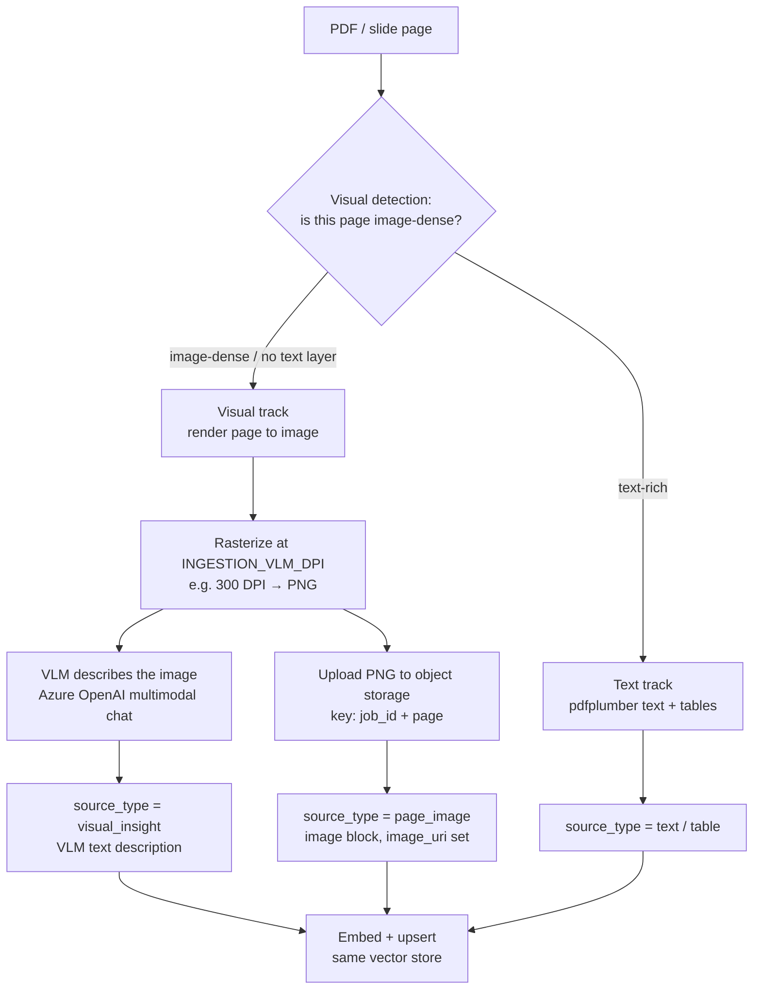
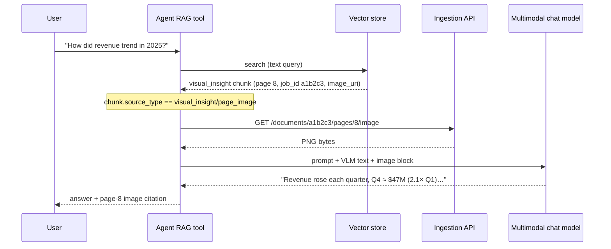

# Visual Extraction & VLM (Image-Dense PDFs)

> **Modular Knowledge Assistant** · design set → [README](README.md) · **you are here: Visual Extraction & VLM**
>
> Deep-dive companion to [02 — LLD Ingestion](02-lld-ingest-service.md). Explains how the ingestion pipeline handles **images inside PDFs/slides separately from text**, using a **Vision-Language Model (VLM)**, and how that visual knowledge becomes retrievable and citable.

---

## 0. Why this needs its own document

A naive RAG pipeline runs `pdfplumber` (or similar) over a PDF, gets text, chunks it, embeds it — done. That **silently loses** everything that isn't a text glyph:

- **Charts, diagrams, architecture figures, flow charts** — the "answer" is in the picture, not the caption.
- **Scanned / image-only PDFs** — there is *no* text layer at all; `pdfplumber` returns empty strings.
- **Screenshots, dashboards, infographics** — dense visual layouts where extracted text is jumbled and meaningless.
- **Tables rendered as images** — look like data, extract as nothing.

For an enterprise corpus these pages are common and often the most information-rich. So the pipeline treats **text extraction and visual extraction as two parallel tracks** and merges them into one vector space. This document is that second track.

---

## 1. Two extraction tracks, one vector space



**Key idea:** the visual track produces **two kinds of chunk** for the same page — a *searchable text description* (`visual_insight`) and a *renderable image reference* (`page_image`). One makes the page **findable**; the other makes the answer **groundable and citable with the actual picture**.

---

## 2. Step 1 — Visual detection (deciding a page is "image-dense")

VLM calls cost money and latency, so the pipeline **does not** send every page to the VLM. It first classifies each page using cheap, local signals from `pdfplumber` page inspection.

### The heuristic

For each page, inspect:

| Signal | How it's measured | What it indicates |
| --- | --- | --- |
| **Extractable text length** | `len(page.extract_text())` | Near-zero → likely scanned or image-only |
| **Text coverage ratio** | text-box area ÷ page area | Low → sparse text, visual layout |
| **Image object count / area** | `page.images` bounding boxes | Large image objects dominating the page |
| **Vector-graphic density** | count of `rects` / `curves` / `lines` | Charts, diagrams, flow charts |

A page is routed to the **visual track** when (illustrative thresholds — tune per corpus):

```text
image_dense(page) :=
      text_len < MIN_TEXT_CHARS            # e.g. < 40 chars  → scanned/blank text layer
   OR text_coverage < MIN_TEXT_COVERAGE    # e.g. < 15% of page area
   OR image_area_ratio > MAX_IMAGE_RATIO   # e.g. a figure covering > 50% of the page
   OR graphic_density  > MAX_GRAPHIC_DENSITY # many vector shapes → chart/diagram
```

> Text-rich pages still run the text track **only** (cheap). Image-dense pages run the visual track. **Mixed pages** (a paragraph + a chart) can run **both** — text chunks *and* a `visual_insight` for the figure — so nothing is lost. Detection is gated globally by `INGESTION_ENABLE_VLM`; when disabled, image-dense pages fall back to whatever text (if any) was extractable.

---

## 3. Step 2 — Render the page to an image

Once a page is flagged image-dense, it is **rasterized** — the whole page is drawn to a PNG at a configured resolution:

- **`INGESTION_VLM_DPI`** (template default `300`) controls fidelity. Higher DPI = sharper small text/labels in charts, but larger files and slower VLM calls. 300 DPI is the sweet spot for readable chart labels without bloating storage.
- The PNG is uploaded to object storage at a deterministic key: **`page_images/{job_id}/{page}.png`** (note the key is `job_id`-scoped, so re-ingesting a document under a new `job_id` never collides with the old images).

This rendered image is reused twice: as the **VLM input** (to generate a description) and as the **`page_image` artifact** (served to the model/UI at answer time).

---

## 4. Step 3 — VLM description → `visual_insight`

The rendered PNG is sent to the **VLM** (the same Azure OpenAI multimodal chat deployment used elsewhere — no separate provider) with a structured extraction prompt. The goal is a **dense, retrieval-friendly text description** of everything the image conveys.

### Example VLM prompt (design intent)

```text
You are extracting knowledge from a document page image for a search index.
Describe ALL information present so it can be retrieved by a text query:
- Transcribe any visible text, labels, axis titles, legends, and numbers verbatim.
- Describe charts/diagrams: type, what each axis/series means, and the trend or takeaway.
- Describe tables rendered as images row by row.
- State the single most important insight of this page in one sentence.
Do not speculate beyond what is visible.
```

### Example: a revenue bar chart page

**Rendered page:** a bar chart titled "Quarterly Revenue 2025", four bars.

**VLM output (becomes the `visual_insight` chunk text):**

```text
Bar chart titled "Quarterly Revenue 2025". X-axis: quarters Q1–Q4.
Y-axis: revenue in USD millions (0–50). Values: Q1 ≈ 22M, Q2 ≈ 28M,
Q3 ≈ 35M, Q4 ≈ 47M. Clear upward trend across the year; Q4 is the
highest, roughly 2.1× Q1. Takeaway: revenue grew steadily each quarter,
accelerating in H2 2025.
```

That text is what gets **embedded and made searchable** — so a query like *"how did revenue trend in 2025?"* now retrieves this page even though the source PDF had **zero extractable text** for it.

---

## 5. Step 4 — The `page_image` chunk (multimodal grounding)

Alongside the `visual_insight` text chunk, the pipeline emits a **`page_image`** chunk whose metadata carries `image_uri`. At answer time the agent loads the **actual image** as a multimodal content block, so:

1. The model can **look at the real chart** (not just its description) before answering — reducing hallucination on visual detail.
2. The UI can render the page image in the **source panel** as a visual citation.

> **Design choice:** the pipeline stores the **image and its text description**, and embeds only the **text**. It deliberately does *not* create CLIP-style image embeddings. Retrieval happens on the VLM's rich text; the image is fetched lazily by `job_id`+`page`. See [07 — Decision Log, ADR-13](07-decision-log.md).

---

## 6. The chunk types produced (canonical)

One image-dense page can yield **both** visual chunk types; a mixed page can yield all three families:

| `source_type` | Track | Embedded? | Carries | Role at answer time |
| --- | --- | --- | --- | --- |
| `text` | Text | ✅ (the text) | `page` | Plain page text |
| `table` | Text | ✅ (the text) | `page`, table metadata | Tabular text |
| `visual_insight` | Visual | ✅ (VLM description) | `page`, `image_uri` | **Makes the figure findable**; VLM text feeds the model |
| `page_image` | Visual | ✅ (short label/desc) | `page`, `image_uri` | **The actual image** loaded as a multimodal block + visual citation |
| `excel_summary` | (Excel) | ✅ (summary) | `sheet_name` | Sheet summary; rows fetched live via API |

`visual_insight` and `page_image` are **atomic** — they are **not** run through recursive character chunking (splitting a figure's description or an image reference would be meaningless). See [02 §5](02-lld-ingest-service.md).

### Example vector records for one image-dense page (page 8)

```json
[
  {
    "job_id": "a1b2c3", "file_id": "external-asset-12345",
    "source_uri": "uploads/a1b2c3_report.pdf", "source_type": "visual_insight",
    "namespace": "policies", "page": 8, "chunk_index": 17,
    "image_uri": "page_images/a1b2c3/8.png",
    "text": "Bar chart 'Quarterly Revenue 2025' … Q4 ≈ 47M; steady upward trend.",
    "doc_summary": "FY2025 financial performance report"
  },
  {
    "job_id": "a1b2c3", "file_id": "external-asset-12345",
    "source_uri": "uploads/a1b2c3_report.pdf", "source_type": "page_image",
    "namespace": "policies", "page": 8, "chunk_index": 18,
    "image_uri": "page_images/a1b2c3/8.png",
    "text": "Page 8 image: Quarterly Revenue 2025 bar chart"
  }
]
```

---

## 7. How it flows through to a grounded answer



The `visual_insight` text is what **matched** the query; the `page_image` is what **grounds** the final answer and shows as a **citation** (`source_type = page_image` → the UI exposes the image/source view, per [03 §3](03-lld-agent-and-ui.md)).

---

## 8. Worked examples by page type

| Page in the PDF | Detection result | What the pipeline produces |
| --- | --- | --- |
| **A text page** (a policy paragraph) | text-rich | `text` chunks only (no VLM cost) |
| **A page with a paragraph + one chart** | mixed | `text` chunk(s) for the paragraph **+** `visual_insight` + `page_image` for the chart |
| **A full-page architecture diagram** | image-dense (low text, big image) | `visual_insight` (VLM describes boxes/arrows/flow) + `page_image` |
| **A scanned contract page** (no text layer) | image-dense (`text_len ≈ 0`) | render → VLM transcribes the visible text → `visual_insight` + `page_image` |
| **A table rendered as an image** | image-dense (image object, no selectable text) | VLM reads the table row-by-row into `visual_insight` + `page_image` |
| **A PPTX slide** | slide render path | slide image + VLM slide description (same two chunk types) |

---

## 9. Cost, latency & quality controls

| Lever | Effect | Guidance |
| --- | --- | --- |
| `INGESTION_ENABLE_VLM` | Master on/off for the visual track | Off by default; enable for image-heavy corpora |
| Detection thresholds | How aggressively pages go to VLM | Tighten to cut cost; loosen to capture more visuals |
| `INGESTION_VLM_DPI` | Render resolution (default 300) | ↑ for tiny chart labels/scans; ↓ to save storage/latency |
| VLM prompt | Description density & format | Keep it extraction-focused, verbatim on text/numbers |
| Batching / async | Throughput | VLM calls run in the worker thread; batch pages where possible |

**Failure isolation:** a VLM error on one page is recorded as a per-page **extraction issue** in the job `result` (see [02 §7.1](02-lld-ingest-service.md)) and does **not** fail the whole document — the text track and other pages still index.

---

## 10. Edge cases & gotchas

- **VLM disabled + scanned PDF** → the page yields little/no text and becomes effectively unsearchable. Detection should still log an extraction issue so the gap is visible (don't silently ship an empty page).
- **Over-triggering detection** on lightly-decorated text pages wastes VLM budget — monitor the visual-track hit rate.
- **DPI too low** → the VLM misreads small axis labels/numbers; **too high** → storage + latency blow up. 300 is the tested default.
- **Duplicate images across versions** → keys are `job_id`-scoped, so re-ingesting under a new `job_id` never overwrites the previous version's images (clean update/delete).
- **PII in images** (scanned IDs, signatures) → the VLM description and the stored PNG both carry sensitive content; apply the same redaction/retention policy as text (see [05 §7](05-technology-stack-and-operations.md) and observability redaction).

---

## 11. Key terms

| Term | Meaning |
| --- | --- |
| **VLM** | Vision-Language Model — here, the Azure OpenAI multimodal chat deployment that "reads" a page image. |
| **Visual detection** | The cheap local heuristic that decides whether a page needs the VLM. |
| **Rasterize / render** | Drawing a PDF/slide page to a PNG at a set DPI. |
| **`visual_insight`** | A chunk holding the VLM's *text description* of a page (searchable). |
| **`page_image`** | A chunk referencing the *actual page image* (`image_uri`) for multimodal grounding + citation. |
| **Atomic chunk** | A chunk that is never split by the character chunker (visual/excel units). |

---

## ✍️ Related
- Pipeline context: [02 — LLD Ingestion](02-lld-ingest-service.md) · Retrieval/citation of these chunks: [03 — LLD Agent](03-lld-agent-and-ui.md) · Why these choices: [07 — Decision Log](07-decision-log.md).
