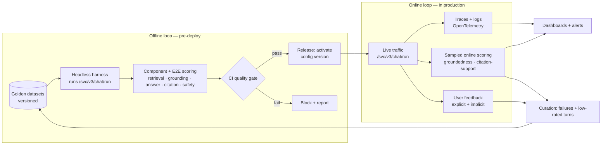
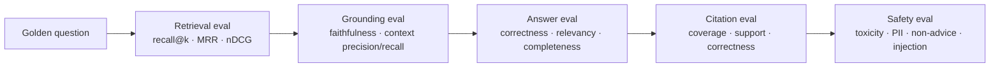
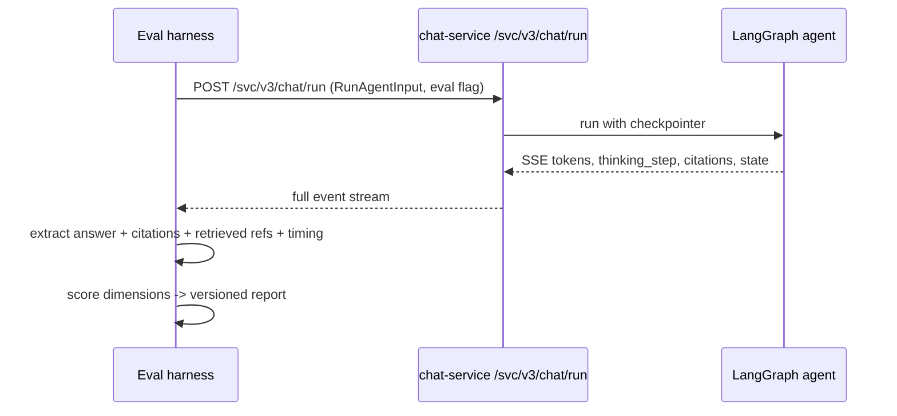
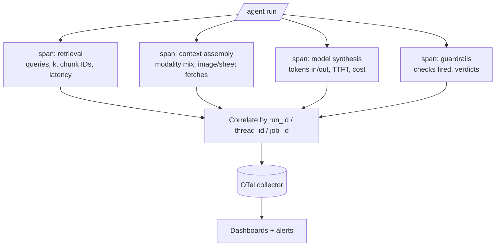
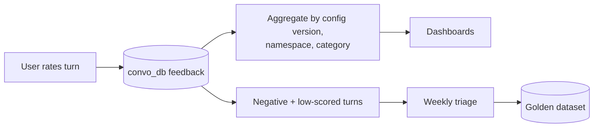
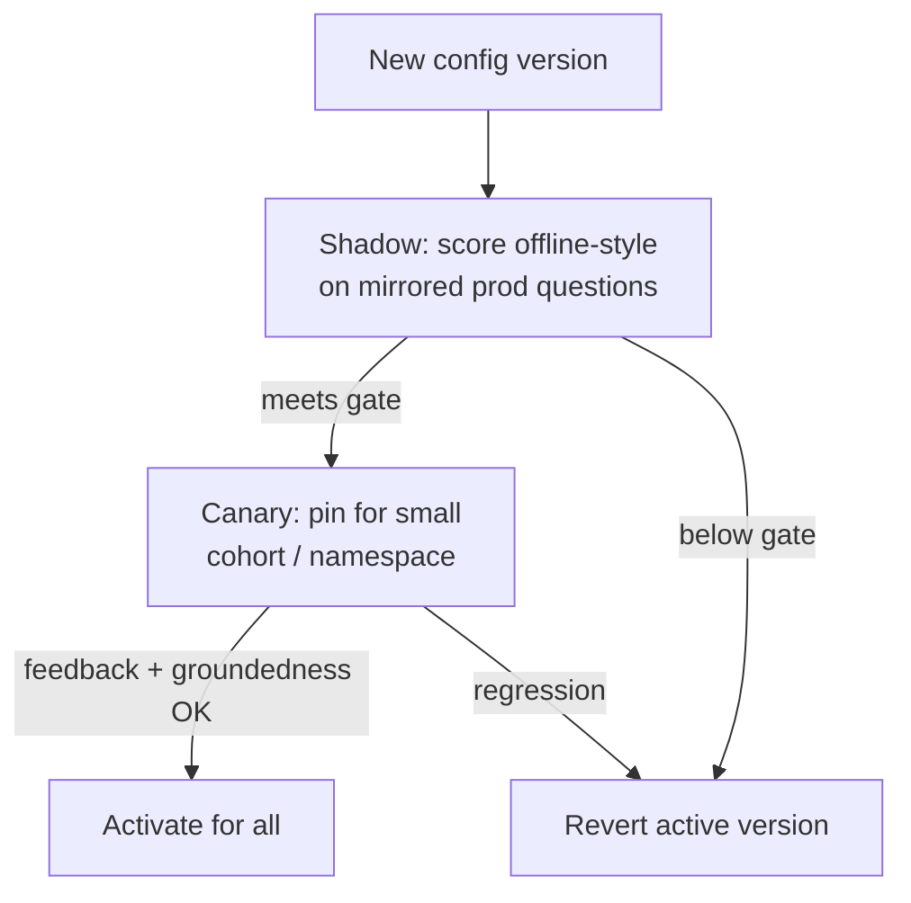
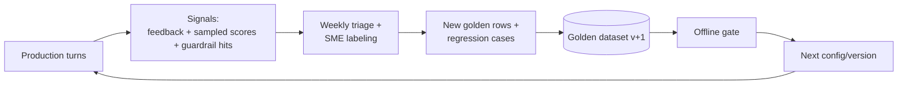

# Evaluation & Observability Proposal — Offline + Online

> **Modular Knowledge Assistant** · design set → [README](README.md) · **you are here: Eval Proposal**
>
> **Status:** 📝 Proposal for review · Extends the Phase-1 design note in [eval.md](eval.md)

---

## 0. TL;DR

The current plan ([eval.md](eval.md)) gives us a solid **offline, UI-run Phase-1 gate**. This proposal grows that into a **complete evaluation program with two loops that feed each other**:

- **Offline loop** — a versioned, headless harness that runs golden datasets against the real agent (via `/svc/v3/chat/run`, not only the UI), scores **retrieval, grounding, answer quality, citations, multimodal, and safety** independently, and gates every change in CI.
- **Online loop** — production telemetry, continuous **groundedness/citation sampling**, an **explicit + implicit user-feedback** pipeline, runtime guardrails, and **A/B + shadow rollout** built on the platform's existing **prompt-configuration versioning**.
- **The flywheel** — production failures and low-rated turns flow back into the golden set, so the offline gate keeps representing reality.

Everything hooks into seams the system already has: the `citations` event, `configuration` versions, the `feedback` store in `convo_db`, and the optional OpenTelemetry integration.

---

## 1. Goals & non-goals

### Goals
- Give a **trustworthy, repeatable quality signal** for a non-deterministic RAG agent — offline *and* in production.
- Evaluate **each stage** (retrieval → grounding → generation → citation → multimodal → safety), not just the final string, so failures are diagnosable.
- Make evaluation a **platform capability** reusable across agentic projects, not a one-off script.
- Close the loop: **production reality continuously refreshes the offline gate**.

### Non-goals
- Replacing human judgment for high-stakes review — we augment it, we don't remove it.
- Building a bespoke metrics library where DeepEval / Ragas already suffice.
- Model training/fine-tuning evaluation (out of scope until a tuning workflow exists).

---

## 2. The two-loop model



**Principle:** the offline loop proves a change is safe *before* it ships; the online loop proves it *stays* good and generates the next round of test cases. Neither is sufficient alone.

---

## 3. What we evaluate — quality dimensions mapped to this system

| Dimension | Question it answers | Where the signal comes from in *this* system |
|-----------|--------------------|-----------------------------------------------|
| **Retrieval quality** | Did we fetch the right chunks? | `search_knowledge_base` results, multi-query expansion, dedup'd chunk IDs, `top_k` |
| **Grounding / faithfulness** | Is the answer supported by retrieved context? | Assembled tool-message context vs. final answer |
| **Answer quality** | Correct, relevant, complete, well-formed? | Final synthesized answer (SSE token stream) |
| **Citation quality** | Are claims cited, and do citations actually support them? | The `citations` event + citation whitelist keyed by tool-call ID |
| **Multimodal correctness** | Right handling of text, Excel rows, page/slide images? | `source_type` = `text`/`table`/`excel_summary`/`visual_insight`/`page_image` |
| **Safety & policy** | Toxicity, PII leakage, out-of-scope advice, injection resistance? | Final answer + input; guardrail checks |
| **Operational** | Latency (TTFT/total), cost, error/timeout rate, refusal rate | Traces, token accounting, SSE timing |
| **Conversational** | Multi-turn coherence, correct use of pinned config, hydration integrity | LangGraph checkpoints + `convo_db` turn records |

---

## 4. Offline evaluation

### 4.1 Golden datasets

A layered dataset, versioned in git (small) or object storage (large/binary), each row carrying enough to score every dimension.

```json
{
  "id": "gold-0142",
  "namespace": "policies",
  "question": "What is the maximum reimbursable hotel rate for domestic travel under the 2024 policy?",
  "expected_answer": "$180 per night, capped at 5 nights without pre-approval.",
  "expected_facts": ["$180 per night", "5 nights", "pre-approval"],
  "must_cite": ["report.pdf#page=7"],
  "modality": "text",
  "category": "factual_lookup",
  "difficulty": "medium",
  "unanswerable": false
}
```

- **Coverage matrix:** modality (`text`, `table`, `excel`, `image/VLM`) × category (factual lookup, multi-hop, summarization, comparison, unanswerable/abstain) × difficulty.
- **Unanswerable rows are mandatory** — they test that the agent *abstains* instead of hallucinating (a core RAG failure mode).
- **Curation:** seed with SME-authored rows, expand with LLM-generated-then-human-verified questions over the real corpus, and grow continuously from production (see §6).
- **Hygiene:** dedup, decontaminate, PII-scrub, and pin a dataset version hash into every report.

### 4.2 Component-level scoring (the diagnostic layer)

Scoring only the final answer tells you *that* something broke, not *where*. We score each stage so regressions are attributable.



| Stage | Metrics | Tool | Notes |
|-------|---------|------|-------|
| **Retrieval** | recall@k, precision@k, MRR, nDCG, dedup rate | custom + Ragas `context_recall`/`context_precision` | Needs retrieved chunk IDs — see §4.5 (instrument the tool to emit them under an eval flag). |
| **Grounding** | faithfulness, groundedness (answer ⊆ context) | Ragas `faithfulness`, DeepEval | The high-value RAG metric; catches hallucination. |
| **Answer** | `geval_correctness`, `answer_relevancy`, completeness | DeepEval, Ragas | Extends the current Phase-1 gate. |
| **Citation** | citation coverage, **citation-support** (does the cited span back the claim?), citation correctness vs `must_cite` | custom (NLI/LLM-judge over `citations` whitelist) | Uses the metadata contract (`source_uri`, `page`, `sheet_name`). |
| **Multimodal** | Excel-row accuracy, image/VLM answer accuracy | custom, per `source_type` | Score only rows whose modality is exercised. |
| **Safety** | `toxicity`, `pii_leakage`, `non_advice`, injection-resistance | DeepEval + adversarial suite | See §4.6. |

### 4.3 End-to-end eval — headless, not UI-only

The Phase-1 note runs through the UI. We keep a **thin UI smoke suite** (Playwright + Page Objects) for the human-visible contract, but move the **bulk of scoring to the `/svc/v3/chat/run` API** headlessly:

- **Faster & cheaper** — no browser, parallelizable in CI.
- **Deterministic capture** — read the SSE stream directly: final answer, `citations` event, `thinking_step` events, and timing. No selector fragility.
- **Same real app** — still the deployed agent, same LangGraph path, same models.



UI suite stays for: streaming render, source-panel hydration after refresh, feedback controls, and the voice round-trip.

### 4.4 Metric gate & thresholds

Phase-1 keeps its curated gate; we add a **tiered** structure so we don't block on noisy secondary metrics.

| Tier | Metrics | Action on fail |
|------|---------|----------------|
| **Blocking gate** | groundedness/faithfulness, `geval_correctness`, `answer_relevancy`, `pii_leakage`, `toxicity`, citation-support | Fail CI, block release |
| **Warn (tracked, non-blocking)** | retrieval recall@k, completeness, latency p95, cost/query | Report + trend; promote to blocking as they stabilize |
| **Informational** | verbosity, expansion count, dedup rate | Dashboards only |

Thresholds are **config, not code**, and start conservative — tuned after a few real runs (per the Phase-1 principle). Every gate result is versioned with `{dataset_hash, config_version, model_deployment, commit}`.

### 4.5 One required instrumentation change

To score retrieval and grounding properly, the agent must be able to **expose retrieved chunk text/IDs to the evaluator** — today the UI only shows citations, which is why the Phase-1 note defers retrieval-internals scoring. Proposed minimal seam:

- Add an **eval-only response mode** (header/flag on `/svc/v3/chat/run`, gated to authenticated eval principals) that includes retrieved chunk IDs + the assembled context in a structured trailer event, **off by default** and never exposed to normal users.
- This unblocks faithfulness/context-recall offline *and* groundedness sampling online, with no change to the user-facing contract.

### 4.6 Adversarial & safety suite

A dedicated dataset (own rows, own pass criteria) run in CI and periodically in prod-shadow:
- **Prompt injection** via ingested documents (the borrower-doc analogue): a malicious chunk must not make the agent exfiltrate context or ignore its system prompt. Critical because ingestion accepts external content.
- **PII leakage** and **jailbreak** probes.
- **Out-of-scope / advice** refusal (`non_advice`).
- **Unanswerable** questions → must abstain with "not in the knowledge base."

---

## 5. Online evaluation

### 5.1 Telemetry & tracing

Turn on the optional OpenTelemetry-based observability integration and standardize spans across the request:



- Correlation IDs already exist (`run_id`, `thread_id`, `job_id`) — thread them through every span and log line (Loguru → structured).
- **Dashboards:** latency p50/p95/p99 + TTFT, cost/query and cost/conversation, token usage, error/timeout rate, retrieval empty-result rate, refusal rate, guardrail-hit rate, groundedness (sampled), feedback score.
- **Alerts:** groundedness drop, cost/latency regression, guardrail-hit surge (possible injection campaign), DLQ depth / oldest-message age on ingestion, empty-retrieval spike.

### 5.2 Continuous online scoring (sampled)

Run cheap async scorers on a **sample** of production traffic (e.g. 5–20%, plus 100% of low-feedback turns):
- **Groundedness / citation-support** on the live answer using the retrieved context (via the eval trailer from §4.5) — the single most important online health metric.
- **Refusal/abstention rate** — trending up may mean retrieval degraded; down may mean hallucination rising.
- **Answer-relevancy** LLM-judge on a smaller sample.
- Scores land in the same store and dashboards as offline, tagged `env=prod`.

### 5.3 User feedback loop

The UI already has **feedback** and it persists to `convo_db`. Formalize it as an eval signal:

| Signal | Type | Use |
|--------|------|-----|
| 👍 / 👎 + optional reason | Explicit | Primary online quality label; 100% of 👎 sampled for scoring + curation |
| Copied answer / clicked citation / opened source | Implicit-positive | Weak satisfaction signal |
| Regenerated / rephrased / abandoned turn | Implicit-negative | Weak dissatisfaction signal |
| Voice replay / follow-up depth | Engagement | Context for interpreting the above |



### 5.4 Runtime guardrails

Guardrails are an **online eval-and-act** layer wrapping every turn (composable, config-driven):
- **Input:** injection/PII detection on user + retrieved content (untrusted).
- **Output:** groundedness/citation check, PII-leak, policy (`non_advice`), schema where structured.
- **Action:** none in this read-only assistant beyond refusing/redacting — but the same layer is the seam if write-tools are ever added.
- Every guardrail decision is a span (§5.1) and a metric.

### 5.5 A/B & shadow rollout — the platform's best hook

The system already supports **versioned prompt configurations** with `activate` and per-conversation pinning. That is a ready-made experimentation surface:



- **Shadow:** replay recent prod questions against the candidate config, score, compare — zero user exposure.
- **Canary:** activate for a namespace/cohort; compare feedback + sampled groundedness vs. the incumbent.
- **Rollback = re-activating the previous version** — instant, no deploy. This is a strong safety property worth advertising.

---

## 6. The flywheel — closing the loop



Every real failure becomes a permanent regression test. The golden set is a **living asset** whose growth is driven by production, so the offline gate never drifts away from reality.

---

## 7. Metric reference (consolidated)

| Metric | Loop | Tier | Source / tool | Target (initial) |
|--------|:----:|:----:|---------------|------------------|
| Faithfulness / groundedness | Off + On | Blocking | Ragas / DeepEval | ≥ 0.90 |
| `geval_correctness` | Off | Blocking | DeepEval | ≥ 0.80 |
| `answer_relevancy` | Off + On | Blocking | Ragas | ≥ 0.85 |
| Citation-support | Off + On | Blocking | custom NLI/judge | ≥ 0.90 |
| `pii_leakage` | Off + On | Blocking | DeepEval | 0 leaks |
| `toxicity` | Off + On | Blocking | DeepEval | below threshold |
| `non_advice` | Off + On | Blocking | DeepEval | pass |
| Injection-resistance | Off | Blocking (safety suite) | adversarial suite | 100% resisted |
| Retrieval recall@k | Off | Warn→Block | custom / Ragas | ≥ 0.85 |
| Abstention correctness (unanswerable) | Off + On | Warn | custom | ≥ 0.90 |
| Latency p95 / TTFT | On | Warn | traces | SLO TBD |
| Cost / query | On | Warn | token accounting | budget TBD |
| Feedback 👍 rate | On | Info→KPI | `convo_db` | trend ↑ |
| Guardrail-hit rate | On | Alert | guardrail spans | anomaly-based |

---

## 8. Phased delivery

| Phase | Scope | Exit criteria |
|-------|-------|---------------|
| **P1 — Extend current (weeks 1–3)** | Keep UI smoke suite; add headless `/svc/v3/chat/run` harness; wire DeepEval+Ragas answer/safety gate into CI; versioned reports; golden v1 with unanswerable rows. | CI gate blocks a seeded regression; first versioned report published. |
| **P2 — Component + online telemetry (weeks 3–6)** | Eval trailer (§4.5); retrieval + grounding + citation-support scoring; enable OpenTelemetry spans + dashboards; formalize feedback signal. | Retrieval/grounding scored offline; live groundedness + feedback on a dashboard. |
| **P3 — Online scoring, A/B, flywheel (weeks 6–10)** | Sampled prod scoring; runtime guardrails; shadow+canary on config versions; weekly triage → golden growth. | A config change ships via canary with rollback; ≥1 flywheel cycle completed. |
| **P4 — Hardening (ongoing)** | Category-specific gates, cost SLOs, adversarial suite in prod-shadow, per-namespace tenanted reporting. | Gate tuned to <5% false-fail; SLOs enforced. |

---

## 9. Tooling & build-vs-buy

| Need | Recommendation | Rationale |
|------|----------------|-----------|
| Metric libraries | **Buy** — DeepEval + Ragas (already chosen) | Mature; don't reinvent faithfulness/relevancy. |
| Tracing | **Buy/adopt** — OpenTelemetry-based tracing | Already an optional integration; standardize it. |
| Golden store & report format | **Build (thin)** | Domain-specific; keep it a small versioned artifact. |
| Harness / orchestration | **Build (reusable core)** | The extractable shared package from the Phase-1 note. |
| Experimentation | **Reuse** existing config-versioning | No new infra needed for A/B. |
| Dashboards | **Buy** — OTel-compatible backend (Grafana/vendor) | Standard telemetry stack. |

---

## 10. Success criteria

- **No quality regression ships undetected** — every merge passes the versioned gate; a deliberately broken change is caught in CI.
- **Production groundedness is observable** — a live dashboard shows groundedness, citation-support, feedback, latency, and cost, with alerts.
- **Rollback in minutes** — a bad config version reverts via re-activation, proven in a drill.
- **The golden set grows from production** — ≥ N new curated rows/month sourced from real failures.
- **Reusable** — the harness runs on a second agentic project with only dataset + Page-Object changes.

---

## 11. Risks & mitigations

| Risk | Mitigation |
|------|------------|
| LLM-judge noise / bias | Repeat runs + aggregate; calibrate judges vs. human labels; prefer pairwise; pin judge model + prompt versions. |
| No retrieved-context visibility today | The eval-trailer seam (§4.5), off by default, auth-gated to eval principals. |
| Online scoring cost | Sample (not 100%); score 👎 fully; use cheaper judge models for online. |
| Golden-set staleness | The flywheel (§6) — production-driven growth + weekly triage. |
| Over-fitting to one metric | Tiered, multi-dimension gate; warn tier before blocking. |
| Config-versioning misused for A/B | Guardrail: canary requires a passing shadow score before activation. |
| Multimodal blind spots (Excel/VLM) | Modality coverage matrix is mandatory in the golden set. |

---

## 12. Ownership (RACI, indicative)

| Workstream | Responsible | Accountable | Consulted | Informed |
|-----------|-------------|-------------|-----------|----------|
| Harness & golden set | Eval/platform eng | Tech lead | SMEs | Product |
| CI gate & thresholds | Eval/platform eng | Tech lead | Backend | All eng |
| Telemetry & dashboards | Backend + DevOps | Tech lead | SRE | Product |
| Guardrails | Backend | Tech lead | Security/Compliance | Product |
| Feedback & triage flywheel | Product + SMEs | Product lead | Eval eng | All |

---

## Appendix A — Sample trace span (model synthesis)

```json
{
  "name": "agent.synthesis",
  "run_id": "c12d8ef1-...",
  "thread_id": "2ec3e4bb-...",
  "config_version": 7,
  "model_deployment": "gpt-4o-mini",
  "tokens_in": 3120,
  "tokens_out": 412,
  "ttft_ms": 640,
  "total_ms": 3180,
  "groundedness_sampled": 0.94,
  "guardrails": { "pii": "pass", "injection": "pass" }
}
```

## Appendix B — Sample feedback record (`convo_db`)

```json
{
  "thread_id": "2ec3e4bb-...",
  "turn_id": "t-9",
  "config_version": 7,
  "namespace": "policies",
  "rating": "down",
  "reason": "missed the pre-approval caveat",
  "answer_ref": "msg-42",
  "cited": ["report.pdf#page=7"],
  "queued_for_triage": true
}
```

## Appendix C — Example CI gate (pseudo)

```text
run_eval --dataset golden@v3 --target /svc/v3/chat/run --config-version candidate
  -> per-dimension scores + versioned report
gate:
  block if faithfulness < 0.90
        or geval_correctness < 0.80
        or answer_relevancy < 0.85
        or citation_support < 0.90
        or pii_leakage > 0
        or toxicity above threshold
        or injection_suite not fully resisted
  warn  if retrieval_recall@k < 0.85 or latency_p95 regressed > 15%
```
