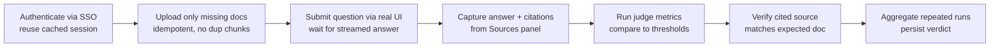

# AI Evaluation Framework

**Design Note & Implementation Plan**

> **Modular Knowledge Assistant** · design set → [README](README.md) · **you are here: Eval Framework (Phase 1)**
>
> **Status:** 🟡 Draft · **Scope:** Phase 1

---

## 1. Purpose

The agent is a **retrieval-augmented generation (RAG)** assistant, so its output is naturally **non-deterministic** — two runs against the same question may produce different wording. That makes classic equality-based testing a poor fit.

This framework answers one practical question:

> Given a curated **golden dataset**, does the deployed agent produce answers that are **correct, relevant, safe, and properly cited**?

The goal is to replace ad-hoc manual spot checks with a **repeatable evaluation workflow** that runs the same way every time, produces a **versioned result**, and shows where the system is getting better or worse over time.

---

## 2. Design principles

- **Test the real deployed app**, not a mock — so evaluation reflects the actual user experience.
- **Keep test files thin and declarative** — describe *what* to evaluate, not *how* the UI works.
- **Isolate UI selectors in Page Objects** — application changes don't cascade into every test.
- **Prefer established evaluation libraries** over custom metrics unless there's a clear gap.
- **Start with a realistic Phase 1 gate** — defer deeper retrieval-quality work until the UI/service exposes the needed context.

---

## 3. Scope

### ✅ Phase 1 — in scope

- Run golden-dataset questions against the **deployed UI**.
- Capture the **final answer** and the **citations** shown to the user.
- Score each answer using a curated set of **independent judge metrics**.
- Write a **versioned pass/fail result** with per-metric scores and a short failure summary.
- Provide a **runner** reusable across other agentic projects with minimal changes.

### 🚫 Phase 1 — explicitly out of scope

| Deferred | Why |
|----------|-----|
| Retrieval-internals scoring (faithfulness, hallucination vs. hidden chunks) | The UI does not expose that text yet. |
| Per-question metric tailoring | The first version should use **one consistent gate** before the taxonomy stabilizes. |
| Programmatic score capture via API | The first delivery is **UI-run** based. |

---

## 4. Proposed architecture

The framework is split into layers so that **intent**, **automation**, and **evaluation logic** stay cleanly separated.

```mermaid
flowchart TD
    GD[Golden dataset<br/>CSV / XLSX / JSON / YAML<br/>questions · expected answers · refs] --> TC[TestCases / eval<br/>thin files: which rows, which gate]
    TC --> FW[framework/<br/>orchestration · page objects · judge integration]
    FW --> RP[reports/<br/>versioned results · dashboard]
    FW -.extract later.-> PKG[Future shared package]
```



| Layer | Responsibility |
|-------|----------------|
| **Golden dataset** | Questions, expected answers, and reference documents in a simple file format (CSV, XLSX, JSON, or YAML). |
| **`TestCases/eval`** | Thin test files that describe which rows to run and which gate to apply. |
| **`framework/`** | Reusable engine: orchestration, Page Objects, and judge integration. |
| **`reports/`** | Versioned results and dashboard output for pass/fail review. |
| **Future package** | The reusable core is designed to be extracted later as a standalone shared package. |

**Why this layering:** if the **UI** changes, only the **Page Objects** update. If the **metric catalog** changes, only the **evaluator** changes — not the tests. If the **corpus** changes, only the **dataset** updates.

---

## 5. Execution flow



1. **Authenticate** with the deployed app using SSO; reuse the cached session where possible.
2. **Upload only missing documents** so repeated runs stay idempotent and don't create duplicate chunks.
3. **Submit each question** through the real UI and wait for the streamed answer to complete.
4. **Capture** the final answer text and the citations visible in the **Sources** section.
5. **Run the judge metrics** and compare the scores to the configured thresholds.
6. **Verify** that the cited source matches the expected document from the dataset.
7. **Aggregate** repeated runs into a single verdict and persist the result for reporting.

---

## 6. Metric gate for Phase 1

Phase 1 uses a curated quality gate focused on **factual accuracy, relevance, and basic safety**. The intent is not to judge every dimension of language quality at once — it's to establish a **stable, credible signal** for the use case first.

| Metric | Library | What it checks |
|--------|---------|----------------|
| `geval_correctness` | DeepEval | Whether the answer is factually correct. |
| `answer_relevancy` | Ragas | Whether the response actually addresses the question. |
| `toxicity` | DeepEval | Whether the answer contains harmful language. |
| `pii_leakage` | DeepEval | Whether personal data is exposed improperly. |
| `non_advice` | DeepEval | Whether the system avoids improper medical or legal advice. |

> The broader catalog may contain many more metrics, but only a **smaller subset** should act as the pass/fail gate for this phase. That keeps the signal understandable and limits false failures from overlapping or redundant metrics.

---

## 7. Implementation approach

- **Build a working thin slice first:** one dataset row, one upload strategy, one scoring path, one dashboard output.
- **Keep the first version simple** enough to run locally and in a CI-style environment without special ceremony.
- **Treat thresholds as configurable** and expect to tune them after a few real runs.
- **Log enough to debug failures**, but avoid over-collecting data.

---

## 8. Operational notes

A **single command entry point** is preferred so the run pattern is easy to remember and automate. The expected commands should cover login, test listing, per-row execution, whole-corpus execution, and dashboard generation.

```powershell
.\eval_run.ps1   # login · list tests · run row · run corpus · generate dashboard
```

---

## 9. Risks & mitigations

| Risk | Mitigation |
|------|------------|
| LLM variance causes score noise | Use **repeat runs** and aggregate results rather than relying on a single execution. |
| UI changes break selectors | Keep selectors in **Page Objects**; never inline them in tests. |
| Golden answers are inconsistent | **Clean the dataset early** so reference-based metrics don't fight bad data. |
| Overfitting to one metric | Use a **curated gate** rather than optimizing every available metric at once. |

---

## 10. Phase 2 plan

- Expose evaluation results through an **API or service**.
- Introduce **retrieval-grounded metrics** once the retrieved context is available to the evaluator.
- **Select metrics by question category** instead of applying the same gate to every row.
- Move **security and adversarial probes** into a dedicated suite with its own rows and pass criteria *(if applicable)*.
