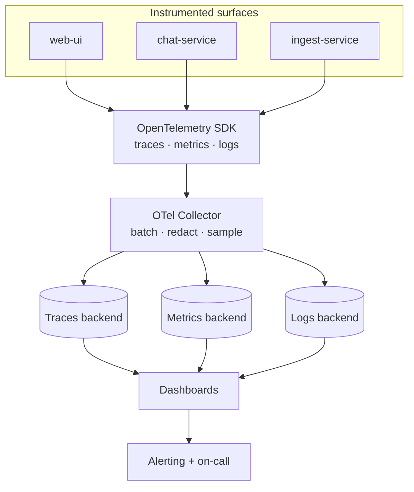
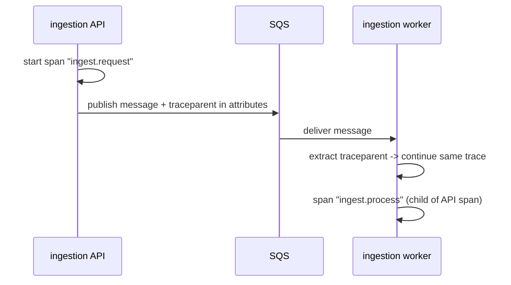
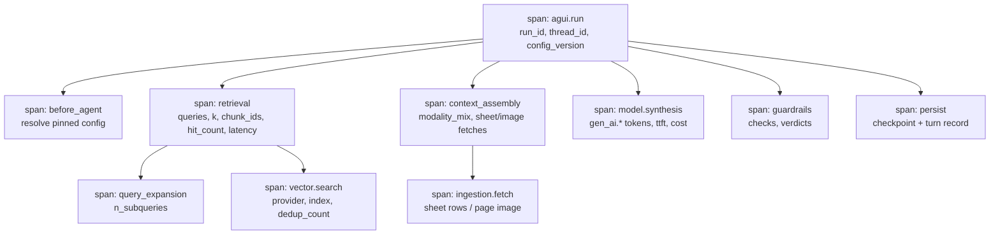
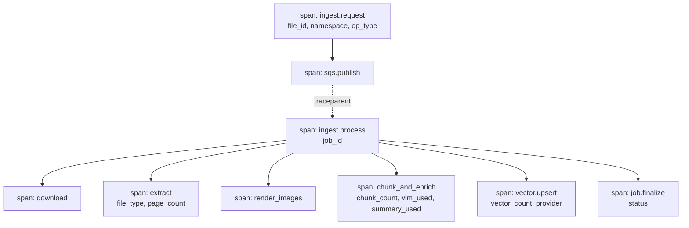
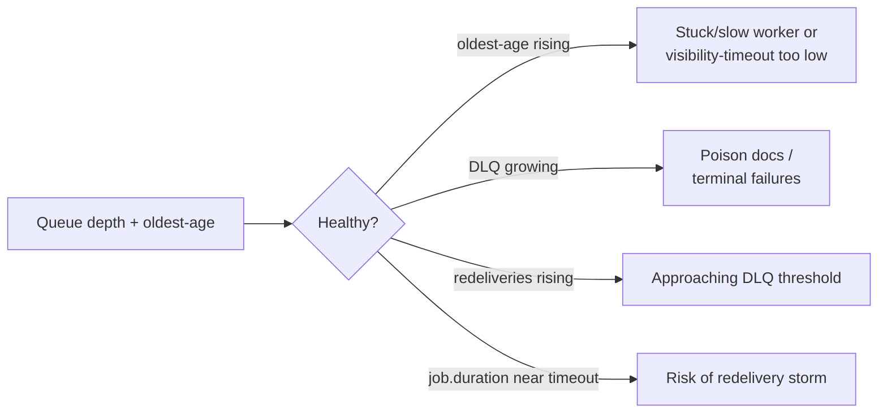
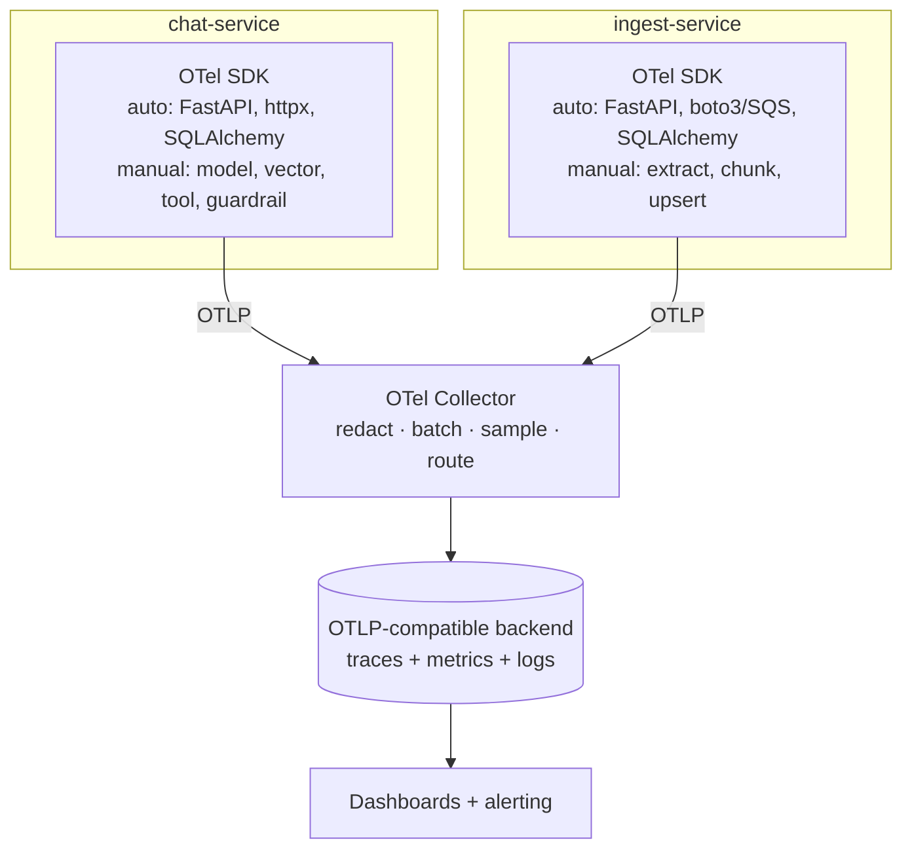

# Observability Proposal

> **Modular Knowledge Assistant** · design set → [README](README.md) · **you are here: Observability Proposal**
>
> **Status:** 📝 Proposal for review · Companion to [eval-proposal.md](eval-proposal.md) (online loop) and the ops baseline in [05-technology-stack-and-operations.md](05-technology-stack-and-operations.md)

---

## 0. TL;DR

Today the stack has **Loguru logs**, `/health` liveness, and an *optional* OpenTelemetry integration that bootstrap tolerates being absent. That is a floor, not a program. This proposal defines a **complete, vendor-neutral observability layer** for a two-service, async, LLM-driven system:

- **Three pillars + a fourth** — logs, metrics, traces, plus **LLM/agent semantics** (tokens, cost, TTFT, tool calls, retrieval, groundedness).
- **One correlation spine** — `run_id` · `thread_id` · `job_id` · `config_version` · `namespace` threaded through every log, span, and metric, and **propagated across the HTTP → SQS → worker boundary**.
- **Standardize on OpenTelemetry (OTLP)** with the **GenAI semantic conventions**, exported to any OTLP-compatible backend — no lock-in.
- **SLIs/SLOs, a dashboard set per persona, and an alert catalog** that make the system's real failure modes (empty retrieval, DLQ growth, hallucination drift, cost spikes) visible before users feel them.
- **PII-safe by design** — redaction at the SDK boundary so prompts/answers never leak into telemetry.

It is the *instrumentation* half of the [eval-proposal](eval-proposal.md)'s online loop: eval decides "is it good?"; observability decides "is it healthy, and where did it break?"

---

## 1. Goals & non-goals

### Goals
- Answer, for any request, **"what happened and where did the time/cost/error go?"** in one trace.
- Make the **async ingestion pipeline** (SQS, worker, DLQ) as observable as the synchronous read path.
- Surface **LLM-specific health** — cost, latency, token usage, retrieval quality, groundedness — not just HTTP 200s.
- Stay **vendor-neutral** (OTel/OTLP) and **PII-safe**.
- Keep observability **cheap and sampled**, not a second cost center.

### Non-goals
- Choosing a specific commercial backend (the design targets any OTLP endpoint).
- Re-deriving quality scoring — that lives in [eval-proposal.md](eval-proposal.md); here we *emit* the signals it consumes.
- Deep infra/host monitoring beyond what the services and their dependencies expose.

---

## 2. Observability model



Four signal types, one pipeline:

| Signal | Answers | Primary consumers |
|--------|---------|-------------------|
| **Traces** | Where did latency/errors happen across services? | On-call, backend eng |
| **Metrics** | Is the system healthy over time? Trends, SLOs. | On-call, SRE, product |
| **Logs** | What exactly happened on this request? (with correlation IDs) | Debugging |
| **LLM/agent semantics** | Cost, tokens, TTFT, retrieval quality, groundedness | Eval, product, cost owners |

---

## 3. Correlation spine & context propagation

The single most valuable thing we can do is make every signal joinable. **One set of IDs, everywhere.**

| ID / attribute | Source | Why it matters |
|----------------|--------|----------------|
| `trace_id` / `span_id` | OTel | Ties all spans of one request together. |
| `run_id` | agent `/svc/v3/chat/run` | One agent turn. |
| `thread_id` | conversation | Joins a multi-turn conversation. |
| `job_id` | ingestion | One document-processing attempt. |
| `file_id` | producer | Document identity across versions (idempotency). |
| `config_version` | pinned prompt config | Attributes quality/cost to a specific config (A/B). |
| `namespace` | upload/message | Tenant/grouping dimension for all metrics. |

**Cross-boundary propagation is the hard part.** The write path crosses a queue, so trace context must ride the SQS message:



Inject W3C `traceparent` into SQS **message attributes** on publish; extract on consume. Result: a single trace spans upload → queue → worker → vector upsert, even though they're different processes.

---

## 4. Tracing — span taxonomy

### 4.1 Read path (agent `/svc/v3/chat/run`)



### 4.2 Write path (ingestion)



Every span carries the correlation spine (§3). Errors set span status + an event with a **redacted** message. Model and vector calls are always explicit spans — they are the latency and cost drivers.

---

## 5. Metrics

### 5.1 Service health — RED (request-level)

| Metric | Type | Key labels |
|--------|------|------------|
| `http.server.requests` | counter | route, method, status, service |
| `http.server.duration` | histogram (p50/p95/p99) | route, service |
| `http.server.errors` | counter | route, status_class, service |
| `agui.run.active` | gauge | — (concurrent runs; ties to the per-conversation run lock) |
| `agui.run.rejected_409` | counter | reason (concurrent run) |

### 5.2 LLM / agent semantics

| Metric | Type | Labels | Notes |
|--------|------|--------|-------|
| `gen_ai.client.token.usage` | counter | model, direction (in/out), config_version | Cost driver. |
| `gen_ai.client.operation.duration` | histogram | model, operation | Model latency. |
| `agent.ttft` | histogram | model | Time-to-first-token (UX). |
| `agent.cost.usd` | counter | model, namespace, config_version, feature | Cost per query/conversation/tenant. |
| `agent.retrieval.hit_count` | histogram | provider | 0 hits = empty-retrieval signal. |
| `agent.retrieval.empty` | counter | namespace | Leading indicator of quality drop. |
| `agent.query_expansion.count` | histogram | — | Cost/latency of multi-query. |
| `agent.groundedness.sampled` | histogram | config_version | From eval online sampler. |
| `agent.refusal` | counter | reason | Abstention rate. |
| `agent.guardrail.hit` | counter | type, verdict | Injection/PII/policy. |
| `agent.feedback` | counter | rating, config_version | From `convo_db`. |

### 5.3 Ingestion pipeline (async)

| Metric | Type | Labels | Why |
|--------|------|--------|-----|
| `ingest.queue.depth` | gauge | queue | Backlog. |
| `ingest.queue.oldest_age_seconds` | gauge | queue | **Best leading indicator of a stuck pipeline.** |
| `ingest.dlq.depth` | gauge | — | Poison messages / terminal failures. |
| `ingest.message.redeliveries` | histogram | — | Approaching DLQ threshold. |
| `ingest.job.duration` | histogram | file_type | Must stay well under SQS visibility timeout. |
| `ingest.job.transitions` | counter | from_state, to_state | Funnel: QUEUED→PROCESSING→COMPLETED/FAILED. |
| `ingest.vector.upsert_count` | histogram | provider | Throughput. |

### 5.4 Dependencies — USE (saturation/errors)

Model API (rate-limit/429s, latency), vector store (latency, errors), Postgres (pool saturation on the three DBs), object storage (latency/errors), SQS (throttling). Prefer OTel auto-instrumentation for HTTP client, SQLAlchemy, and the AWS SDK so most of this is free.

---

## 6. Logs

- **Structured JSON** from Loguru in both services, every line carrying the correlation spine (§3) so logs join to traces by `trace_id`.
- **Levels with intent:** `INFO` for lifecycle/state transitions, `WARNING` for degraded-but-handled (retry, empty retrieval, guardrail modify), `ERROR` for failed turns/jobs. Avoid `DEBUG` in prod except behind a per-request debug flag.
- **Redaction at the logging boundary** (§9): never log full prompts, answers, retrieved chunk text, or document content — log IDs, counts, and hashes.
- **Sampling:** log 100% of errors and a sample of successful requests to control volume/cost.
- **Retention:** short hot retention (searchable) + cheaper cold archive; set per data-classification.

---

## 7. LLM/agent-specific observability (the fourth pillar)

Standard APM misses the things that actually matter for a RAG agent. Adopt the **OpenTelemetry GenAI semantic conventions** (`gen_ai.*`) so model spans are portable, and add domain spans/metrics:

- **Cost & tokens** per model call, aggregated to per-query / per-conversation / per-namespace / per-config_version — the levers for cost control.
- **TTFT and total latency** separately — SSE UX is about first token, batch is about total.
- **Tool-call telemetry** — `search_knowledge_base` invocations, expansion count, dedup count, hit count. A spike in expansion or a rise in empty retrieval is an early quality warning.
- **Retrieval → grounding link** — emit retrieved chunk IDs (via the eval trailer from [eval-proposal §4.5](eval-proposal.md)) so the online sampler can score groundedness/citation-support and publish `agent.groundedness.sampled`.
- **Guardrail events** as first-class metrics — a surge in guardrail hits may indicate a prompt-injection campaign via ingested documents.
- **Config attribution** — every quality/cost/latency signal is tagged with `config_version`, which turns the platform's prompt-versioning into a live experiment readout.

---

## 8. Ingestion pipeline observability

The async write path is where silent failures hide. Make it loud:



Key guardrails to alert on: **oldest-message age** (the single best "pipeline is stuck" signal), **DLQ depth**, **redelivery counts**, and **job duration vs. visibility timeout** (job time must stay safely under it, or SQS will redeliver mid-processing). Also track the **job-state funnel** so a rising FAILED rate is visible per file type.

---

## 9. Data governance — PII-safe telemetry

Non-negotiable for document RAG, where inputs may contain sensitive content:

- **Redact at the SDK/collector boundary** — a processor strips or hashes prompt text, answer text, retrieved chunk content, and document bodies before export. Telemetry keeps **IDs, counts, durations, scores, and hashes**, never raw content.
- **Allow-list attributes**, don't block-list — only explicitly approved fields leave the process.
- **No PII in metric labels** (high-cardinality + leak risk) — `namespace` yes, user identifiers no (or hashed).
- **Retention & access** tiered by classification; telemetry stores inherit the same access controls as the app.
- **Sampling** reduces both cost and exposure surface.

---

## 10. SLIs / SLOs / error budgets

| SLI | SLO (initial) | Error budget use |
|-----|---------------|------------------|
| Agent availability (`/svc/v3/chat/run` success) | 99.5% | Gate risky config activations. |
| Chat TTFT p95 | < 1.5 s | UX regressions block release. |
| Answer total latency p95 | < 6 s | Tune top-k / model tier. |
| Groundedness (sampled) | ≥ 0.90 | Drop triggers investigation + rollback. |
| Ingestion job success rate | ≥ 98% | Excludes user-caused terminal errors. |
| Ingestion oldest-message age | < 10 min | Pipeline-stuck alert. |
| Cost per conversation | ≤ budget (TBD) | Cost-control review. |

SLOs are starting points; tune after a baseline period. Burn-rate alerts on the availability and groundedness SLOs.

---

## 11. Dashboards (by persona)

| Dashboard | Audience | Panels |
|-----------|----------|--------|
| **Agent health** | On-call | Availability, TTFT/latency p50-p99, error rate, active/rejected runs, model 429s |
| **Ingestion health** | On-call | Queue depth, oldest-age, DLQ depth, redeliveries, job funnel, job duration by file type |
| **Quality** | Eval + product | Sampled groundedness, citation-support, refusal rate, empty-retrieval rate, feedback 👍/👎 — sliced by `config_version` |
| **Cost** | Cost owners | Cost/query, cost/conversation, tokens by model, cost by namespace and config_version |
| **Experiment (A/B)** | Tech lead + product | Incumbent vs. candidate config: groundedness, feedback, latency, cost side by side |

---

## 12. Alert catalog

| Alert | Condition | Severity | Action |
|-------|-----------|----------|--------|
| Agent availability breach | success < SLO (burn-rate) | High | Page on-call; consider config rollback |
| TTFT/latency regression | p95 > SLO for 10 min | Medium | Check model provider + retrieval |
| Model rate-limit surge | 429 rate up | Medium | Backoff/capacity; degrade gracefully |
| Empty-retrieval spike | `agent.retrieval.empty` up | Medium | Check index health / re-index drift |
| Groundedness drop | sampled < 0.90 | High | Investigate; rollback config version |
| Guardrail-hit surge | injection/PII hits up | High | Possible attack via ingested docs; review |
| Cost spike | cost/query above budget | Medium | Inspect heavy namespaces/config |
| Ingestion stuck | oldest-age > 10 min | High | Check worker/visibility timeout |
| DLQ growth | dlq.depth > 0 rising | High | Inspect poison docs; reprocess/quarantine |

---

## 13. Architecture & integration



- **Auto-instrumentation** covers HTTP server/client, SQLAlchemy (the three Postgres DBs), and the AWS SDK (SQS/S3) with near-zero code.
- **Manual spans** for model synthesis, vector search, `search_knowledge_base`, context assembly, and guardrails — the domain-specific, high-value parts.
- **The Collector** is where redaction, batching, sampling, and routing live — so services stay simple and backend choice stays swappable.
- Turn the existing optional integration into a **standard, enabled-by-default (in prod) OTel setup**; keep it tolerant of a missing collector for local dev.

---

## 14. Tooling & build-vs-buy

| Need | Recommendation | Rationale |
|------|----------------|-----------|
| Instrumentation API/SDK | **Adopt** OpenTelemetry + GenAI semconv | Vendor-neutral standard; portable spans. |
| Collector/redaction/sampling | **Adopt** OTel Collector | Keeps services simple; central policy. |
| Backend (traces/metrics/logs) | **Buy/adopt** any OTLP-compatible backend | No lock-in; pick on cost/ops. |
| LLM cost/quality attribution | **Build (thin)** on top of spans | Domain-specific aggregation. |
| Dashboards & alerts | **Buy/adopt** with the backend | Standard tooling. |

Bias: **adopt the open standard, build only the domain-specific aggregation.**

---

## 15. Phased rollout

| Phase | Scope | Exit criteria |
|-------|-------|---------------|
| **P1 — Foundation** | OTel SDK in both services; auto-instrumentation; correlation spine in logs + spans; structured logging + redaction; `/health` + readiness. | One request traced end-to-end; logs join by `trace_id`. |
| **P2 — Async + LLM semantics** | Trace context across SQS; manual model/vector/tool spans; token/cost/TTFT metrics; ingestion queue metrics. | A single trace spans upload→worker→upsert; cost/latency dashboards live. |
| **P3 — Quality + SLOs** | Groundedness/guardrail/feedback metrics; SLOs + burn-rate alerts; per-persona dashboards; A/B experiment dashboard. | Groundedness + cost visible per `config_version`; alerts firing correctly in a drill. |
| **P4 — Hardening** | Sampling tuning, cost of observability review, retention/access policy, synthetic canaries. | Telemetry cost within budget; redaction audited. |

---

## 16. Success criteria

- **Any request is explainable from one trace** across both services.
- **The async pipeline is not a black box** — stuck/DLQ/latency states alert before users notice.
- **Cost and groundedness are visible per `config_version`**, making rollout decisions data-driven.
- **No raw prompt/answer/document content** ever appears in telemetry (audited).
- **Backend is swappable** — changing the OTLP backend requires no service code change.

---

## 17. Risks & mitigations

| Risk | Mitigation |
|------|------------|
| PII leaking into traces/logs | Allow-list attributes + redaction processor in the Collector; audit. |
| Observability cost/volume blowup | Sampling (100% errors, sampled success); short hot retention + cold archive. |
| High-cardinality labels (e.g., IDs as labels) | IDs go on spans/logs, **not** metric labels; only bounded dimensions labelled. |
| Trace context lost across SQS | Inject/extract `traceparent` in message attributes; test the joined trace. |
| Instrumentation drift as code changes | Keep manual spans close to the seams; add a smoke test asserting key spans exist. |
| Vendor lock-in | OTLP + Collector; backend behind a swappable exporter. |

---

## Appendix A — Model-synthesis span (GenAI semantic conventions)

```json
{
  "name": "model.synthesis",
  "trace_id": "a1b2c3...",
  "run_id": "c12d8ef1-...",
  "thread_id": "2ec3e4bb-...",
  "config_version": 7,
  "namespace": "policies",
  "gen_ai.system": "azure_openai",
  "gen_ai.request.model": "chat-deployment",
  "gen_ai.usage.input_tokens": 3120,
  "gen_ai.usage.output_tokens": 412,
  "agent.ttft_ms": 640,
  "duration_ms": 3180,
  "agent.cost_usd": 0.0021,
  "status": "OK"
}
```

## Appendix B — Structured log line (redacted, correlated)

```json
{
  "ts": "2026-07-28T09:45:10Z",
  "level": "INFO",
  "service": "chat-service",
  "event": "retrieval.completed",
  "trace_id": "a1b2c3...",
  "run_id": "c12d8ef1-...",
  "thread_id": "2ec3e4bb-...",
  "namespace": "policies",
  "queries": 4,
  "hit_count": 11,
  "dedup_count": 3,
  "latency_ms": 210,
  "note": "no prompt or chunk text logged"
}
```

## Appendix C — Example alert rules (pseudo / PromQL-style)

```text
# Ingestion stuck
ingest_queue_oldest_age_seconds > 600  for 5m  -> severity: high

# Groundedness drop (burn-rate style)
avg_over_time(agent_groundedness_sampled[15m]) < 0.90  -> severity: high

# Model rate-limit surge
rate(gen_ai_client_errors{code="429"}[5m]) > threshold  -> severity: medium

# DLQ growth
increase(ingest_dlq_depth[10m]) > 0  -> severity: high
```
