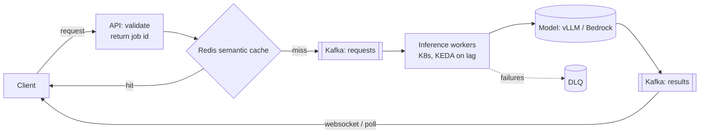
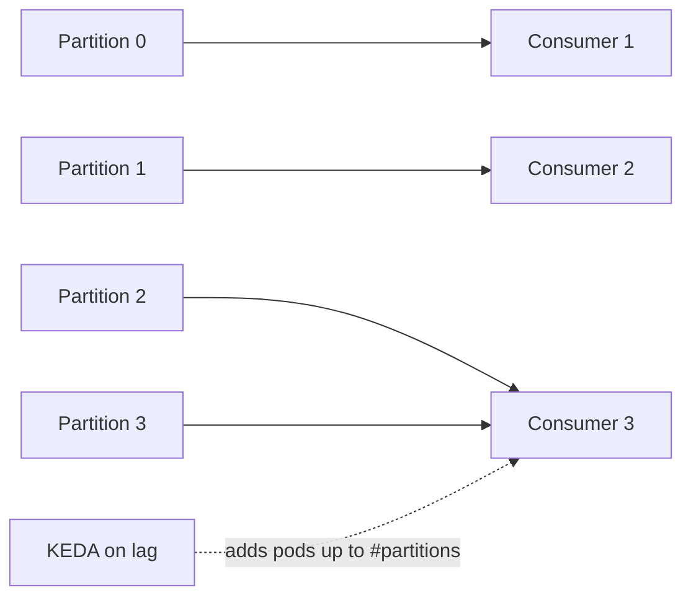
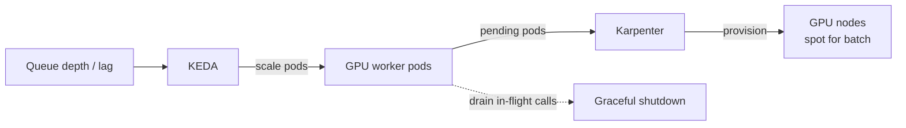
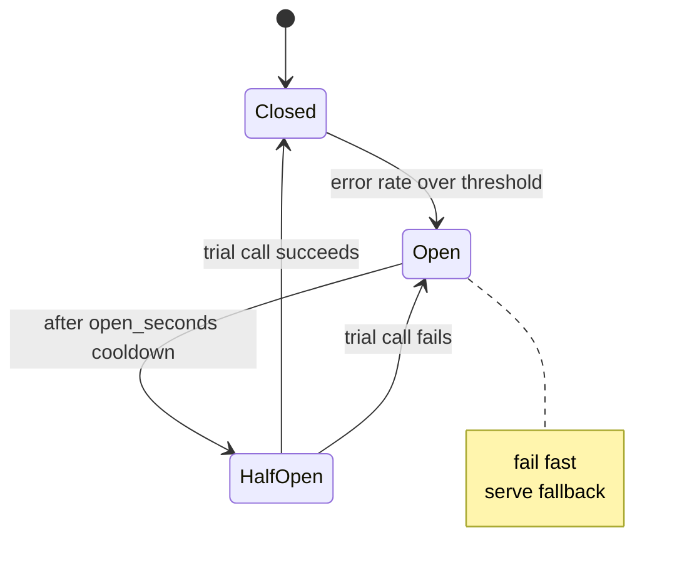
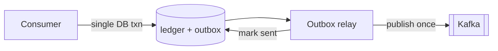
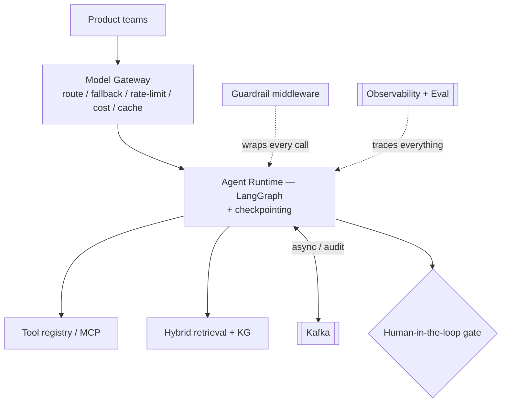
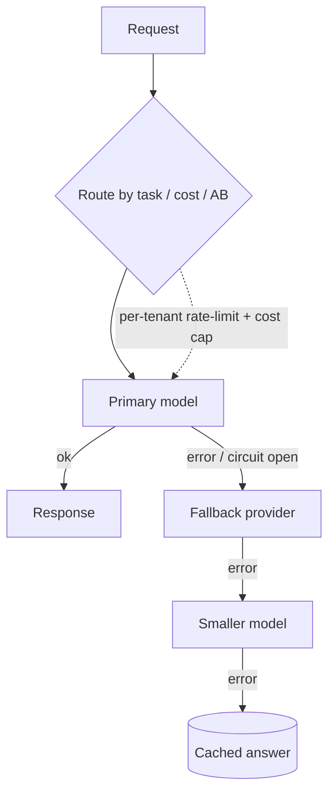
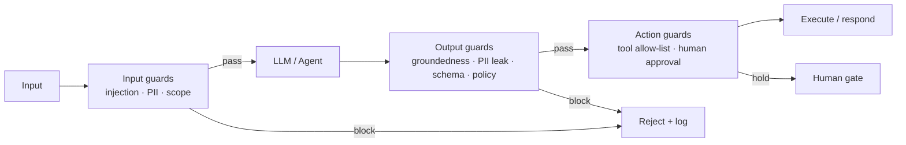
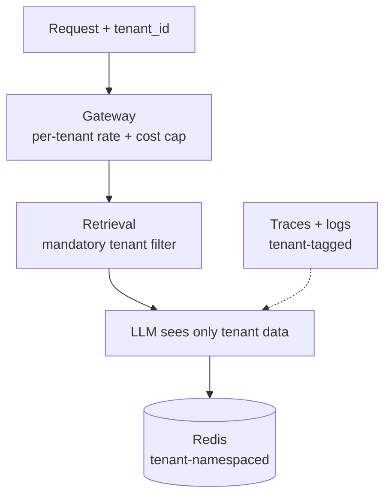
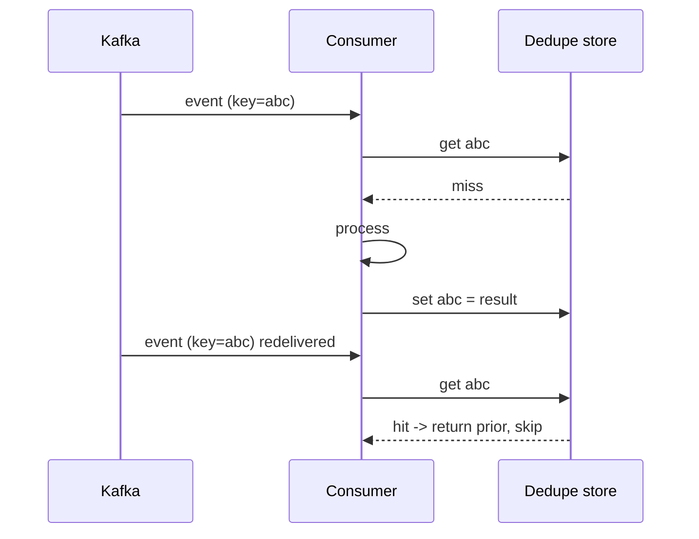

# 11c — Answers: Distributed Systems & System Design (Q60–88)

> Model answers to [11_Mock_Questions_Bank.md](11_Mock_Questions_Bank.md), sections E & F. Deep context in [06](06_Distributed_Systems_Backend.md) and [07](07_System_Design_HLD_LLD.md). Swap in your real numbers where marked [ ].

**How to read:** each entry is `**Q — question**` → a quoted **spoken answer** with key terms **bolded**. Mermaid diagrams render on GitHub — in a live round, redraw them on the whiteboard as you talk.

---

## E. Distributed Systems & Backend

**60. Design an async event-driven inference service (Kafka).**
"API accepts a request, validates, and publishes to a Kafka topic, returning a job id immediately. Inference workers on K8s consume from the topic — autoscaled on consumer lag via KEDA — call the model (vLLM or Bedrock), and publish results to a results topic; the client gets them via websocket/SSE or polling. A Redis semantic cache sits in front to skip repeats. Backpressure is natural: workers pull at a sustainable rate, capped to respect provider rate limits, and Kafka buffers spikes. DLQ for poison messages, idempotent consumers keyed on request id, and metrics on lag, TTFT, and cost per request."

> 💡 **The flow:**



**Backpressure:** workers *pull* at a sustainable, rate-limited pace; Kafka absorbs spikes. Autoscale on **consumer lag**.

> **📌 Example** — KEDA autoscaling the inference workers on Kafka consumer lag:

```yaml
triggers:
  - type: kafka
    metadata:
      topic: inference.requests
      consumerGroup: infer-workers
      lagThreshold: "50"        # add a pod per 50 msgs of lag/replica
minReplicaCount: 2
maxReplicaCount: 40
```

**61. How did you reduce latency / AWS cost?**
"[Your real story with numbers.] Generalizable levers I used: semantic caching cut redundant LLM calls by [X%]; model routing/cascade sent simple requests to a small cheap model and escalated only when needed; continuous batching on the serving layer raised GPU throughput; right-sizing GPUs plus spot instances and autoscaling on queue depth instead of CPU dropped idle spend; and prompt compression reduced tokens. Net: latency down [X%], cost down [Y%] at [Z] throughput. The mindset is treating inference like any high-throughput service and measuring cost per request."

> **📌 Example** — levers applied to a 2M-call/day workload:

| Lever | Before | After |
|---|---|---|
| Semantic cache (35% hit) | 2.0M calls | 1.3M calls |
| Cascade — 70% to small model | large model for all | mixed |
| Blended cost / 1k req | $4.20 | $1.85 (-56%) |
| p95 latency | 3.1s | 1.9s (-39%) |

**62. Kafka delivery semantics — exactly-once vs at-least-once for inference?**
"Default reality is at-least-once, so I make consumers idempotent — dedupe on a request/idempotency key in Redis or the DB — which handles duplicates cheaply. Exactly-once via Kafka transactions costs throughput and complexity, so I only justify it when a duplicate side-effect is genuinely unacceptable — e.g., don't double-post a ledger entry or double-charge. For pure inference where the result is idempotent, at-least-once plus dedupe is the right call."

> **📌 Example** — dedupe on an idempotency key before a ledger side-effect:

```python
if redis.set(f"idem:{req_id}", "1", nx=True, ex=86400):
    result = run_inference(req)              # first delivery only
    ledger.upsert(id=req_id, entry=result)   # idempotent write
else:
    result = cache.get(req_id)               # duplicate -> return prior
```

**63. Kafka consumer lag is growing — diagnose and fix.**
"Check the consumer first: slow processing → scale out consumers or optimize, raising concurrency within provider rate limits. Hot partition → rebalanced/rekeyed partitioning. Poison message stalling the partition → route to DLQ. If the bottleneck is a downstream model rate limit, that's backpressure working as designed — I add capacity or degrade gracefully rather than overwhelm the provider. I alert on lag and autoscale on it as a first-class signal."

> **📌 Example** — lag triage runbook:

```text
lag up + CPU low    -> downstream 429s (model rate limit): add capacity / degrade
lag up + CPU high   -> slow consumer: scale out or optimize
one partition lags  -> hot key or poison msg: rekey / route to DLQ
```

> 💡 **Consumer-group scaling — partitions cap the parallelism:**



**64. Redis for LLM systems — use cases and risks?**
"Uses: semantic and exact-match response caching, per-tenant rate limiting, short-term session/conversation memory with TTL, distributed locks and idempotency keys, and even vector search via RediSearch. Risks: semantic-cache false hits — a near-miss returning a wrong cached answer, dangerous in fintech, so I set a conservative similarity threshold; staleness — TTL plus event-driven invalidation; and memory pressure — sensible eviction policy. Never semantic-cache anything whose answer depends on live or private state without keying on that state."

> **📌 Example** — conservative semantic-cache config for fintech:

```yaml
cache:
  similarity_threshold: 0.97          # high bar to avoid false hits
  ttl_seconds: 900
  key_includes: [tenant_id, account_state_hash]   # never cross live/private state
  skip_if: [contains_pii, live_balance_query]
```

**65. How achieve low-latency LLM inference?**
"At the serving layer: continuous batching and PagedAttention (vLLM/TGI), KV-cache management with prefix caching to reuse shared system prompts, and quantization for throughput. Speculative decoding — a small draft model proposes, the big one verifies — cuts latency. Stream tokens so perceived latency (TTFT) is low. Above that: a model cascade routing simple requests to small models, and semantic caching to skip inference entirely. I optimize the metric the product cares about — TTFT for chat, throughput for batch."

> **📌 Example** — TTFT contributors for one chat turn:

```text
prefix cache hit (shared system prompt reused):  -120ms
speculative decoding (small draft + big verify):  ~1.8x tokens/sec
stream first token at:                            ~180ms  (vs ~900ms full)
```

**66. TTFT vs throughput — what optimize when?**
"TTFT — time to first token — matters for interactive/chat UX where perceived responsiveness is king; I optimize it with streaming, prefix caching, and speculative decoding. Throughput — tokens or requests per second — matters for batch and high-volume back-office processing; I optimize it with continuous batching and larger batch sizes, accepting higher per-request latency. Continuous batching is nice because it improves both. I always ask which one the use case actually cares about before tuning."

> **📌 Example** — same model, two tuning targets:

| Config | Batch size | TTFT | Throughput |
|---|---|---|---|
| Chat (optimize latency) | 1–4 | 180ms | 900 tok/s |
| Batch (optimize throughput) | 64 | 2.4s | 7,800 tok/s |

**67. Design GPU autoscaling on K8s for spiky inference.**
"GPU node groups with a queue/lag-based autoscaler — KEDA scaling worker pods on Kafka consumer lag or queue depth, and Karpenter/cluster-autoscaler provisioning GPU nodes, using spot for interruptible batch work. Scale-to-zero for spiky, infrequent workloads. Scale on the real demand signal (queue depth/GPU utilization), not CPU. Graceful shutdown drains in-flight LLM calls before a pod dies. This keeps GPUs busy without over-provisioning for peak."

> **📌 Example** — KEDA scaling GPU worker pods on queue depth, not CPU:

```yaml
triggers:
  - type: aws-sqs-queue
    metadata:
      queueLength: "20"          # target ~20 pending jobs per pod
minReplicaCount: 0               # scale-to-zero for spiky, infrequent load
maxReplicaCount: 16
advanced:
  horizontalPodAutoscalerConfig:
    behavior: {scaleDown: {stabilizationWindowSeconds: 300}}   # avoid thrash
```

> 💡 **GPU autoscaling — pods on demand, nodes on demand:**



**68. How control GPU cost on AWS?**
"Spot instances for batch and eval, right-sizing and bin-packing, autoscaling on real demand with scale-to-zero, GPU sharing via MIG/fractional GPUs, and off-hours scale-down. Above the infra: caching, model routing/cascade, and quantization to serve more per GPU. And cost observability — cost per request/feature — so I target the biggest spenders. [Tie to your real AWS-savings story.]"

> **📌 Example** — monthly GPU spend, before vs after:

```text
8x A10G on-demand 24/7   = 8 x $0.75 x 730h   = $4,380
-> spot for batch (~60%)                       ~ -$1,970
-> scale-to-zero off-hours                     ~   -$730
effective:                                     ~ $1,680/mo  (-62%)
```

**69. Backpressure when the provider rate-limits you?**
"Kafka buffers the load; consumers pull at a rate capped to the provider's limit, with a concurrency semaphore. Retries use exponential backoff with jitter on 429s, and a circuit breaker trips on sustained rate-limiting to avoid hammering. Under overload I degrade gracefully — serve cached or smaller-model responses, or queue with a job id and async delivery. The key is never letting the front door accept faster than the back end can sustainably serve."

> **📌 Example** — rate-limit-aware worker (semaphore + backoff):

```python
sem = asyncio.Semaphore(PROVIDER_MAX_CONCURRENCY)   # e.g. 20 in flight
async def call(req):
    async with sem:
        return await backoff_retry(
            model.invoke, req,
            on=[429, 503], base=0.5, factor=2, jitter=True, max_tries=5)
```

**70. Partition strategy / hot partitions in Kafka?**
"Partitioning is the unit of parallelism and ordering — ordering holds only within a partition, so I choose the key deliberately (e.g., by tenant or entity when I need per-entity ordering). Hot partitions come from skewed keys; I fix with a better key, a composite key, or more partitions. I size partitions for target throughput and monitor per-partition lag. Repartitioning is disruptive, so I plan headroom up front."

> **📌 Example** — key by entity for per-entity ordering, composite key to defuse a hot tenant:

```python
# ordering guaranteed per loan_id; spreads load across partitions
producer.send("loan.events", key=loan_id.encode(), value=evt)

# one whale tenant creating a hot partition? composite key rebalances:
key = f"{tenant_id}:{loan_id}".encode()
```

**71. Design a high-throughput streaming LLM API.**
"Async, non-blocking framework (FastAPI async or Node) since LLM calls are I/O-bound — don't block workers. Stream tokens over SSE/websockets for low TTFT. Long-running agent work returns a job id and streams/pushes results rather than holding an HTTP connection for 30s. Redis-backed rate limiting and idempotency keys, request validation, per-tenant auth, timeouts/retries/circuit-breakers around every model call, and graceful degradation to a fallback model or cached response under overload."

> **📌 Example** — async SSE endpoint; long work goes async with a job id:

```python
@app.post("/v1/chat")
async def chat(req: ChatReq):
    if req.long_running:
        return {"job_id": enqueue(req)}          # push results later
    async def gen():
        async for tok in model.astream(req.prompt):
            yield f"data: {tok}\n\n"
    return StreamingResponse(gen(), media_type="text/event-stream")
```

**72. Circuit breakers, timeouts, retries around model calls — how?**
"Every model/tool call gets a timeout matched to its SLA, retries with exponential backoff and jitter for transient errors (429/5xx), and a circuit breaker that trips after sustained failures to fail fast and shed load instead of piling on. On an open circuit I fall back — alternate provider via the gateway, a smaller model, or a cached response. Bulkheads isolate one dependency's failure from the rest. This keeps a provider blip from cascading into an outage."

> **📌 Example** — per-backend resilience policy:

```yaml
model_call:
  timeout_ms: 8000
  retries: {max: 3, backoff: exponential, jitter: true, on: [429, 500, 503]}
  circuit_breaker: {error_threshold: 0.5, window: 20, open_seconds: 30}
  fallback: [small-model, redis_cache]
```

> 💡 **Circuit-breaker states:**



**73. Bedrock vs self-hosted — trade-offs?**
"Bedrock: managed, no GPU ops, multiple foundation models behind one API, fast to ship, good for variable load and data staying in AWS — but per-token cost at scale and less control over latency/customization. Self-hosted (vLLM on EKS): cheaper at high steady volume, full control over latency, quantization, and fine-tuned/open models, and data residency — but you own the GPU ops and scaling. I often start on Bedrock to ship, then move high-volume paths self-hosted once volume justifies the ops cost."

> **📌 Example** — hosted vs self-host crossover for one high-volume path:

```text
Hosted:    50M tok/day x $0.0008/1k = $40/day = $1,200/mo (no ops)
Self-host: 2x A10G x $0.75 x 730h   = $1,095/mo + GPU ops
=> below ~50M tok/day stay on Bedrock; above it self-hosting wins
```

**74. Idempotency for event-driven side-effects (e.g., ledger writes)?**
"Attach an idempotency key to each event (request/transaction id). Before a side-effect, check a dedupe store (Redis/DB) for that key; if seen, skip. Make the write itself idempotent — upsert or conditional write keyed on the id — so a replay can't double-apply. For financial writes specifically, I'd use a transactional outbox or exactly-once semantics so a ledger entry is applied once and only once even under retries or consumer rebalances."

> **📌 Example** — transactional outbox: write and event committed atomically:

```python
with db.transaction():
    db.execute("INSERT INTO ledger(id, amt) VALUES(%s,%s) "
               "ON CONFLICT (id) DO NOTHING", (txn_id, amt))   # idempotent
    db.execute("INSERT INTO outbox(event_id, payload) VALUES(%s,%s)",
               (txn_id, evt))                                  # same txn
# a relay tails outbox -> publishes to Kafka -> marks sent
```

> 💡 **Transactional outbox — one commit, then relay to Kafka:**



**75. Schema evolution in Kafka (Schema Registry)?**
"Use a Schema Registry with Avro/Protobuf and enforce compatibility — typically backward compatibility so new consumers read old data. Add optional fields with defaults; never remove or repurpose fields without a versioned migration. Producers and consumers validate against the registry, which prevents a bad deploy from poisoning a topic. This matters at scale where producers and consumers deploy independently."

---

> **📌 Example** — backward-compatible Avro change (add an optional field):

```json
{"name": "risk_score", "type": ["null", "double"], "default": null}
```

> Old consumers ignore the new field; new consumers read old records via the `default`. Removing or renaming a field breaks compatibility and the registry rejects the producer.

## F. System Design (HLD / LLD)

**76. Design the company's agentic AI platform end-to-end.**
"I'd start by clarifying scale, latency SLA, and — critically — the cost of a wrong decision, since that sets the safety posture. High level: API gateway → model gateway (routing, fallback, rate-limit, cost cap, cache) → LangGraph agent runtime with checkpointing → specialist agents over a governed tool registry → hybrid retrieval (OpenSearch BM25+vector + reranker, KG for relationships) → Redis for cache/session → data in S3/Postgres/vector index. Kafka carries async work, re-indexing, long-horizon steps, and an immutable audit log. Guardrail middleware wraps every call; a human-in-the-loop console gates high-stakes actions. Everything versioned, traced, evaluated, tenant-isolated, and auditable. I'd ship the single-agent RAG version first and add multi-agent + KG when data justifies it."

> 💡 **Platform skeleton** (full ASCII version in [07](07_System_Design_HLD_LLD.md)):



*Everything: versioned · traced · evaluated · tenant-isolated · auditable.*

> **📌 Example** — phased rollout: ship value first, add complexity as data justifies:

```text
Phase 1: API GW + model gateway + single RAG agent + guardrails + audit log
Phase 2: specialist agents + tool registry + human-in-the-loop console
Phase 3: KG relationships + multi-agent supervisor + eval flywheel
```

**77. Design a document-intelligence agent for loan agreements.**
"Scope first: volume, real-time vs batch, does output feed automation or a human. Ingestion: layout-aware parsing preserving tables/clauses, structure-aware chunking, metadata, PII handling, triggered by doc events on Kafka. Retrieval: hybrid (BM25 for clause refs/IDs + vector for semantics) + rerank, plus a KG for cross-document entity relationships. Agents: supervisor → schema-constrained extraction agent, covenant-risk agent, RAG QA agent, with deterministic validation of extracted numbers/dates. Guardrails: groundedness and citations on every extracted term, human sign-off before writing to the system of record, hallucination monitoring. Full trace per field for dispute/audit. Cache repeated queries, route simple extractions to a cheap model, batch bulk overnight."

> **📌 Example** — schema-constrained extraction, every term grounded with a citation:

```json
{
  "principal": {"value": 4200000, "cite": "p3 sec2.1", "grounded": true},
  "maturity_date": {"value": "2029-06-30", "cite": "p1 sec1.4"},
  "covenants": [{"type": "DSCR", "min": 1.25, "cite": "p7 sec5.3"}]
}
```

**78. Design a collections/support agent for borrowers.**
"Real-time and multi-turn: stream tokens for low TTFT, Redis for session memory. The heavy emphasis is compliance — regulated communication rules, tone and policy guardrails, PII handling, and no unauthorized financial advice. Read tools (fetch account state) are open; any write or commitment is gated behind human approval. Full transcript audit, refusal calibration for out-of-scope asks, and human escalation paths. I'd design the guardrail/policy layer as the centerpiece here, because in collections the regulatory risk of a bad message is the dominant design constraint."

> **📌 Example** — reads open, writes gated behind compliance + human approval:

```yaml
tools:
  get_account_balance:  {access: read,  auto: true}
  get_payment_history:  {access: read,  auto: true}
  send_borrower_message: {access: write, requires: [compliance_check, human_approval]}
  set_payment_plan:      {access: write, requires: human_approval}
```

**79. Design the agent evaluation platform.**
"A golden-dataset store with versioning; an LLM-as-judge service, calibrated to humans and version-pinned; a regression runner wired into CI that gates deploys; trajectory eval for agent paths; and production-traffic sampling that flows into a labeling loop and back into the goldens. Plus A/B and shadow infrastructure, dashboards for quality/cost/latency, and drift alerts. It's exposed as a platform service with SDK hooks so every product team evaluates the same way instead of reinventing it. This is the flywheel that keeps quality from silently degrading."

> **📌 Example** — regression gate wired into CI on the golden set:

```yaml
eval_gate:
  dataset: goldens@v14
  metrics:
    groundedness: ">=0.95"
    exact_match:  ">=0.88"
    cost_per_q:   "<=0.02usd"
  on_regression: block_merge
```

**80. Design a low-latency RAG API at 10k QPS.**
"Shard the hybrid index (OpenSearch) for horizontal read scale. Aggressive Redis semantic caching in front — at 10k QPS the cache hit rate is the single biggest lever. Model routing to small models for simple queries, continuous batching on the serving layer, and streaming for TTFT. Autoscale workers on queue depth. Break the p99 budget down across stages — retrieval, rerank, generation — and optimize the dominant one. Graceful degradation under load: serve cached or smaller-model answers rather than time out. Multi-AZ for availability."

> **📌 Example** — p99 budget at 10k QPS, target 800ms:

| Stage | p99 | Note |
|---|---|---|
| Redis cache lookup | 5ms | ~45% served here, skip the rest |
| Hybrid retrieval (OpenSearch) | 120ms | sharded for read scale |
| Rerank | 90ms | top-50 down to top-8 |
| Generation (small model, streamed) | 550ms | TTFT ~180ms |
| **Total** | **~765ms** | ~35ms headroom |

**81. Design the model gateway.**
"A single internal API in front of all models. Responsibilities: routing (by task, cost, or A/B), a fallback chain across providers/models on failure, per-tenant rate limiting and cost caps, response caching, request/response logging for tracing, and version pinning. It decouples product teams from provider specifics so I can swap models, roll back, or shift traffic instantly, and it's the natural place to meter cost and enforce guardrails centrally. LLD-wise: a policy config per route, a provider-adapter interface, and a circuit breaker per backend."

> **📌 Example** — route policy with a cross-provider fallback chain:

```yaml
routes:
  - match: {task: simple_qa}
    primary:  bedrock/claude-haiku
    fallback: [self-host/llama-8b, redis_cache]
  - match: {task: extraction}
    primary:  self-host/llama-70b
    fallback: [bedrock/claude-sonnet]
    cost_cap_usd_per_day: 300
```

> 💡 **Gateway routing and fallback:**



**82. Design the tool registry + governance layer.**
"A central catalog where tools are registered with typed schemas, descriptions, auth requirements, and risk classification (read vs write, needs-human-approval). Agents discover tools through it — including semantic tool-selection to narrow large sets. Governance: access control per tool per agent/tenant, versioning, audit logging of every invocation, and a review process to register write/destructive tools. MCP is a natural implementation. This makes tools reusable across teams while keeping them governed — important when tools touch financial systems."

> **📌 Example** — a governed tool registry entry:

```json
{
  "name": "post_ledger_entry",
  "schema": {"account_id": "string", "amount": "number"},
  "auth": "service-role:ledger-writer",
  "risk": "write",
  "requires_human_approval": true,
  "version": "2.1.0",
  "allowed_agents": ["collections", "reconciliation"]
}
```

**83. Design agent state schema + checkpointing.**
"Typed state holding the task, working data, intermediate results, tool outputs, and step count — deliberately structured, not a raw transcript, so it stays compact and inspectable. Checkpoint the state at each node transition to a durable store keyed by run id, enabling resume, human-pause, and time-travel debugging. Steps must be idempotent (idempotency keys on side-effecting tools) so replay is safe. I persist enough to reconstruct and audit the run, and I compact/summarize long-running state to control window size."

> **📌 Example** — typed state, checkpointed per run for resume and time-travel:

```python
class AgentState(TypedDict):
    run_id: str
    task: str
    scratch: dict          # working data, not the raw transcript
    tool_results: list
    step: int
# after each node transition:
checkpointer.put(state["run_id"], state)   # durable, keyed by run id
```

**84. Design a guardrail middleware pipeline (LLD).**
"A composable pipeline of checks with a common interface — each guardrail takes context and returns pass/modify/block with a reason. Three stages: input guards (injection, PII, scope), output guards (groundedness, PII leak, schema, policy), and action guards (tool allow-list, human-approval gate). They're configured declaratively per agent and applied uniformly by the runtime, so a team gets standard protection by default and can add domain-specific checks. Every guard hit is logged for monitoring and audit. Fail-closed on high-risk checks."

> 💡 **Three-stage guardrail pipeline:**



> **📌 Example** — common guard interface, fail-closed on a block:

```python
class Guard(Protocol):
    def check(self, ctx) -> Result: ...     # PASS | MODIFY(new_ctx) | BLOCK(reason)

def run(pipeline, ctx):
    for g in pipeline:
        r = g.check(ctx)
        if r.blocked:
            log(r); raise Blocked(r.reason)  # fail-closed on high-risk checks
        ctx = r.apply(ctx)
    return ctx
```

**85. Design multi-tenant isolation for an AI platform.**
"Isolation at every layer: tenant-scoped access control on retrieval (filter before the LLM sees data), per-tenant rate limits and cost caps in the gateway, tenant tags on all traces and logs, and either separate indices or an enforced mandatory tenant filter that can't be bypassed. Session/memory in Redis keyed and namespaced per tenant. Never rely on the prompt for isolation. Red-team it with cross-tenant queries. In fintech, tenant leakage is a breach, so this is a hard requirement, not a feature."

> **📌 Example** — mandatory, non-bypassable tenant filter on retrieval:

```python
def search(query, tenant_id):
    # tenant filter injected server-side; never taken from the prompt/LLM
    return index.query(query, filter={"tenant_id": tenant_id}, strict=True)

# Redis session/memory namespaced per tenant:
key = f"{tenant_id}:session:{session_id}"
```

> 💡 **Isolation enforced at every layer:**



**86. Design idempotent inference event processing.**
"Each event carries an idempotency key. Consumers are idempotent: check a dedupe store for the key before processing; if the result already exists, return it. Side-effects use conditional/upsert writes keyed on the id. This makes at-least-once delivery safe under retries and consumer rebalances. For financial side-effects specifically, a transactional outbox pattern ensures the write and the event are consistent. Result: replays and duplicates are harmless."

> **📌 Example** — idempotent consumer, safe under at-least-once delivery:

```python
key = evt["idempotency_key"]
if (prior := store.get(key)) is not None:
    return prior                        # duplicate / replay -> no-op
result = process(evt)
store.set(key, result, ex=DEDUPE_TTL)   # safe across retries + rebalances
```

> 💡 **Duplicate delivery collapses to one effect:**



**87. Capacity/cost estimate for X users/docs/QPS.**
"I'd do it out loud. Storage: docs × avg chunks/doc × (embedding dim × 4 bytes + metadata) → index size. Throughput: QPS × avg tokens/request → tokens/sec → number of model replicas given per-replica tokens/sec → GPU count. Cost: tokens/month × cost/token for hosted, or GPU-hours for self-hosted, plus retrieval and storage. Then I sanity-check against the latency budget and add headroom for peak. The point is showing I can reason about scale numerically, not the exact figures."

> **📌 Example** — worked estimate: 5M docs, 500 QPS, 1536-dim embeddings:

```text
Index:      5M docs x 8 chunks x (1536 x 4B + 512B meta) ~ 5M x 8 x 6.6KB ~ 264 GB
Throughput: 500 QPS x 600 tok/req = 300k tok/s
Replicas:   300k / 8k tok/s per A10G ~ 38 GPUs, +30% peak headroom ~ 50
Cost:       50 x $0.75/h x 730h ~ $27,400/mo + retrieval + storage
```

**88. How make this fault-tolerant / handle provider outage?**
"Multi-provider fallback through the model gateway, cached responses to serve during an outage, and graceful degradation to a smaller or alternate model. Circuit breakers and timeouts stop cascading failures. Kafka decouples ingestion from processing so a downstream outage just grows a queue that drains on recovery, not lost work. Multi-AZ deployment, health checks, and checkpointed agent state so long workflows resume. And I'd chaos-test the fallback paths — an untested fallback isn't a fallback."

> **📌 Example** — outage degradation ladder (each rung tried in order):

```text
primary provider 5xx spike -> circuit opens for 30s
  -> fallback provider in another AZ/region
    -> smaller self-hosted model
      -> serve a fresh-enough cached answer
        -> accept + return job_id, deliver async on recovery
```
