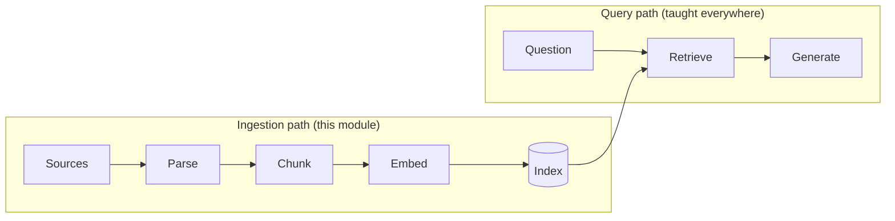
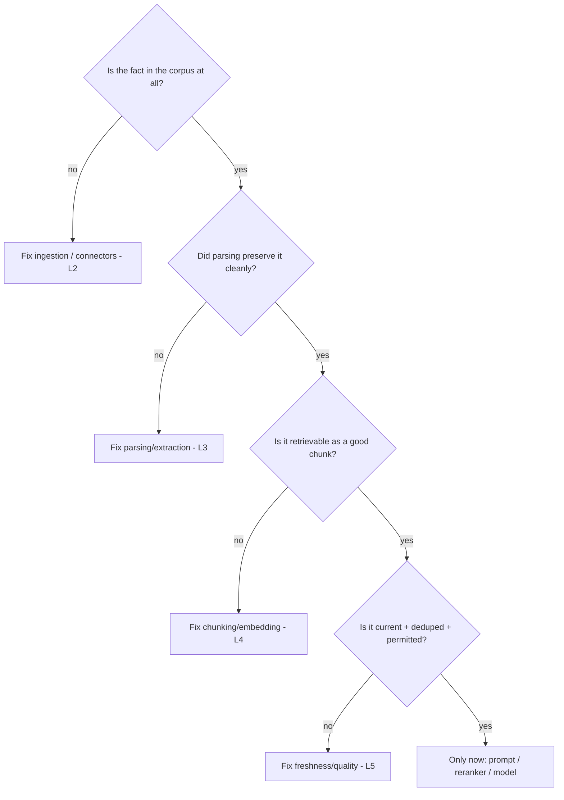

# Lesson 1 — The RAG Data Problem

> **One-liner:** A RAG system's answer quality is **capped by what made it into the index** — no cleverer prompt, bigger model, or fancier reranker can retrieve a fact that was never ingested, was mangled during parsing, or was split across two bad chunks.

---

## 🎯 TL;DR

Most "our RAG isn't accurate" problems are **data problems, not model problems**. The demo works because someone hand-picked three clean PDFs; production breaks because real corpora are messy, huge, permission-scoped, and *constantly changing*. This module treats the **ingestion path** (connect → parse → chunk → embed → index) as the real engineering surface. Lesson 1 is the mindset: **debug retrieval from the data up, not the prompt down.**

---

## 1. Two halves of RAG — and which one gets ignored

Tutorials obsess over the **read** side. Production quality is dominated by the **write** side — because retrieval can only ever return what ingestion put there, in the shape ingestion left it.

---

## 2. Where RAG quality actually leaks

| Failure | Root cause (upstream) | Symptom (looks like a model bug) |
|---|---|---|
| Answer missing a known fact | Doc never ingested / connector missed it | "The model doesn't know it" |
| Right doc, wrong snippet | Bad chunk boundary split the fact | Retrieved context is almost-but-not-relevant |
| Garbled numbers/tables | Parser flattened a table to mush | Confident wrong figures |
| Stale answer | Index not refreshed after source changed | "It's using old info" |
| Leaks another tenant's data | No ACL metadata on chunks | Security incident |
| Duplicated/contradictory hits | No dedup across near-identical docs | Model waffles between versions |

**Every row is fixed upstream of the LLM.** That's the point.

---

## 3. The debugging order (data-up, not prompt-down)

When retrieval is bad, walk this ladder **top-down**. Teams that start at the bottom (tweaking prompts) burn weeks on a data bug.

---

## 4. What "good ingestion" optimizes for

| Property | Why it matters |
|---|---|
| **Coverage** | Every source doc that should be answerable *is* ingested |
| **Fidelity** | Parsed text preserves meaning (tables, structure, order) |
| **Retrievability** | Chunks are self-contained and sized so the right one surfaces |
| **Freshness** | Index reflects source changes within the SLA |
| **Governance** | ACLs, provenance, and citations travel with each chunk |

---

## 5. Key terms

| Term | Meaning |
|------|---------|
| **Ingestion path** | The write side of RAG: source → index |
| **Coverage** | Fraction of answerable content actually indexed |
| **Fidelity** | How faithfully parsed text preserves the original meaning |
| **Retrievability** | Whether a fact's chunk actually surfaces for relevant queries |
| **Provenance** | The recorded origin (source, section, version) of a chunk |

---

## ✍️ Notes / follow-ups
- This reframes RAG debugging; the next four lessons are each a rung on the §3 ladder.
- The query-side counterpart is [`../12_rag/`](../12_rag/README.md) — read both to see the full loop.
- Next: [Lesson 2 — Connectors & Ingestion](02-connectors-and-ingestion.md).
