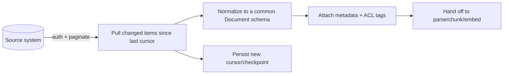
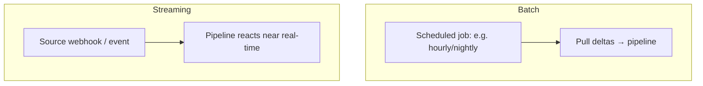

# Lesson 2 — Connectors & Ingestion

> **One-liner:** A connector is the reliable, **incremental**, permission-aware bridge from a source system (S3, Confluence, Slack, a database, the web) into your pipeline — and its job is not just "fetch documents" but "fetch *what changed*, with metadata and access tags intact."

---

## 🎯 TL;DR

Ingestion is where "coverage" and "governance" are won or lost. A toy loader reads a folder once; a production connector handles **auth, pagination, rate limits, incremental change detection, deletions, and ACLs** — and emits documents with rich **metadata** (source, URL, timestamps, permissions) that everything downstream depends on. Design connectors to be **idempotent and re-runnable**, so a crash or a re-sync never corrupts the index.

---

## 1. Anatomy of a real connector

| Concern | What the connector must do |
|---|---|
| **Auth** | Tokens/OAuth, refresh, least-privilege service accounts |
| **Pagination + rate limits** | Page through large sources without tripping limits |
| **Incremental cursor** | Track "last synced" (timestamp/ETag/change-token) to pull only deltas (L5) |
| **Deletions** | Detect removed/archived source items so the index can drop them |
| **Metadata + ACLs** | Capture source, URL, author, timestamps, and *who may see it* |
| **Idempotency** | Re-running produces the same result — safe to retry |

---

## 2. Batch vs streaming ingestion

| | Batch | Streaming (event-driven) |
|---|---|---|
| **Freshness** | Minutes–hours lag | Seconds |
| **Complexity** | Low | Higher (queues, webhooks) |
| **Best for** | Most corpora (docs, wikis, policies) | Fast-moving data (tickets, chat, prices) |

Start batch; move specific high-churn sources to streaming when the **freshness SLA** (L5) demands it.

---

## 3. The common Document schema

Normalize every source into one shape so parsing/chunking don't care where data came from:

| Field | Purpose |
|---|---|
| `id` / `source_id` | Stable key for upsert + dedup (L5) |
| `content` (raw) | Bytes/text to be parsed (L3) |
| `mime_type` | Tells the parser how to handle it |
| `metadata` | source, url, title, section, author, `created`/`modified` |
| `acl` | Groups/users allowed to retrieve it — enforced at query time |
| `version` / `hash` | Change detection + dedup |

- **ACLs are not optional**: if retrieval can surface any chunk regardless of permission, RAG becomes a data-leak vector. Carry access tags from ingestion → chunk → filter-at-query.

---

## 4. Reliability patterns

| Pattern | Why |
|---|---|
| **Checkpoint/cursor per source** | Resume after failure without re-pulling everything |
| **Dead-letter queue** | Park un-parseable/failed items for inspection, don't block the batch |
| **Backoff + retry** | Survive source rate limits and transient errors |
| **Observability** | Count docs in/failed/skipped per run — silent coverage gaps are the enemy (L1) |

---

## 5. Key terms

| Term | Meaning |
|------|---------|
| **Connector** | Reliable, incremental, auth-aware bridge from a source into the pipeline |
| **Cursor / checkpoint** | Stored marker of "last synced" enabling delta pulls |
| **ACL tag** | Permission metadata carried with a doc/chunk for query-time filtering |
| **Idempotent** | Re-runnable with the same result — safe under retries |
| **Dead-letter queue** | Holding area for items that failed processing |

---

## ✍️ Notes / follow-ups
- Incremental cursors + deletion handling are the setup for freshness in [Lesson 5](05-freshness-sync-and-quality.md).
- Generic ETL context: [`../../Shared/02_mlops/04-etl-pipeline-in-mlops.md`](../../Shared/02_mlops/04-etl-pipeline-in-mlops.md).
- Next: [Lesson 3 — Parsing & Extraction](03-parsing-and-extraction.md).
