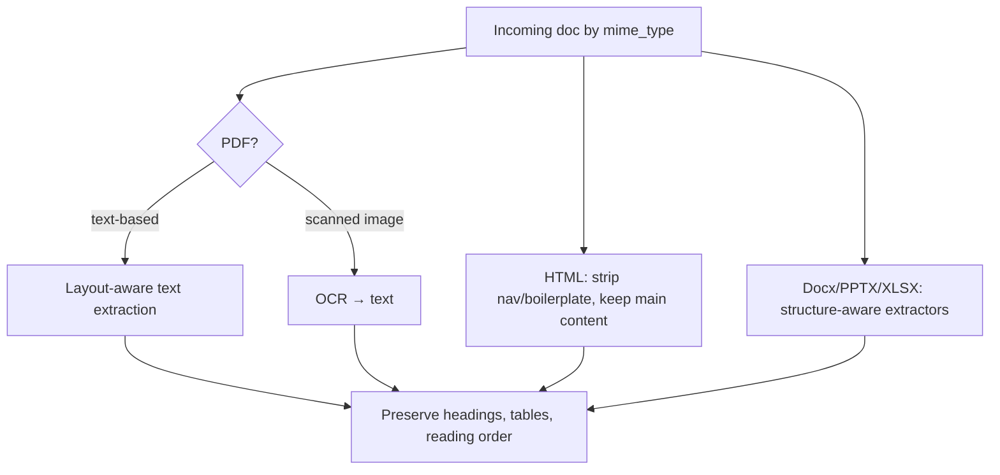
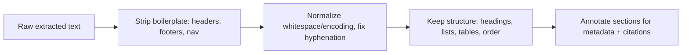

# Lesson 3 — Parsing & Extraction

> **One-liner:** Real corpora are PDFs, scanned images, HTML, slides, and spreadsheets — and how faithfully you turn them into **clean, structured, ordered text** (especially tables and layout) sets a hard ceiling on retrieval quality that no downstream step can raise.

---

## 🎯 TL;DR

Parsing is the least glamorous and most impactful step. A PDF that a naive extractor turns into jumbled two-column soup, or a table flattened into a run-on line, will *retrieve* fine and *answer* wrong. Match the parser to the format, **preserve structure** (headings, tables, reading order), handle **scans with OCR**, and keep **layout/section metadata** so chunks stay meaningful and citable.

---

## 1. Format → strategy

| Format | Watch out for |
|---|---|
| **Text PDF** | Multi-column reading order, headers/footers, ligatures |
| **Scanned PDF/image** | Needs OCR; quality varies with resolution/skew |
| **HTML** | Nav/ads/boilerplate pollute content; keep the main article |
| **Tables** | The #1 fidelity killer — flattening destroys row/column meaning |
| **Slides/Docx** | Speaker notes, ordering, embedded objects |

---

## 2. Tables and figures — handle deliberately

| Approach | When |
|---|---|
| **Preserve as Markdown/HTML table** | Keeps row/column relationships the model can read |
| **Row-to-sentence templating** | "For {product}, warranty is {x} months." — great retrievability for lookups |
| **Vision-language model (VLM) extraction** | Complex/scanned tables & charts → structured output ([`../08_multimodal-ai/`](../08_multimodal-ai/README.md)) |
| **Figure captioning** | Replace an image with a text description so it's searchable |

Never let a table become a single delimiter-free line — that's how "confident wrong numbers" happen (L1).

---

## 3. Clean without destroying meaning

- **Do** remove repeated headers/footers, page numbers, nav chrome, and encoding artifacts.
- **Don't** strip headings, list structure, or table layout — that's the signal chunking (L4) relies on.
- Capture **section paths** ("Warranty > Coverage > Exclusions") as metadata for precise citations.

---

## 4. Quality gates on extraction

| Check | Catches |
|---|---|
| **Non-empty / min-length** | Failed extraction, blank scans |
| **Text-to-noise ratio** | OCR garbage, encoding failures |
| **Table integrity** | Row/column counts preserved vs source |
| **Language detection** | Unexpected language → wrong pipeline |
| **Sample & eyeball** | Nothing beats reviewing N random parsed docs before trusting a new source |

Route failures to the dead-letter queue (L2) — don't silently index garbage.

---

## 5. Key terms

| Term | Meaning |
|------|---------|
| **OCR** | Optical Character Recognition — image/scan → text |
| **Layout-aware extraction** | Parsing that respects columns, headings, and reading order |
| **Boilerplate** | Repeated non-content (nav, headers, footers) to strip |
| **VLM extraction** | Using a vision-language model to read complex tables/figures |
| **Section path** | Hierarchical heading trail kept as metadata for citations |

---

## ✍️ Notes / follow-ups
- Complex table/figure/scan handling leans on [`../08_multimodal-ai/`](../08_multimodal-ai/README.md).
- Clean, structure-preserving text is exactly what good chunking needs next.
- Next: [Lesson 4 — Chunking & Embedding Pipelines](04-chunking-and-embedding-pipelines.md).
