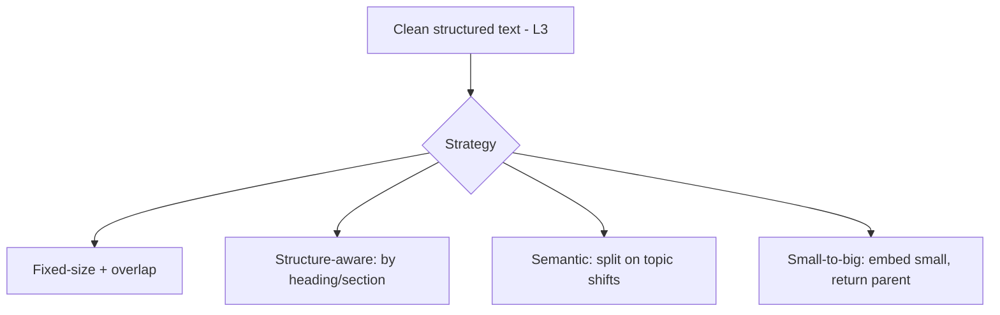
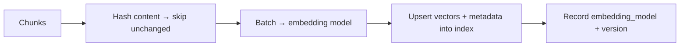

# Lesson 4 — Chunking & Embedding Pipelines

> **One-liner:** Chunking decides *what a retrievable unit is* — too big and the embedding is muddy, too small and facts get orphaned — so chunk on **structure** (headings, sections) not arbitrary character counts, attach **metadata** to every chunk, and run the embedding step as a **batched, versioned, idempotent** pipeline.

---

## 🎯 TL;DR

The chunk is the atom of retrieval: it's what gets embedded, what gets returned, and what the model reasons over. Good chunks are **self-contained** (a reader could understand them alone), **structure-aligned** (respect section boundaries), and **metadata-rich** (source, section, timestamp, ACL). The embedding job around them must be **idempotent and versioned** — because you *will* re-embed when you change the model or chunking, and that can't corrupt the index.

---

## 1. Chunking strategies



| Strategy | How | Trade-off |
|---|---|---|
| **Fixed-size + overlap** | N tokens, sliding overlap | Simple baseline; can cut mid-thought |
| **Structure-aware** | Split on headings/sections/paragraphs | Usually best default — chunks map to real units |
| **Semantic** | Break where topic/embedding shifts | Coherent chunks; more compute |
| **Small-to-big (parent doc)** | Embed small chunks, return their parent/section | Precise match + full context — strong for QA |

**Overlap** (e.g., 10–20%) reduces boundary-cut facts. Tune chunk size to your content and embedding model's sweet spot — measure, don't guess (§4).

---

## 2. Metadata makes chunks useful

Every chunk carries, at minimum:

| Field | Enables |
|---|---|
| `source` / `url` / `title` | Citations back to the origin |
| `section_path` | Precise "where in the doc" + better reranking |
| `created` / `modified` | Freshness filtering + recency boosts (L5) |
| `acl` | Query-time permission filtering (L2) — non-negotiable |
| `doc_id` / `chunk_index` | Upsert + dedup + "fetch neighbors" |

Metadata is what lets you do **filtered retrieval** ("only this product's docs, only current versions, only what this user may see") instead of blind similarity.

---

## 3. The embedding pipeline (treat it like a job, not a script)



| Property | Why |
|---|---|
| **Batched** | Throughput + cost; embeddings are cheap per item, pricey one-at-a-time |
| **Idempotent (content hash)** | Re-runs skip unchanged chunks → cheap incremental re-index (L5) |
| **Versioned** | Store which embedding model produced each vector |
| **Model-consistent** | Query + index **must** use the same embedding model/version |

**Re-embedding rule:** changing the embedding model or chunking = a **full re-index** (old and new vectors aren't comparable). Version it so you can do this as a controlled migration, not an accident.

---

## 4. Measure chunking — don't guess

```mermaid
flowchart TD
    PROBE[Labeled probe set: question → known answer doc] --> RUN[Ingest with config A vs B]
    RUN --> SCORE[Recall@k / MRR per config]
    SCORE --> PICK[Pick the config that maximizes recall]
```

- Build a small **labeled probe set** (questions + the doc/section that answers each).
- Sweep chunk size / strategy / overlap and score **recall@k** — this is an ingestion-time eval, sibling to [`../16_evals/`](../16_evals/README.md).
- This is how you replace "1000 tokens felt right" with a defensible number.

---

## 5. Key terms

| Term | Meaning |
|------|---------|
| **Chunk** | The embedded/retrieved unit of text |
| **Overlap** | Shared tokens between adjacent chunks to avoid boundary cuts |
| **Small-to-big** | Embed small chunks but return their larger parent for context |
| **Idempotent embedding** | Re-runnable via content hashing; unchanged chunks skipped |
| **Recall@k** | Fraction of queries whose answer chunk appears in the top-k |

---

## ✍️ Notes / follow-ups
- Vectors/ANN/hybrid-search internals: [`../06_vector-databases/`](../06_vector-databases/README.md); graph-structured alternative: [`../07_graph-rag/`](../07_graph-rag/README.md).
- The idempotent, hashed pipeline here is exactly what makes incremental freshness cheap — next.
- Next: [Lesson 5 — Freshness, Sync & Data Quality](05-freshness-sync-and-quality.md).
