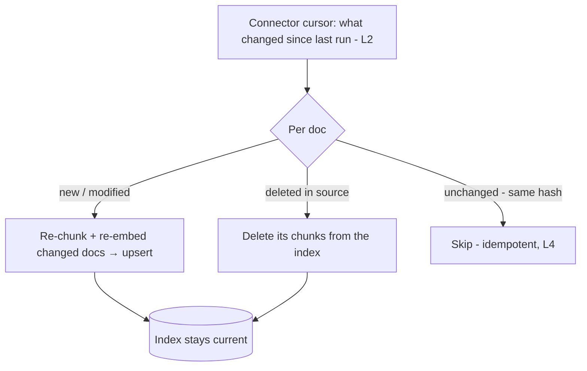
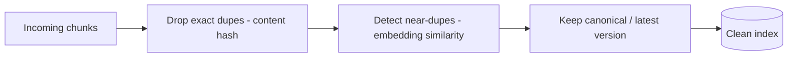

# Lesson 5 — Freshness, Sync & Data Quality

> **One-liner:** A RAG index is a **cache of the world that goes stale** — so the production-grade work is keeping it true: **incremental upserts** for changed docs, **deletes** for removed ones, **dedup** across near-duplicates, a **freshness SLA**, and ongoing **quality checks** that catch drift before users do.

---

## 🎯 TL;DR

The demo indexes once and never updates; production sources change every hour. Without sync, your index quietly diverges from reality and starts returning **stale or deleted** information with full confidence. The fixes: drive re-indexing from the connector's **incremental cursor** (L2), make embedding **idempotent** (L4) so updates are cheap, **propagate deletions**, **dedup** contradictory copies, define a **freshness SLA**, and monitor **retrieval drift** (ties to [`../../Shared/03_llmops/06`](../../Shared/03_llmops/06-monitoring-and-drift.md)).

---

## 1. The sync loop



Incremental sync = **upsert changed + delete removed + skip unchanged**. Full re-index every run is wasteful and, at scale, impossible — reserve it for embedding-model/chunking migrations (L4).

---

## 2. The three sync operations (and the one everyone forgets)

| Operation | Trigger | Miss it and… |
|---|---|---|
| **Upsert** | Doc created/modified | New/edited content never surfaces |
| **Skip** | Content hash unchanged | You waste money re-embedding everything |
| **Delete** ⚠️ | Doc removed/archived/access revoked | **Index serves deleted or now-forbidden content** — the most dangerous gap |

Deletion is the commonly-skipped one and the highest-risk: a doc removed for legal/privacy/accuracy reasons that still answers queries is a real incident.

---

## 3. Deduplication & versioning



| Problem | Fix |
|---|---|
| **Exact duplicates** (same doc ingested twice) | Content-hash dedup at upsert |
| **Near-duplicates** (v1 and v2 of a policy) | Keep the **canonical/latest**; retire the old version |
| **Contradictions** in retrieval | Recency/version metadata so the model trusts current info |

---

## 4. Freshness SLA — make lag a decision, not an accident

| Content type | Reasonable target | Mechanism |
|---|---|---|
| Fast-moving (prices, tickets, status) | Seconds–minutes | Streaming ingestion (L2) |
| Docs/wikis/policies | Hours | Scheduled batch |
| Archival/reference | Daily+ | Nightly batch |

State the SLA explicitly and **monitor actual lag** (source `modified` time → indexed time). An unstated SLA is one you're always silently violating.

---

## 5. Data quality checks & retrieval drift

```mermaid
flowchart TD
    RUN[After each sync] --> COUNT[Counts: docs in/updated/deleted/failed]
    RUN --> PROBE[Recall@k on the labeled probe set - L4]
    RUN --> ORPHAN[Orphan/empty-chunk + dup checks]
    PROBE -->|recall drops| ALERT[Alert: retrieval drift]
    COUNT -->|coverage gap| ALERT
```

| Signal | Catches |
|---|---|
| **Coverage counts per run** | Silent connector failures (L1's "the model doesn't know it") |
| **Recall@k on probe set** | Chunking/embedding regressions after a change |
| **% low-similarity retrievals in prod** | Growing gap between questions and corpus → new content needed |
| **Stale-hit rate** | Answers citing outdated versions |

This closes the module loop: production retrieval failures become **new probe-set cases** (L1/L4), and quality-drift monitoring is the same discipline as LLM-output monitoring in [`../../Shared/03_llmops/06`](../../Shared/03_llmops/06-monitoring-and-drift.md).

---

## 6. Key terms

| Term | Meaning |
|------|---------|
| **Upsert** | Insert-or-update a doc's chunks in the index |
| **Freshness SLA** | Agreed max lag from source change to index update |
| **Deduplication** | Removing exact/near-duplicate chunks to avoid contradictions |
| **Canonical version** | The single source-of-truth copy kept when duplicates exist |
| **Retrieval drift** | Recall/quality degrading as corpus or queries change over time |

---

## ✍️ Notes / follow-ups
- Freshness depends on the connector cursors (L2) and idempotent embedding (L4) — this lesson is where they pay off.
- Prod-side monitoring counterpart: [`../../Shared/03_llmops/06`](../../Shared/03_llmops/06-monitoring-and-drift.md); managed RAG hides much of this (at the cost of control) — [`../../Shared/04_cloud-ai-platforms/`](../../Shared/04_cloud-ai-platforms/README.md).
- Module complete — the ingestion path from source to a fresh, trustworthy index. ✅
