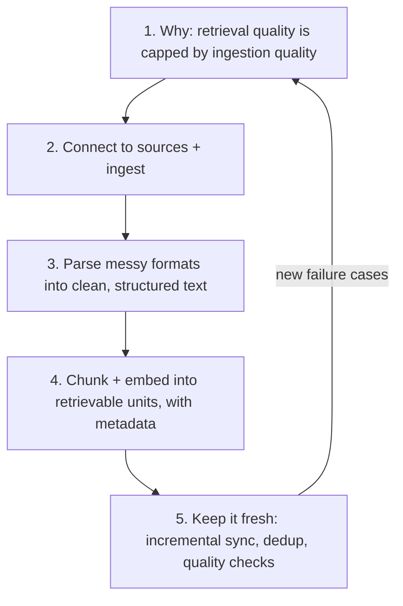

# 🧱 Data Engineering for RAG

> RAG lessons everywhere teach the **query path** — embed the question, search, stuff context, generate. This short module is about the **other half nobody demos**: the **ingestion path** that decides whether retrieval has anything good to find. Connectors, parsing, chunking pipelines, and *freshness* are where real RAG systems live or die — "garbage in, garbage retrieved."
>
> It complements the query-side modules ([`12_rag`](../12_rag/README.md), [`06_vector-databases`](../06_vector-databases/README.md), [`07_graph-rag`](../07_graph-rag/README.md)) and the system design in [`18_ragapp`](../18_ragapp/README.md). It's also the "keep the RAG pipeline yours" piece referenced by the [cloud platforms module](../../Shared/04_cloud-ai-platforms/README.md) — what you build when managed RAG (Bedrock KB / Vertex RAG Engine / Azure AI Search) isn't enough.

---

## Lessons

| # | Lesson | Theme | Status |
|---|--------|:------|:------:|
| 1 | [The RAG Data Problem](01-the-rag-data-problem.md) | Why ingestion is the hard part | ✅ |
| 2 | [Connectors & Ingestion](02-connectors-and-ingestion.md) | Getting data in | ✅ |
| 3 | [Parsing & Extraction](03-parsing-and-extraction.md) | Messy docs → clean text | ✅ |
| 4 | [Chunking & Embedding Pipelines](04-chunking-and-embedding-pipelines.md) | Text → retrievable units | ✅ |
| 5 | [Freshness, Sync & Data Quality](05-freshness-sync-and-quality.md) | Keeping the index true | ✅ |

---

## The arc (how the lessons connect)

- **1** = the mindset: your RAG ceiling is set upstream of the vector DB.
- **2–4** = the pipeline: connect → parse → chunk/embed.
- **5** = the part that separates a demo from production — the index must stay correct as source data changes.

---

## Core cheat-sheet

| Concept | In one line |
|---------|-------------|
| **Ingestion path** | Source → parse → chunk → embed → index (the write side of RAG) |
| **"Garbage in, garbage retrieved"** | No prompt or reranker fixes bad chunks — quality starts at ingestion |
| **Connector** | Code that pulls from a source (S3, Confluence, DB, web) reliably + incrementally |
| **Parsing** | Turning PDFs/HTML/tables/scans into clean, structured text |
| **Chunk** | The unit that gets embedded and retrieved — size + boundary matter enormously |
| **Metadata** | Source, section, timestamp, ACL tags attached to each chunk for filtering + citations |
| **Embedding pipeline** | Batched, versioned, idempotent chunk→vector job |
| **Incremental sync** | Upsert changed docs + delete removed ones — not full re-index every time |
| **Freshness SLA** | The agreed max lag between a source change and the index reflecting it |
| **Ingestion eval** | Recall@k on a labeled probe set — did the right chunks become retrievable? |

---

## How this connects to the rest of the repo

| Topic | Where |
|---|---|
| Query-side RAG (retrieve → generate) | [`12_rag`](../12_rag/README.md) |
| Vectors, ANN, hybrid search, reranking | [`06_vector-databases`](../06_vector-databases/README.md) |
| Graph-structured retrieval | [`07_graph-rag`](../07_graph-rag/README.md) |
| End-to-end RAG-agent system design | [`18_ragapp`](../18_ragapp/README.md) |
| ETL foundations (generic) | [`../../Shared/02_mlops/04-etl-pipeline-in-mlops.md`](../../Shared/02_mlops/04-etl-pipeline-in-mlops.md) |
| Retrieval **drift** monitoring in prod | [`../../Shared/03_llmops/06`](../../Shared/03_llmops/06-monitoring-and-drift.md) |
| Managed RAG (when you'd use it instead) | [`../../Shared/04_cloud-ai-platforms/`](../../Shared/04_cloud-ai-platforms/README.md) |

---

## A note on sourcing

No single video source. Consistent with the repo's [`claude-code/`](../17_claude-code/README.md) and [`mlops/`](../../Shared/02_mlops/README.md) notes, these pages are distilled from established RAG data-engineering practice and the documentation of common tools (LangChain/LlamaIndex loaders & splitters, document-parsing libraries, and vector-DB ingestion APIs).

---

## How each page is structured
- **TL;DR** — the one thing to remember.
- **Core concepts** — distilled, with tables and Mermaid diagrams.
- **Key terms** — quick glossary.
- **Notes** — cross-links to related lessons + pointer to what's next.
