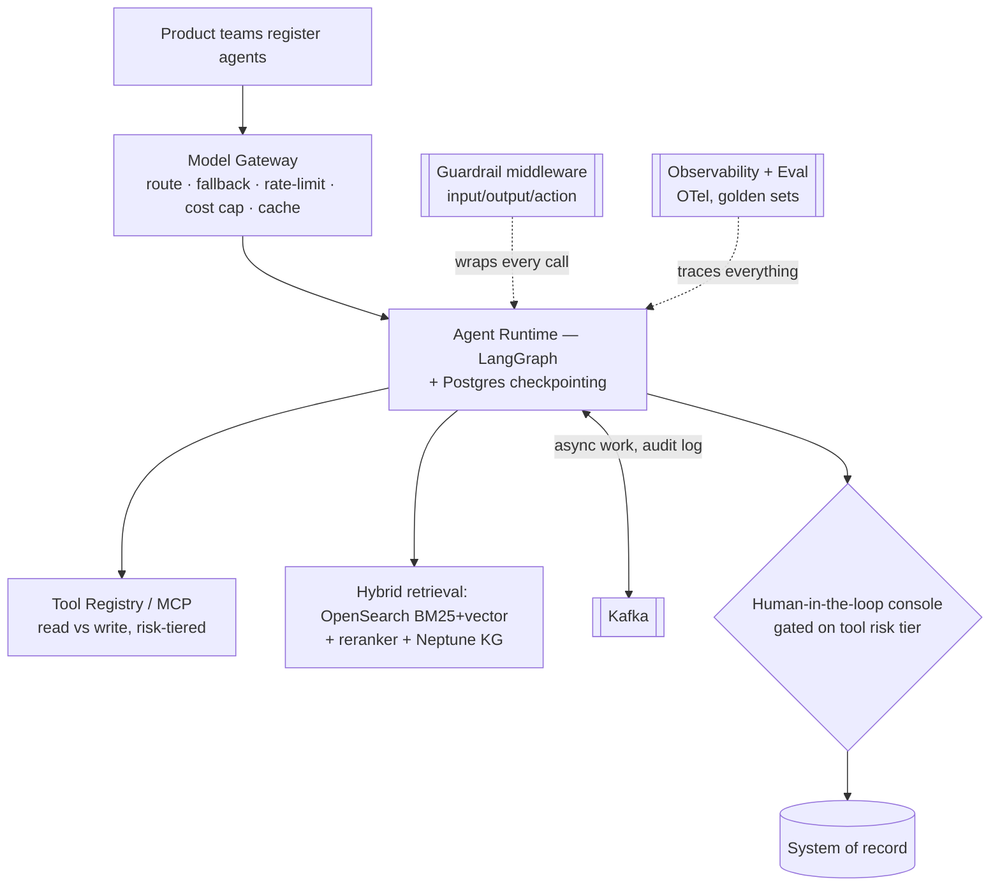
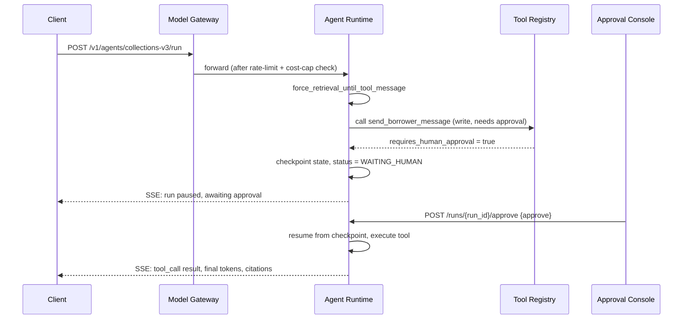
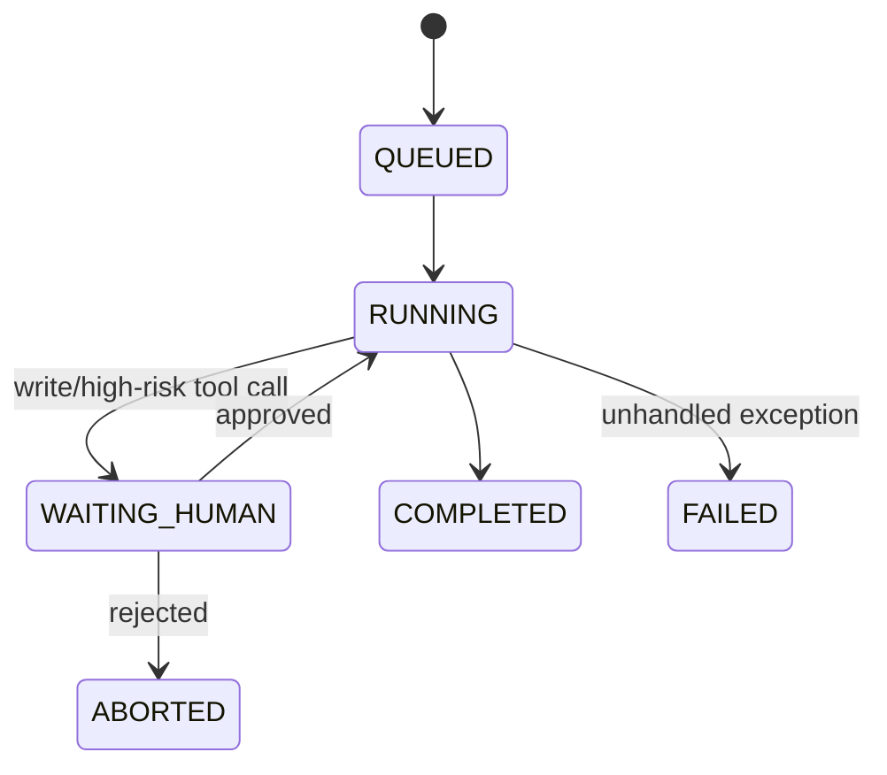

# 01 — The End-to-End Agentic AI Platform

> [Deep-dive set](README.md) · file 1 of 10 · next: [02 — Document-Intelligence Agent](02_document_intelligence_agent.md)

**Prompt:** *"Design the platform that lets any product team stand up an agent — from registering it to a borrower or investor getting a grounded answer — end to end."*

---

## Part A — HLD (High-Level Design)

### 1. Clarify & scope

- **Who builds on this:** many product teams (loan-doc RAG, risk memos, collections, reconciliation), each shipping a different agent on shared infra.
- **Scale:** low-thousands QPS aggregate peak across all agents, bursty (business hours + month-end spikes), India data residency, RBI-regulated data.
- **Latency:** chat-style agents need seconds-level TTFT; batch memo generation tolerates minutes.
- **The deciding question:** *what does each agent's decision influence, and what's the cost of it being wrong?* This varies per agent (a risk-memo typo vs. an unauthorized financial action) and is why the platform must support **per-agent risk tiering**, not one blanket policy.

### 2. Functional requirements

| # | Requirement |
| --- | --- |
| FR1 | A product team can register a new agent (system prompt, tools, model, guardrail policy) without platform-team involvement. |
| FR2 | An agent can call registered tools, with read/write risk classification enforced centrally. |
| FR3 | A conversation is resumable after a client refresh or a process restart. |
| FR4 | Every run produces a replayable, auditable trace. |
| FR5 | High-risk tool calls pause for human approval before executing. |

### 3. Non-functional requirements

| NFR | Target | Why it's explicit |
| --- | --- | --- |
| Availability | 99.5% for the run endpoint | Below this, product teams lose trust in the platform as "the" way to ship agents. |
| p95 latency (chat) | TTFT < 1.5s, total < 6s | UX floor for a synchronous chat experience. |
| Auditability | 100% of runs replayable | Non-negotiable for regulated data — not a "nice to have." |
| Tenant isolation | No cross-tenant data in any single trace/log | A leak here is a breach, not a bug. |
| Cost control | Per-tenant budget enforced at request time, not after | Prevents one runaway agent from consuming the shared budget. |

### 4. System context



### 5. Component choices & why

| Component | Choice | Why this, not the obvious alternative |
| --- | --- | --- |
| Model access | A thin, shared **model gateway** in front of Bedrock + self-hosted vLLM | vs. each team calling providers directly: a shared control point is the only way rate-limits, cost caps, and fallback exist *once* instead of being reinvented inconsistently by every team. |
| Agent runtime | **LangGraph** with a **Postgres checkpointer** | vs. a free-form conversational framework (AutoGen-style): LangGraph forces an explicit state machine, which is what makes a run **replayable and auditable**. A looser framework is easier to prototype in but harder to defend to an auditor. |
| Tool access | Central **tool registry** (MCP), tools risk-tagged read/write | vs. agents calling internal services directly: one place to enforce auth, versioning, and **human-approval gates on write tools**. |
| Retrieval | **Hybrid** BM25+vector + reranker + a **KG** for relationships | Exact clause/ID lookups need lexical match, which embeddings alone miss; the KG exists specifically for cross-document relationship queries chunk-retrieval can't answer. |
| Async backbone | **Kafka**, not direct calls or a plain queue | Need ordered per-entity streams, replay for reprocessing, and a log-based substrate that doubles as the audit trail. A queue gives async but not ordering/replay as naturally. |
| Guardrails | A **middleware pipeline** wrapping every call, not per-agent checks | New agents inherit safety by default instead of by developer discipline. |
| Human gate | One **approval console**, keyed off the tool registry's risk tier | One audit trail, one place compliance reviews, instead of N bespoke approval UIs. |

### 6. Deployment topology

- **API/gateway tier:** stateless, horizontally scaled behind a load balancer; holds per-tenant rate-limit/cost-cap state in Redis.
- **Agent runtime tier:** stateless compute (state lives in Postgres checkpoints), autoscaled on request concurrency, not CPU.
- **Data tier:** Postgres (app state + checkpoints, can be split into logical DBs by concern), object storage (docs/artifacts), vector index (Chroma dev / managed search prod).
- **Async tier:** Kafka cluster for audit log + long-running/async agent steps.
- **Model tier:** managed (Bedrock) for burst/variable load; self-hosted GPU pool (vLLM) for steady high-volume paths once volume justifies the ops cost.

### 7. Failure modes & mitigations

| Failure | Mitigation |
| --- | --- |
| Model/provider outage | Gateway fallback chain (alternate provider → smaller model → cached response). |
| Guardrail block storm | Fail-closed, but alert — a spike is itself a signal (possible attack, see [file 06](06_prompt_injection_defense.md)), not just noise to suppress. |
| Kafka consumer lag | Autoscale on **lag**, not CPU; a lagging consumer under load is doing real work, CPU alone won't show it. |
| Cost blowup | Per-tenant caps enforced **at the gateway**, before the call, not reconciled after the bill arrives. |
| Checkpoint-table growth | A tombstone sweeper that hard-deletes checkpoints for closed/expired conversations on a schedule. |

### 8. Capacity gut-check

2,000 QPS peak × ~600 avg tokens/request ≈ 1.2M tok/s aggregate demand. At ~8k tok/s per GPU replica that's ~150 replicas at peak; add ~30% headroom → ~195. In practice, a semantic cache (§ below, ~35% hit rate is typical) and cheap-model routing for simple requests cut real demand well below that ceiling before you provision for it.

---

## Part B — LLD (Low-Level Design)

### 1. Data model

**`AgentConfig`** (registered by a product team):
```json
{
  "agent_id": "collections-v3",
  "tenant_id": "org_442",
  "system_prompt_ref": "prompts/collections-v3@7",
  "model": {"primary": "bedrock/claude-sonnet", "fallback": ["self-host/llama-70b"]},
  "tools": ["get_account_balance", "get_payment_history", "send_borrower_message"],
  "guardrail_policy_ref": "policies/collections-standard@2",
  "risk_tier": "high",
  "created_at": "2026-08-01T00:00:00Z"
}
```

**`ToolRegistryEntry`:**
```json
{
  "name": "send_borrower_message",
  "schema": {"channel": "string", "template_id": "string", "params": "object"},
  "access": "write",
  "requires_human_approval": true,
  "allowed_agents": ["collections-v3"],
  "version": "2.1.0"
}
```

**`AgentRun`** (one execution, checkpointed):
```json
{
  "run_id": "c12d8ef1-...",
  "thread_id": "2ec3e4bb-...",
  "agent_id": "collections-v3",
  "tenant_id": "org_442",
  "status": "RUNNING",
  "step": 4,
  "pending_approval": null,
  "started_at": "...",
  "completed_at": null
}
```

### 2. API contracts

```text
POST /v1/agents/{agent_id}/run
  body: { thread_id, run_id, messages: [...], forwarded_props: {...} }
  -> 200, SSE stream of: token | thinking_step | tool_call | citation | run_completed
  -> 409 if thread_id already has an in-flight run (per-conversation run lock)

POST /v1/tools/register
  body: ToolRegistryEntry
  -> 201 | 403 if requester lacks tool-registration role

POST /v1/runs/{run_id}/approve
  body: { approver_id, decision: "approve"|"reject", reason }
  -> 200, resumes or aborts the paused run
```

### 3. Core algorithm — forced-retrieval + human-gate node sequence

```python
@wrap_model_call
async def force_retrieval_until_tool_message(request, handler):
    messages = request.state.get("messages", [])
    last_user_idx = max(
        (i for i, m in enumerate(messages) if _kind(m) in {"human", "user"}),
        default=-1,
    )
    has_tool_after_latest_user = any(
        _kind(m) == "tool" for m in messages[last_user_idx + 1:]
    )
    if has_tool_after_latest_user:
        return await handler(request)                     # synthesize
    return await handler(request.override(tool_choice="any"))  # force a fresh search

async def before_tool_execute(tool_call, registry_entry, run):
    if registry_entry.access == "write" or registry_entry.requires_human_approval:
        run.status = "WAITING_HUMAN"
        run.pending_approval = tool_call
        await checkpoint(run)                              # durable pause
        raise Interrupt("awaiting_human_approval")
    return await execute(tool_call)
```

This is the same pattern I already ship in production: a middleware guard on the model call (forces fresh retrieval per turn — see [RagApp ADR-5](../18_ragapp/07-decision-log.md)) plus a tool-execution guard that turns "this tool is risky" into a durable, resumable pause rather than a blocking synchronous wait.

### 4. Sequence — one request, end to end



### 5. State machine — agent run lifecycle



### 6. Edge cases

- **Concurrent runs on the same thread:** reject the second with `409` — a per-conversation run lock, not a queue, because two simultaneous answers to the same conversation is a correctness bug, not a throughput problem.
- **Tool call timeout:** the tool-execution guard has its own timeout independent of the model call's; a hung tool must not hold the model's context open indefinitely.
- **Guardrail blocks mid-stream:** truncate the SSE stream with an explicit `blocked` event and a reason, never a silent disconnect — the client needs to distinguish "blocked" from "network error."
- **Approval never arrives:** a TTL on `WAITING_HUMAN` that auto-expires to `ABORTED` after N hours, so a forgotten approval doesn't leave a run (and its checkpoint) alive forever.

### 7. Extension points

| Change | Where it lands |
| --- | --- |
| New tool | Register via `ToolRegistryEntry`; no runtime code change. |
| New model provider | Add a route to the gateway's provider-adapter interface. |
| New guardrail check | Add a stage to the guardrail middleware pipeline (see [file 06](06_prompt_injection_defense.md)). |
| New approval workflow | Extend `pending_approval` schema + the approval console's decision types. |
