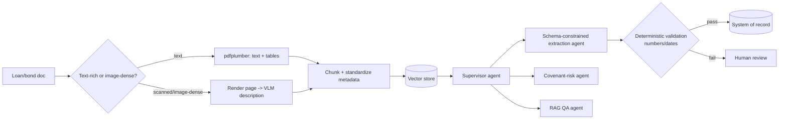
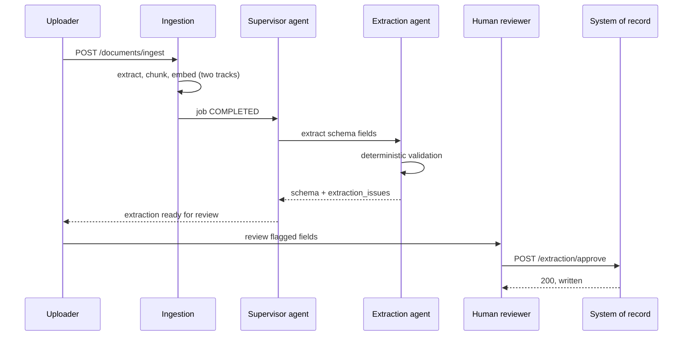
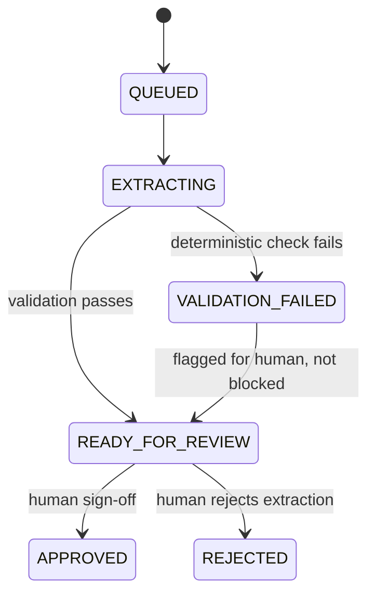

# 02 — Document-Intelligence / Covenant-Extraction Agent

> [Deep-dive set](README.md) · file 2 of 10 · prev: [01 — Agentic AI Platform](01_agentic_ai_platform.md) · next: [03 — Agentic Collections](03_agentic_collections.md)

**Prompt:** *"Design an agent that ingests loan/bond agreements, extracts terms and covenants, flags risk, and answers questions about them — with legal/financial consequences for being wrong."*

---

## Part A — HLD (High-Level Design)

### 1. Clarify & scope

- Volume and doc mix: native PDF, scanned/image-only PDF, Word, occasionally PPT term sheets.
- Does output feed an automated decision, or always sit in front of a human first? (Assume: **always** a human sign-off before anything writes to the system of record — the cost of a wrong covenant is a real financial/legal event.)
- Languages, table density, and — the number that drives the visual-track design below — what fraction of the corpus is scanned/image-heavy.

### 2. Functional requirements

| # | Requirement |
| --- | --- |
| FR1 | Extract a fixed schema of terms (principal, maturity, covenants, parties) from any accepted document type. |
| FR2 | Every extracted field carries a citation back to a page/clause. |
| FR3 | Answer free-text questions about an ingested document (RAG QA), grounded and citation-backed. |
| FR4 | Flag covenant-risk (e.g., DSCR below threshold) as a distinct, reviewable signal. |
| FR5 | Nothing writes to the system of record without human sign-off. |

### 3. Non-functional requirements

| NFR | Target | Why |
| --- | --- | --- |
| Extraction fidelity | Deterministic validation on 100% of numeric/date fields | A malformed extraction must never silently pass. |
| Auditability | Every field replayable to source page/clause | Disputes require proving what the system read and why. |
| Cost | VLM calls only on pages that need them | VLM is the most expensive step in the pipeline by a wide margin. |
| Latency | Minutes, not seconds, is acceptable | This is document-review workflow, not chat. |

### 4. System context — two extraction tracks, one vector space



This is the exact pattern from my own [RagApp design](../18_ragapp/06-visual-extraction-and-vlm.md): a cheap local heuristic gates the expensive VLM call, so text-rich pages never pay for vision.

### 5. Component choices & why

| Component | Choice | Why this, not the obvious alternative |
| --- | --- | --- |
| Visual gating | VLM **only** on pages a cheap heuristic (text length, image-area ratio, vector-graphic density) flags as image-dense | Sending every page through a VLM is pure waste; this cheap-filter-then-expensive-step pattern reappears in files [05](05_fraud_anomaly_detection.md), [07](07_marketplace_matching_ranking.md), and [09](09_kyc_entity_resolution_graph.md) — it's a general principle, not a one-off. |
| Extraction output | **Schema-constrained structured output** with a citation per field | Free text can't be deterministically validated or diffed across re-extractions; a typed schema lets you validate `principal` is numeric and `maturity_date` parses, and trace every field to a clause. |
| Validation | A **deterministic** post-extraction check (regex/parser), not another LLM call | An LLM judging its own sibling's numeric extraction is weak self-verification; a parser check is cheap, deterministic, and catches the dominant failure class. |
| DOCX handling | Convert DOCX → PDF (LibreOffice), then re-enter the PDF track | One high-fidelity path preserves layout, tables, and embedded figures; a second `.docx`-native parser would be more code for a worse result. |
| Grounding | Store the rendered image **and** its VLM text description; embed only the text | Text retrieval over a rich description is cheaper and more controllable than image embeddings, and the image is still available for multimodal grounding + citation. |

### 6. Failure modes

- VLM misreads a scanned page's small print → tune DPI, and **log as an extraction issue** rather than silently shipping an empty/wrong field.
- A document with genuinely no extractable content → surface the gap explicitly, never guess a value.
- Cost blowup on an image-heavy corpus → the heuristic gate is the control; monitor its hit rate as a first-class metric.

### 7. Capacity gut-check

Assume 5,000 docs/day, 20 pages/doc avg, ~10% flagged image-dense → 10,000 VLM calls/day at ~2s each ≈ 5.5 GPU-hours/day of VLM work — small enough to run on the same shared multimodal deployment as chat, with a lower priority queue.

---

## Part B — LLD (Low-Level Design)

### 1. Data model

**Extraction schema (per document):**
```json
{
  "job_id": "a1b2c3",
  "principal": {"value": 4200000, "currency": "INR", "cite": "p3 sec2.1", "grounded": true},
  "maturity_date": {"value": "2029-06-30", "cite": "p1 sec1.4", "grounded": true},
  "covenants": [
    {"type": "DSCR", "min": 1.25, "cite": "p7 sec5.3", "grounded": true}
  ],
  "extraction_issues": [
    {"page": 8, "issue": "vlm_low_confidence", "detail": "table partially occluded"}
  ]
}
```

**Chunk metadata (vector store, canonical fields):**
```json
{
  "job_id": "a1b2c3", "source_type": "visual_insight",
  "page": 8, "chunk_index": 17,
  "image_uri": "page_images/a1b2c3/8.png",
  "doc_summary": "FY2025 term loan agreement"
}
```

### 2. API contracts

```text
POST /v1/documents/ingest
  multipart: file; optional namespace, file_id
  -> 202 { job_id, status: "QUEUED" }

GET /v1/documents/{job_id}/extraction
  -> 200 { schema above } | 409 if extraction not yet complete

POST /v1/documents/{job_id}/qa
  body: { question: string }
  -> 200 { answer, citations: [{page, cite}] }

POST /v1/documents/{job_id}/extraction/approve
  body: { approver_id, field_overrides?: {...} }
  -> 200, writes to system of record only after this call
```

### 3. Core algorithm — visual detection heuristic

```python
def image_dense(page) -> bool:
    text_len = len(page.extract_text() or "")
    text_coverage = text_box_area(page) / page_area(page)
    image_area_ratio = max_image_area(page) / page_area(page)
    graphic_density = len(page.rects) + len(page.curves) + len(page.lines)
    return (
        text_len < MIN_TEXT_CHARS            # e.g. < 40 chars: scanned/blank text layer
        or text_coverage < MIN_TEXT_COVERAGE  # e.g. < 15%: sparse text, visual layout
        or image_area_ratio > MAX_IMAGE_RATIO # e.g. a figure covering > 50% of the page
        or graphic_density > MAX_GRAPHIC_DENSITY  # many vector shapes: chart/diagram
    )
```

Mixed pages (a paragraph + one chart) run **both** tracks — a `text` chunk for the paragraph and a `visual_insight`/`page_image` pair for the chart — so nothing is lost to a binary classification.

### 4. Sequence — extraction to human sign-off



### 5. State machine — extraction lifecycle



### 6. Edge cases

- A covenant expressed as a range or conditional clause (not a single number) → the schema's `covenants[]` entries support a `condition` field rather than forcing a single min/max, and the extraction agent flags ambiguous phrasing for human review instead of guessing a value.
- Two conflicting figures for the same field on different pages (an amendment) → surface **both** citations, let the human resolve it; never silently pick one.
- A re-ingested (updated) version of the same document → carries a new `job_id`; prior extraction stays in the audit trail, not overwritten.

### 7. Extension points

| Change | Where it lands |
| --- | --- |
| New document type (e.g., term sheets) | New processor in the dispatch layer; must preserve the canonical chunk metadata contract. |
| New covenant type | Extend the extraction schema + risk-agent rule set. |
| New language | Extend the VLM prompt + validation locale rules (date/number formats). |
