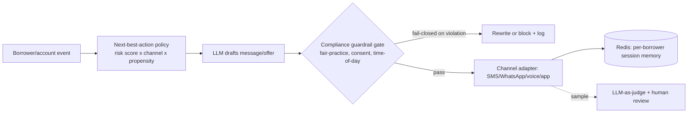
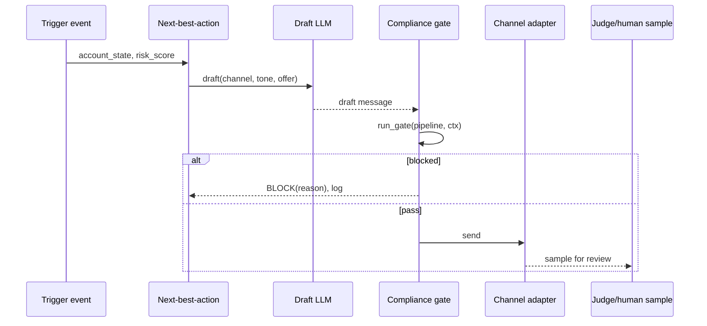
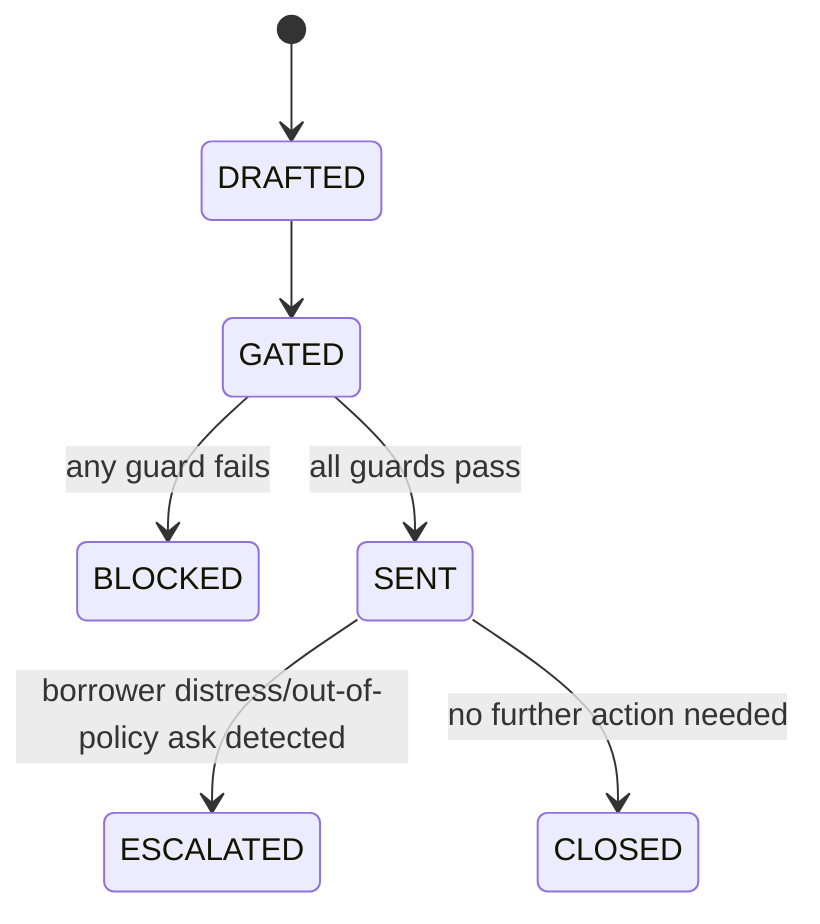

# 03 — Next-Generation Agentic Collections (Borrower Engagement)

> [Deep-dive set](README.md) · file 3 of 10 · prev: [02 — Document-Intelligence Agent](02_document_intelligence_agent.md) · next: [04 — Agent Eval + Guardrail Platform](04_agent_eval_guardrail_platform.md)

**Prompt:** *"Redesign the collections agent that engages borrowers across channels to reduce default — real-time, multi-turn, and it cannot violate fair-practice regulations."*

---

## Part A — HLD (High-Level Design)

### 1. Clarify & scope

- Channels: SMS, WhatsApp, voice, in-app — each with different latency and content constraints.
- Real-time, multi-turn, with per-borrower memory across touches.
- The dominant constraint isn't ML quality, it's **regulated communication rules** — fair-practice hours, consent, no-harassment, message-frequency caps. This is a compliance-gated ML problem, not primarily an ML problem.

### 2. Functional requirements

| # | Requirement |
| --- | --- |
| FR1 | Compute a next-best-action per borrower per touch (channel, offer, tone). |
| FR2 | Draft a message via LLM, grounded in account state. |
| FR3 | Block or rewrite any message that would violate a compliance rule, before send. |
| FR4 | Escalate to a human when the borrower shows distress or asks for something out of policy. |
| FR5 | Full transcript audit per borrower, per touch. |

### 3. Non-functional requirements

| NFR | Target | Why |
| --- | --- | --- |
| Compliance | 0 fair-practice violations reach a borrower | Regulatory, not a quality metric to trend — a hard gate. |
| Latency | Sub-second TTFT on interactive channels (voice/app) | Perceived responsiveness on a live channel. |
| Scale | Crore-scale monthly accounts | Drives the cost-tiered model choice below. |
| Review coverage | 100% of flagged/sensitive messages sampled | Can't A/B test or blanket-review borrower communication. |

### 4. System context — decision, draft, gate, deliver as separable concerns



### 5. Component choices & why

| Component | Choice | Why this, not the obvious alternative |
| --- | --- | --- |
| Compliance gate | **Deterministic, rules-based** hard fail-closed check — not an LLM judgment call | Compliance can't be probabilistic; an LLM asked "is this compliant?" is right most of the time, which is exactly the failure mode unacceptable for a regulatory requirement. |
| Decision vs. channel | Next-best-action policy **decoupled** from channel delivery via an adapter layer | Onboarding a new channel or partner integration shouldn't require touching decision logic, and vice versa. |
| Tool risk tiering | Reads (balance, history) auto-execute; writes/commitments (send message, set payment plan) require the compliance gate | Mirrors the tool-registry risk tiering from [file 01](01_agentic_ai_platform.md) — writes are exactly where regulatory/financial risk concentrates. |
| Cost tiering | Small/cheap model for routine reminders, larger model reserved for negotiation-style messages | Most touches are routine; reserving the expensive model for genuinely hard cases is the same cascade pattern used platform-wide. |
| Quality control | LLM-as-judge **plus** human review, sampled — not 100% human, not 0% | 100% doesn't scale to crore-scale accounts; 0% is unacceptable for regulated borrower communication. |

### 6. Failure modes

- A borrower in genuine distress → explicit refusal calibration + escalation path, not an infinite polite loop.
- A channel outage mid-conversation → session state in Redis with TTL, resumable on any channel.
- Gate false-positives blocking legitimate messages → log and route to human, never just silently drop.

### 7. Capacity gut-check

5.5 crore monthly accounts, assume 2 touches/account/month average → ~11 crore message-decision cycles/month ≈ ~4,200/minute sustained, spikier around due dates — sized for the cheap-model tier to absorb the bulk, escalating only the negotiation-tier fraction to the larger model.

---

## Part B — LLD (Low-Level Design)

### 1. Data model

**`BorrowerTouch`:**
```json
{
  "touch_id": "t-9821",
  "borrower_id": "b-55210",
  "channel": "whatsapp",
  "action": "reminder",
  "draft": "...",
  "gate_result": {"decision": "pass", "checks": ["fair_practice_hours", "consent", "frequency_cap"]},
  "sent_at": "2026-08-01T09:12:00Z",
  "judge_score": null,
  "human_reviewed": false
}
```

**`CompliancePolicy`** (versioned, edited by compliance team, not by model retraining):
```json
{
  "policy_id": "fair-practice-v4",
  "allowed_hours": {"start": "08:00", "end": "19:00", "tz": "Asia/Kolkata"},
  "max_touches_per_week": 3,
  "requires_consent_flags": ["dnd_registered"],
  "prohibited_phrases": ["threat_language_list_ref"]
}
```

### 2. API contracts

```text
POST /v1/collections/touch
  body: { borrower_id, trigger_event }
  -> 200 { touch_id, status: "sent"|"blocked"|"escalated" }

POST /v1/collections/policy
  body: CompliancePolicy
  -> 201 (compliance-team role only; no model retrain needed to change a limit)

GET /v1/collections/borrower/{id}/transcript
  -> 200 [ BorrowerTouch, ... ]   # full audit trail
```

### 3. Core algorithm — gate as a composable, fail-closed pipeline

```python
class Guard(Protocol):
    def check(self, ctx: TouchContext) -> Result: ...   # PASS | MODIFY(new_ctx) | BLOCK(reason)

def run_gate(pipeline: list[Guard], ctx: TouchContext) -> TouchContext:
    for g in pipeline:
        r = g.check(ctx)
        if r.blocked:
            log_and_alert(r)
            raise Blocked(r.reason)          # fail-closed, never fail-open silently
        ctx = r.apply(ctx)
    return ctx

GATE_PIPELINE = [FairPracticeHoursGuard(), ConsentGuard(),
                 FrequencyCapGuard(), ProhibitedPhraseGuard()]
```

### 4. Sequence — one touch, end to end



### 5. State machine — touch lifecycle



### 6. Edge cases

- A borrower revokes consent mid-conversation → the `ConsentGuard` must re-check on **every** touch, not cache a stale consent flag for the session.
- A policy update (e.g., new allowed-hours window) must apply to in-flight drafted-but-not-yet-sent messages, not just new ones — the gate re-evaluates against the **current** policy version at send time, not draft time.
- Multi-language borrower messages → prohibited-phrase checks must run against the message's actual language, not assume English.

### 7. Extension points

| Change | Where it lands |
| --- | --- |
| New channel | New channel adapter implementing the send interface; no change to NBA or gate. |
| New compliance rule | New `Guard` implementation added to `GATE_PIPELINE`; compliance team can toggle without a model change. |
| New escalation trigger | Extend distress/out-of-policy detection in the post-send classifier. |
